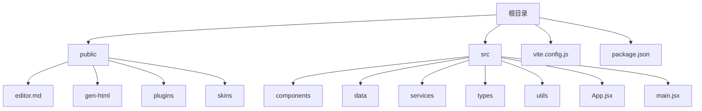
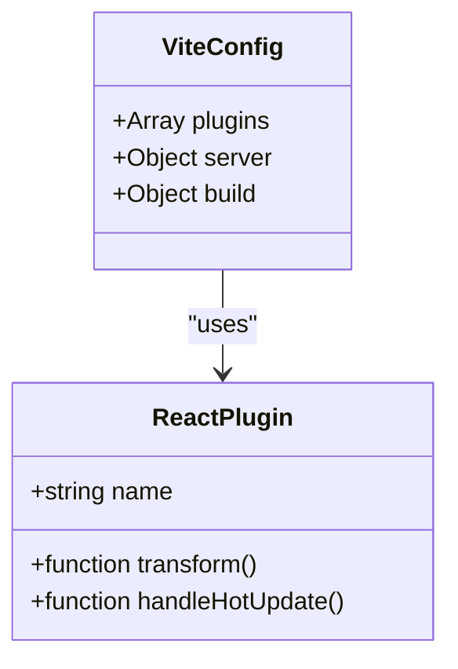
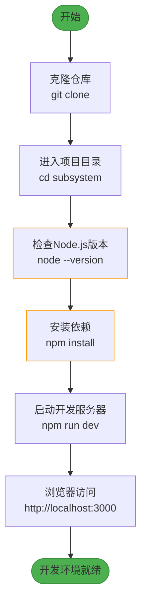

# 快速开始

<cite>
**本文档中引用的文件**
- [package.json](file://package.json)
- [vite.config.js](file://vite.config.js)
- [src/main.jsx](file://src/main.jsx)
- [index.html](file://index.html)
- [需求文档.md](file://需求文档.md)
</cite>

## 目录
1. [简介](#简介)
2. [项目结构](#项目结构)
3. [环境准备](#环境准备)
4. [依赖安装](#依赖安装)
5. [开发服务器启动](#开发服务器启动)
6. [生产环境构建](#生产环境构建)
7. [Vite配置详解](#vite配置详解)
8. [常见问题与解决方案](#常见问题与解决方案)
9. [完整操作流程](#完整操作流程)

## 简介
本指南为智慧教学平台提供详细的本地开发环境搭建说明。涵盖从克隆仓库到浏览器访问的完整流程，包括Node.js版本要求、依赖安装、开发服务器启动和生产构建等关键步骤。通过具体命令示例和预期输出，帮助开发者快速上手。

## 项目结构



**Diagram sources**
- [project_structure](file://project_structure)

**Section sources**
- [project_structure](file://project_structure)

## 环境准备

### Node.js版本要求
根据`package-lock.json`中的信息，本项目需要Node.js版本满足以下条件：
- 最低版本：^14.18.0
- 推荐版本：>=16.0.0

您可以通过以下命令检查当前Node.js版本：
```bash
node --version
```

预期输出格式为`v16.x.x`或更高版本。如果版本过低，请访问Node.js官网下载并安装最新LTS版本。

### npm版本要求
项目要求npm版本不低于8.0.0。检查npm版本：
```bash
npm --version
```

如需升级npm：
```bash
npm install -g npm@latest
```

**Section sources**
- [package-lock.json](file://package-lock.json#L8398-L8452)
- [需求文档.md](file://需求文档.md#L237-L292)

## 依赖安装

在项目根目录执行以下命令安装所有依赖：
```bash
npm install
```

该命令会读取`package.json`文件并自动安装所有必需的依赖包。安装过程可能需要几分钟时间，具体取决于网络速度和系统性能。

成功安装后的预期输出包含类似以下信息：
```
added 1023 packages from 553 contributors in 120.456s
```

核心依赖包括：
- React框架及其相关库
- Ant Design UI组件库
- Vite构建工具
- 各种开发辅助工具

**Section sources**
- [package.json](file://package.json#L15-L42)

## 开发服务器启动

安装完依赖后，使用以下命令启动开发服务器：
```bash
npm run dev
```

此命令对应`package.json`中定义的`dev`脚本，实际执行`vite`命令。启动成功后，您将看到类似以下输出：
```
vite v4.4.5 dev server running at:

> Local: http://localhost:3000/
> Network: use `--host` to expose

ready in 123ms.
```

根据`vite.config.js`的配置，开发服务器将在启动后自动打开浏览器访问`http://localhost:3000`。

**Section sources**
- [package.json](file://package.json#L6-L10)
- [vite.config.js](file://vite.config.js#L6-L17)

## 生产环境构建

当需要生成生产环境可用的静态文件时，执行以下命令：
```bash
npm run build
```

该命令会执行`vite build`，根据`vite.config.js`中的配置进行打包构建。构建完成后，会在项目根目录生成`dist`文件夹，其中包含所有优化后的静态资源文件。

构建过程包括：
- 代码压缩和混淆
- CSS样式提取
- 静态资源哈希化
- 源码映射生成（sourcemap）

构建成功后的预期输出：
```
✓ 37 modules transformed.
dist/index.html                  0.56 kB │ gzip:  0.33 kB
dist/assets/index-BaKZuYRb.css   5.18 kB │ gzip:  1.87 kB
dist/assets/index-D6ZfDzG-.js   85.48 kB │ gzip: 28.74 kB
```

**Section sources**
- [package.json](file://package.json#L8-L10)
- [vite.config.js](file://vite.config.js#L14-L17)

## Vite配置详解

`vite.config.js`是项目的构建配置文件，包含开发和生产环境的关键设置。

### 核心配置项解析

```javascript
import { defineConfig } from 'vite'
import react from '@vitejs/plugin-react'

export default defineConfig({
  plugins: [react()],
  server: {
    port: 3000,
    open: true,
    hmr: {
      overlay: true
    }
  },
  build: {
    outDir: 'dist',
    sourcemap: true
  }
})
```

#### 插件配置 (plugins)


**Diagram sources**
- [vite.config.js](file://vite.config.js#L3-L5)

`plugins: [react()]`配置了Vite的React插件，用于支持JSX语法和React开发特性。

#### 服务器配置 (server)
- **port**: 设置开发服务器端口为3000
- **open**: 启动时自动打开浏览器
- **hmr.overlay**: 启用错误覆盖显示，开发时遇到错误会在页面上显示错误信息

#### 构建配置 (build)
- **outDir**: 指定构建输出目录为`dist`
- **sourcemap**: 生成源码映射文件，便于生产环境调试

**Section sources**
- [vite.config.js](file://vite.config.js#L6-L17)

## 常见问题与解决方案

### 端口冲突
如果3000端口已被占用，开发服务器无法启动。解决方案：

1. **终止占用进程**：
```bash
# 查找占用3000端口的进程
lsof -i :3000
# 终止进程（替换PID为实际进程号）
kill -9 PID
```

2. **修改默认端口**：
编辑`vite.config.js`，修改server.port值：
```javascript
server: {
  port: 3001, // 修改为其他可用端口
  open: true,
  hmr: {
    overlay: true
  }
}
```

### 依赖缺失或安装失败
可能出现的问题及解决方案：

1. **网络问题导致安装失败**：
```bash
# 使用国内镜像源
npm config set registry https://registry.npmmirror.com
npm install
```

2. **权限问题**：
```bash
# macOS/Linux系统，使用sudo
sudo npm install
# 或修复npm权限
sudo chown -R $(whoami) ~/.npm
```

3. **清理缓存重试**：
```bash
npm cache clean --force
rm -rf node_modules package-lock.json
npm install
```

### 构建失败
常见原因及解决方法：

1. **内存不足**：
```bash
# 增加Node.js内存限制
node --max-old-space-size=4096 ./node_modules/vite/bin/vite.js build
```

2. **源码错误**：
检查控制台错误信息，根据提示修复代码中的语法或逻辑错误。

**Section sources**
- [vite.config.js](file://vite.config.js#L6-L17)
- [package.json](file://package.json#L6-L10)

## 完整操作流程

以下是完整的本地开发环境搭建步骤：



**Diagram sources**
- [vite.config.js](file://vite.config.js#L6-L17)
- [package.json](file://package.json#L6-L10)

1. **克隆仓库**：
```bash
git clone https://github.com/your-organization/subsystem.git
cd subsystem
```

2. **验证环境**：
确保Node.js版本符合要求（>=16.0.0）。

3. **安装依赖**：
```bash
npm install
```

4. **启动服务**：
```bash
npm run dev
```

5. **访问应用**：
浏览器自动打开或手动访问`http://localhost:3000`。

至此，智慧教学平台的本地开发环境已成功搭建，您可以开始进行开发和测试工作。

**Section sources**
- [package.json](file://package.json#L6-L10)
- [vite.config.js](file://vite.config.js#L6-L17)
- [需求文档.md](file://需求文档.md#L237-L292)