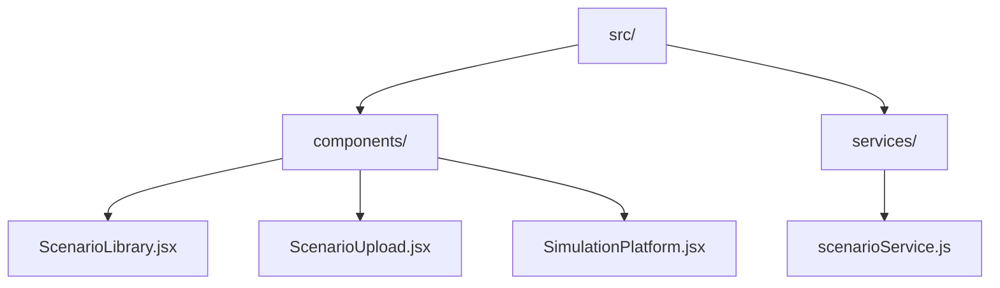
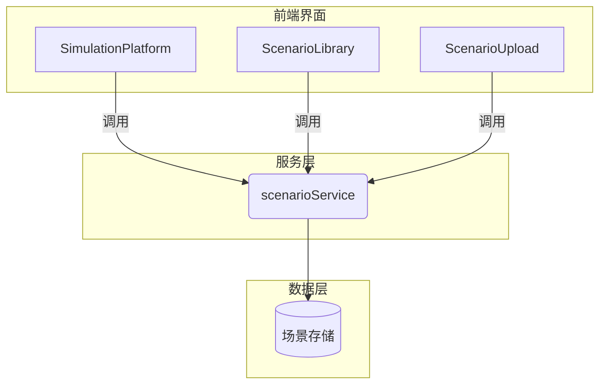
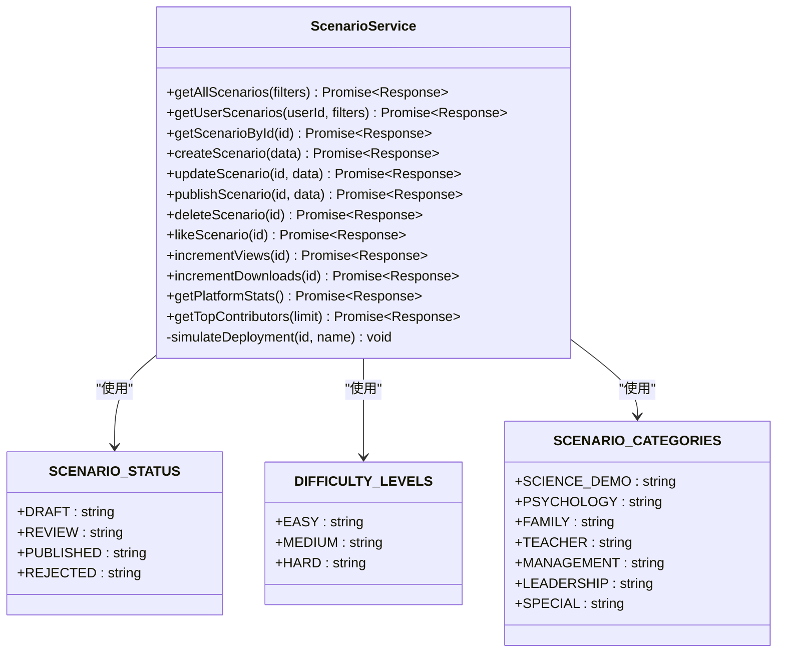
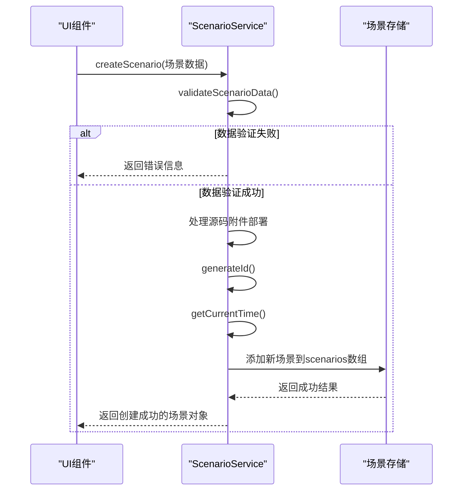
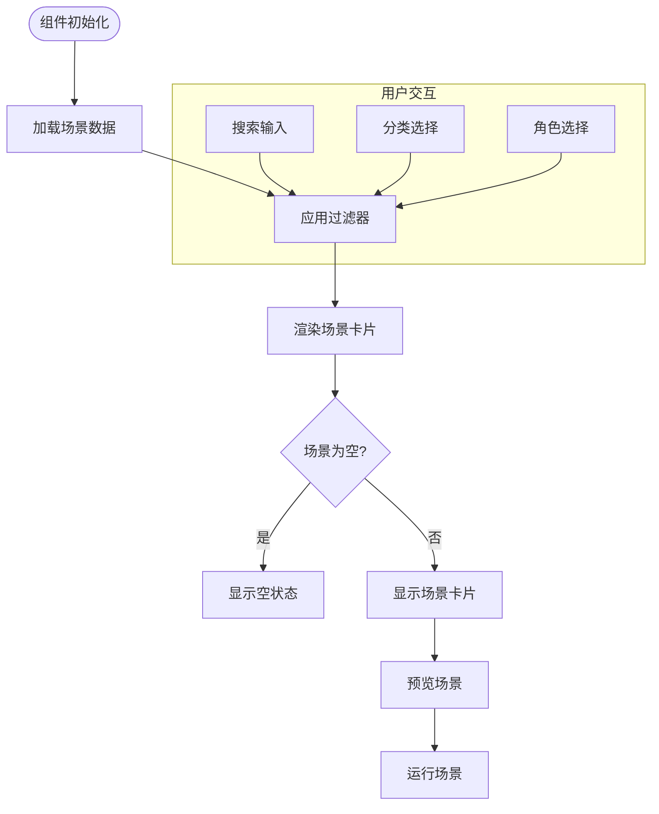
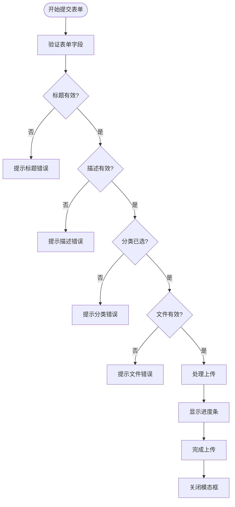
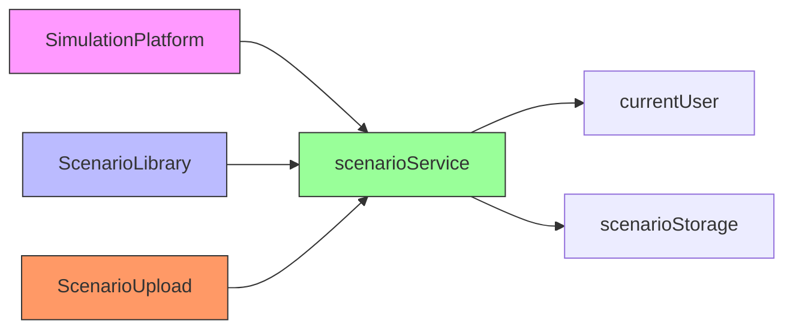

# 场景服务

<cite>
**本文档引用文件**  
- [scenarioService.js](file://src/services/scenarioService.js)
- [ScenarioLibrary.jsx](file://src/components/ScenarioLibrary.jsx)
- [ScenarioUpload.jsx](file://src/components/ScenarioUpload.jsx)
- [SimulationPlatform.jsx](file://src/components/SimulationPlatform.jsx)
</cite>

## 目录
1. [简介](#简介)
2. [项目结构](#项目结构)
3. [核心组件](#核心组件)
4. [架构概述](#架构概述)
5. [详细组件分析](#详细组件分析)
6. [依赖分析](#依赖分析)
7. [性能考虑](#性能考虑)
8. [故障排除指南](#故障排除指南)
9. [结论](#结论)

## 简介
场景服务是模拟仿真开放平台的核心数据服务模块，负责管理教学场景的全生命周期。该服务为场景库、上传界面和仿真平台提供统一的数据接口，支持场景的创建、发布、元数据管理、分类检索和使用统计等功能。系统采用模块化设计，通过`scenarioService.js`提供RESTful风格的API接口，与前端组件`ScenarioLibrary.jsx`、`ScenarioUpload.jsx`和`SimulationPlatform.jsx`协同工作，构建完整的场景管理生态系统。

## 项目结构
场景服务相关文件位于项目的`src`目录下，按照功能分离的原则组织：



**Diagram sources**
- [scenarioService.js](file://src/services/scenarioService.js)
- [ScenarioLibrary.jsx](file://src/components/ScenarioLibrary.jsx)
- [ScenarioUpload.jsx](file://src/components/ScenarioUpload.jsx)
- [SimulationPlatform.jsx](file://src/components/SimulationPlatform.jsx)

**Section sources**
- [scenarioService.js](file://src/services/scenarioService.js)
- [ScenarioLibrary.jsx](file://src/components/ScenarioLibrary.jsx)
- [ScenarioUpload.jsx](file://src/components/ScenarioUpload.jsx)
- [SimulationPlatform.jsx](file://src/components/SimulationPlatform.jsx)

## 核心组件
场景服务包含四个核心组件：`scenarioService.js`作为后端服务层，提供数据访问接口；`ScenarioLibrary.jsx`作为场景展示界面，实现场景浏览和搜索功能；`ScenarioUpload.jsx`作为上传界面，处理场景文件的提交；`SimulationPlatform.jsx`作为综合管理平台，集成场景管理的各项功能。这些组件通过服务注入的方式紧密协作，形成完整的场景管理闭环。

**Section sources**
- [scenarioService.js](file://src/services/scenarioService.js#L0-L1210)
- [ScenarioLibrary.jsx](file://src/components/ScenarioLibrary.jsx#L0-L1134)
- [ScenarioUpload.jsx](file://src/components/ScenarioUpload.jsx#L0-L374)
- [SimulationPlatform.jsx](file://src/components/SimulationPlatform.jsx#L0-L1713)

## 架构概述
系统采用分层架构设计，前端组件与后端服务分离，通过清晰的接口定义进行通信。`scenarioService.js`封装了所有数据操作逻辑，包括场景的增删改查、状态管理和统计功能。前端组件通过导入服务实例来调用这些功能，实现了关注点分离和代码复用。



**Diagram sources**
- [scenarioService.js](file://src/services/scenarioService.js#L0-L1210)
- [ScenarioLibrary.jsx](file://src/components/ScenarioLibrary.jsx#L0-L1134)
- [ScenarioUpload.jsx](file://src/components/ScenarioUpload.jsx#L0-L374)
- [SimulationPlatform.jsx](file://src/components/SimulationPlatform.jsx#L0-L1713)

## 详细组件分析

### 场景服务分析
`scenarioService.js`是场景管理的核心服务，提供了完整的CRUD操作和业务逻辑处理。

#### 类图


**Diagram sources**
- [scenarioService.js](file://src/services/scenarioService.js#L0-L1210)

#### 创建场景序列图


**Diagram sources**
- [scenarioService.js](file://src/services/scenarioService.js#L648-L719)

### 场景库组件分析
`ScenarioLibrary.jsx`是场景的展示界面，提供浏览、搜索和预览功能。

#### 流程图


**Diagram sources**
- [ScenarioLibrary.jsx](file://src/components/ScenarioLibrary.jsx#L0-L1134)

### 上传组件分析
`ScenarioUpload.jsx`处理场景的上传和编辑功能，提供友好的用户界面。

#### 表单验证流程


**Diagram sources**
- [ScenarioUpload.jsx](file://src/components/ScenarioUpload.jsx#L0-L374)

### 仿真平台组件分析
`SimulationPlatform.jsx`是综合管理平台，集成了场景管理的各项高级功能。

#### 平台功能架构
```mermaid
erDiagram
USER ||--o{ SCENARIO : "创建"
USER ||--o{ CONTRIBUTION : "贡献"
SCENARIO ||--|| CATEGORY : "属于"
SCENARIO ||--|| SUBJECT : "学科"
SCENARIO ||--o{ STATISTIC : "产生"
CONTRIBUTOR ||--o{ BADGE : "获得"
class USER {
id PK
name
role
permissions
}
class SCENARIO {
id PK
title
description
category FK
subject FK
status
authorId FK
createTime
updateTime
views
likes
downloads
rating
}
class CATEGORY {
id PK
name
description
color
}
class SUBJECT {
id PK
name
}
class STATISTIC {
scenarioId PK,FK
views
likes
downloads
rating
timestamp
}
class CONTRIBUTOR {
userId PK,FK
scenarios
publishedScenarios
totalScore
level
}
class BADGE {
id PK
name
description
}
```

**Diagram sources**
- [SimulationPlatform.jsx](file://src/components/SimulationPlatform.jsx#L0-L1713)

## 依赖分析
场景服务与其他组件存在明确的依赖关系，形成了清晰的调用链路。



**Diagram sources**
- [scenarioService.js](file://src/services/scenarioService.js)
- [ScenarioLibrary.jsx](file://src/components/ScenarioLibrary.jsx)
- [ScenarioUpload.jsx](file://src/components/ScenarioUpload.jsx)
- [SimulationPlatform.jsx](file://src/components/SimulationPlatform.jsx)

## 性能考虑
场景服务在设计时考虑了性能优化，通过合理的延迟模拟和数据处理策略确保用户体验。服务方法中使用`simulateDelay`函数模拟API调用延迟，避免了界面卡顿。数据过滤和排序操作在客户端完成，减少了服务器负载。大容量数据如平台统计和贡献者排行榜采用并行加载策略，提高了数据获取效率。

## 故障排除指南
当场景服务出现异常时，可参考以下常见问题及解决方案：

| 问题现象 | 可能原因 | 解决方案 |
|---------|--------|---------|
| 场景无法创建 | 必填字段缺失或格式错误 | 检查标题、描述、分类等必填字段是否完整且符合长度要求 |
| 上传失败 | 文件大小超过限制或格式不支持 | 确保文件不超过10MB且为HTML、图片或ZIP格式 |
| 预览无响应 | 场景文件路径错误 | 检查场景的HTML文件路径配置是否正确 |
| 统计数据不更新 | 异步操作未完成 | 等待API调用完成后再查看统计数据 |
| 权限错误 | 用户无操作权限 | 确认当前用户是否有创建、编辑或删除场景的权限 |

**Section sources**
- [scenarioService.js](file://src/services/scenarioService.js)
- [ScenarioLibrary.jsx](file://src/components/ScenarioLibrary.jsx)
- [ScenarioUpload.jsx](file://src/components/ScenarioUpload.jsx)

## 结论
场景服务通过`scenarioService.js`提供了完整的场景管理功能，与`ScenarioLibrary.jsx`、`ScenarioUpload.jsx`和`SimulationPlatform.jsx`等前端组件协同工作，构建了一个功能完善的模拟仿真开放平台。系统设计合理，接口清晰，具备良好的扩展性和维护性。未来可进一步优化大文件上传机制，增加断点续传和分片上传功能，提升用户体验。