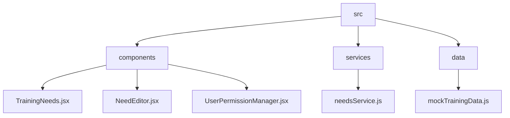
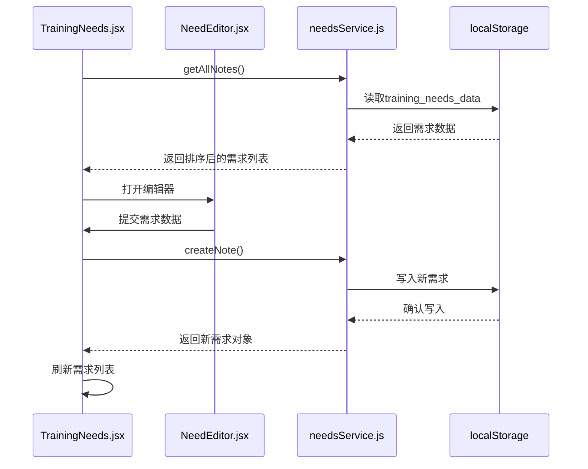
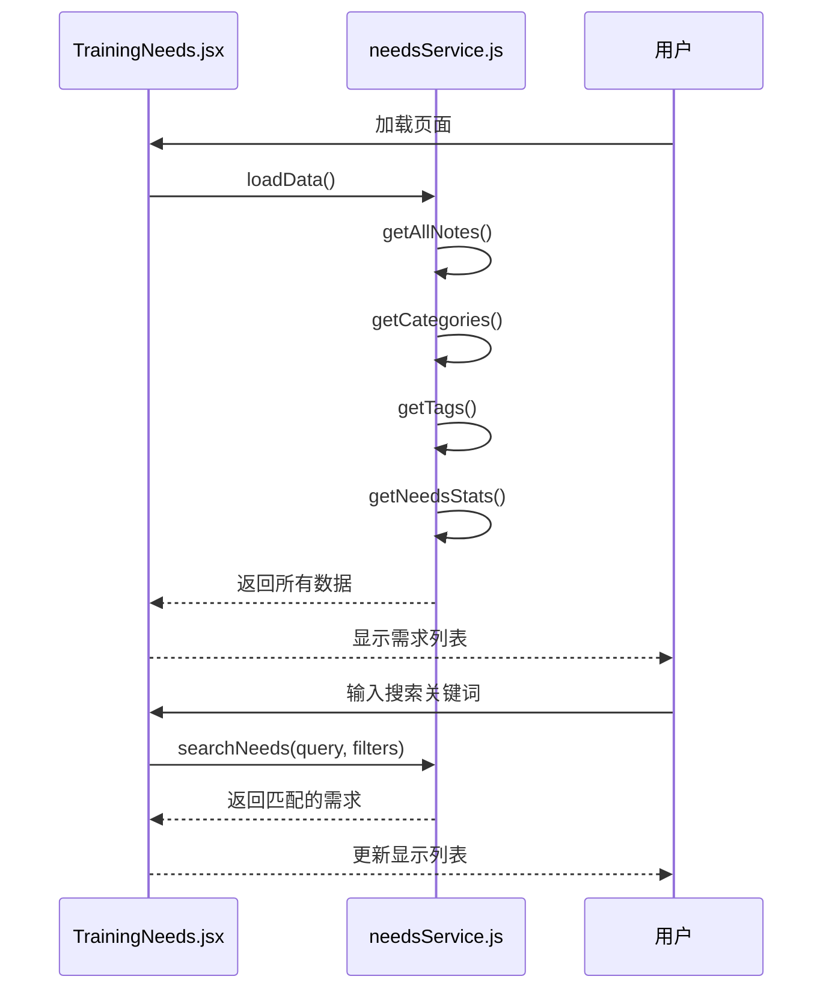
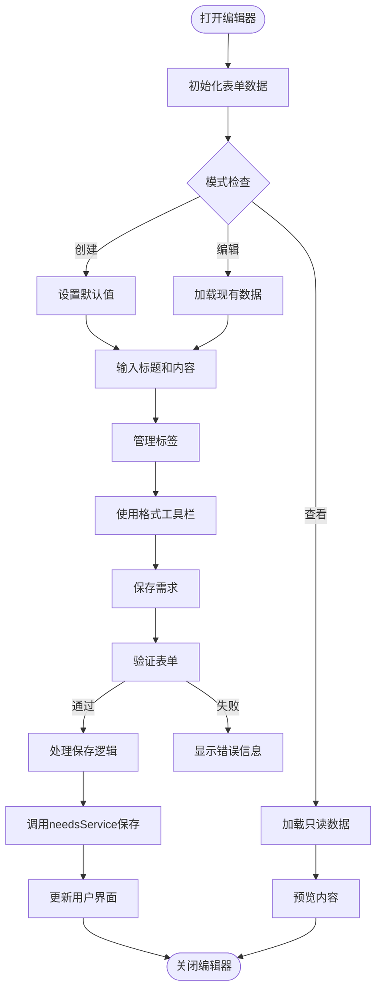
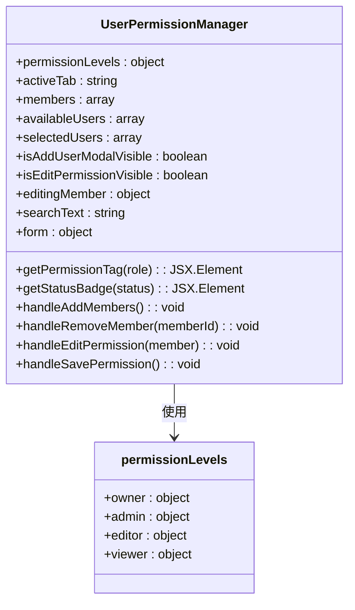
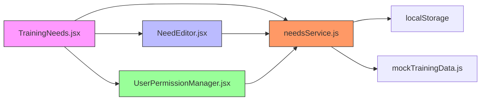

# 培训需求服务

<cite>
**本文档引用文件**   
- [needsService.js](file://src/services/needsService.js)
- [TrainingNeeds.jsx](file://src/components/TrainingNeeds.jsx)
- [NeedEditor.jsx](file://src/components/NeedEditor.jsx)
- [UserPermissionManager.jsx](file://src/components/UserPermissionManager.jsx)
</cite>

## 目录
1. [简介](#简介)
2. [项目结构](#项目结构)
3. [核心组件](#核心组件)
4. [架构概述](#架构概述)
5. [详细组件分析](#详细组件分析)
6. [依赖关系分析](#依赖关系分析)
7. [性能考虑](#性能考虑)
8. [故障排除指南](#故障排除指南)
9. [结论](#结论)

## 简介
培训需求服务是系统中用于管理教师培训需求的核心模块，提供完整的CRUD操作和本地存储管理功能。该服务支持需求创建、分类管理、优先级排序和状态变更等关键功能，并与前端组件实现双向数据绑定。

## 项目结构


**图表来源**
- [needsService.js](file://src/services/needsService.js#L0-L850)
- [TrainingNeeds.jsx](file://src/components/TrainingNeeds.jsx#L0-L927)

**章节来源**
- [needsService.js](file://src/services/needsService.js#L0-L850)
- [TrainingNeeds.jsx](file://src/components/TrainingNeeds.jsx#L0-L927)

## 核心组件
培训需求服务包含四个主要组件：需求数据服务（needsService.js）、需求列表界面（TrainingNeeds.jsx）、需求编辑器（NeedEditor.jsx）和用户权限管理器（UserPermissionManager.jsx）。这些组件协同工作，实现了完整的培训需求管理功能。

**章节来源**
- [needsService.js](file://src/services/needsService.js#L0-L850)
- [TrainingNeeds.jsx](file://src/components/TrainingNeeds.jsx#L0-L927)
- [NeedEditor.jsx](file://src/components/NeedEditor.jsx#L0-L438)

## 架构概述


**图表来源**
- [needsService.js](file://src/services/needsService.js#L0-L850)
- [TrainingNeeds.jsx](file://src/components/TrainingNeeds.jsx#L0-L927)
- [NeedEditor.jsx](file://src/components/NeedEditor.jsx#L0-L438)

## 详细组件分析

### 需求服务分析
需求服务提供了完整的培训需求管理API接口，包括需求的创建、读取、更新和删除操作。

#### 类图
```mermaid
classDiagram
class NeedsService {
+STORAGE_KEY : string
+CATEGORIES_KEY : string
+TAGS_KEY : string
+DEFAULT_CATEGORIES : array
+DEFAULT_TAGS : array
+constructor()
+initializeStorage() : void
+generateId() : string
+getAllNeeds() : array
+getNeedById(id) : object
+createNeed(needData) : object
+updateNeed(id, needData) : object
+deleteNeed(id) : boolean
+searchNeeds(query, filters) : array
+getCategories() : array
+getTags() : array
+updateTagsList(newTags) : void
+renameTag(oldTag, newTag) : boolean
+getNeedsStats() : object
+getWordCount(content) : number
+calculateReadTime(content) : number
+exportNeeds(format) : string
+importNeeds(data, options) : object
+clearAllData() : boolean
+advancedSearch(criteria) : array
+saveSearch(name, criteria) : object
+getSavedSearches() : array
+deleteSavedSearch(id) : boolean
+saveSearchHistory(keyword) : void
+getSearchHistory() : array
+clearSearchHistory() : boolean
}
class NeedsService "单例实例" *-- NeedsService : 实例化
```

**图表来源**
- [needsService.js](file://src/services/needsService.js#L0-L850)

**章节来源**
- [needsService.js](file://src/services/needsService.js#L0-L850)

### 需求列表分析
需求列表组件负责展示所有培训需求，并提供搜索、过滤和创建新需求的功能。

#### 序列图


**图表来源**
- [TrainingNeeds.jsx](file://src/components/TrainingNeeds.jsx#L0-L927)
- [needsService.js](file://src/services/needsService.js#L0-L850)

**章节来源**
- [TrainingNeeds.jsx](file://src/components/TrainingNeeds.jsx#L0-L927)

### 需求编辑器分析
需求编辑器组件提供了一个富文本编辑界面，用于创建和编辑培训需求。

#### 流程图


**图表来源**
- [NeedEditor.jsx](file://src/components/NeedEditor.jsx#L0-L438)
- [needsService.js](file://src/services/needsService.js#L0-L850)

**章节来源**
- [NeedEditor.jsx](file://src/components/NeedEditor.jsx#L0-L438)

### 权限管理分析
用户权限管理器负责管理系统的访问控制和权限分配。

#### 类图


**图表来源**
- [UserPermissionManager.jsx](file://src/components/UserPermissionManager.jsx#L0-L692)

**章节来源**
- [UserPermissionManager.jsx](file://src/components/UserPermissionManager.jsx#L0-L692)

## 依赖关系分析


**图表来源**
- [needsService.js](file://src/services/needsService.js#L0-L850)
- [TrainingNeeds.jsx](file://src/components/TrainingNeeds.jsx#L0-L927)
- [NeedEditor.jsx](file://src/components/NeedEditor.jsx#L0-L438)
- [UserPermissionManager.jsx](file://src/components/UserPermissionManager.jsx#L0-L692)

**章节来源**
- [needsService.js](file://src/services/needsService.js#L0-L850)
- [TrainingNeeds.jsx](file://src/components/TrainingNeeds.jsx#L0-L927)

## 性能考虑
培训需求服务采用localStorage作为持久化存储方案，具有以下性能特点：
- 数据读写速度快，适合小规模数据存储
- 同步操作避免了异步回调的复杂性
- 客户端存储减轻了服务器压力
- 数据量较大时可能影响页面加载性能
- 建议定期清理过期数据以保持性能

## 故障排除指南
常见问题及解决方案：

1. **需求无法保存**
   - 检查浏览器是否禁用了localStorage
   - 确认存储空间是否已满
   - 检查数据格式是否符合要求

2. **搜索功能失效**
   - 验证搜索条件是否正确
   - 检查数据索引是否正常
   - 确认过滤逻辑是否有误

3. **权限控制异常**
   - 验证用户角色配置
   - 检查权限判断逻辑
   - 确认权限缓存是否需要刷新

**章节来源**
- [needsService.js](file://src/services/needsService.js#L0-L850)
- [TrainingNeeds.jsx](file://src/components/TrainingNeeds.jsx#L0-L927)

## 结论
培训需求服务通过合理的架构设计和完善的API接口，实现了高效的培训需求管理功能。服务与前端组件的良好集成确保了用户体验的流畅性，而权限控制机制则保障了数据的安全性。