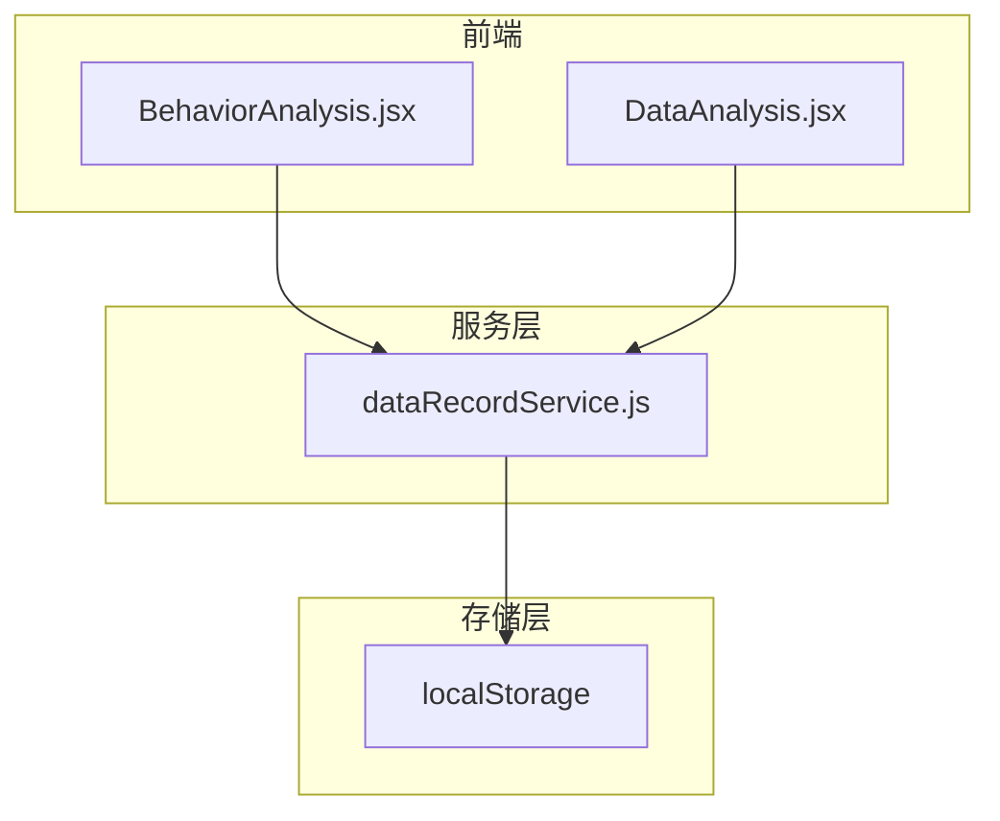
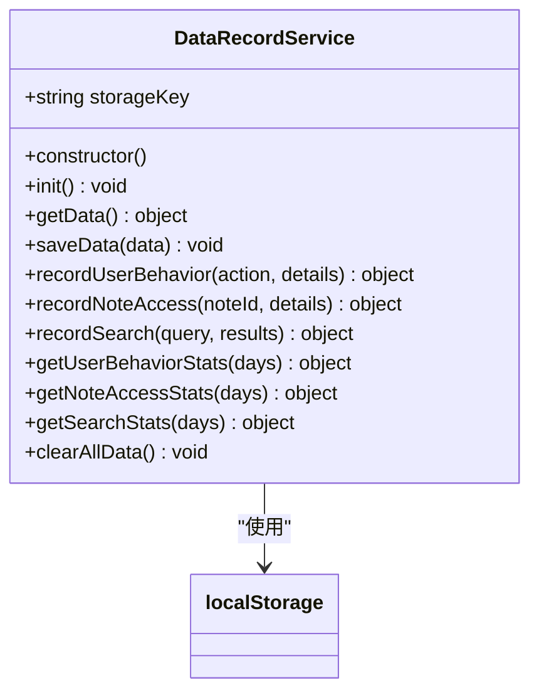
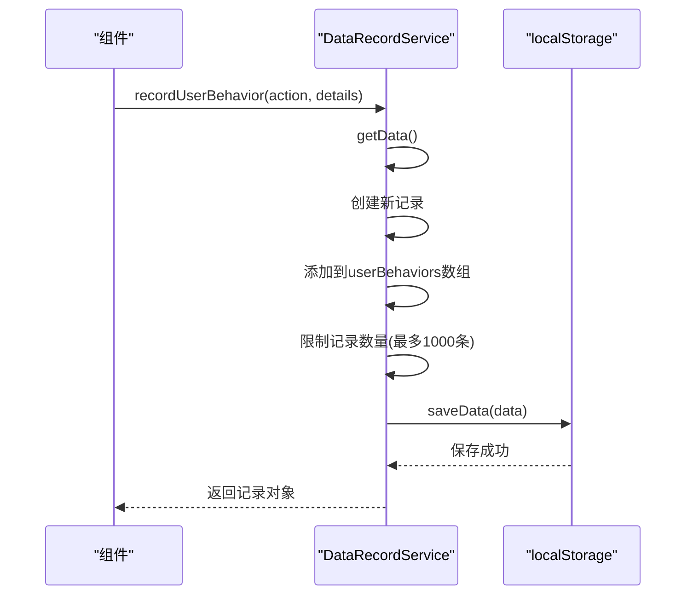
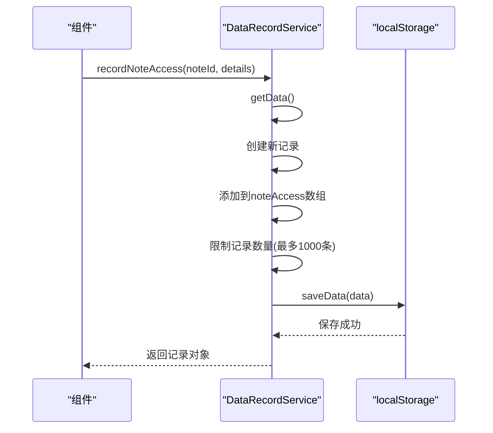
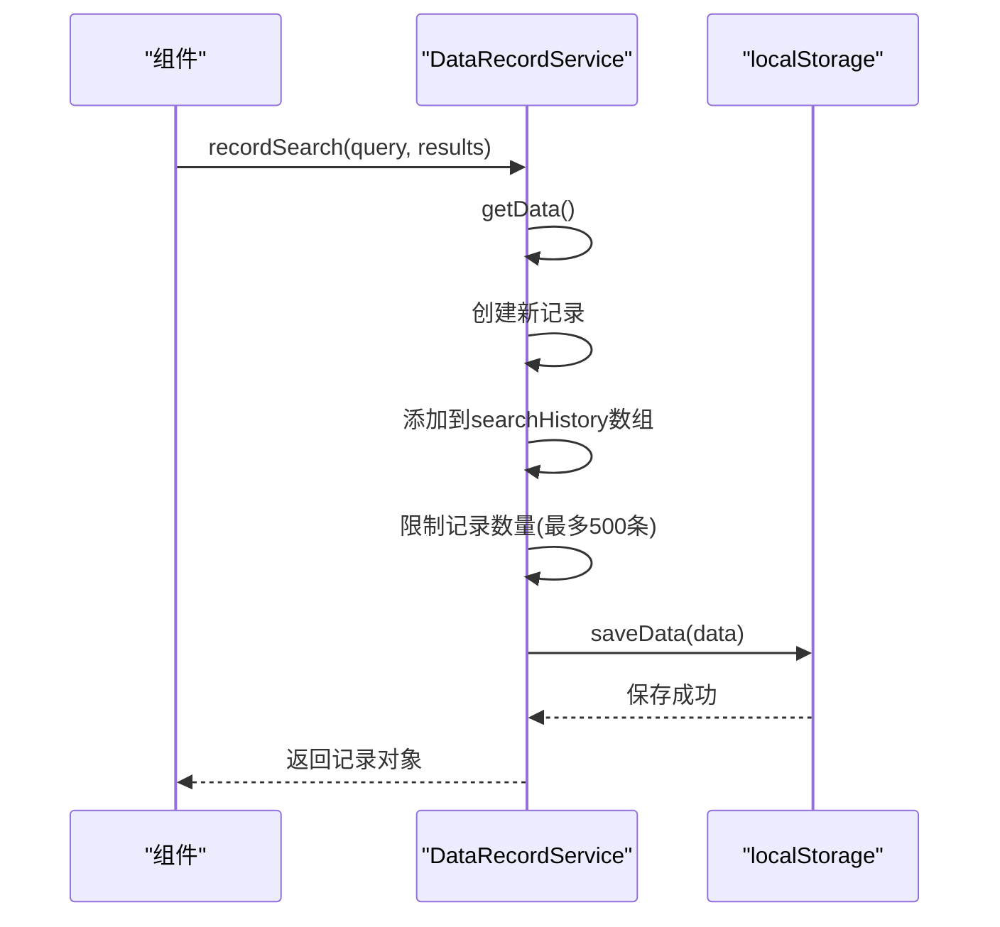
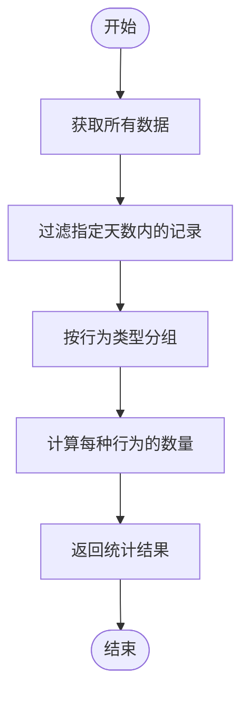
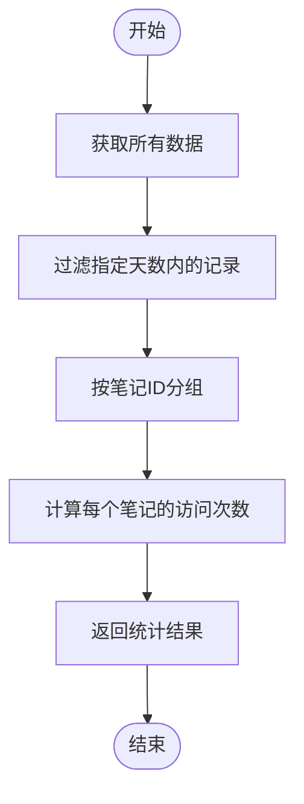
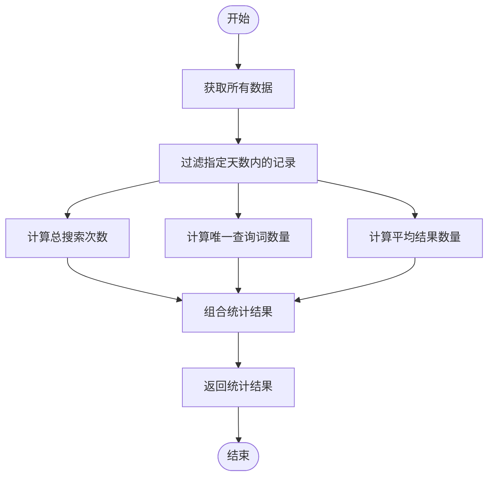
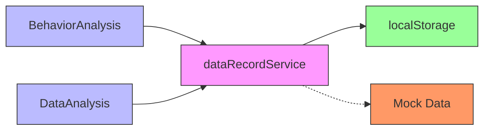

# 数据记录服务

<cite>
**本文档引用的文件**
- [dataRecordService.js](file://src/services/dataRecordService.js)
- [BehaviorAnalysis.jsx](file://src/components/BehaviorAnalysis.jsx)
- [DataAnalysis.jsx](file://src/components/DataAnalysis.jsx)
</cite>

## 目录
1. [简介](#简介)
2. [项目结构](#项目结构)
3. [核心组件](#核心组件)
4. [架构概述](#架构概述)
5. [详细组件分析](#详细组件分析)
6. [依赖分析](#依赖分析)
7. [性能考虑](#性能考虑)
8. [故障排除指南](#故障排除指南)
9. [结论](#结论)

## 简介
数据记录服务是一个用于教学行为数据采集的核心模块，它负责记录用户在智能笔记系统中的各种行为日志、操作轨迹，并计算相关的统计指标。该服务通过与localStorage集成，实现了离线工作场景下的数据持久化存储。本API文档将详细介绍`dataRecordService.js`的各项方法，包括事件日志记录、操作轨迹追踪和统计指标计算等功能。

**Section sources**
- [dataRecordService.js](file://src/services/dataRecordService.js#L1-L10)

## 项目结构
数据记录服务位于项目的`src/services`目录下，作为独立的服务模块被多个前端组件所依赖。其主要功能是为`BehaviorAnalysis.jsx`和`DataAnalysis.jsx`等数据分析组件提供原始数据支持。



**Diagram sources**
- [dataRecordService.js](file://src/services/dataRecordService.js#L1-L10)
- [BehaviorAnalysis.jsx](file://src/components/BehaviorAnalysis.jsx#L1-L10)
- [DataAnalysis.jsx](file://src/components/DataAnalysis.jsx#L1-L10)

**Section sources**
- [dataRecordService.js](file://src/services/dataRecordService.js#L1-L10)

## 核心组件
`dataRecordService.js`是整个数据采集系统的核心，它封装了所有与用户行为数据相关的操作。该服务采用单例模式设计，确保在整个应用生命周期内只有一个实例存在，从而保证数据的一致性和完整性。

**Section sources**
- [dataRecordService.js](file://src/services/dataRecordService.js#L1-L10)

## 架构概述
数据记录服务采用了分层架构设计，主要包括三个层次：接口层、业务逻辑层和数据存储层。这种设计使得代码结构清晰，易于维护和扩展。



**Diagram sources**
- [dataRecordService.js](file://src/services/dataRecordService.js#L1-L177)

## 详细组件分析

### 用户行为记录分析
数据记录服务提供了全面的用户行为跟踪能力，能够精确捕捉用户的每一个操作。

#### 记录用户行为


**Diagram sources**
- [dataRecordService.js](file://src/services/dataRecordService.js#L46-L68)

#### 记录笔记访问


**Diagram sources**
- [dataRecordService.js](file://src/services/dataRecordService.js#L69-L90)

#### 记录搜索历史


**Diagram sources**
- [dataRecordService.js](file://src/services/dataRecordService.js#L91-L112)

### 统计指标计算分析
数据记录服务不仅负责数据采集，还提供了强大的统计分析功能。

#### 获取用户行为统计


**Diagram sources**
- [dataRecordService.js](file://src/services/dataRecordService.js#L113-L130)

#### 获取笔记访问统计


**Diagram sources**
- [dataRecordService.js](file://src/services/dataRecordService.js#L131-L148)

#### 获取搜索统计


**Diagram sources**
- [dataRecordService.js](file://src/services/dataRecordService.js#L149-L177)

**Section sources**
- [dataRecordService.js](file://src/services/dataRecordService.js#L46-L177)

## 依赖分析
数据记录服务与其他组件之间存在着紧密的依赖关系，这些关系构成了完整的数据分析生态系统。



**Diagram sources**
- [dataRecordService.js](file://src/services/dataRecordService.js#L1-L10)
- [BehaviorAnalysis.jsx](file://src/components/BehaviorAnalysis.jsx#L1-L10)
- [DataAnalysis.jsx](file://src/components/DataAnalysis.jsx#L1-L10)

**Section sources**
- [dataRecordService.js](file://src/services/dataRecordService.js#L1-L10)

## 性能考虑
数据记录服务在设计时充分考虑了性能优化问题，特别是在高频率写入场景下的表现。

### 高性能写入示例
```javascript
// 缓冲队列实现
const bufferQueue = [];
let isFlushing = false;

function enqueueRecord(record) {
  bufferQueue.push(record);
  
  // 节流策略：批量处理
  if (!isFlushing) {
    isFlushing = true;
    setTimeout(() => {
      flushBuffer();
      isFlushing = false;
    }, 100); // 每100ms批量写入一次
  }
}

function flushBuffer() {
  const data = getData();
  data.userBehaviors.push(...bufferQueue);
  
  // 保持最近1000条记录
  if (data.userBehaviors.length > 1000) {
    data.userBehaviors = data.userBehaviors.slice(-1000);
  }
  
  saveData(data);
  bufferQueue.length = 0; // 清空缓冲队列
}
```

该实现通过缓冲队列和节流策略相结合的方式，有效减少了对localStorage的直接写入次数，提升了整体性能。

## 故障排除指南
当遇到数据记录服务相关的问题时，可以参考以下常见问题及解决方案：

**Section sources**
- [dataRecordService.js](file://src/services/dataRecordService.js#L1-L177)

## 结论
数据记录服务作为教学行为数据采集的核心组件，提供了完整的行为日志记录、操作轨迹追踪和统计指标计算功能。通过与localStorage的深度集成，该服务不仅支持在线环境下的实时数据采集，还能适应离线工作场景的需求。其高性能的写入机制和完善的隐私保护措施，确保了系统的稳定性和安全性。