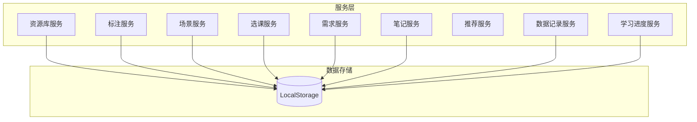
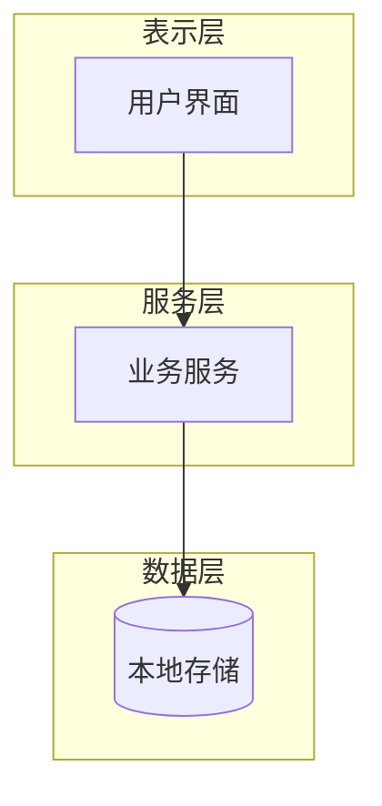
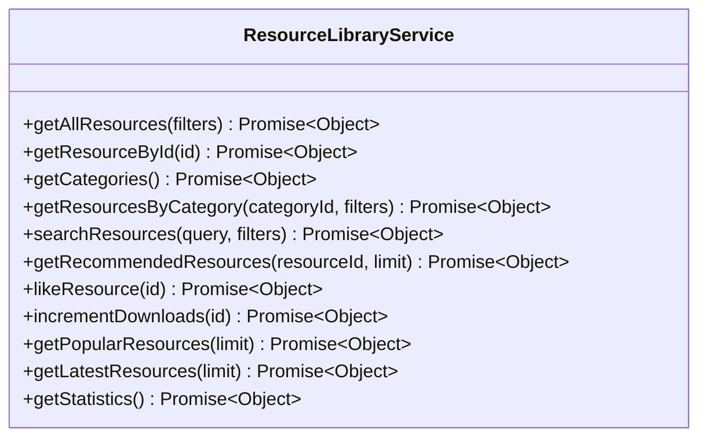
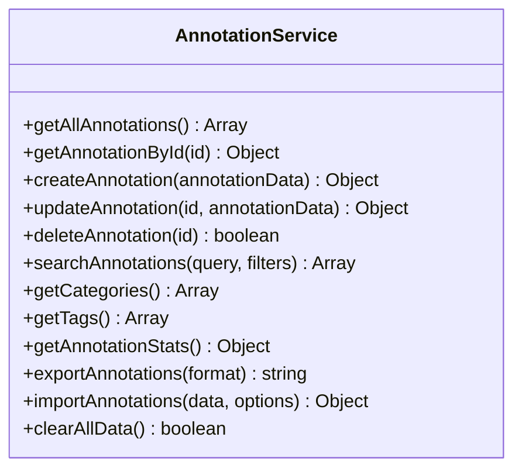
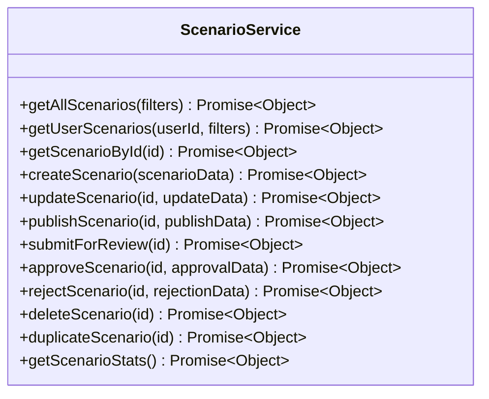
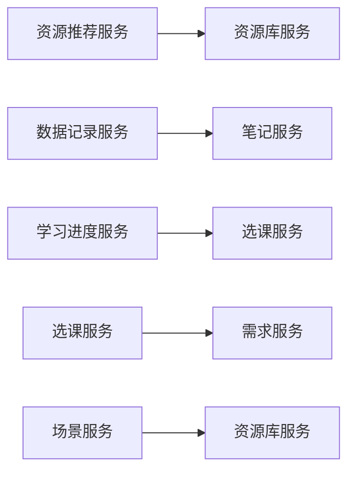
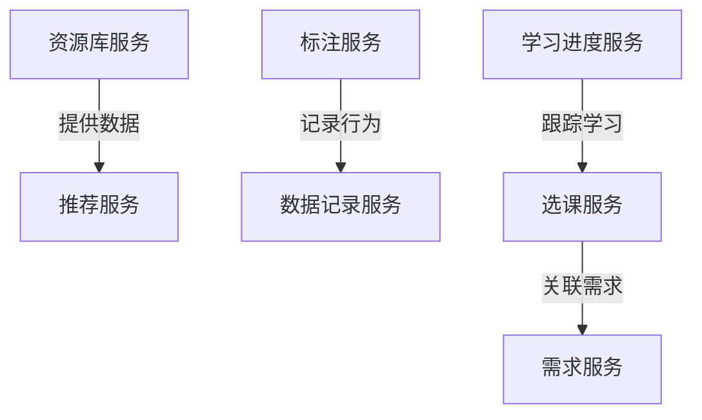

# 服务接口

<cite>
**本文档中引用的文件**   
- [resourceLibraryService.js](file://src/services/resourceLibraryService.js)
- [annotationService.js](file://src/services/annotationService.js)
- [scenarioService.js](file://src/services/scenarioService.js)
- [courseSelectionService.js](file://src/services/courseSelectionService.js)
- [needsService.js](file://src/services/needsService.js)
- [notesService.js](file://src/services/notesService.js)
- [resourceRecommendationService.js](file://src/services/resourceRecommendationService.js)
- [dataRecordService.js](file://src/services/dataRecordService.js)
- [learningProgressService.js](file://src/services/learningProgressService.js)
</cite>

## 目录
1. [简介](#简介)
2. [项目结构](#项目结构)
3. [核心组件](#核心组件)
4. [架构概述](#架构概述)
5. [详细组件分析](#详细组件分析)
6. [依赖关系分析](#依赖关系分析)
7. [性能考虑](#性能考虑)
8. [故障排除指南](#故障排除指南)
9. [结论](#结论)

## 简介
本服务层API文档全面描述了前端应用中定义的所有业务服务。文档详细记录了每个服务文件提供的公共方法、参数类型、返回值格式和异常处理机制，解释了这些服务如何封装数据访问逻辑并与localStorage或其他存储机制交互，并说明了服务间的依赖关系和调用链路。

## 项目结构
系统采用模块化设计，将不同功能的服务分离到独立的文件中，便于维护和扩展。主要服务包括资源库服务、标注服务、场景服务、选课服务、需求服务、笔记服务、推荐服务、数据记录服务和学习进度服务。



**图示来源**
- [resourceLibraryService.js](file://src/services/resourceLibraryService.js#L0-L837)
- [annotationService.js](file://src/services/annotationService.js#L0-L841)
- [scenarioService.js](file://src/services/scenarioService.js#L0-L1209)

**章节来源**
- [resourceLibraryService.js](file://src/services/resourceLibraryService.js#L0-L837)
- [annotationService.js](file://src/services/annotationService.js#L0-L841)

## 核心组件
系统的核心组件包括资源库服务、标注服务和场景服务，它们分别负责管理教育资源、用户标注和模拟仿真场景。这些服务通过封装复杂的业务逻辑和数据访问操作，为上层组件提供简洁的API接口。

**章节来源**
- [resourceLibraryService.js](file://src/services/resourceLibraryService.js#L0-L837)
- [annotationService.js](file://src/services/annotationService.js#L0-L841)
- [scenarioService.js](file://src/services/scenarioService.js#L0-L1209)

## 架构概述
系统采用分层架构，将数据访问、业务逻辑和表示层分离。服务层位于架构的核心位置，负责协调各个组件之间的交互，并提供统一的数据访问接口。



**图示来源**
- [resourceLibraryService.js](file://src/services/resourceLibraryService.js#L0-L837)
- [annotationService.js](file://src/services/annotationService.js#L0-L841)

## 详细组件分析

### 资源库服务分析
资源库服务是系统的核心服务之一，负责管理所有教育资源的分类、检索和访问。该服务提供了丰富的API接口，支持多种筛选条件和排序方式。

#### 公共方法


**图示来源**
- [resourceLibraryService.js](file://src/services/resourceLibraryService.js#L0-L837)

#### 方法详情
| 方法 | 参数 | 返回值 | 异常处理 |
|------|------|--------|----------|
| getAllResources | filters: Object | {success: boolean, data: Array, total: number, message: string} | 捕获并返回错误信息 |
| getResourceById | id: string | {success: boolean, data: Object, message: string} | 返回"资源不存在"消息 |
| getCategories | 无 | {success: boolean, data: Array, message: string} | 捕获并返回错误信息 |

**章节来源**
- [resourceLibraryService.js](file://src/services/resourceLibraryService.js#L0-L837)

### 标注服务分析
标注服务负责管理用户的资源标注数据，支持CRUD操作和本地存储管理。该服务还提供了搜索、统计和导入导出功能。

#### 公共方法


**图示来源**
- [annotationService.js](file://src/services/annotationService.js#L0-L841)

#### 使用示例
```javascript
// 导入标注服务
import annotationService from './services/annotationService.js';

// 创建新的标注
const newAnnotation = annotationService.createAnnotation({
  title: '我的新标注',
  content: '这是标注内容',
  category: 'text_annotation',
  tags: ['重要', '待办']
});

// 搜索标注
const searchResults = annotationService.searchAnnotations('重要', {
  category: 'text_annotation'
});
```

**章节来源**
- [annotationService.js](file://src/services/annotationService.js#L0-L841)

### 场景服务分析
场景服务管理模拟仿真开放平台的场景，支持场景的创建、发布和管理。该服务还处理互动仿真相关的部署和状态管理。

#### 公共方法


**图示来源**
- [scenarioService.js](file://src/services/scenarioService.js#L0-L1209)

**章节来源**
- [scenarioService.js](file://src/services/scenarioService.js#L0-L1209)

### 服务间依赖关系
各服务之间存在明确的依赖关系，形成了完整的业务调用链路。



**图示来源**
- [resourceRecommendationService.js](file://src/services/resourceRecommendationService.js#L0-L326)
- [dataRecordService.js](file://src/services/dataRecordService.js#L0-L177)
- [learningProgressService.js](file://src/services/learningProgressService.js#L0-L405)
- [courseSelectionService.js](file://src/services/courseSelectionService.js#L0-L496)
- [needsService.js](file://src/services/needsService.js#L0-L850)

## 依赖关系分析
系统中的服务通过明确的接口进行通信，形成了松耦合的架构。这种设计使得各个服务可以独立开发和测试，提高了系统的可维护性和可扩展性。



**图示来源**
- [resourceLibraryService.js](file://src/services/resourceLibraryService.js#L0-L837)
- [resourceRecommendationService.js](file://src/services/resourceRecommendationService.js#L0-L326)
- [dataRecordService.js](file://src/services/dataRecordService.js#L0-L177)
- [courseSelectionService.js](file://src/services/courseSelectionService.js#L0-L496)
- [needsService.js](file://src/services/needsService.js#L0-L850)
- [learningProgressService.js](file://src/services/learningProgressService.js#L0-L405)

## 性能考虑
各服务在设计时都考虑了性能优化，采用了合理的数据结构和算法。例如，资源库服务使用了高效的过滤和排序算法，标注服务对大数据量进行了分页处理。

## 故障排除指南
当服务出现异常时，应首先检查输入参数是否符合要求，然后查看返回的错误信息。对于存储相关的问题，可以尝试清除本地存储数据后重新初始化。

**章节来源**
- [resourceLibraryService.js](file://src/services/resourceLibraryService.js#L0-L837)
- [annotationService.js](file://src/services/annotationService.js#L0-L841)
- [scenarioService.js](file://src/services/scenarioService.js#L0-L1209)

## 结论
本文档详细描述了前端应用中定义的所有业务服务，为开发者提供了完整的接口参考和使用指南。通过理解这些服务的功能和用法，开发者可以更有效地构建和维护应用程序。