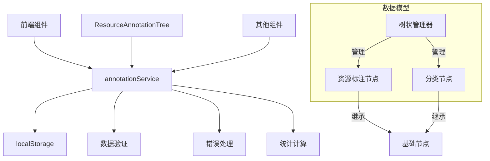
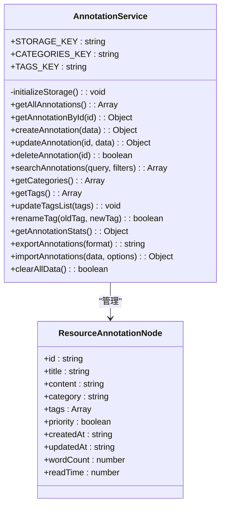
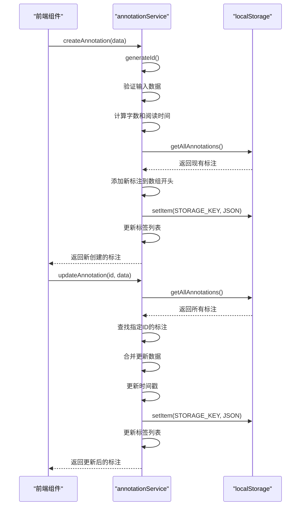
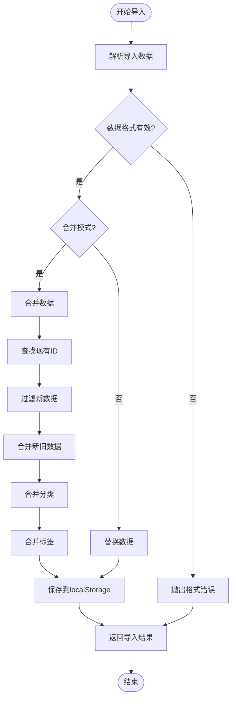
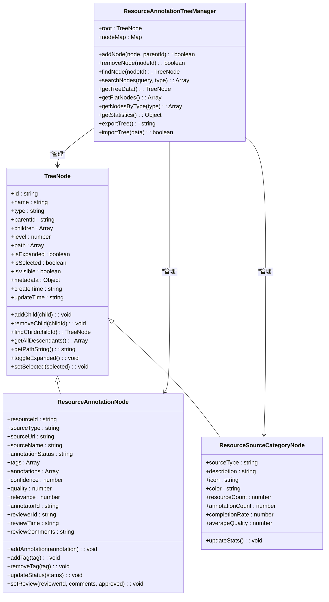
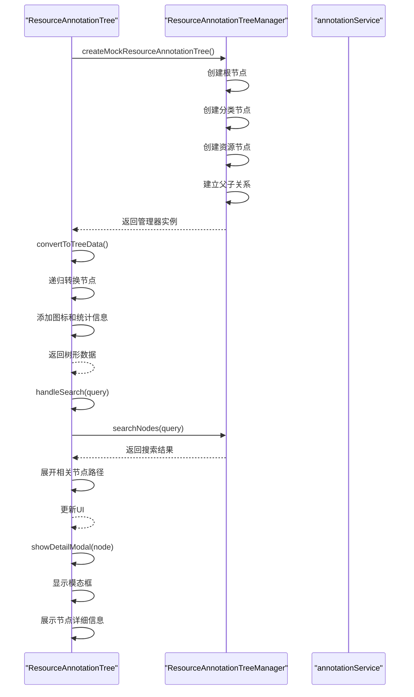
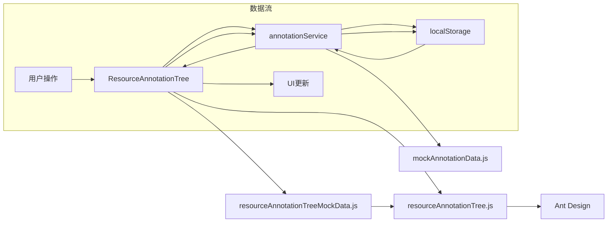

# 标注服务

<cite>
**本文档引用文件**   
- [annotationService.js](file://src/services/annotationService.js)
- [ResourceAnnotationTree.jsx](file://src/components/ResourceAnnotationTree.jsx)
- [resourceAnnotationTree.js](file://src/types/resourceAnnotationTree.js)
- [resourceAnnotationTreeMockData.js](file://src/data/resourceAnnotationTreeMockData.js)
</cite>

## 目录
1. [简介](#简介)
2. [项目结构](#项目结构)
3. [核心组件](#核心组件)
4. [架构概述](#架构概述)
5. [详细组件分析](#详细组件分析)
6. [依赖分析](#依赖分析)
7. [性能考虑](#性能考虑)
8. [故障排除指南](#故障排除指南)
9. [结论](#结论)

## 简介
标注服务是资源管理系统的数据访问层，负责处理所有与资源标注相关的CRUD操作和本地存储管理。该服务为前端组件提供统一的API接口，支持创建、查询、更新和删除资源标注，并通过localStorage实现数据持久化。服务还支持资源标注树形结构的数据组织，与ResourceAnnotationTree组件协同工作，实现复杂的资源分类和标注管理功能。

## 项目结构
```
subsystem/
├── src/
│   ├── components/
│   │   ├── ResourceAnnotationTree.jsx        # 资源标注树形展示组件
│   │   └── ...
│   ├── data/
│   │   ├── resourceAnnotationTreeMockData.js # 模拟数据生成器
│   │   └── ...
│   ├── services/
│   │   └── annotationService.js              # 标注服务主文件
│   ├── types/
│   │   └── resourceAnnotationTree.js         # 数据模型定义
│   └── ...
└── ...
```

## 核心组件
标注服务的核心功能包括资源标注的创建、查询、更新和删除操作，以及对标签、分类等元数据的管理。服务通过localStorage实现数据持久化，使用JSON格式存储标注数据。每个标注包含标题、内容、分类、标签、优先级等属性，并自动记录创建和更新时间。服务还提供搜索、统计、导入导出等高级功能，支持复杂的数据管理和分析需求。

**Section sources**
- [annotationService.js](file://src/services/annotationService.js#L0-L842)

## 架构概述


**Diagram sources **
- [annotationService.js](file://src/services/annotationService.js#L0-L842)
- [resourceAnnotationTree.js](file://src/types/resourceAnnotationTree.js#L0-L434)

## 详细组件分析

### 标注服务分析
标注服务采用单例模式实现，确保全局唯一实例。服务初始化时检查并创建必要的存储键值，包括资源标注数据、分类和标签列表。所有数据操作都封装在独立的方法中，遵循单一职责原则。服务方法返回Promise兼容的同步结果，便于在异步环境中使用。

#### 对于对象导向组件：


**Diagram sources **
- [annotationService.js](file://src/services/annotationService.js#L0-L842)

#### 对于API/服务组件：


**Diagram sources **
- [annotationService.js](file://src/services/annotationService.js#L0-L842)

#### 对于复杂逻辑组件：


**Diagram sources **
- [annotationService.js](file://src/services/annotationService.js#L0-L842)

**Section sources**
- [annotationService.js](file://src/services/annotationService.js#L0-L842)

### 资源标注树分析
ResourceAnnotationTree组件基于Ant Design的Tree组件构建，实现了树形结构的资源标注展示和管理。组件使用ResourceAnnotationTreeManager类管理树状数据结构，支持分类、子分类和资源节点的层级组织。每个节点显示名称、状态图标、质量评分和资源计数等信息，支持搜索、过滤和右键菜单操作。

#### 对于对象导向组件：


**Diagram sources **
- [resourceAnnotationTree.js](file://src/types/resourceAnnotationTree.js#L0-L434)

#### 对于API/服务组件：


**Diagram sources **
- [ResourceAnnotationTree.jsx](file://src/components/ResourceAnnotationTree.jsx#L0-L813)
- [resourceAnnotationTree.js](file://src/types/resourceAnnotationTree.js#L0-L434)

**Section sources**
- [ResourceAnnotationTree.jsx](file://src/components/ResourceAnnotationTree.jsx#L0-L813)
- [resourceAnnotationTree.js](file://src/types/resourceAnnotationTree.js#L0-L434)

## 依赖分析


**Diagram sources **
- [ResourceAnnotationTree.jsx](file://src/components/ResourceAnnotationTree.jsx#L0-L813)
- [annotationService.js](file://src/services/annotationService.js#L0-L842)
- [resourceAnnotationTree.js](file://src/types/resourceAnnotationTree.js#L0-L434)

## 性能考虑
标注服务的性能主要受localStorage读写速度和数据量大小影响。建议定期清理无用数据，避免单个标注过大。对于大量数据的搜索操作，可考虑添加索引或分页功能。树形组件在渲染大量节点时可能影响性能，建议实现虚拟滚动或懒加载。数据导入导出操作应提供进度提示，避免界面卡顿。

## 故障排除指南
常见问题及解决方案：

1. **标注数据冲突处理**：当多个用户同时编辑同一标注时，后保存的版本会覆盖之前的修改。建议实现乐观锁机制，在更新前检查数据版本号。

2. **存储空间不足**：localStorage有5-10MB限制，当数据接近上限时，服务会抛出异常。可通过压缩数据、定期归档或使用IndexedDB替代。

3. **数据同步问题**：不同浏览器标签页间的数据同步需要监听storage事件，及时更新UI。

4. **导入数据格式错误**：确保导入数据符合预期格式，包含必要的字段和正确的数据类型。

5. **树形组件渲染缓慢**：当节点数量过多时，可实现按需加载，只渲染可见区域的节点。

**Section sources**
- [annotationService.js](file://src/services/annotationService.js#L0-L842)
- [ResourceAnnotationTree.jsx](file://src/components/ResourceAnnotationTree.jsx#L0-L813)

## 结论
标注服务为资源管理系统提供了完整的数据访问能力，支持丰富的标注功能和灵活的数据组织方式。通过与ResourceAnnotationTree组件的紧密协作，实现了直观的树形界面和高效的资源管理。服务设计考虑了易用性、可维护性和扩展性，为未来的功能迭代奠定了良好基础。