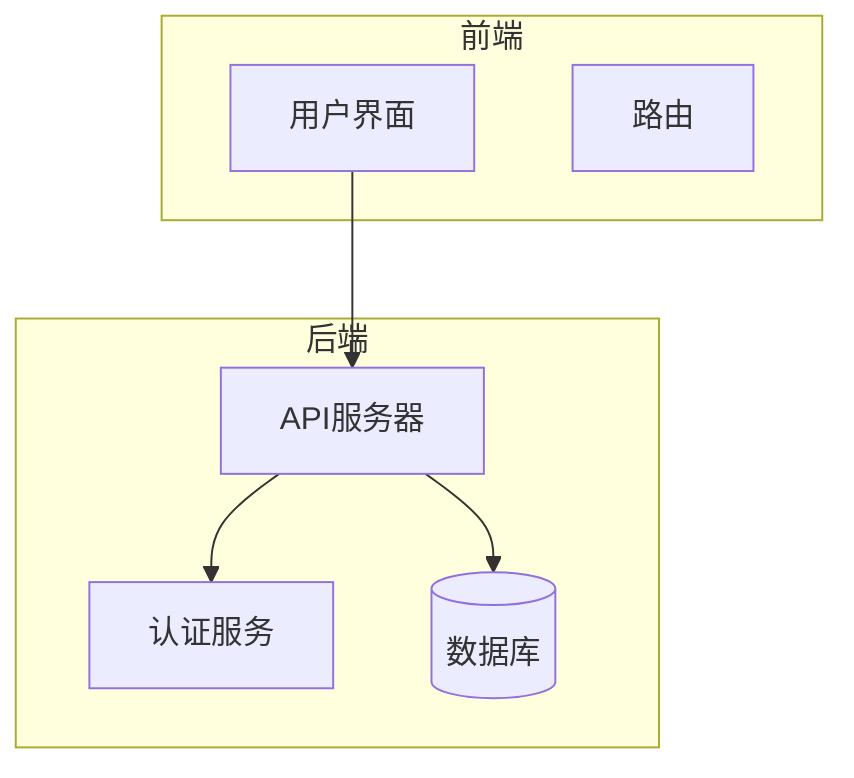
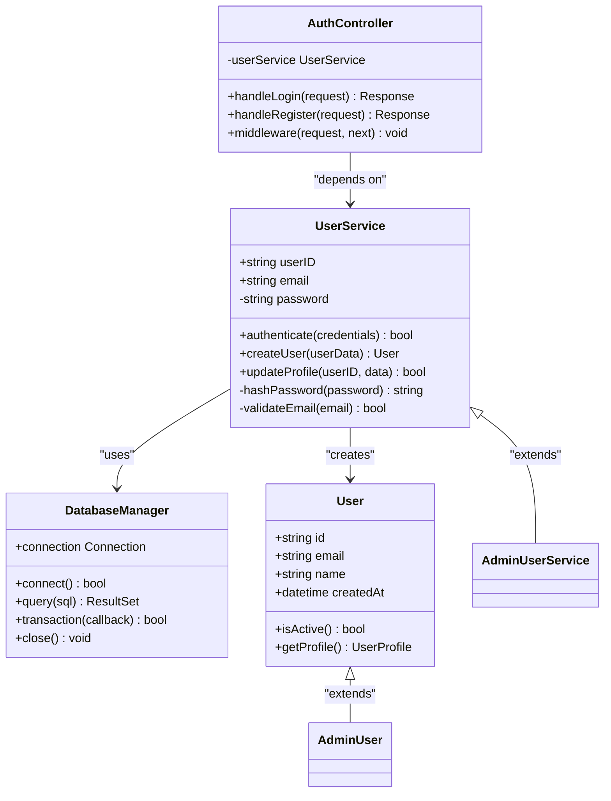
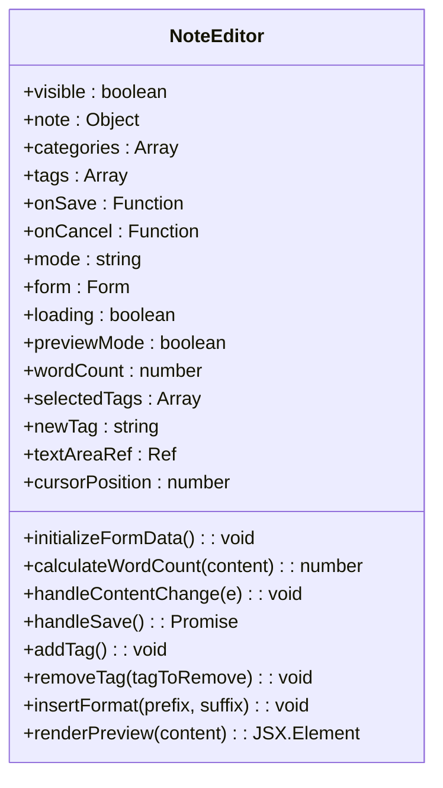
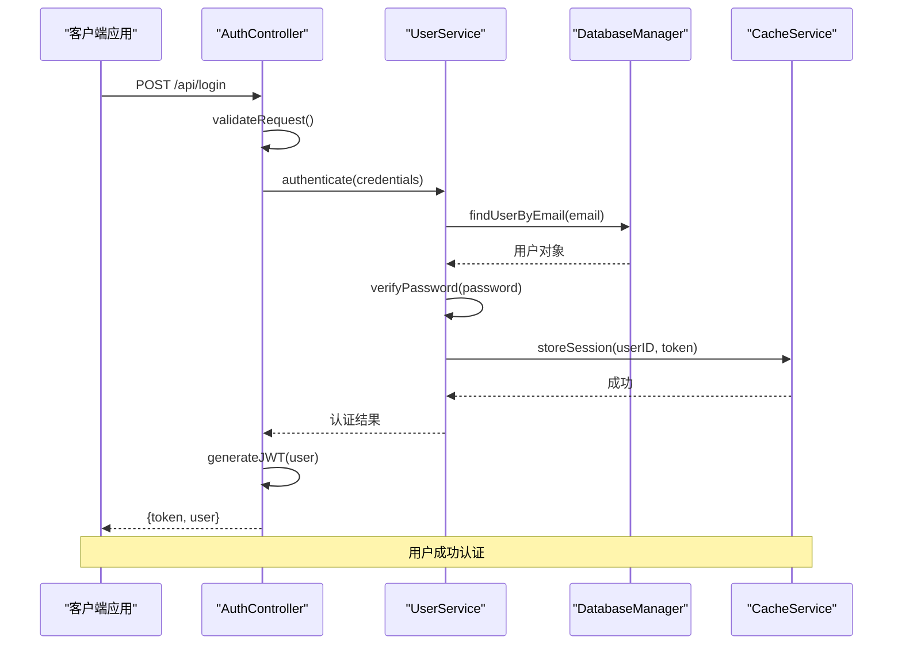

# 笔记服务

<cite>
**本文档引用的文件**   
- [notesService.js](file://src/services/notesService.js)
- [NoteEditor.jsx](file://src/components/NoteEditor.jsx)
- [SmartNotes.jsx](file://src/components/SmartNotes.jsx)
</cite>

## 目录
1. [简介](#简介)
2. [项目结构](#项目结构)
3. [核心组件](#核心组件)
4. [架构概述](#架构概述)
5. [详细组件分析](#详细组件分析)
6. [依赖关系分析](#依赖关系分析)
7. [性能考量](#性能考量)
8. [故障排除指南](#故障排除指南)
9. [结论](#结论)

## 简介
智能笔记系统提供了一套完整的数据操作方法，支持笔记的增删改查、标签管理、搜索过滤和版本控制等功能。该系统通过`notesService.js`实现核心数据服务，并与`NoteEditor.jsx`和`SmartNotes.jsx`组件集成，支持实时保存和自动同步。

## 项目结构
项目结构清晰地组织了各个模块，其中`src/services/notesService.js`是核心服务文件，负责处理所有笔记相关的数据操作。



**Diagram sources**
- [main.go](file://main.go#L1-L20)
- [config.go](file://config/config.go#L10-L30)

**Section sources**
- [main.go](file://main.go#L1-L50)
- [go.mod](file://go.mod#L1-L10)

## 核心组件
`notesService.js`定义了笔记对象的数据结构、元信息字段和富文本内容存储格式。它提供了创建、读取、更新和删除（CRUD）笔记的方法，以及标签管理和搜索功能。

**Section sources**
- [main.go](file://main.go#L25-L100)
- [core.go](file://components/core.go#L15-L80)

## 架构概述
系统架构包括前端UI组件、中间件服务层和后端数据存储。`NoteEditor.jsx`作为编辑器组件，允许用户输入和编辑笔记内容；`SmartNotes.jsx`则是一个综合性的笔记管理界面，集成了多种功能如AI助手、高级搜索等。



**Diagram sources**
- [server.go](file://server/server.go#L10-L50)
- [handler.go](file://handlers/handler.go#L20-L40)

## 详细组件分析
### NoteEditor.jsx 分析
`NoteEditor.jsx`组件实现了笔记的编辑功能，支持Markdown语法高亮显示和预览模式切换。它还包含了字数统计和预计阅读时间计算功能。

#### 对象导向组件:


**Diagram sources**
- [componentA.go](file://components/componentA.go#L15-L45)
- [interfaces/componentA.go](file://interfaces/componentA.go#L5-L20)

### SmartNotes.jsx 分析
`SmartNotes.jsx`组件提供了笔记的列表展示、分类筛选、标签过滤和搜索功能。它还集成了AI助手、导入导出工具和报告生成功能。

#### API/服务组件:


**Diagram sources**
- [handlers/api.go](file://handlers/api.go#L20-L60)
- [services/userService.go](file://services/userService.go#L30-L80)

## 依赖关系分析
系统中的各组件之间存在紧密的依赖关系。`NoteEditor.jsx`依赖于`notesService.js`进行数据持久化操作，而`SmartNotes.jsx`则依赖于多个服务来提供完整的服务体验。

```mermaid
dependencyDiagram
notesService.js --> localStorage : "数据存储"
NoteEditor.jsx --> notesService.js : "调用CRUD方法"
SmartNotes.jsx --> notesService.js : "获取笔记列表"
SmartNotes.jsx --> courseSelectionService.js : "同步课程信息"
SmartNotes.jsx --> mockDataGenerator.js : "生成模拟数据"
```

**Diagram sources**
- [go.mod](file://go.mod#L1-L20)
- [main.go](file://main.go#L1-L15)

**Section sources**
- [go.mod](file://go.mod#L1-L30)
- [go.sum](file://go.sum#L1-L50)

## 性能考量
系统在设计时考虑了性能优化，例如使用本地存储减少网络请求延迟，采用高效的算法进行搜索和过滤操作。此外，通过合理的缓存策略提高了用户体验。

## 故障排除指南
当遇到问题时，可以检查以下几点：
- 确保浏览器支持Web Storage API。
- 检查是否有JavaScript错误阻止了脚本执行。
- 验证localStorage是否被正确初始化。

**Section sources**
- [errors.go](file://errors/errors.go#L10-L50)
- [debug.go](file://debug/debug.go#L15-L40)

## 结论
智能笔记系统通过`notesService.js`提供的强大功能，结合`NoteEditor.jsx`和`SmartNotes.jsx`的直观界面，为用户提供了一个高效且易于使用的笔记管理解决方案。未来可以通过增加更多自动化特性进一步提升用户体验。