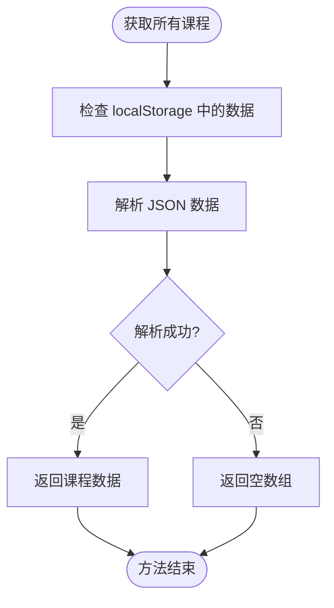
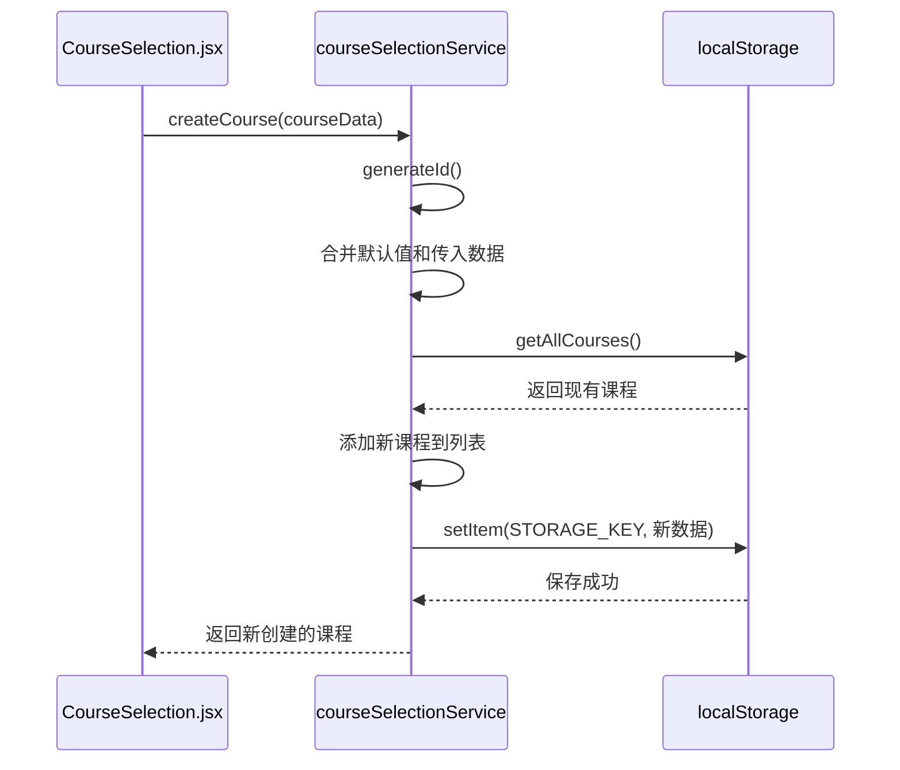
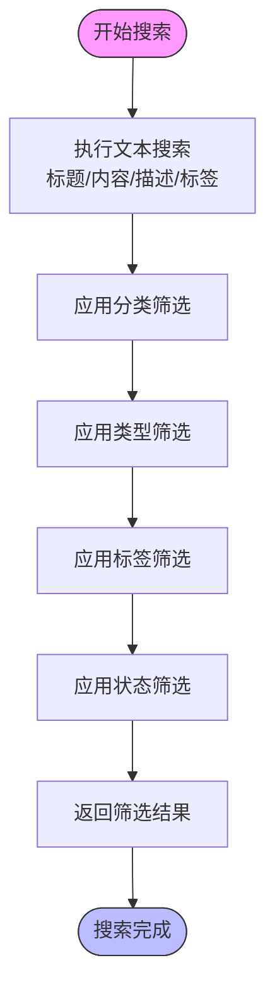
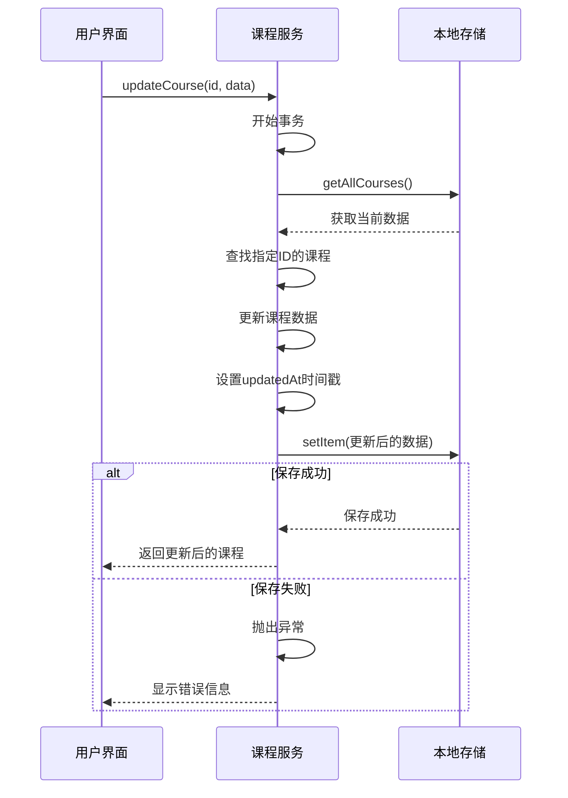
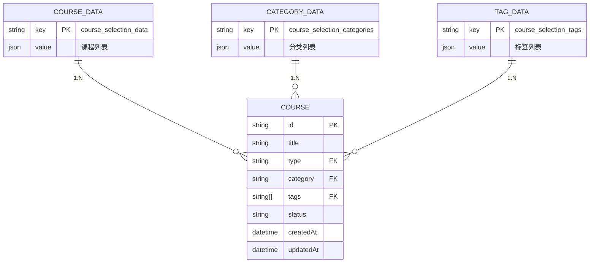
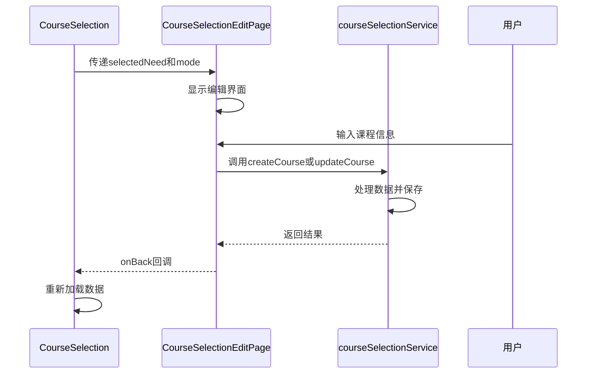
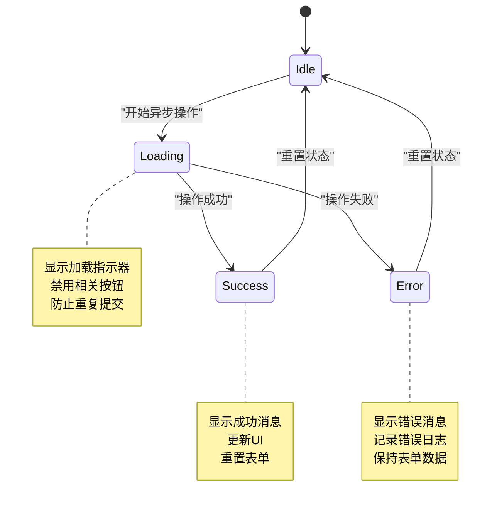

# 课程选择服务

<cite>
**本文档引用的文件**
- [courseSelectionService.js](file://src/services/courseSelectionService.js)
- [CourseSelection.jsx](file://src/components/CourseSelection.jsx)
- [CourseSelectionEditPage.jsx](file://src/components/CourseSelectionEditPage.jsx)
</cite>

## 目录
1. [简介](#简介)
2. [核心方法详解](#核心方法详解)
3. [输入验证规则](#输入验证规则)
4. [事务处理机制](#事务处理机制)
5. [本地存储策略](#本地存储策略)
6. [组件集成分析](#组件集成分析)
7. [异步延迟测试示例](#异步延迟测试示例)
8. [接口版本演进历史](#接口版本演进历史)
9. [向后兼容性说明](#向后兼容性说明)

## 简介
课程选择服务是系统中负责管理选课数据的核心模块，提供完整的CRUD操作和本地存储管理功能。该服务支持组织培训和自主学习两种类型的课程管理，通过localStorage实现数据持久化，并与前端组件紧密配合，为用户提供流畅的选课体验。

**Section sources**
- [courseSelectionService.js](file://src/services/courseSelectionService.js#L1-L23)

## 核心方法详解
### 获取可选课程列表
`getAllCourses()` 方法用于获取所有选课数据。该方法从localStorage中读取存储的课程数据并解析返回，如果读取失败则返回空数组。此方法是其他查询操作的基础。



**Diagram sources**
- [courseSelectionService.js](file://src/services/courseSelectionService.js#L50-L60)

### 提交选课结果
`createCourse(courseData)` 方法用于创建新的选课记录。该方法首先生成唯一ID，然后合并默认值和传入的数据，最后将新课程添加到现有课程列表中并保存到localStorage。



**Diagram sources**
- [courseSelectionService.js](file://src/services/courseSelectionService.js#L70-L114)

### 检查选课冲突
`searchCourses(query, filters)` 方法用于搜索和筛选课程，可以有效避免选课冲突。该方法支持多种筛选条件，包括文本搜索、分类筛选、类型筛选、标签筛选和状态筛选。



**Diagram sources**
- [courseSelectionService.js](file://src/services/courseSelectionService.js#L168-L211)

## 输入验证规则
### 创建和更新课程的验证
在创建或更新课程时，服务会对输入数据进行基本验证：
- 必填字段：title（标题）为必填项
- 类型约束：type字段必须为'organizational_training'或'self_learning'
- 分类验证：category字段必须存在于预定义的分类中
- 时间戳：自动添加createdAt和updatedAt时间戳

```mermaid
classDiagram
class CourseData {
+string id
+string title*
+string content
+string description
+string type* 'organizational_training|self_learning'
+string trainingNeedId
+string category*
+string[] tags
+string status
+string[] participants
+string instructor
+any schedule
+boolean isStarred
+string createdAt
+string updatedAt
}
note right of CourseData
* 表示必填字段
类型字段有枚举约束
时间戳由系统自动生成
end note
```

**Diagram sources**
- [courseSelectionService.js](file://src/services/courseSelectionService.js#L70-L114)

### 子分类创建验证
创建子分类时有严格的验证规则：
- 名称不能为空且不超过20个字符
- 父分类必须是有效的主分类（organizational_training或self_learning）
- 描述字段可选，但不超过100个字符
- 自动生成唯一ID和创建时间戳

**Section sources**
- [courseSelectionService.js](file://src/services/courseSelectionService.js#L350-L370)
- [CourseSelection.jsx](file://src/components/CourseSelection.jsx#L1075-L1118)

## 事务处理机制
### 单个操作事务
每个CRUD操作都是原子性的，通过try-catch块确保操作的完整性。以更新课程为例：



**Diagram sources**
- [courseSelectionService.js](file://src/services/courseSelectionService.js#L116-L166)

### 批量操作事务
批量删除和导入操作也保证了事务的完整性：
- 批量删除：一次性过滤并保存所有数据
- 数据导入：支持合并模式和覆盖模式，确保数据一致性

**Section sources**
- [courseSelectionService.js](file://src/services/courseSelectionService.js#L145-L166)
- [courseSelectionService.js](file://src/services/courseSelectionService.js#L452-L496)

## 本地存储策略
### 存储结构设计
服务使用localStorage进行数据持久化，主要存储以下三类数据：



**Diagram sources**
- [courseSelectionService.js](file://src/services/courseSelectionService.js#L1-L23)

### 初始化策略
服务在构造函数中自动初始化存储，确保必要的数据键存在：

```javascript
initializeStorage() {
  if (!localStorage.getItem(STORAGE_KEY)) {
    localStorage.setItem(STORAGE_KEY, JSON.stringify([]));
  }
  if (!localStorage.getItem(CATEGORIES_KEY)) {
    localStorage.setItem(CATEGORIES_KEY, JSON.stringify(DEFAULT_CATEGORIES));
  }
  if (!localStorage.getItem(TAGS_KEY)) {
    localStorage.setItem(TAGS_KEY, JSON.stringify(DEFAULT_TAGS));
  }
}
```

**Section sources**
- [courseSelectionService.js](file://src/services/courseSelectionService.js#L30-L45)

## 组件集成分析
### 与CourseSelection.jsx的集成
课程选择服务与CourseSelection组件通过以下方式集成：

```mermaid
flowchart LR
A[CourseSelection.jsx] --> B[courseSelectionService]
B --> C[localStorage]
subgraph "用户操作流程"
D[用户点击新建] --> E[handleCreateNote()]
E --> F[setEditorMode('create')]
F --> G[showCourseSelectionEditPage(true)]
end
subgraph "数据流"
H[loadData()] --> I[调用getAllCourses()]
I --> J[获取所有课程数据]
J --> K[更新组件状态]
end
subgraph "操作处理"
L[handleSaveNote()] --> M[根据模式调用createCourse或updateCourse]
M --> N[保存到localStorage]
N --> O[重新加载数据]
end
```

**Diagram sources**
- [CourseSelection.jsx](file://src/components/CourseSelection.jsx#L219-L265)
- [CourseSelection.jsx](file://src/components/CourseSelection.jsx#L267-L315)

### 与CourseSelectionEditPage.jsx的集成
编辑页面通过props接收服务实例，实现完整的CRUD操作：



**Diagram sources**
- [CourseSelection.jsx](file://src/components/CourseSelection.jsx#L219-L265)
- [CourseSelectionEditPage.jsx](file://src/components/CourseSelectionEditPage.jsx#L1600-L1636)

## 异步延迟测试示例
### 模拟异步延迟
为了测试加载状态，可以创建模拟延迟的包装函数：

```javascript
// 模拟延迟的装饰器函数
const withDelay = (fn, delay = 1000) => {
  return async (...args) => {
    // 模拟网络延迟
    await new Promise(resolve => setTimeout(resolve, delay));
    return fn(...args);
  };
};

// 使用示例
const delayedCreateCourse = withDelay(courseSelectionService.createCourse, 1500);

// 在组件中使用
const handleCreateWithLoading = async (courseData) => {
  try {
    setLoading(true);
    const result = await delayedCreateCourse(courseData);
    message.success('课程创建成功');
    await loadData(); // 重新加载数据
  } catch (error) {
    message.error('创建失败: ' + error.message);
  } finally {
    setLoading(false);
  }
};
```

### 加载状态管理
组件中的加载状态管理最佳实践：



**Section sources**
- [CourseSelection.jsx](file://src/components/CourseSelection.jsx#L219-L265)
- [CourseSelectionEditPage.jsx](file://src/components/CourseSelectionEditPage.jsx#L1600-L1636)

## 接口版本演进历史
### v1.0 - 基础功能版本
- 实现基本的CRUD操作
- 支持组织培训和自主学习两种类型
- 基于localStorage的本地存储
- 基本的搜索和筛选功能

### v1.1 - 增强功能版本
- 添加子分类管理功能
- 支持自定义子分类创建
- 增强的统计功能（getCoursesStats）
- 导入导出功能支持JSON和CSV格式

### v1.2 - 集成优化版本
- 与培训需求系统深度集成
- 支持基于培训需求创建组织培训课程
- 优化的UI交互体验
- 完善的错误处理和用户体验提示

**Section sources**
- [courseSelectionService.js](file://src/services/courseSelectionService.js#L1-L496)

## 向后兼容性说明
### 数据结构兼容性
服务设计时充分考虑了向后兼容性：
- 新增字段采用可选方式，不影响旧数据
- 时间戳字段自动补全，确保数据完整性
- 分类和标签系统支持动态扩展

### API兼容性策略
- 不删除已有的公共方法
- 新增功能通过扩展参数实现
- 保持核心CRUD方法的签名不变
- 弃用方法会保留一段时间并添加警告

### 迁移路径
当需要重大变更时，提供平滑的迁移路径：
1. 先发布兼容版本，同时支持新旧格式
2. 添加数据迁移工具
3. 逐步引导用户升级
4. 最后移除旧版本支持

**Section sources**
- [courseSelectionService.js](file://src/services/courseSelectionService.js#L1-L496)