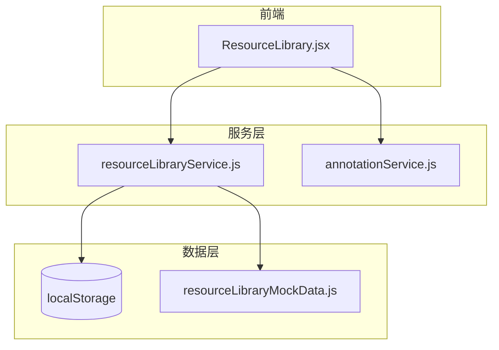
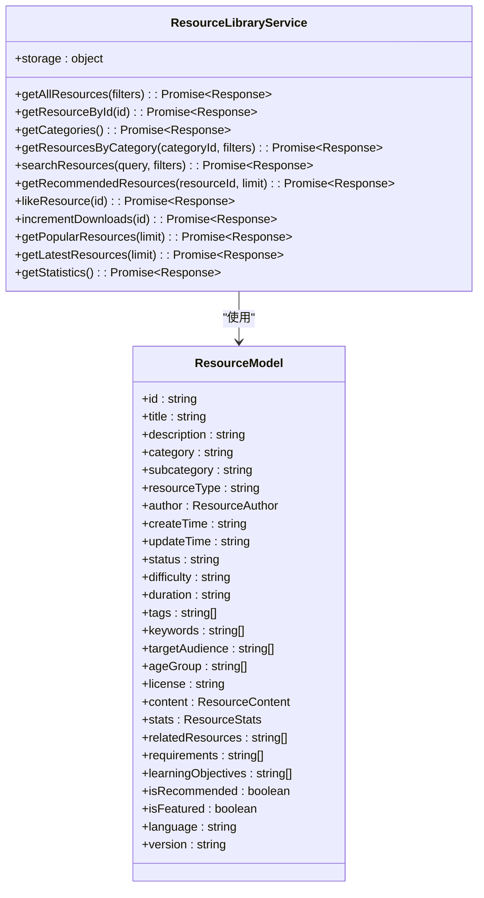
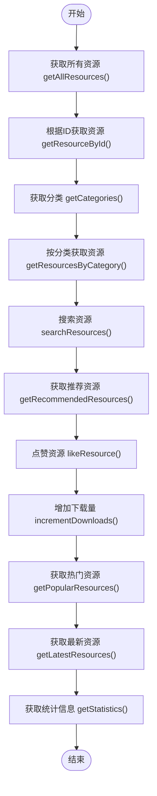
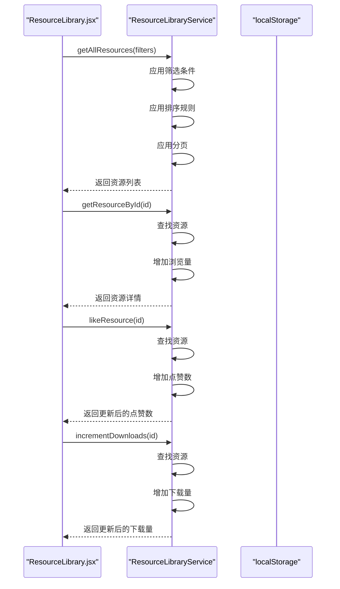
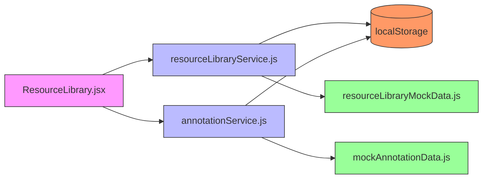
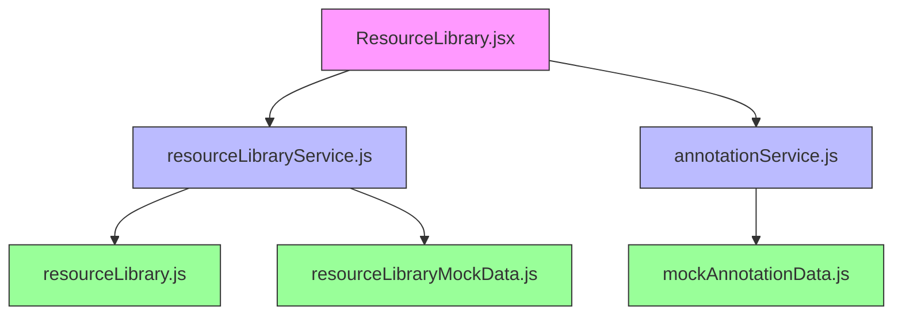

# 资源库服务

<cite>
**本文档引用的文件**
- [resourceLibraryService.js](file://src/services/resourceLibraryService.js)
- [ResourceLibrary.jsx](file://src/components/ResourceLibrary.jsx)
- [annotationService.js](file://src/services/annotationService.js)
- [resourceLibrary.js](file://src/types/resourceLibrary.js)
</cite>

## 目录
1. [简介](#简介)
2. [项目结构](#项目结构)
3. [核心组件](#核心组件)
4. [架构概述](#架构概述)
5. [详细组件分析](#详细组件分析)
6. [依赖分析](#依赖分析)
7. [性能考虑](#性能考虑)
8. [故障排除指南](#故障排除指南)
9. [结论](#结论)

## 简介
资源库服务是系统中负责管理教育资源的核心模块，提供资源的分类、检索、访问和统计功能。该服务通过localStorage实现数据持久化，支持多种资源类型（如视频、文档、音频等）的统一管理。作为资源管理模块的核心，它与前端组件ResourceLibrary.jsx紧密协作，并与其他服务如annotationService集成，为用户提供完整的资源管理和标注体验。

## 项目结构
资源库服务位于`src/services/resourceLibraryService.js`，其数据模型定义在`src/types/resourceLibrary.js`中。前端组件`ResourceLibrary.jsx`位于`src/components/`目录下，负责展示资源列表和详情。服务的数据存储基于localStorage，初始化时从模拟数据`resourceLibraryMockData.js`加载资源信息。

**Diagram sources**
- [resourceLibraryService.js](file://src/services/resourceLibraryService.js)
- [ResourceLibrary.jsx](file://src/components/ResourceLibrary.jsx)
- [annotationService.js](file://src/services/annotationService.js)

**Section sources**
- [resourceLibraryService.js](file://src/services/resourceLibraryService.js)
- [ResourceLibrary.jsx](file://src/components/ResourceLibrary.jsx)

## 核心组件
资源库服务提供了完整的资源管理API，包括获取资源列表、搜索、分类浏览、推荐等功能。所有方法均为异步操作，返回包含success状态、data数据和message消息的标准响应格式。服务通过localStorage实现数据持久化，确保用户数据不会丢失。

**Section sources**
- [resourceLibraryService.js](file://src/services/resourceLibraryService.js#L486-L837)
- [resourceLibrary.js](file://src/types/resourceLibrary.js#L0-L463)

## 架构概述
资源库服务采用单例模式设计，通过`ResourceLibraryService`类封装所有资源管理功能。服务内部维护一个`resourceStorage`对象，用于存储资源数据和分类信息。所有数据操作都通过服务提供的公共方法进行，确保数据一致性和安全性。

**Diagram sources**
- [resourceLibraryService.js](file://src/services/resourceLibraryService.js#L486-L837)
- [resourceLibrary.js](file://src/types/resourceLibrary.js#L0-L463)

## 详细组件分析

### 资源库服务分析
资源库服务提供了全面的资源管理功能，所有方法都经过异常处理，确保调用的安全性。服务通过localStorage实现数据持久化，初始化时从模拟数据加载资源信息。

#### 公共方法说明

**Diagram sources**
- [resourceLibraryService.js](file://src/services/resourceLibraryService.js#L486-L837)

#### 方法调用时序图

**Diagram sources**
- [resourceLibraryService.js](file://src/services/resourceLibraryService.js#L486-L837)
- [ResourceLibrary.jsx](file://src/components/ResourceLibrary.jsx#L0-L657)

#### 集成关系

**Diagram sources**
- [resourceLibraryService.js](file://src/services/resourceLibraryService.js)
- [ResourceLibrary.jsx](file://src/components/ResourceLibrary.jsx)
- [annotationService.js](file://src/services/annotationService.js)

**Section sources**
- [resourceLibraryService.js](file://src/services/resourceLibraryService.js#L486-L837)
- [ResourceLibrary.jsx](file://src/components/ResourceLibrary.jsx#L0-L657)
- [annotationService.js](file://src/services/annotationService.js#L0-L841)

## 依赖分析
资源库服务依赖于多个核心组件：`resourceLibrary.js`提供数据模型定义，`resourceLibraryMockData.js`提供初始数据，`ResourceLibrary.jsx`作为主要消费者。服务还与`annotationService.js`集成，实现资源标注功能。

**Diagram sources**
- [resourceLibraryService.js](file://src/services/resourceLibraryService.js)
- [resourceLibrary.js](file://src/types/resourceLibrary.js)
- [ResourceLibrary.jsx](file://src/components/ResourceLibrary.jsx)
- [annotationService.js](file://src/services/annotationService.js)

**Section sources**
- [resourceLibraryService.js](file://src/services/resourceLibraryService.js)
- [resourceLibrary.js](file://src/types/resourceLibrary.js)
- [ResourceLibrary.jsx](file://src/components/ResourceLibrary.jsx)
- [annotationService.js](file://src/services/annotationService.js)

## 性能考虑
资源库服务在设计时考虑了性能优化：
1. 所有数据操作都在内存中进行，避免频繁的localStorage读写
2. 搜索和筛选操作使用JavaScript原生数组方法，效率较高
3. 分页功能减少了一次性加载的数据量
4. 统计信息计算采用reduce等高效方法

对于大型数据集，建议：
- 实现数据分片加载
- 添加缓存机制
- 优化搜索算法
- 使用Web Worker处理复杂计算

## 故障排除指南
常见问题及解决方案：

| 问题 | 可能原因 | 解决方案 |
|------|---------|----------|
| 获取资源失败 | localStorage被禁用或已满 | 检查浏览器设置，清理存储空间 |
| 数据未持久化 | 服务未正确初始化 | 确保调用loadInitialData()方法 |
| 搜索结果不准确 | 搜索条件错误 | 检查filters参数是否正确 |
| 点赞/下载数未更新 | 方法调用失败 | 检查返回的success状态 |

**Section sources**
- [resourceLibraryService.js](file://src/services/resourceLibraryService.js#L486-L837)
- [ResourceLibrary.jsx](file://src/components/ResourceLibrary.jsx#L0-L657)

## 结论
资源库服务为系统提供了稳定可靠的资源管理功能，通过清晰的API设计和良好的错误处理机制，确保了用户体验的一致性。服务与前端组件和其它服务的良好集成，形成了完整的资源管理生态系统。未来可考虑引入更高级的搜索功能和数据分析能力，进一步提升服务价值。