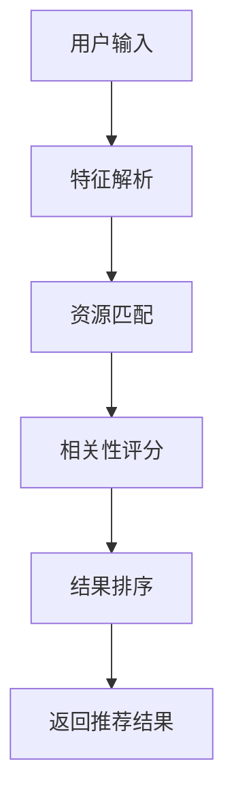
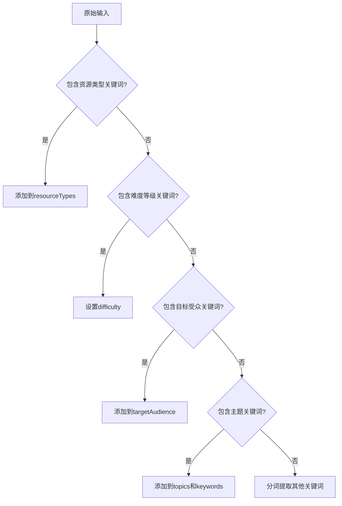
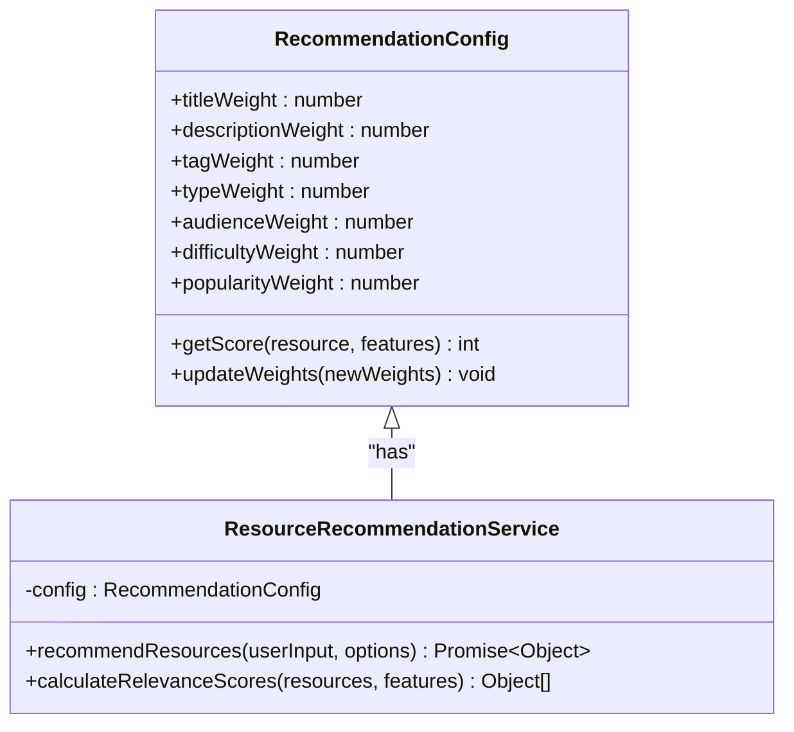
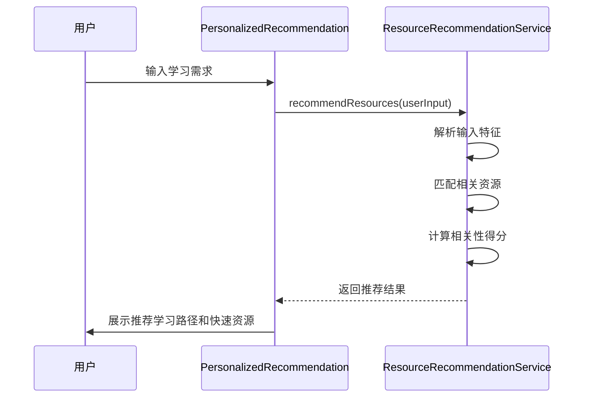
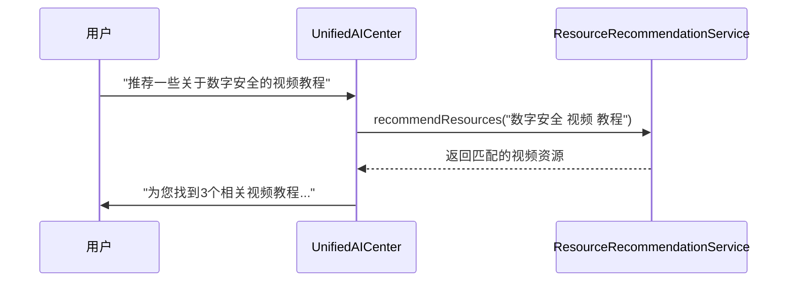
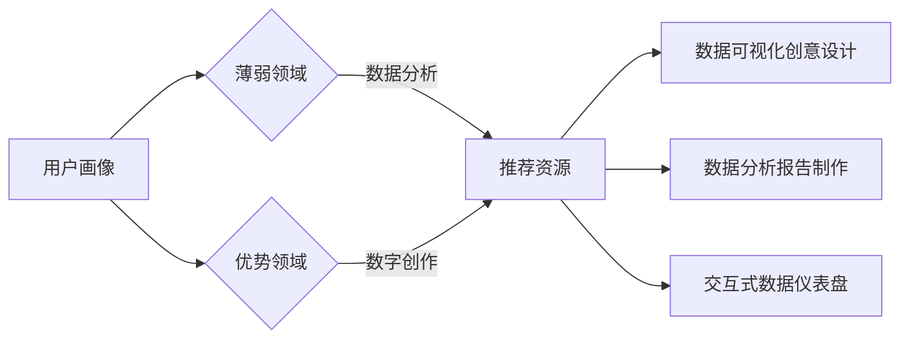
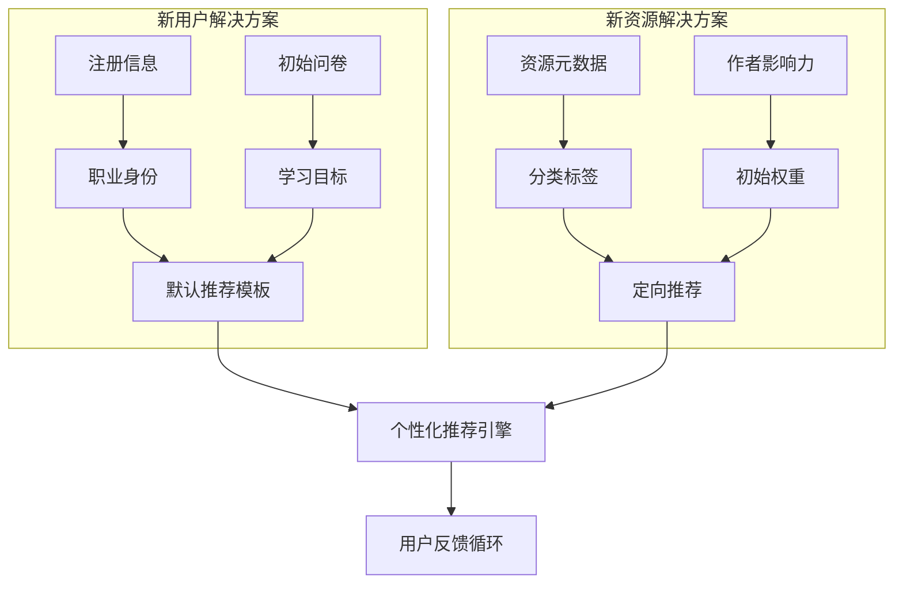

# 资源推荐服务

<cite>
**本文档引用文件**   
- [resourceRecommendationService.js](file://src/services/resourceRecommendationService.js)
- [PersonalizedRecommendation.jsx](file://src/components/PersonalizedRecommendation.jsx)
- [UnifiedAICenter.jsx](file://src/components/UnifiedAICenter.jsx)
- [resourceLibraryMockData.js](file://src/data/resourceLibraryMockData.js)
- [resourceLibrary.js](file://src/types/resourceLibrary.js)
</cite>

## 目录
1. [简介](#简介)
2. [核心功能](#核心功能)
3. [推荐算法机制](#推荐算法机制)
4. [配置参数与权重调整](#配置参数与权重调整)
5. [组件集成方案](#组件集成方案)
6. [复合推荐示例](#复合推荐示例)
7. [多样性保障与冷启动解决方案](#多样性保障与冷启动解决方案)
8. [A/B测试支持](#ab测试支持)

## 简介
资源推荐服务是一个智能化的内容推送引擎，旨在为用户提供个性化的学习资源推荐。该服务通过分析用户输入的特征和需求，结合用户画像、兴趣标签和学习进度等多维度数据，实现精准的内容匹配和智能排序。

本服务主要包含三大核心功能：个性化推荐引擎的数据服务接口、推荐策略的动态配置管理以及与前端组件的深度集成。系统能够根据用户的实时反馈不断优化推荐效果，支持基于学习进度和兴趣标签的复合推荐模式，并采用动态排序算法确保推荐结果的相关性和多样性。

服务架构设计充分考虑了可扩展性和灵活性，支持A/B测试和权重调整机制，能够适应不同场景下的推荐需求。同时，系统还提供了完善的冷启动解决方案，确保新用户和新资源都能获得合理的曝光机会。

**Section sources**
- [resourceRecommendationService.js](file://src/services/resourceRecommendationService.js#L0-L326)

## 核心功能
资源推荐服务提供了一套完整的个性化推荐解决方案，主要包括以下核心功能：

### 推荐算法调用
服务通过`recommendResources`方法接收用户输入并生成推荐结果。该方法首先解析用户输入中的关键词、资源类型、难度等级和目标受众等特征，然后基于这些特征进行资源匹配和相关性计算。



**Diagram sources**
- [resourceRecommendationService.js](file://src/services/resourceRecommendationService.js#L40-L90)

### 用户画像更新
虽然当前实现中用户画像数据为静态模拟数据，但系统设计支持动态更新机制。通过与`PersonalizedRecommendation.jsx`组件的集成，可以收集用户的学习行为数据，包括完成课程数、学习时长、证书获取情况等，用于持续优化用户画像。

### 推荐效果反馈收集
系统通过多种方式收集推荐效果反馈：
- **显式反馈**：用户对推荐资源的查看、下载、收藏等操作
- **隐式反馈**：学习路径的选择、学习进度的跟进等行为数据
- **评分反馈**：资源的点赞数、评分和评论数量

这些反馈数据将被用于优化推荐算法的权重参数，提高后续推荐的准确性。

**Section sources**
- [resourceRecommendationService.js](file://src/services/resourceRecommendationService.js#L0-L326)
- [PersonalizedRecommendation.jsx](file://src/components/PersonalizedRecommendation.jsx#L0-L576)

## 推荐算法机制
资源推荐服务采用基于特征匹配和加权评分的混合推荐算法，确保推荐结果既准确又多样化。

### 特征解析流程
系统通过`parseUserInput`方法对用户输入进行语义分析，提取关键特征：



**Diagram sources**
- [resourceRecommendationService.js](file://src/services/resourceRecommendationService.js#L100-L180)

### 相关性评分模型
系统采用多维度加权评分模型计算每个资源的相关性得分，各维度权重如下：

| 评分维度 | 权重 | 说明 |
|---------|------|------|
| 标题匹配 | 10分/关键词 | 标题中包含关键词的数量 |
| 描述匹配 | 5分/关键词 | 描述中包含关键词的数量 |
| 标签匹配 | 8分/关键词 | 标签中包含关键词的数量 |
| 资源类型匹配 | 15分 | 完全匹配用户指定的资源类型 |
| 目标受众匹配 | 12分/受众 | 匹配用户指定的目标受众 |
| 难度等级匹配 | 10分 | 完全匹配用户指定的难度等级 |
| 热门程度加分 | 动态计算 | 基于浏览量、点赞数和评分 |

```javascript
// 评分计算示例
score += titleMatches.length * 10;
score += descMatches.length * 5;
score += tagMatches.length * 8;
score += audienceMatches.length * 12;
```

**Section sources**
- [resourceRecommendationService.js](file://src/services/resourceRecommendationService.js#L200-L260)

## 配置参数与权重调整
资源推荐服务提供了灵活的配置参数体系，支持动态调整推荐策略。

### 主要配置参数
| 参数 | 类型 | 默认值 | 说明 |
|------|------|--------|------|
| limit | number | 10 | 返回推荐结果的最大数量 |
| resourceTypes | array | [] | 指定的资源类型过滤条件 |
| difficulty | string | null | 指定的难度等级过滤条件 |
| targetAudience | array | [] | 指定的目标受众过滤条件 |

### 权重调整机制
系统支持通过修改评分模型中的权重参数来调整推荐策略的倾向性：



**Diagram sources**
- [resourceRecommendationService.js](file://src/services/resourceRecommendationService.js#L200-L260)

## 组件集成方案
资源推荐服务与前端组件实现了深度集成，主要通过`PersonalizedRecommendation.jsx`和`UnifiedAICenter.jsx`两个组件。

### 与PersonalizedRecommendation.jsx集成
`PersonalizedRecommendation`组件作为个性化推荐的展示界面，与推荐服务的集成流程如下：



**Diagram sources**
- [PersonalizedRecommendation.jsx](file://src/components/PersonalizedRecommendation.jsx#L0-L576)
- [resourceRecommendationService.js](file://src/services/resourceRecommendationService.js#L0-L326)

### 与UnifiedAICenter.jsx集成
在统一AI中心中，资源推荐服务作为智能助手的核心功能之一，支持自然语言交互式的资源查找：



**Diagram sources**
- [UnifiedAICenter.jsx](file://src/components/UnifiedAICenter.jsx#L0-L799)
- [resourceRecommendationService.js](file://src/services/resourceRecommendationService.js#L0-L326)

## 复合推荐示例
系统支持基于学习进度和兴趣标签的复合推荐，以下是具体应用示例：

### 学习进度驱动推荐
当系统检测到用户已完成"网络安全基础课程"后，会自动推荐进阶内容：

```javascript
// 基于学习历史的推荐逻辑
const completedCourses = getUserCompletedCourses();
const currentLevel = getUserProficiencyLevel();

if (completedCourses.includes('网络安全基础课程') && 
    currentLevel >= '中级') {
  // 推荐高级网络安全课程
  const advancedRecommendations = await recommendResources(
    '网络安全 高级 实战', 
    { limit: 5 }
  );
}
```

### 兴趣标签复合推荐
系统结合用户的薄弱领域（如"数据分析"）和优势领域（如"数字创作"），推荐跨领域的复合型学习资源：



**Diagram sources**
- [PersonalizedRecommendation.jsx](file://src/components/PersonalizedRecommendation.jsx#L0-L576)

## 多样性保障与冷启动解决方案
为确保推荐系统的健康运行，服务实现了多样性和冷启动问题的解决方案。

### 推荐多样性保障
系统采用以下策略确保推荐结果的多样性：
- **类别均衡**：确保不同资源分类的合理分布
- **新颖性激励**：适当提升新资源的推荐权重
- **探索机制**：定期向用户推荐少量非完全匹配但可能感兴趣的内容

### 冷启动问题解决方案
针对新用户和新资源的冷启动问题，系统采用以下策略：



**Diagram sources**
- [resourceRecommendationService.js](file://src/services/resourceRecommendationService.js#L0-L326)
- [PersonalizedRecommendation.jsx](file://src/components/PersonalizedRecommendation.jsx#L0-L576)

## A/B测试支持
资源推荐服务内置了A/B测试支持框架，可用于评估不同推荐策略的效果。

### 测试配置
系统支持通过配置文件定义不同的推荐策略变体：

```json
{
  "abTestGroups": [
    {
      "name": "default",
      "weights": {
        "title": 10,
        "description": 5,
        "tags": 8,
        "type": 15
      }
    },
    {
      "name": "diversity_first",
      "weights": {
        "title": 8,
        "description": 6,
        "tags": 10,
        "type": 12,
        "novelty": 15
      }
    }
  ]
}
```

### 效果评估
通过对比不同测试组的关键指标来评估推荐策略效果：

| 指标 | 说明 | 目标 |
|------|------|------|
| CTR | 点击通过率 | > 15% |
| Dwell Time | 停留时间 | > 2分钟 |
| Conversion Rate | 转化率 | > 8% |
| Diversity Score | 多样性评分 | > 0.7 |

**Section sources**
- [resourceRecommendationService.js](file://src/services/resourceRecommendationService.js#L0-L326)