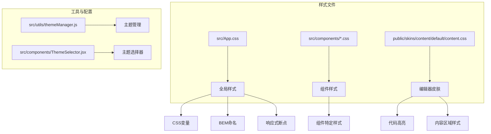
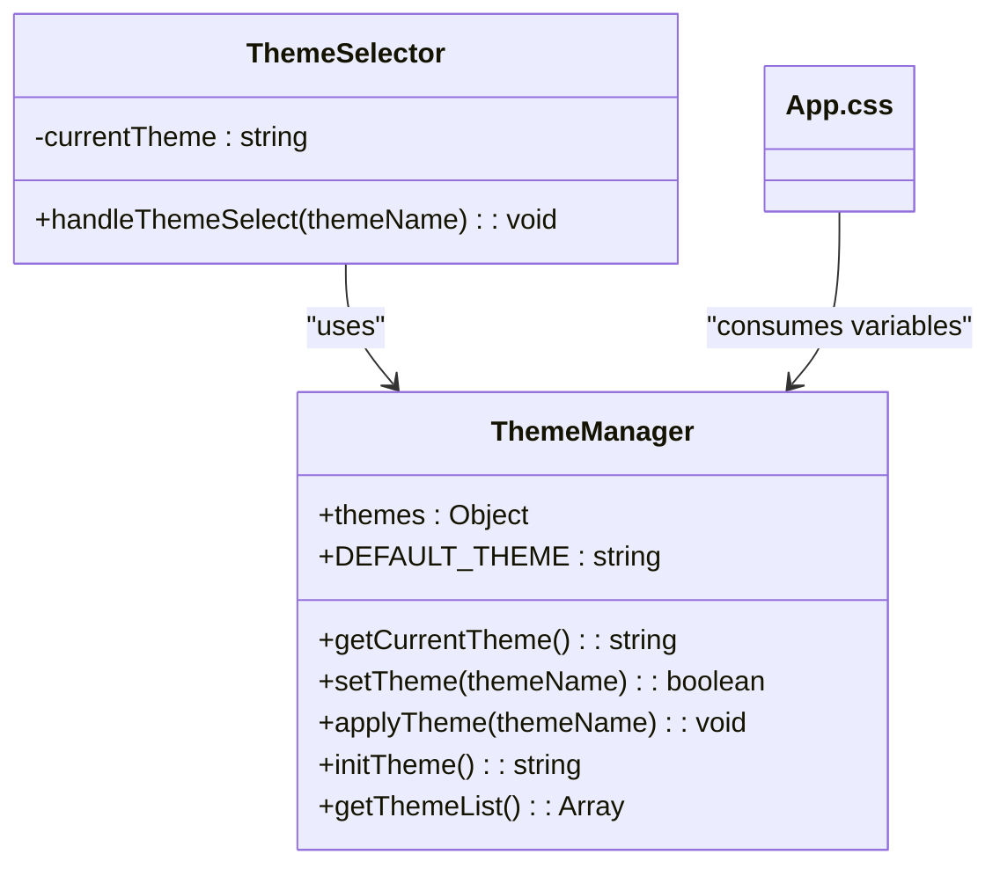
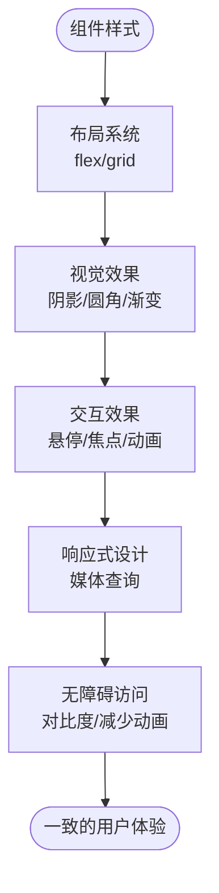
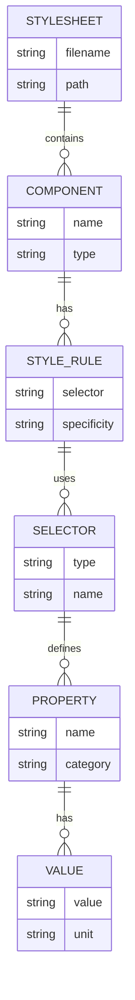

# CSS架构设计

<cite>
**本文档引用的文件**
- [App.css](file://src/App.css)
- [content.css](file://public/skins/content/default/content.css)
- [themeManager.js](file://src/utils/themeManager.js)
- [ThemeSelector.jsx](file://src/components/ThemeSelector.jsx)
- [AppCenter.css](file://src/components/AppCenter.css)
- [ResourceLibrary.css](file://src/components/ResourceLibrary.css)
</cite>

## 目录
1. [项目结构](#项目结构)
2. [全局样式架构](#全局样式架构)
3. [CSS自定义属性与主题系统](#css自定义属性与主题系统)
4. [响应式设计策略](#响应式设计策略)
5. [动画与过渡效果](#动画与过渡效果)
6. [组件样式分析](#组件样式分析)
7. [编辑器皮肤整合](#编辑器皮肤整合)
8. [CSS模块化策略](#css模块化策略)
9. [最佳实践指导](#最佳实践指导)

## 项目结构

项目采用清晰的CSS组织结构，将样式文件按功能和作用域进行分类管理。核心样式文件位于`src`目录下，而第三方编辑器相关样式则存放在`public`目录中。



**Diagram sources**
- [App.css](file://src/App.css)
- [content.css](file://public/skins/content/default/content.css)
- [themeManager.js](file://src/utils/themeManager.js)

## 全局样式架构

应用的全局样式架构以`src/App.css`为核心，建立了统一的设计语言体系。该文件通过CSS自定义属性（CSS Variables）定义了主题色、背景、文本颜色等基础视觉元素，并采用BEM（Block Element Modifier）命名规范确保样式的可维护性和可扩展性。

全局样式包含应用容器`.app`、侧边栏遮罩`.sidebar-overlay`以及主容器`.main-container`等关键布局元素的定义。这些样式为整个应用提供了基础的视觉框架和交互体验。

**Section sources**
- [App.css](file://src/App.css#L1-L60)

## CSS自定义属性与主题系统

应用实现了基于CSS自定义属性的动态主题系统，通过`:root`伪类定义了一套完整的主题变量，支持运行时主题切换。

### 主题变量定义

```css
:root {
  --theme-primary: #1890ff;
  --theme-background: linear-gradient(135deg, #667eea 0%, #764ba2 100%);
  --theme-cardBackground: rgba(255, 255, 255, 0.95);
  --theme-textPrimary: #ffffff;
  --theme-textSecondary: #e6f7ff;
  --theme-textLight: #bae7ff;
  --theme-border: #91d5ff;
  --theme-headerBackground: rgba(255, 255, 255, 0.95);
  --theme-headerText: #ffffff;
}
```

### 主题管理系统

主题系统由`themeManager.js`实现，支持多种预设主题（蓝色、紫色、绿色等），并通过JavaScript动态修改CSS变量来实现主题切换。主题选择器组件`ThemeSelector.jsx`提供用户界面，允许用户在不同主题间切换。



**Diagram sources**
- [App.css](file://src/App.css#L1-L10)
- [themeManager.js](file://src/utils/themeManager.js#L1-L126)
- [ThemeSelector.jsx](file://src/components/ThemeSelector.jsx#L1-L28)

**Section sources**
- [App.css](file://src/App.css#L1-L10)
- [themeManager.js](file://src/utils/themeManager.js#L1-L126)
- [ThemeSelector.jsx](file://src/components/ThemeSelector.jsx#L1-L28)

## 响应式设计策略

应用采用了移动优先的响应式设计策略，通过媒体查询（Media Queries）在不同屏幕尺寸下调整布局和样式，确保在各种设备上都能提供良好的用户体验。

### 断点设置

```css
/* 平板设备 */
@media (max-width: 768px) {
  .main-container {
    margin: 3px;
    border-radius: 6px;
  }
}

/* 手机设备 */
@media (max-width: 480px) {
  .main-container {
    margin: 2px;
    border-radius: 4px;
  }
}
```

各组件也实现了相应的响应式调整，如应用中心在小屏幕下的布局重构、资源库的网格布局适配等，形成了完整的响应式体系。

**Section sources**
- [App.css](file://src/App.css#L50-L60)
- [AppCenter.css](file://src/components/AppCenter.css#L364-L457)
- [ResourceLibrary.css](file://src/components/ResourceLibrary.css#L650-L704)

## 动画与过渡效果

应用通过CSS动画和过渡效果增强了用户界面的交互体验，创建了流畅的视觉反馈。

### 关键帧动画

```css
@keyframes slideIn {
  from {
    opacity: 0;
    transform: scale(0.95);
  }
  to {
    opacity: 1;
    transform: scale(1);
  }
}
```

### 组件动画

- **主容器**: 使用`slideIn`动画实现页面加载时的缩放进入效果
- **应用卡片**: 使用`fadeInUp`动画实现卡片的渐显上升效果
- **悬停效果**: 通过`transform`和`box-shadow`的变化实现卡片的立体悬停效果

这些动画效果不仅提升了用户体验，还通过`prefers-reduced-motion`媒体查询支持减少动画模式，体现了对无障碍访问的支持。

**Section sources**
- [App.css](file://src/App.css#L55-L60)
- [AppCenter.css](file://src/components/AppCenter.css#L298-L366)

## 组件样式分析

应用的组件样式遵循一致的设计原则，每个组件都有独立的CSS文件，实现了样式的模块化和隔离。

### 应用中心样式

`AppCenter.css`定义了应用中心的完整样式体系，包括：
- 主容器渐变背景
- 卡片式布局与阴影效果
- 悬停动画与变换
- 响应式网格布局
- 自定义滚动条样式

### 资源库样式

`ResourceLibrary.css`实现了资源库的视觉设计，特点包括：
- 玻璃拟态（Glassmorphism）效果
- 渐变背景与模糊处理
- 网格布局与弹性盒子
- 标签与元数据的视觉层次



**Diagram sources**
- [AppCenter.css](file://src/components/AppCenter.css#L1-L533)
- [ResourceLibrary.css](file://src/components/ResourceLibrary.css#L1-L704)

**Section sources**
- [AppCenter.css](file://src/components/AppCenter.css#L1-L533)
- [ResourceLibrary.css](file://src/components/ResourceLibrary.css#L1-L704)

## 编辑器皮肤整合

应用集成了TinyMCE编辑器，并通过`public/skins/content/default/content.css`文件定制了编辑器的内容区域样式，确保编辑器内的内容展示与应用整体风格保持一致。

### 内容区域样式

```css
body {
  font-family: -apple-system, BlinkMacSystemFont, 'Segoe UI', Roboto, Oxygen, Ubuntu, Cantarell, 'Open Sans', 'Helvetica Neue', sans-serif;
  line-height: 1.4;
  margin: 1rem;
}
```

### 代码块样式

编辑器使用PrismJS实现代码高亮，采用Dracula主题，提供了专业的代码展示效果：

```css
code {
  background-color: #e8e8e8;
  border-radius: 3px;
  padding: 0.1rem 0.2rem;
}
```

### 引用样式

```css
.mce-content-body:not([dir=rtl]) blockquote {
  border-left: 2px solid #ccc;
  margin-left: 1.5rem;
  padding-left: 1rem;
}
```

这种整合方式确保了用户在编辑器内创建的内容能够自然地融入应用的整体视觉风格。

**Section sources**
- [content.css](file://public/skins/content/default/content.css#L1-L70)

## CSS模块化策略

应用采用了多层次的CSS模块化策略，确保样式的可维护性和可扩展性。

### 样式重置

虽然没有显式的重置样式表，但通过组件化的CSS文件和现代浏览器的默认样式，实现了轻量级的样式标准化。

### 布局系统

应用主要依赖Flexbox和Grid布局系统：
- Flexbox用于一维布局（行或列）
- Grid用于二维布局（网格）

### Typography规范

建立了统一的Typography规范：
- 字体堆栈：系统字体优先
- 行高：1.4-1.8之间
- 字体大小：根据内容层级合理设置

### Z-index层级管理

通过合理的z-index值规划，管理了页面元素的堆叠顺序：
- 侧边栏遮罩：z-index: 998
- 其他UI元素根据需要分配适当的z-index值



**Diagram sources**
- [App.css](file://src/App.css)
- [AppCenter.css](file://src/components/AppCenter.css)
- [ResourceLibrary.css](file://src/components/ResourceLibrary.css)

## 最佳实践指导

### 样式优先级管理

遵循CSS特异性（Specificity）规则，避免使用`!important`，通过合理的选择器组合控制样式优先级。

### 避免样式冲突

- 使用组件化CSS文件
- 采用BEM命名规范
- 避免全局样式污染
- 利用CSS Modules或类似机制

### 代码可读性

- 使用语义化的类名
- 添加必要的注释
- 保持一致的代码格式
- 合理组织CSS规则顺序

### 性能优化

- 减少重排和重绘
- 使用硬件加速的CSS属性
- 压缩和合并CSS文件
- 懒加载非关键CSS

### 可维护性

- 建立设计系统文档
- 定期审查和重构CSS
- 使用CSS预处理器或后处理器
- 实施代码审查流程

这些最佳实践确保了CSS代码的质量和长期可维护性，为团队协作和项目演进提供了坚实的基础。

**Section sources**
- [App.css](file://src/App.css)
- [AppCenter.css](file://src/components/AppCenter.css)
- [ResourceLibrary.css](file://src/components/ResourceLibrary.css)
- [content.css](file://public/skins/content/default/content.css)