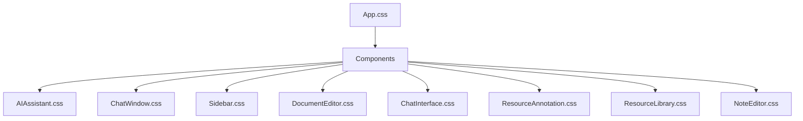
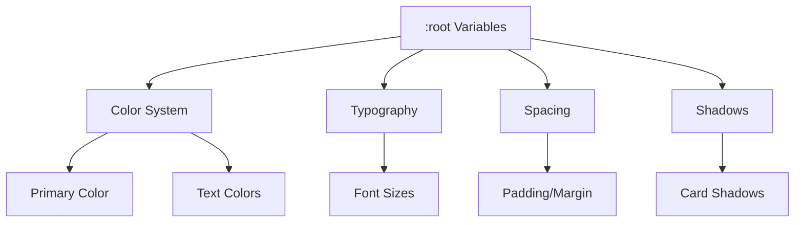
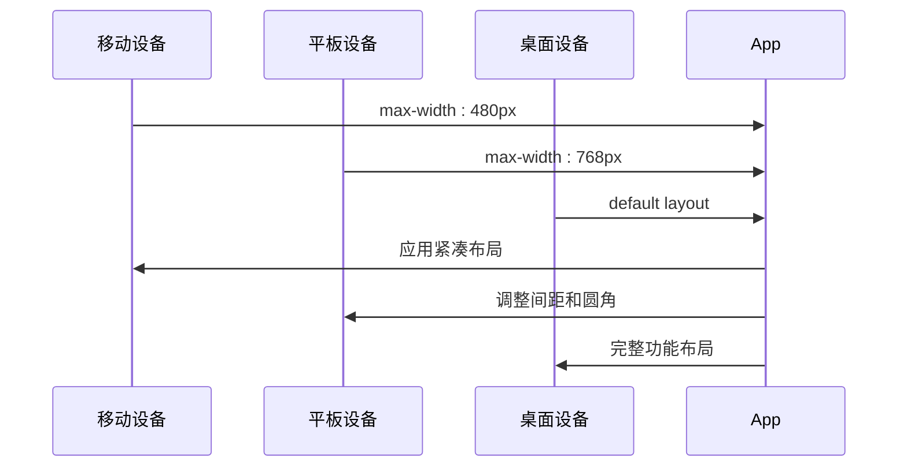
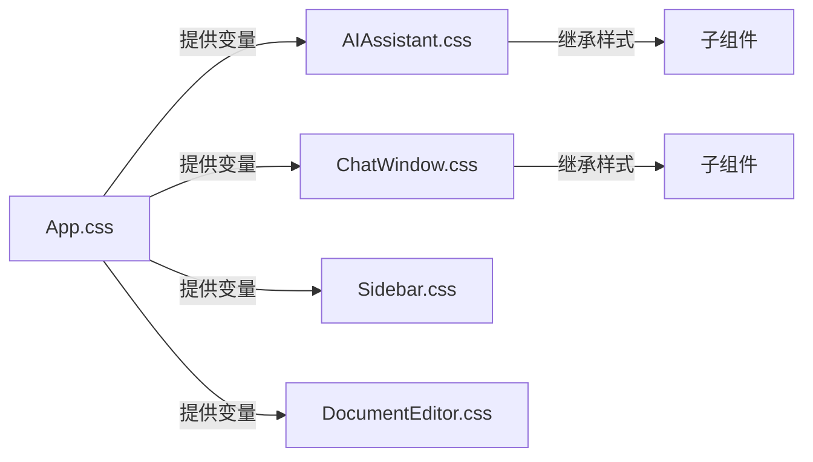

# 全局样式架构

<cite>
**本文档引用文件**  
- [App.css](file://src/App.css)
- [AIAssistant.css](file://src/components/AIAssistant.css)
- [ChatWindow.css](file://src/components/ChatWindow.css)
- [Sidebar.css](file://src/components/Sidebar.css)
- [DocumentEditor.css](file://src/components/DocumentEditor.css)
- [ChatInterface.css](file://src/components/ChatInterface.css)
- [ResourceAnnotation.css](file://src/components/ResourceAnnotation.css)
- [ResourceLibrary.css](file://src/components/ResourceLibrary.css)
- [NoteEditor.css](file://src/components/NoteEditor.css)
</cite>

## 目录
1. [简介](#简介)
2. [项目结构](#项目结构)
3. [核心组件](#核心组件)
4. [架构概览](#架构概览)
5. [详细组件分析](#详细组件分析)
6. [依赖分析](#依赖分析)
7. [性能考虑](#性能考虑)
8. [故障排除指南](#故障排除指南)
9. [结论](#结论)

## 简介
本文档旨在深入分析系统的全局样式架构，重点解析 `App.css` 中的样式组织体系。内容涵盖 BEM 命名规范的应用、CSS 自定义属性的设计系统、响应式布局策略以及基础 UI 样式的标准化处理。

## 项目结构
项目中的 CSS 文件主要分布在 `src/components/` 目录下，每个组件拥有独立的样式文件。全局样式由 `src/App.css` 定义，并通过 CSS 变量（Custom Properties）实现主题化和可维护性。



**图示来源**
- [App.css](file://src/App.css)
- [AIAssistant.css](file://src/components/AIAssistant.css)
- [ChatWindow.css](file://src/components/ChatWindow.css)

## 核心组件
全局样式的核心是 `App.css` 文件，它定义了整个应用的基础视觉风格和设计令牌。该文件使用 CSS 自定义属性来管理颜色、背景、文本等主题变量，并通过类名控制布局和动画效果。

**章节来源**
- [App.css](file://src/App.css#L1-L60)

## 架构概览
系统采用模块化的 CSS 架构，以 `App.css` 作为全局样式的入口点。通过 CSS Variables 实现设计系统的统一管理，各组件样式文件继承并扩展这些变量，确保视觉一致性。

```mermaid
classDiagram
: root {
+--theme-primary : #1890ff
+--theme-background : linear-gradient(...)
+--theme-cardBackground : rgba(255,255,255,0.95)
+--theme-textPrimary : #ffffff
+--theme-border : #91d5ff
}
.app {
background : var(--theme-background)
min-height : 100vh
}
.main-container {
animation : slideIn 0.5s ease-out
}
@media (max-width : 768px) {
.main-container { margin : 3px; border-radius : 6px }
}
: root --> .app : "使用"
.app --> .main-container : "包含"
```

**图示来源**
- [App.css](file://src/App.css#L1-L60)

## 详细组件分析
### BEM 命名规范应用
项目中广泛采用了 BEM（Block Element Modifier）命名方法论，提高了样式的可读性和可维护性。例如在 `AIAssistant.css` 中：

```css
.ai-assistant-modal {}
.ai-feature-tabs {}
.ai-result-card {}
.result-actions {}
```

其中 `.ai-assistant-modal` 是 block，`.ai-feature-tabs` 和 `.ai-result-card` 是其子元素（element），而状态变化则通过 modifier 表达，如 `.active`、`.hover` 等。

**章节来源**
- [AIAssistant.css](file://src/components/AIAssistant.css#L1-L395)

### CSS 自定义属性与设计系统
`App.css` 定义了一套完整的 CSS 变量系统，构成了应用的设计语言基础：

```css
:root {
  --theme-primary: #1890ff;
  --theme-background: linear-gradient(135deg, #667eea 0%, #764ba2 100%);
  --theme-cardBackground: rgba(255, 255, 255, 0.95);
  --theme-textPrimary: #ffffff;
  --theme-border: #91d5ff;
}
```

这些变量被所有组件共享，实现了主题切换和样式统一。例如 `Sidebar.css` 使用 `var(--theme-cardBackground)` 作为侧边栏背景色。



**图示来源**
- [App.css](file://src/App.css#L1-L20)
- [Sidebar.css](file://src/components/Sidebar.css#L1-L476)

### 响应式设计实现
系统实现了移动优先的响应式设计策略，使用断点控制不同屏幕尺寸下的布局表现。媒体查询定义在多个组件中，如 `App.css` 和 `ChatWindow.css`：

```css
@media (max-width: 768px) {
  .main-container { margin: 3px; border-radius: 6px; }
}

@media (max-width: 480px) {
  .main-container { margin: 2px; border-radius: 4px; }
}
```

此外，`DocumentEditor.css` 还针对小屏幕设备调整了编辑器布局，确保在移动端也能良好显示。



**图示来源**
- [App.css](file://src/App.css#L40-L50)
- [DocumentEditor.css](file://src/components/DocumentEditor.css#L800-L1014)

### 基础样式重置与 Z-index 管理
系统对基础 UI 元素进行了标准化处理，包括滚动条样式、按钮交互反馈、卡片阴影等。Z-index 层级管理系统确保模态框、悬浮菜单等元素正确堆叠。

例如 `Sidebar.css` 中定义了清晰的层级关系：
```css
.sidebar-overlay {
  z-index: 998;
}
```

同时，`NoteEditor.css` 对模态框的 z-index 进行了精细控制，避免层叠冲突。

**章节来源**
- [Sidebar.css](file://src/components/Sidebar.css#L10-L20)
- [NoteEditor.css](file://src/components/NoteEditor.css#L1-L524)

## 依赖分析
全局样式主要依赖于现代浏览器对 CSS Custom Properties 的支持。各组件样式文件之间不存在直接依赖，而是通过共享 `:root` 变量实现协同工作。



**图示来源**
- [App.css](file://src/App.css)
- [AIAssistant.css](file://src/components/AIAssistant.css)
- [ChatWindow.css](file://src/components/ChatWindow.css)

## 性能考虑
CSS 架构设计充分考虑了性能因素：
- 使用 CSS Variables 减少重复代码
- 动画效果使用 `transform` 和 `opacity` 避免重排
- 合理使用 `will-change` 提升动画性能
- 滚动条样式优化减少绘制开销

## 故障排除指南
常见样式问题及解决方案：
- **变量未生效**：检查浏览器兼容性或变量拼写错误
- **响应式失效**：确认 meta viewport 设置正确
- **z-index 冲突**：检查父级元素的 stacking context
- **动画卡顿**：使用 `transform` 替代 `top/left` 位移

**章节来源**
- [App.css](file://src/App.css)
- [DocumentEditor.css](file://src/components/DocumentEditor.css)

## 结论
本系统建立了完善的全局样式架构，通过 BEM 命名规范、CSS 自定义属性、响应式设计和模块化组织，实现了高可维护性和视觉一致性。建议未来进一步抽象常用样式模式，形成设计系统文档。