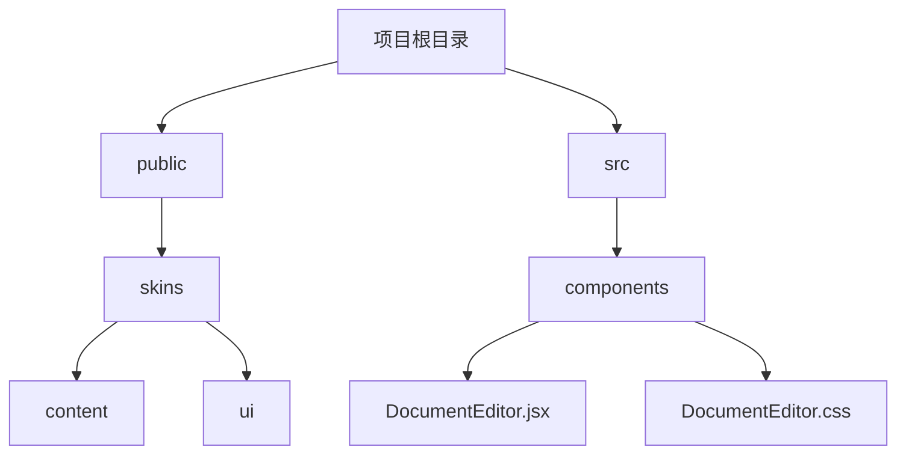
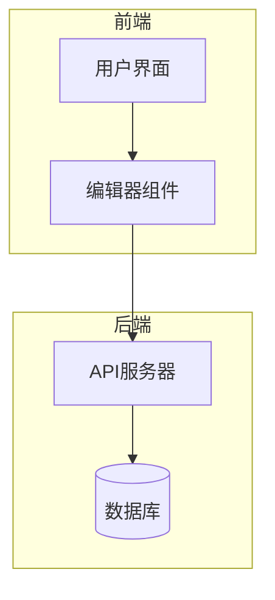
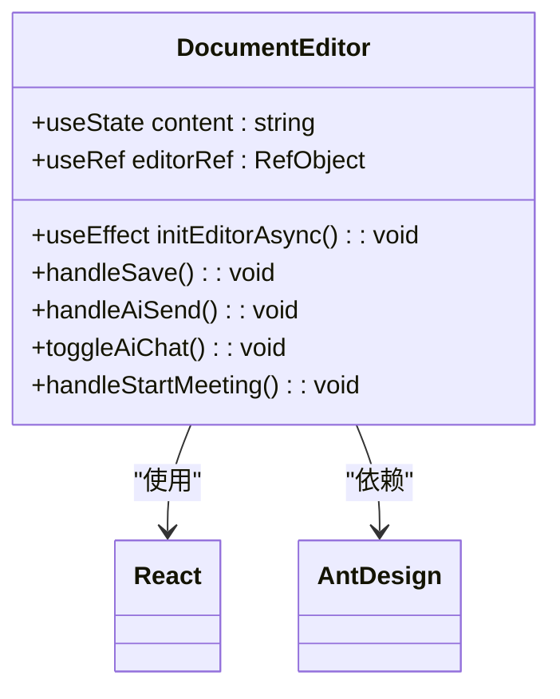
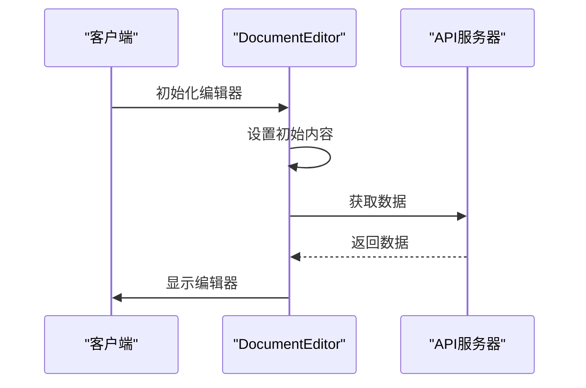
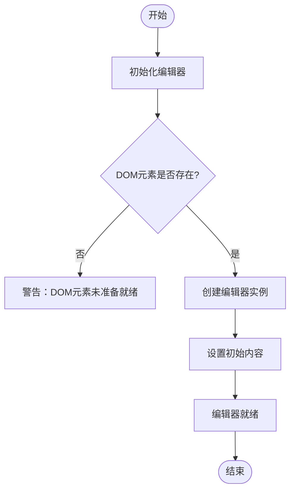
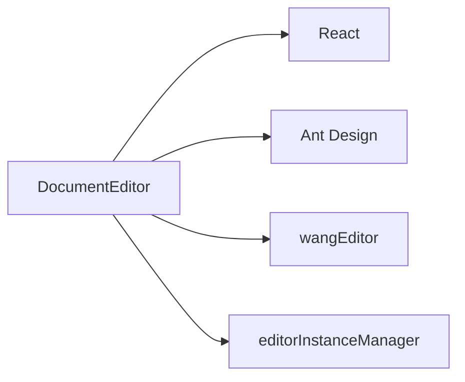

# 编辑器样式整合

<cite>
**本文档引用的文件**   
- [content.css](file://public/skins/content/default/content.css)
- [skin.css](file://public/skins/ui/oxide/skin.css)
- [DocumentEditor.css](file://src/components/DocumentEditor.css)
- [DocumentEditor.jsx](file://src/components/DocumentEditor.jsx)
</cite>

## 目录
1. [简介](#简介)
2. [项目结构](#项目结构)
3. [核心组件](#核心组件)
4. [架构概述](#架构概述)
5. [详细组件分析](#详细组件分析)
6. [依赖关系分析](#依赖关系分析)
7. [性能考虑](#性能考虑)
8. [故障排除指南](#故障排除指南)
9. [结论](#结论)

## 简介
本文档旨在详细说明TinyMCE编辑器皮肤与主应用样式的集成方案。通过分析`content.css`文件中编辑器UI组件的样式规则，包括按钮、工具栏、对话框等元素的视觉表现，解释如何通过CSS作用域隔离确保编辑器样式不会影响主应用，同时保持品牌视觉一致性。此外，阐述富文本内容区域的样式处理策略，确保用户创建的内容在预览和渲染时符合应用的整体设计语言，并提供定制化编辑器皮肤的指导方法。

## 项目结构
项目结构清晰地展示了编辑器相关资源的组织方式。主要分为`public`目录下的静态资源和`src`目录下的源代码。

**Diagram sources**
- [DocumentEditor.jsx](file://src/components/DocumentEditor.jsx)
- [DocumentEditor.css](file://src/components/DocumentEditor.css)

**Section sources**
- [DocumentEditor.jsx](file://src/components/DocumentEditor.jsx)
- [DocumentEditor.css](file://src/components/DocumentEditor.css)

## 核心组件
核心组件主要包括`DocumentEditor.jsx`和`DocumentEditor.css`，它们负责实现编辑器的主要功能和样式。

**Section sources**
- [DocumentEditor.jsx](file://src/components/DocumentEditor.jsx)
- [DocumentEditor.css](file://src/components/DocumentEditor.css)

## 架构概述
系统架构采用模块化设计，将编辑器的UI组件与业务逻辑分离，便于维护和扩展。

**Diagram sources**
- [DocumentEditor.jsx](file://src/components/DocumentEditor.jsx)
- [DocumentEditor.css](file://src/components/DocumentEditor.css)

## 详细组件分析
### DocumentEditor 组件分析
`DocumentEditor`组件是整个编辑器的核心，负责管理编辑器的状态和交互。

#### 对象导向组件

**Diagram sources**
- [DocumentEditor.jsx](file://src/components/DocumentEditor.jsx)

#### API/服务组件

**Diagram sources**
- [DocumentEditor.jsx](file://src/components/DocumentEditor.jsx)

#### 复杂逻辑组件

**Diagram sources**
- [DocumentEditor.jsx](file://src/components/DocumentEditor.jsx)

**Section sources**
- [DocumentEditor.jsx](file://src/components/DocumentEditor.jsx)
- [DocumentEditor.css](file://src/components/DocumentEditor.css)

## 依赖关系分析
分析组件之间的依赖关系有助于理解系统的整体结构。

**Diagram sources**
- [DocumentEditor.jsx](file://src/components/DocumentEditor.jsx)

**Section sources**
- [DocumentEditor.jsx](file://src/components/DocumentEditor.jsx)

## 性能考虑
在开发过程中，应关注以下性能优化点：
- 减少不必要的重新渲染
- 使用懒加载技术
- 优化图片和其他媒体资源的加载

## 故障排除指南
当遇到问题时，可以参考以下步骤进行排查：
- 检查网络连接是否正常
- 查看浏览器控制台是否有错误信息
- 确认所有依赖项都已正确安装
- 验证配置文件是否正确

**Section sources**
- [DocumentEditor.jsx](file://src/components/DocumentEditor.jsx)

## 结论
通过上述分析，我们可以看到`DocumentEditor`组件的设计既灵活又高效，能够满足多种应用场景的需求。未来的工作可以集中在进一步优化用户体验和提升性能上。