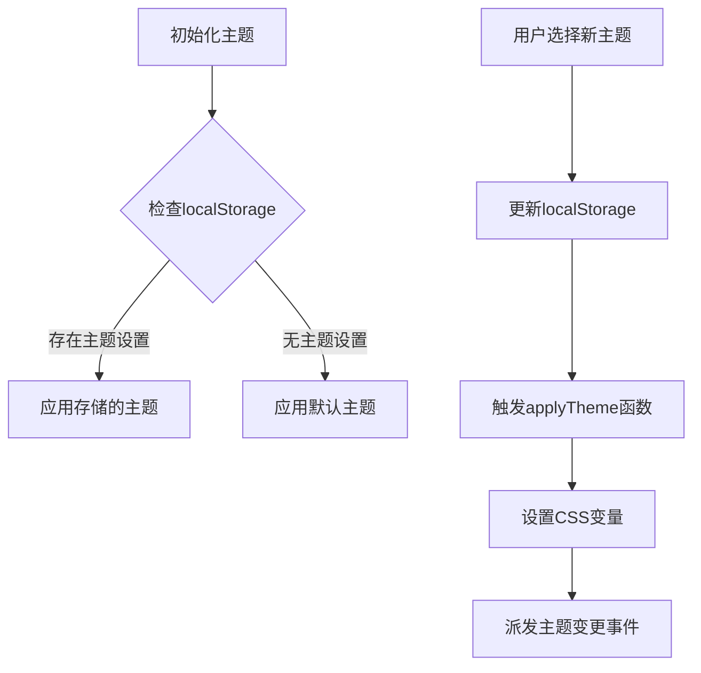
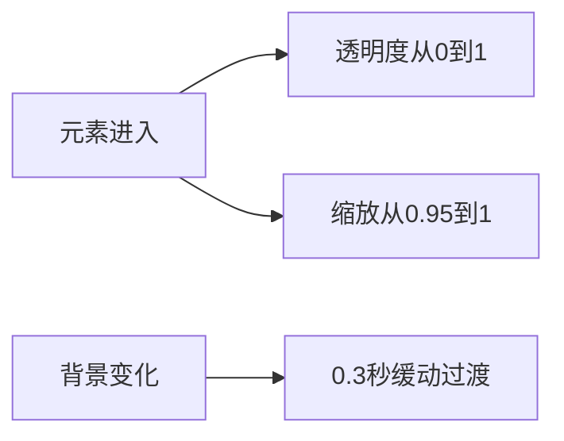
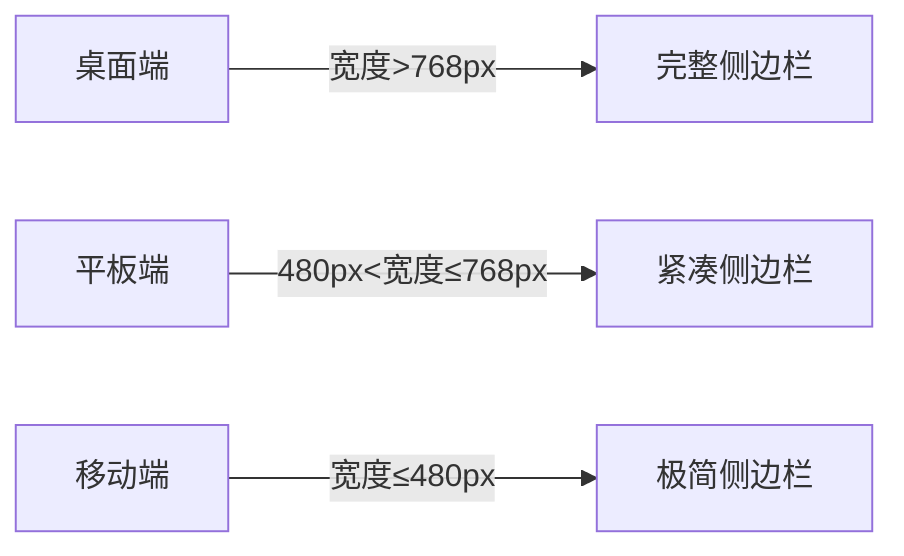
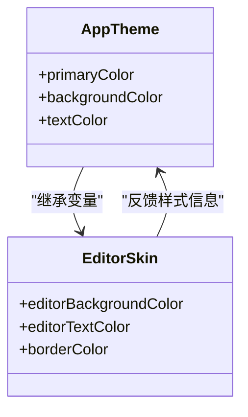

# 主题与样式

<cite>
**本文档引用的文件**
- [themeManager.js](file://src/utils/themeManager.js)
- [App.css](file://src/App.css)
- [Sidebar.css](file://src/components/Sidebar.css)
- [ThemeSelector.jsx](file://src/components/ThemeSelector.jsx)
- [content.css](file://public/skins/content/dark/content.css)
</cite>

## 目录
1. [简介](#简介)
2. [主题管理机制](#主题管理机制)
3. [全局样式架构](#全局样式架构)
4. [侧边栏布局设计](#侧边栏布局设计)
5. [编辑器皮肤整合](#编辑器皮肤整合)
6. [主题配置结构](#主题配置结构)
7. [API调用示例](#api调用示例)
8. [扩展新主题](#扩展新主题)

## 简介
本技术文档深入解析系统中的主题与样式管理系统，涵盖主题切换机制、CSS变量应用、全局样式架构和响应式设计等核心内容。文档详细说明了如何通过JavaScript控制CSS自定义属性实现即时主题变换，并分析了不同组件的样式设计原则。

## 主题管理机制

主题管理系统基于`themeManager.js`实现，采用JavaScript控制CSS自定义属性的方式进行主题切换。系统通过localStorage持久化存储用户选择的主题，并在页面加载时自动应用。



**Diagram sources**
- [themeManager.js](file://src/utils/themeManager.js#L1-L126)

**Section sources**
- [themeManager.js](file://src/utils/themeManager.js#L1-L126)

## 全局样式架构

全局样式定义在`App.css`中，采用BEM（Block Element Modifier）命名规范，确保样式的可维护性和可扩展性。系统使用CSS自定义属性（CSS Variables）作为主题变量的基础。

### CSS变量应用
系统在`:root`选择器中定义了一系列以`--theme-`为前缀的CSS变量，这些变量被所有组件引用：

```css
:root {
  --theme-primary: #1890ff;
  --theme-background: linear-gradient(135deg, #667eea 0%, #764ba2 100%);
  --theme-cardBackground: rgba(255, 255, 255, 0.95);
  /* ...其他变量 */
}
```

### 动画效果
全局样式中包含了平滑的过渡动画，提升用户体验：



**Diagram sources**
- [App.css](file://src/App.css#L1-L60)

**Section sources**
- [App.css](file://src/App.css#L1-L60)

## 侧边栏布局设计

`Sidebar.css`文件定义了侧边栏的完整样式架构，包含响应式设计和交互效果。

### 布局结构
侧边栏采用Flexbox布局，主要包含以下组件：
- 侧边栏容器（sidebar）
- 头部区域（sidebar-header）
- 菜单列表（menu-list）
- 菜单项（menu-item）

### 响应式断点
系统设置了多个响应式断点以适应不同屏幕尺寸：



### 交互状态
菜单项支持多种交互状态：
- 悬停状态：背景色变化，轻微上浮
- 激活状态：渐变背景，发光效果
- 折叠状态：仅显示图标

**Diagram sources**
- [Sidebar.css](file://src/components/Sidebar.css#L1-L477)

**Section sources**
- [Sidebar.css](file://src/components/Sidebar.css#L1-L477)

## 编辑器皮肤整合

系统整合了TinyMCE编辑器的多种皮肤方案，通过`public/skins/content/`目录下的CSS文件实现。

### 皮肤类型
系统提供了多种编辑器皮肤：
- **暗色主题**：适合夜间使用的深色背景
- **默认主题**：标准的浅色背景
- **文档主题**：模拟纸质文档的外观
- **tinymce-5主题**：现代简约风格

### 样式整合
编辑器皮肤与应用自身样式通过以下方式整合：
1. 继承应用的主题变量
2. 保持一致的字体栈
3. 统一的圆角半径和阴影效果
4. 协调的色彩搭配



**Diagram sources**
- [content.css](file://public/skins/content/dark/content.css#L1-L75)

## 主题配置结构

主题配置系统采用模块化的JSON结构，便于维护和扩展。

### 颜色变量
每个主题包含以下颜色变量：
- primary：主色调
- background：背景渐变
- cardBackground：卡片背景
- textPrimary：主要文字
- textSecondary：次要文字
- border：边框颜色
- headerBackground：头部背景
- headerText：头部文字

### 字体设置
系统统一使用以下字体栈：
```
-apple-system, BlinkMacSystemFont, 'Segoe UI', Roboto, Oxygen, Ubuntu, Cantarell, 'Open Sans', 'Helvetica Neue', sans-serif
```

### 间距规范
采用8px基准网格系统：
- 小间距：8px
- 中等间距：16px
- 大间距：24px
- 超大间距：32px

**Section sources**
- [themeManager.js](file://src/utils/themeManager.js#L7-L55)

## API调用示例

### 初始化主题
```javascript
import { initTheme } from '../utils/themeManager';

// 页面加载时初始化主题
initTheme();
```

### 获取当前主题
```javascript
import { getCurrentTheme } from '../utils/themeManager';

const currentTheme = getCurrentTheme();
console.log('当前主题:', currentTheme);
```

### 切换主题
```javascript
import { setTheme } from '../utils/themeManager';

// 切换到暗色主题
setTheme('dark');

// 切换到蓝色主题
setTheme('blue');
```

### 监听主题变更
```javascript
window.addEventListener('themeChanged', (event) => {
  const { theme, colors } = event.detail;
  console.log('主题已更改为:', theme);
  // 执行主题相关的逻辑
});
```

**Section sources**
- [themeManager.js](file://src/utils/themeManager.js#L76-L126)
- [ThemeSelector.jsx](file://src/components/ThemeSelector.jsx#L1-L77)

## 扩展新主题

### 添加新主题
在`themeManager.js`中添加新的主题配置：

```javascript
export const themes = {
  // ...现有主题
  orange: {
    name: '橙色主题',
    colors: {
      primary: '#fa8c16',
      background: 'linear-gradient(135deg, #f7b733 0%, #fc4a1a 100%)',
      cardBackground: 'rgba(255, 255, 255, 0.95)',
      textPrimary: '#ffffff',
      textSecondary: '#fff7ed',
      textLight: '#ffd591',
      border: '#ffd591',
      headerBackground: 'rgba(255, 255, 255, 0.95)',
      headerText: '#ffffff'
    }
  }
};
```

### 创建主题选择器
使用`ThemeSelector`组件提供用户界面：

```jsx
import ThemeSelector from './components/ThemeSelector';

function App() {
  return (
    <div className="app">
      <ThemeSelector onThemeChange={(theme, colors) => {
        console.log('主题已变更:', theme);
      }} />
      {/* 应用内容 */}
    </div>
  );
}
```

### 主题开发最佳实践
1. **保持一致性**：新主题应遵循现有的色彩搭配原则
2. **可访问性**：确保文本与背景有足够的对比度
3. **性能优化**：避免过于复杂的渐变效果
4. **测试覆盖**：在不同设备和光照条件下测试主题效果

**Section sources**
- [themeManager.js](file://src/utils/themeManager.js#L1-L126)
- [ThemeSelector.jsx](file://src/components/ThemeSelector.jsx#L1-L77)