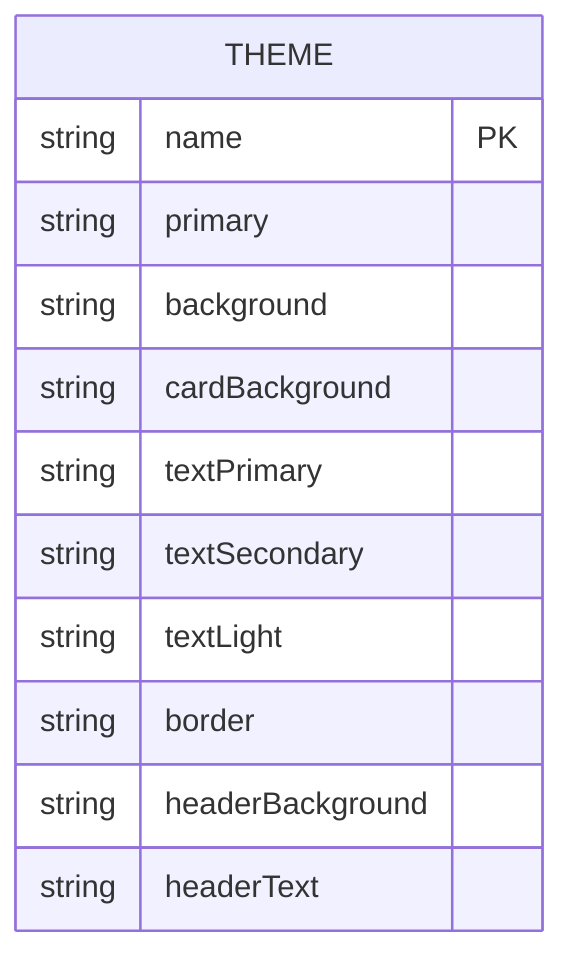
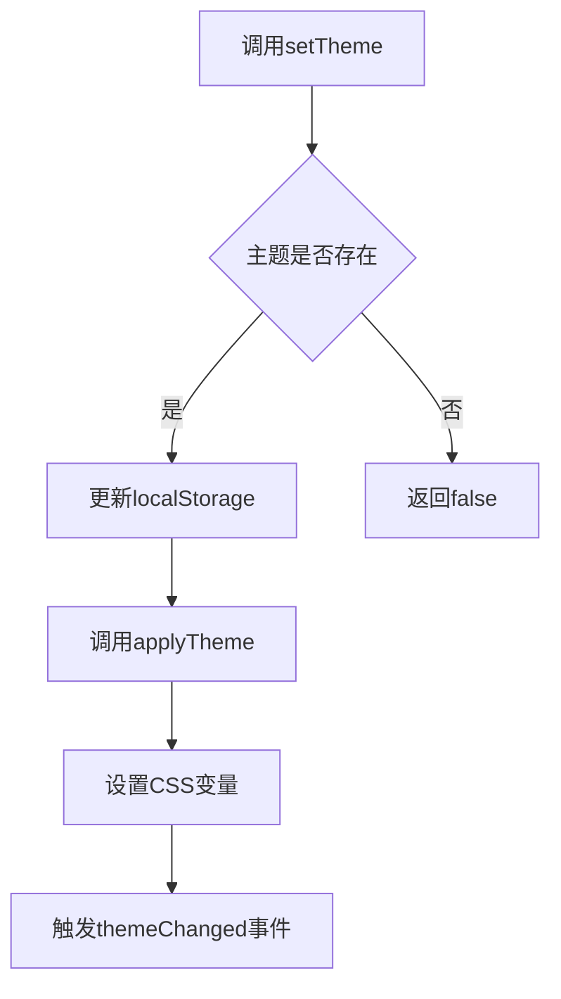
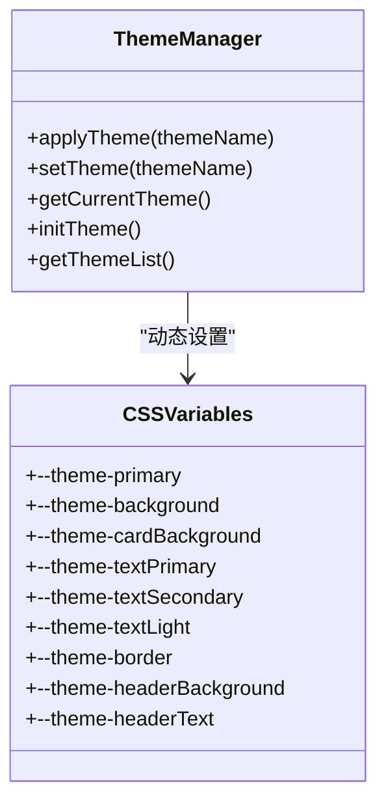
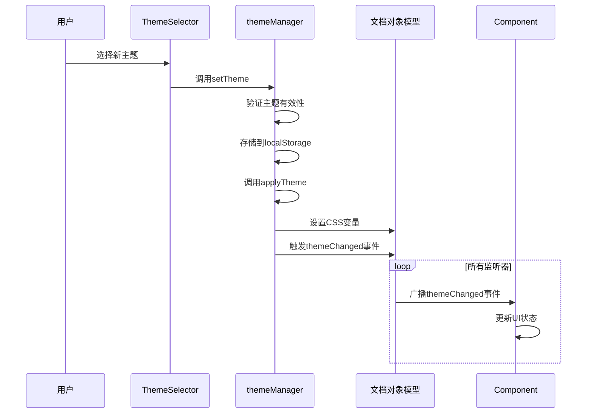

# 主题管理系统

<cite>
**Referenced Files in This Document **   
- [themeManager.js](file://src/utils/themeManager.js)
- [ThemeSelector.jsx](file://src/components/ThemeSelector.jsx)
- [App.css](file://src/App.css)
</cite>

## 目录
1. [简介](#简介)
2. [主题配置结构](#主题配置结构)
3. [主题注册与激活机制](#主题注册与激活机制)
4. [持久化存储实现](#持久化存储实现)
5. [CSS自定义属性动态操作](#css自定义属性动态操作)
6. [事件监听与状态同步](#事件监听与状态同步)
7. [主题切换流程](#主题切换流程)
8. [扩展功能指导](#扩展功能指导)

## 简介

主题管理系统为应用程序提供了一套完整的主题管理解决方案，实现了主题的动态切换、持久化存储和状态同步功能。系统通过JavaScript动态操作CSS自定义属性来实现即时的主题切换效果，同时利用本地存储保持用户偏好设置。

该系统主要由`themeManager.js`核心工具模块和`ThemeSelector`组件构成，通过事件驱动机制实现主题变更的全局通知和响应。系统支持多种预设主题，包括亮色、暗色、蓝色、紫色和绿色主题，每种主题都包含完整的颜色变量、背景样式和文本属性配置。

**Section sources**
- [themeManager.js](file://src/utils/themeManager.js#L0-L126)
- [ThemeSelector.jsx](file://src/components/ThemeSelector.jsx#L0-L77)

## 主题配置结构

主题配置对象采用分层结构设计，每个主题包含名称标识和颜色变量集合。系统定义了以下核心颜色变量：

- `primary`: 主色调，用于按钮、链接等重要元素
- `background`: 页面背景，支持渐变色
- `cardBackground`: 卡片背景，带透明度
- `textPrimary`: 主要文本颜色
- `textSecondary`: 次要文本颜色
- `textLight`: 浅色文本
- `border`: 边框颜色
- `headerBackground`: 头部背景
- `headerText`: 头部文本



**Diagram sources **
- [themeManager.js](file://src/utils/themeManager.js#L4-L45)

**Section sources**
- [themeManager.js](file://src/utils/themeManager.js#L4-L45)

## 主题注册与激活机制

主题管理系统通过预定义的主题配置对象实现主题注册。所有主题在`themes`常量中集中管理，通过键值对形式组织，键名为主题标识符，值为包含主题名称和颜色配置的对象。

主题激活通过`setTheme`函数实现，该函数接收主题名称作为参数，验证主题存在性后执行激活流程。激活过程包括更新本地存储和应用主题到页面两个步骤。



**Diagram sources **
- [themeManager.js](file://src/utils/themeManager.js#L76-L100)

**Section sources**
- [themeManager.js](file://src/utils/themeManager.js#L76-L100)

## 持久化存储实现

系统使用浏览器的`localStorage`实现主题的持久化存储。当用户选择新主题时，系统将主题标识符保存到`app-theme`键下，确保页面刷新后能恢复上次选择的主题。

初始化时，`initTheme`函数从本地存储读取当前主题，若不存在则使用默认主题（蓝色主题）。这种设计确保了用户体验的一致性和个性化设置的持久性。

```javascript
// 获取当前主题
export const getCurrentTheme = () => {
  return localStorage.getItem('app-theme') || DEFAULT_THEME;
};

// 设置主题
export const setTheme = (themeName) => {
  if (themes[themeName]) {
    localStorage.setItem('app-theme', themeName);
    applyTheme(themeName);
    return true;
  }
  return false;
};
```

**Section sources**
- [themeManager.js](file://src/utils/themeManager.js#L90-L100)

## CSS自定义属性动态操作

主题切换的核心机制是通过JavaScript动态操作CSS自定义属性（CSS Variables）。系统在`:root`选择器中定义了一系列以`--theme-`为前缀的CSS变量，这些变量被应用程序的各个组件引用。

`applyTheme`函数负责将选定主题的颜色值应用到对应的CSS变量上，通过`document.documentElement.style.setProperty`方法实现动态更新。这种方式的优势在于一次设置即可影响所有使用这些变量的CSS规则，无需修改DOM结构或类名。



**Diagram sources **
- [themeManager.js](file://src/utils/themeManager.js#L102-L115)
- [App.css](file://src/App.css#L1-L10)

**Section sources**
- [themeManager.js](file://src/utils/themeManager.js#L102-L115)
- [App.css](file://src/App.css#L1-L10)

## 事件监听与状态同步

系统采用事件驱动架构实现主题变更的状态同步。当主题发生变化时，`applyTheme`函数会触发一个名为`themeChanged`的自定义事件，携带新主题的名称和颜色配置作为详细信息。

其他组件可以通过监听此事件来响应主题变化，实现局部UI的更新或执行特定逻辑。`ThemeSelector`组件就是一个典型的事件监听者，它不仅触发主题变更，还监听自身和其他来源的主题变更以保持界面状态同步。



**Diagram sources **
- [themeManager.js](file://src/utils/themeManager.js#L117-L126)
- [ThemeSelector.jsx](file://src/components/ThemeSelector.jsx#L10-L25)

**Section sources**
- [themeManager.js](file://src/utils/themeManager.js#L117-L126)
- [ThemeSelector.jsx](file://src/components/ThemeSelector.jsx#L10-L25)

## 主题切换流程

主题切换是一个多步骤的协调过程，涉及用户交互、状态管理和UI更新。完整流程如下：

1. 用户通过`ThemeSelector`组件界面选择新主题
2. 组件调用`themeManager.setTheme`函数
3. 系统验证主题有效性并更新本地存储
4. 调用`applyTheme`函数应用新主题
5. 动态更新CSS自定义属性
6. 触发`themeChanged`自定义事件
7. 所有监听组件收到通知并更新状态

这个流程确保了主题切换的原子性和一致性，避免了中间状态的出现。整个过程通常在毫秒级完成，为用户提供流畅的视觉体验。

**Section sources**
- [themeManager.js](file://src/utils/themeManager.js#L76-L126)
- [ThemeSelector.jsx](file://src/components/ThemeSelector.jsx#L28-L77)

## 扩展功能指导

### 添加新主题

要添加新主题，只需在`themes`对象中添加新的主题配置：

```javascript
export const themes = {
  // ... existing themes
  custom: {
    name: '自定义主题',
    colors: {
      primary: '#ff6b6b',
      background: 'linear-gradient(135deg, #f093fb 0%, #f5576c 100%)',
      // ... other color variables
    }
  }
};
```

### 响应系统偏好设置

可以扩展系统以响应用户的操作系统偏好，如深色模式：

```javascript
// 在initTheme中添加
if (window.matchMedia && window.matchMedia('(prefers-color-scheme: dark)').matches) {
  setTheme('dark');
}
```

### 主题切换动画

通过CSS过渡效果增强用户体验：

```css
.app {
  transition: background 0.3s ease, color 0.3s ease;
}
```

### 性能优化策略

1. 缓存主题配置对象，避免重复解析
2. 批量更新CSS变量，减少重排重绘
3. 使用事件委托优化事件监听
4. 预加载常用主题资源

**Section sources**
- [themeManager.js](file://src/utils/themeManager.js#L0-L126)
- [App.css](file://src/App.css#L11-L20)