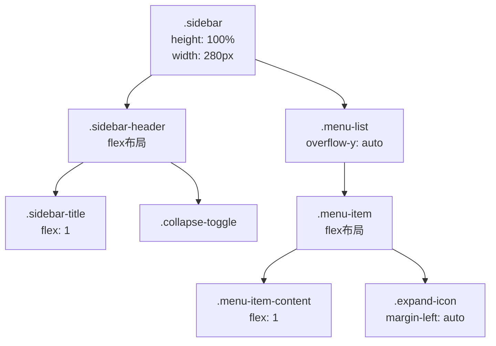
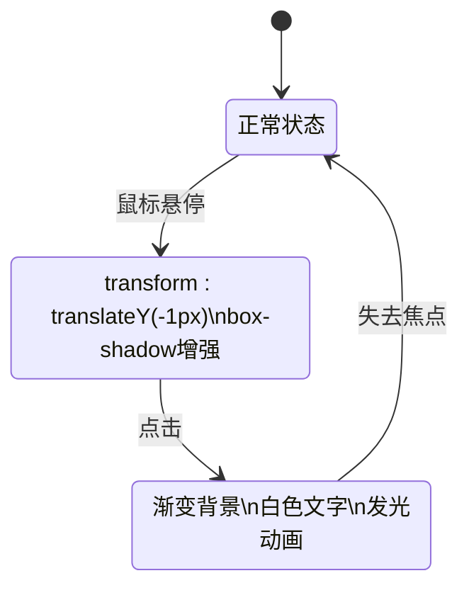
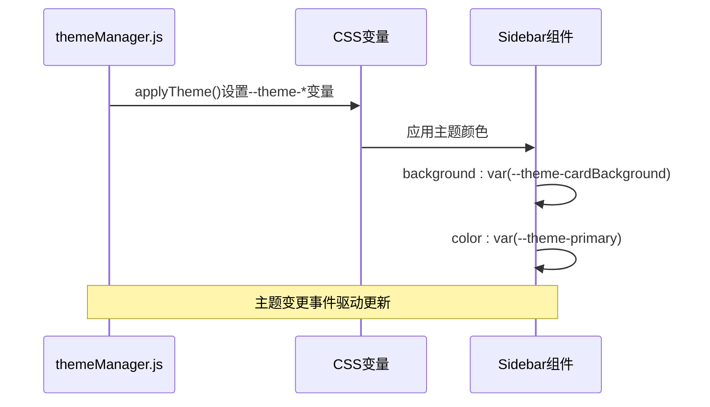

# 跨组件样式一致性

<cite>
**本文档引用的文件**
- [Sidebar.css](file://src/components/Sidebar.css)
- [themeManager.js](file://src/utils/themeManager.js)
- [Sidebar.jsx](file://src/components/Sidebar.jsx)
- [ThemeSelector.jsx](file://src/components/ThemeSelector.jsx)
</cite>

## 目录
1. [简介](#简介)
2. [侧边栏布局实现](#侧边栏布局实现)
3. [响应式设计策略](#响应式设计策略)
4. [交互状态样式](#交互状态样式)
5. [主题适配机制](#主题适配机制)
6. [样式封装与全局协调](#样式封装与全局协调)
7. [新组件开发指导](#新组件开发指导)
8. [结论](#结论)

## 简介
本文档深入分析以`Sidebar.css`为代表的组件样式设计原则，详细阐述侧边栏的布局实现、响应式设计策略和交互状态样式。重点解析CSS变量与`themeManager.js`协同工作的主题适配机制，以及组件内样式封装与全局样式的协调方法。为新组件开发提供遵循现有样式规范的指导，确保UI一致性。

**Section sources**
- [Sidebar.css](file://src/components/Sidebar.css#L0-L476)
- [themeManager.js](file://src/utils/themeManager.js#L0-L126)

## 侧边栏布局实现
侧边栏采用Flexbox布局实现现代化的界面结构。主容器`.sidebar`使用固定宽度（280px）和100%高度，通过`display: flex`和相关属性实现内部元素的灵活排列。



**Diagram sources**
- [Sidebar.css](file://src/components/Sidebar.css#L0-L82)

**Section sources**
- [Sidebar.css](file://src/components/Sidebar.css#L0-L82)
- [Sidebar.jsx](file://src/components/Sidebar.jsx#L689-L730)

## 响应式设计策略
侧边栏采用多层级响应式设计策略，适应不同屏幕尺寸和用户交互需求：

1. **折叠状态响应**：通过`.collapsed`类切换侧边栏宽度（280px ↔ 64px）
2. **移动端适配**：媒体查询在小屏幕设备上调整间距和字体大小
3. **滚动优化**：菜单列表设置最大高度并启用垂直滚动

```css
@media (max-width: 768px) {
  .sidebar {
    padding: 12px 0;
  }
  
  .menu-item {
    padding: 10px 12px;
  }
  
  .menu-item-label {
    font-size: 13px;
  }
}
```

**Section sources**
- [Sidebar.css](file://src/components/Sidebar.css#L314-L325)

## 交互状态样式
侧边栏定义了丰富的交互状态样式，提升用户体验：

### 悬停状态


**Diagram sources**
- [Sidebar.css](file://src/components/Sidebar.css#L234-L313)

### 状态转换
- **hover**: 添加轻微上移效果和阴影，增强立体感
- **active**: 应用渐变背景色、白色文字和发光动画
- **focus**: 通过CSS过渡实现平滑的状态变化

**Section sources**
- [Sidebar.css](file://src/components/Sidebar.css#L234-L313)

## 主题适配机制
侧边栏通过CSS变量与`themeManager.js`协同工作实现动态主题适配：



**Diagram sources**
- [themeManager.js](file://src/utils/themeManager.js#L76-L126)
- [Sidebar.css](file://src/components/Sidebar.css#L0-L82)

### 协同工作流程
1. `themeManager.js`从localStorage读取当前主题
2. `applyTheme()`函数将主题颜色设置为CSS变量
3. 侧边栏样式通过`var(--theme-*)`引用这些变量
4. 主题变更时触发自定义事件通知所有组件

**Section sources**
- [themeManager.js](file://src/utils/themeManager.js#L76-L126)
- [Sidebar.css](file://src/components/Sidebar.css#L0-L82)
- [ThemeSelector.jsx](file://src/components/ThemeSelector.jsx#L0-L77)

## 样式封装与全局协调
侧边栏实现了良好的样式封装与全局协调机制：

### 封装策略
- 使用BEM命名规范（`.sidebar`, `.sidebar-header`等）
- 局部作用域样式避免全局污染
- CSS变量实现主题解耦

### 全局协调
- 统一的过渡时间（0.2s-0.3s）
- 一致的圆角半径（6px-12px）
- 标准化的阴影效果
- 共享的动画效果（pulse, activeGlow）

**Section sources**
- [Sidebar.css](file://src/components/Sidebar.css#L0-L476)

## 新组件开发指导
为确保新组件与现有系统保持样式一致性，请遵循以下规范：

### 间距系统
| 类型 | 数值 | 应用场景 |
|------|------|----------|
| 微小间距 | 4px | 图标与文字间隔 |
| 常规间距 | 8px | 内容区块间隔 |
| 中等间距 | 16px | 主要区块间隔 |
| 大间距 | 24px | 页面级间隔 |

### 圆角与阴影
```css
/* 推荐的圆角半径 */
.border-radius-sm: 6px
.border-radius-md: 12px
.border-radius-lg: 16px

/* 推荐的阴影效果 */
.box-shadow-sm: 0 1px 3px rgba(0,0,0,0.12)
.box-shadow-md: 0 4px 12px rgba(0,0,0,0.1)
.box-shadow-lg: 0 8px 25px rgba(0,0,0,0.15)
```

### 过渡动画
```css
/* 统一的过渡效果 */
.transition-default: all 0.2s ease
.transition-hover: all 0.3s cubic-bezier(0.4, 0, 0.2, 1)
.transition-transform: transform 0.3s ease
```

**Section sources**
- [Sidebar.css](file://src/components/Sidebar.css#L0-L476)
- [Animations.css](file://src/components/Animations.css#L0-L193)

## 结论
通过分析`Sidebar.css`的设计原则，我们建立了跨组件样式一致性的完整框架。该框架结合了现代CSS技术（Flexbox、CSS变量）、响应式设计和主题化机制，为系统的可维护性和扩展性提供了坚实基础。新组件开发应严格遵循既定的间距系统、圆角半径、阴影效果和过渡动画标准，确保整体UI的一致性和专业性。