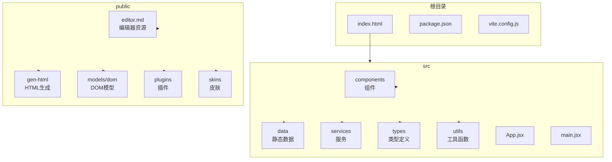
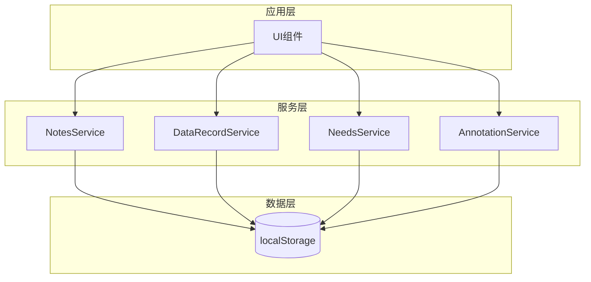
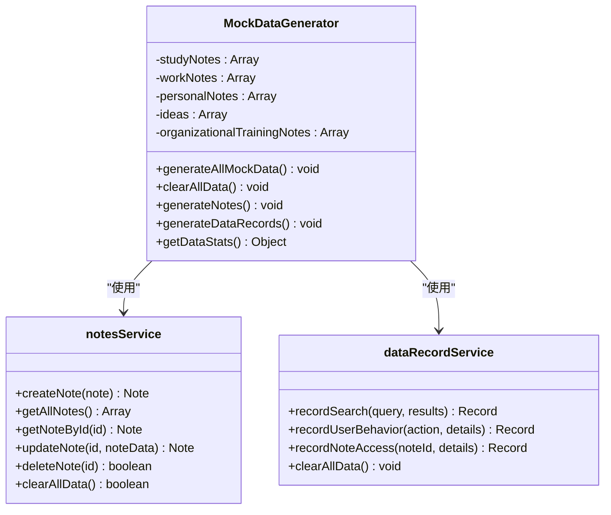
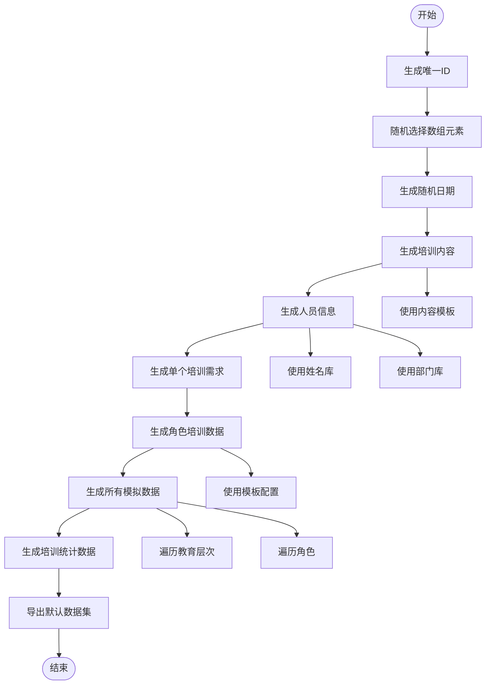
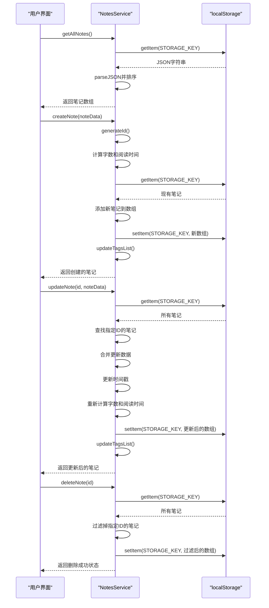
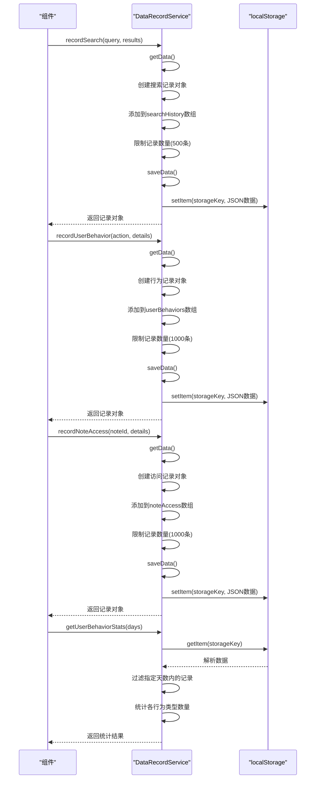

# 数据持久化

<cite>
**本文档引用文件**
- [mockTrainingData.js](file://src/data/mockTrainingData.js)
- [mockDataGenerator.js](file://src/utils/mockDataGenerator.js)
- [notesService.js](file://src/services/notesService.js)
- [dataRecordService.js](file://src/services/dataRecordService.js)
- [trainingDataTemplates.js](file://src/data/trainingDataTemplates.js)
</cite>

## 目录
1. [引言](#引言)
2. [项目结构](#项目结构)
3. [核心组件](#核心组件)
4. [架构概述](#架构概述)
5. [详细组件分析](#详细组件分析)
6. [依赖分析](#依赖分析)
7. [性能考虑](#性能考虑)
8. [故障排除指南](#故障排除指南)
9. [结论](#结论)

## 引言
本项目是一个教育领域的智能笔记与培训管理系统，专注于为不同教育层次和角色提供全面的数据持久化解决方案。系统通过本地存储技术实现数据的可靠保存，并结合模拟数据生成机制支持开发环境下的高效测试。文档将深入解析系统的数据存储策略、模拟数据生成逻辑、localStorage使用规范以及开发与生产环境的数据源切换机制。

## 项目结构
项目采用模块化的前端架构设计，主要分为组件、数据、服务、类型定义和工具函数等几个核心目录。这种分层结构确保了代码的可维护性和扩展性。

**Diagram sources**
- [需求文档.md](file://需求文档.md#L218-L237)

**Section sources**
- [需求文档.md](file://需求文档.md#L218-L237)

## 核心组件
系统的核心组件包括智能笔记服务、数据记录服务、培训需求管理和服务等。这些组件共同构成了系统的数据持久化基础，通过localStorage实现客户端数据的长期保存。

**Section sources**
- [notesService.js](file://src/services/notesService.js#L1-L2595)
- [dataRecordService.js](file://src/services/dataRecordService.js#L0-L177)

## 架构概述
系统采用基于localStorage的客户端数据持久化架构，结合服务类封装提供统一的数据访问接口。整个架构分为数据层、服务层和应用层三个主要部分。

**Diagram sources**
- [notesService.js](file://src/services/notesService.js#L1-L2595)
- [dataRecordService.js](file://src/services/dataRecordService.js#L0-L177)

## 详细组件分析

### 模拟数据生成器分析
`mockDataGenerator.js` 是系统的核心工具之一，负责在开发环境中生成各种类型的模拟数据，包括学习笔记、工作笔记、个人笔记和想法灵感等。

#### 对象导向组件：

**Diagram sources**
- [mockDataGenerator.js](file://src/utils/mockDataGenerator.js#L0-L575)

**Section sources**
- [mockDataGenerator.js](file://src/utils/mockDataGenerator.js#L0-L575)

### 培训数据模拟分析
`mockTrainingData.js` 文件实现了复杂的培训需求数据生成逻辑，支持多种教育层次和角色的定制化数据生成。

#### 复杂逻辑组件：

**Diagram sources**
- [mockTrainingData.js](file://src/data/mockTrainingData.js#L0-L838)

**Section sources**
- [mockTrainingData.js](file://src/data/mockTrainingData.js#L0-L838)

### 笔记服务分析
`notesService.js` 提供了完整的笔记CRUD操作和本地存储管理功能，是系统数据持久化的关键组件。

#### API/服务组件：

**Diagram sources**
- [notesService.js](file://src/services/notesService.js#L1-L2595)

**Section sources**
- [notesService.js](file://src/services/notesService.js#L1-L2595)

### 数据记录服务分析
`dataRecordService.js` 负责记录用户行为和笔记访问统计，为系统提供数据分析基础。

#### API/服务组件：

**Diagram sources**
- [dataRecordService.js](file://src/services/dataRecordService.js#L0-L177)

**Section sources**
- [dataRecordService.js](file://src/services/dataRecordService.js#L0-L177)

## 依赖分析
系统内部组件之间存在明确的依赖关系，主要通过服务类之间的调用来实现功能协作。

```mermaid
graph TD
MockDataGenerator --> notesService
MockDataGenerator --> dataRecordService
NotesService --> localStorage
DataRecordService --> localStorage
NeedsService --> localStorage
AnnotationService --> localStorage
ResourceLibraryService --> localStorage
CourseSelectionService --> localStorage
LearningProgressService --> localStorage
ScenarioService --> localStorage
style MockDataGenerator fill:#f9f,stroke:#333
style notesService fill:#bbf,stroke:#333
style dataRecordService fill:#bbf,stroke:#333
style NeedsService fill:#bbf,stroke:#333
style AnnotationService fill:#bbf,stroke:#333
style ResourceLibraryService fill:#bbf,stroke:#333
style CourseSelectionService fill:#bbf,stroke:#333
style LearningProgressService fill:#bbf,stroke:#333
style ScenarioService fill:#bbf,stroke:#333
style localStorage fill:#f96,stroke:#333
```

**Diagram sources**
- [mockDataGenerator.js](file://src/utils/mockDataGenerator.js#L0-L575)
- [notesService.js](file://src/services/notesService.js#L1-L2595)
- [dataRecordService.js](file://src/services/dataRecordService.js#L0-L177)

**Section sources**
- [mockDataGenerator.js](file://src/utils/mockDataGenerator.js#L0-L575)
- [notesService.js](file://src/services/notesService.js#L1-L2595)
- [dataRecordService.js](file://src/services/dataRecordService.js#L0-L177)

## 性能考虑
系统在数据持久化方面进行了多项性能优化：

1. **数据量控制**：对搜索历史记录保持最近500条，对用户行为和笔记访问记录保持最近1000条，避免localStorage存储过大。
2. **批量操作**：在导入数据时采用合并模式，减少重复数据写入。
3. **内存效率**：使用Set数据结构进行ID去重检查，提高查找效率。
4. **序列化优化**：直接使用JSON.stringify和JSON.parse进行数据序列化和反序列化，利用浏览器原生优化。

## 故障排除指南
当遇到数据持久化相关问题时，可以按照以下步骤进行排查：

1. **检查localStorage容量**：确认是否达到浏览器限制（通常为5-10MB）。
2. **验证数据格式**：确保存入localStorage的数据能够被正确序列化为JSON。
3. **调试存储键名**：确认使用的存储键名没有拼写错误。
4. **检查异常处理**：查看控制台是否有相关的错误日志输出。
5. **清除缓存测试**：尝试清除localStorage后重新初始化数据。

**Section sources**
- [notesService.js](file://src/services/notesService.js#L1-L2595)
- [dataRecordService.js](file://src/services/dataRecordService.js#L0-L177)

## 结论
本系统通过精心设计的数据持久化架构，实现了可靠的客户端数据存储。利用localStorage作为主要存储介质，结合服务类封装提供了一致的API接口。模拟数据生成机制为开发和测试提供了便利，而清晰的依赖关系和性能优化措施确保了系统的稳定性和可维护性。整体方案平衡了功能需求和性能要求，为教育管理应用提供了坚实的数据基础。