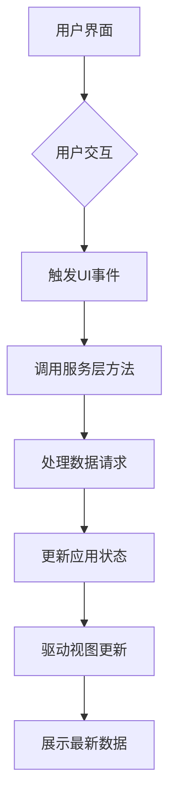
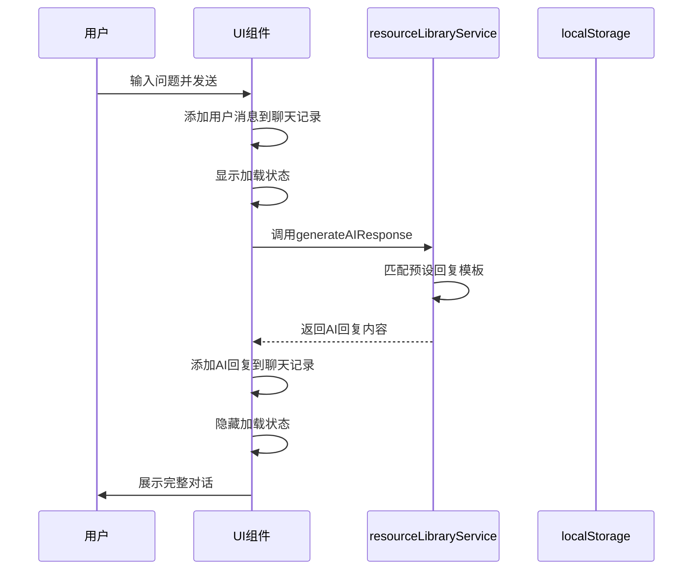
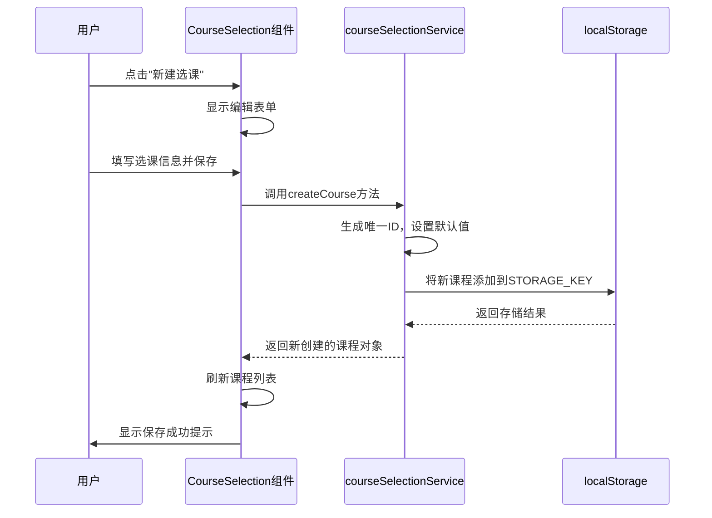

# 数据流设计

<cite>
**本文档引用的文件**   
- [resourceLibraryService.js](file://src/services/resourceLibraryService.js)
- [mockTrainingData.js](file://src/data/mockTrainingData.js)
- [ResourceLibrary.jsx](file://src/components/ResourceLibrary.jsx)
- [CourseSelection.jsx](file://src/components/CourseSelection.jsx)
- [courseSelectionService.js](file://src/services/courseSelectionService.js)
- [AIAssistantCenter.jsx](file://src/components/AIAssistantCenter.jsx)
</cite>

## 目录
1. [引言](#引言)
2. [数据流动路径与状态管理策略](#数据流动路径与状态管理策略)
3. [用户交互与UI事件处理](#用户交互与ui事件处理)
4. [服务层数据请求处理](#服务层数据请求处理)
5. [localStorage使用模式与数据持久化机制](#localstorage使用模式与数据持久化机制)
6. [mock数据在开发环境中的作用](#mock数据在开发环境中的作用)
7. [全局状态与局部状态划分原则](#全局状态与局部状态划分原则)
8. [数据变更驱动视图更新机制](#数据变更驱动视图更新机制)
9. [关键业务流程数据流转序列图](#关键业务流程数据流转序列图)
10. [错误处理与加载状态管理](#错误处理与加载状态管理)
11. [缓存策略与性能优化建议](#缓存策略与性能优化建议)

## 引言
本数据流设计文档全面阐述了系统的数据流动路径和状态管理策略。系统通过`resourceLibraryService.js`服务层处理数据请求，利用`localStorage`实现数据持久化，并采用`mockTrainingData.js`中的模拟数据支持开发环境。文档详细说明了用户交互如何触发UI事件，进而通过服务层处理数据请求并更新应用状态，以及全局状态与局部状态的划分原则。

**Section sources**
- [resourceLibraryService.js](file://src/services/resourceLibraryService.js#L1-L838)
- [mockTrainingData.js](file://src/data/mockTrainingData.js#L1-L839)

## 数据流动路径与状态管理策略
系统采用分层架构进行数据流动管理，从用户界面到服务层再到数据存储形成闭环。`resourceLibraryService.js`作为核心服务层，负责资源库的数据管理和操作，包括获取所有资源、根据ID获取资源详情、获取资源分类等。该服务通过异步方法返回包含成功状态、数据和消息的对象，确保数据流动的可靠性和可追踪性。

状态管理方面，系统结合使用组件内部状态和全局服务状态。`ResourceLibrary.jsx`组件通过React的useState钩子管理本地状态，如搜索条件、选中资源等；同时通过`resourceLibraryService`实例访问和修改全局资源数据。这种混合状态管理模式既保证了组件的独立性，又实现了跨组件的数据共享。



**Diagram sources **
- [resourceLibraryService.js](file://src/services/resourceLibraryService.js#L1-L838)
- [ResourceLibrary.jsx](file://src/components/ResourceLibrary.jsx#L1-L658)

## 用户交互与UI事件处理
用户交互主要通过`ResourceLibrary.jsx`组件中的各种UI元素触发。当用户执行搜索、筛选或查看资源等操作时，会触发相应的事件处理器。例如，在资源库页面中，用户输入搜索关键词会触发`setSearchTerm`状态更新，选择分类会触发`setSelectedCategory`状态更新。

这些UI事件最终会调用服务层的方法来获取新数据。以查看资源为例，`viewResource`函数被调用时，不仅会设置选中资源的状态，还会调用`getResourceById`服务方法来增加资源的浏览量统计。这种设计将UI交互与数据处理分离，提高了代码的可维护性和可测试性。

**Section sources**
- [ResourceLibrary.jsx](file://src/components/ResourceLibrary.jsx#L1-L658)
- [resourceLibraryService.js](file://src/services/resourceLibraryService.js#L1-L838)

## 服务层数据请求处理
`resourceLibraryService.js`提供了完整的资源库数据访问接口。服务类`ResourceLibraryService`封装了所有数据操作方法，包括`getAllResources`、`getResourceById`、`getCategories`等。这些方法都采用异步编程模式，返回Promise对象，便于在组件中进行链式调用和错误处理。

数据请求处理过程中，服务层会应用各种过滤和排序逻辑。例如，`getAllResources`方法支持按分类、子分类、资源类型、难度等级等多种条件进行筛选，并可根据创建时间、浏览量、点赞数等字段进行排序。此外，服务还提供`searchResources`和`getRecommendedResources`等高级查询功能，满足不同场景下的数据需求。

**Section sources**
- [resourceLibraryService.js](file://src/services/resourceLibraryService.js#L1-L838)

## localStorage使用模式与数据持久化机制
系统采用`localStorage`作为客户端数据持久化的主要机制。`courseSelectionService.js`服务通过定义常量`STORAGE_KEY`、`CATEGORIES_KEY`和`TAGS_KEY`来管理不同的数据集合。服务在构造函数中调用`initializeStorage`方法检查并初始化必要的存储项，确保数据结构的完整性。

数据持久化操作封装在服务方法中，如`createCourse`、`updateCourse`和`deleteCourse`等。每次数据变更都会立即同步到`localStorage`，保证了数据的一致性。对于复杂数据类型，服务自动进行JSON序列化和反序列化，简化了开发者的工作。这种集中式的持久化管理避免了分散的数据操作，降低了出错风险。

```mermaid
classDiagram
class CourseSelectionService {
+STORAGE_KEY : string
+CATEGORIES_KEY : string
+TAGS_KEY : string
+initializeStorage()
+getAllCourses() Course[]
+getCourseById(id) Course
+createCourse(courseData) Course
+updateCourse(id, courseData) Course
+deleteCourse(id) boolean
+searchCourses(query, filters) Course[]
+getCategories() Category[]
+getTags() Tag[]
+getCoursesStats() Stats
+exportCourses(format) string
+importCourses(data, options) boolean
}
CourseSelectionService --> "localStorage" : 使用
```

**Diagram sources **
- [courseSelectionService.js](file://src/services/courseSelectionService.js#L1-L497)

## mock数据在开发环境中的作用
`mockTrainingData.js`文件为系统提供了丰富的模拟培训数据，支持开发和测试过程。该文件定义了多种培训类型、角色、教育层次等常量，并通过`generateAllMockTrainingData`函数生成符合实际场景的测试数据集。模拟数据包含完整的培训需求信息，如标题、内容、优先级、状态、目标受众等。

在`ResourceLibrary.jsx`组件的`loadInitialData`函数中，系统首先生成模拟数据，然后将其注入到`resourceLibraryService`的存储中。这种方式使得前端开发可以独立于后端API进行，提高了开发效率。同时，模拟数据的结构与真实数据保持一致，确保了开发环境与生产环境的一致性。

**Section sources**
- [mockTrainingData.js](file://src/data/mockTrainingData.js#L1-L839)
- [ResourceLibrary.jsx](file://src/components/ResourceLibrary.jsx#L1-L658)

## 全局状态与局部状态划分原则
系统遵循清晰的状态划分原则：将需要跨组件共享的数据作为全局状态，而仅在单个组件内使用的数据作为局部状态。全局状态由服务类（如`resourceLibraryService`）管理，通过实例属性`storage`保存所有资源和分类数据。这种设计使得任何组件都可以访问和修改全局数据，实现数据共享。

局部状态则由各个React组件通过`useState`钩子管理。例如，`ResourceLibrary.jsx`组件管理搜索条件、选中资源、收藏列表等状态。这些状态只影响当前组件的渲染，不会干扰其他组件。当局部状态的变化需要更新全局数据时，组件会调用服务层方法，由服务层统一处理数据变更和状态同步。

**Section sources**
- [resourceLibraryService.js](file://src/services/resourceLibraryService.js#L1-L838)
- [ResourceLibrary.jsx](file://src/components/ResourceLibrary.jsx#L1-L658)

## 数据变更驱动视图更新机制
系统采用响应式编程模型实现数据变更驱动视图更新。当服务层数据发生变化时，会通过返回值通知调用方操作结果，但不会直接触发视图更新。视图更新由组件内的状态管理机制驱动，遵循"单一数据源"原则。

以资源收藏功能为例，`toggleFavorite`函数调用`likeResource`服务方法后，会根据返回结果更新本地的`favorites`状态和`resources`状态。正是这个`setFavorites`和`setResources`的操作触发了React的重新渲染机制，从而更新视图。这种设计将数据变更与视图更新解耦，使得状态变化更加可预测和可调试。

**Section sources**
- [ResourceLibrary.jsx](file://src/components/ResourceLibrary.jsx#L1-L658)
- [resourceLibraryService.js](file://src/services/resourceLibraryService.js#L1-L838)

## 关键业务流程数据流转序列图
以下序列图展示了两个典型业务场景的数据流转过程：

### AI助手交互流程


**Diagram sources **
- [AIAssistantCenter.jsx](file://src/components/AIAssistantCenter.jsx#L1-L519)

### 课程管理操作流程


**Diagram sources **
- [CourseSelection.jsx](file://src/components/CourseSelection.jsx#L1-L1119)
- [courseSelectionService.js](file://src/services/courseSelectionService.js#L1-L497)

## 错误处理与加载状态管理
系统实现了完善的错误处理和加载状态管理机制。所有服务层方法都包裹在try-catch块中，捕获潜在的运行时错误，并返回包含错误信息的标准化响应对象。前端组件根据响应的`success`字段判断操作结果，对于失败的操作会显示相应的错误消息。

加载状态通过组件的`loading`状态变量管理。在执行异步操作前设置`setLoading(true)`，操作完成后（无论成功或失败）设置`setLoading(false)`。UI组件根据`loading`状态显示加载指示器，提升用户体验。例如，在`loadInitialData`函数中，系统在数据加载期间显示"正在加载资源库..."的提示。

**Section sources**
- [resourceLibraryService.js](file://src/services/resourceLibraryService.js#L1-L838)
- [ResourceLibrary.jsx](file://src/components/ResourceLibrary.jsx#L1-L658)

## 缓存策略与性能优化建议
系统采用多层级缓存策略提升性能。第一层是服务实例缓存，`resourceLibraryService`将资源数据保存在内存中的`storage`对象里，避免重复解析和计算。第二层是浏览器缓存，通过`localStorage`持久化存储数据，减少网络请求。

性能优化建议包括：
1. 实现分页加载，避免一次性加载过多数据
2. 添加数据查询缓存，对相同参数的查询返回缓存结果
3. 优化资源搜索算法，建立索引提高搜索效率
4. 采用虚拟滚动技术，提升大量数据的渲染性能
5. 实施懒加载策略，按需加载非关键资源

这些优化措施能显著提升系统响应速度和用户体验。

**Section sources**
- [resourceLibraryService.js](file://src/services/resourceLibraryService.js#L1-L838)
- [courseSelectionService.js](file://src/services/courseSelectionService.js#L1-L497)