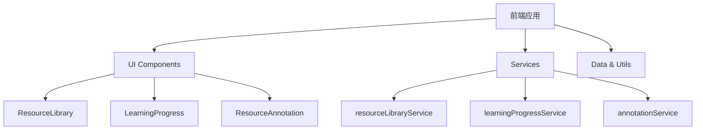
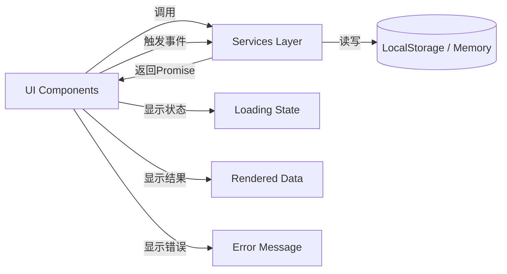
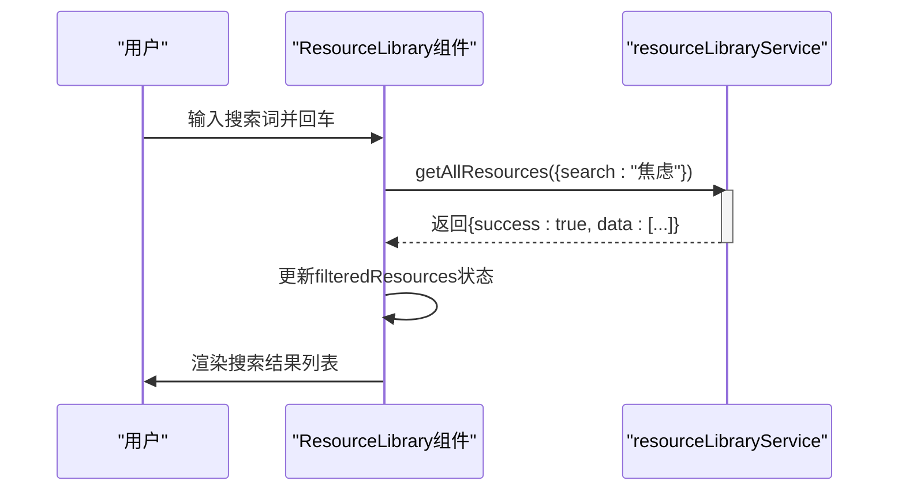
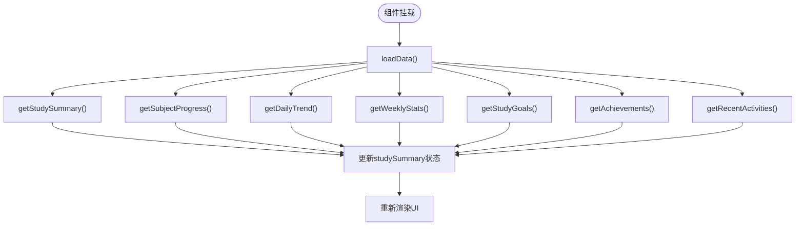
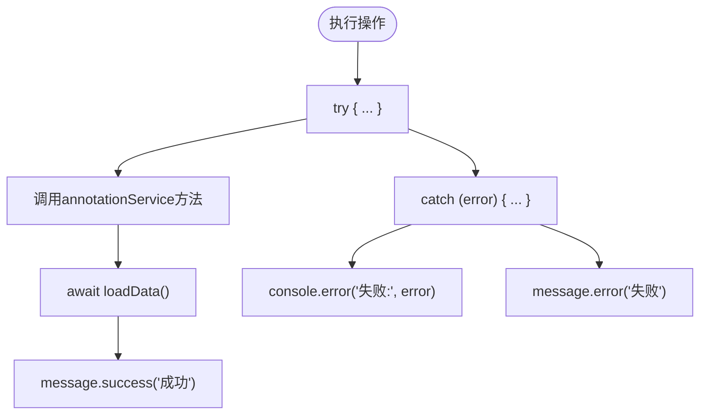
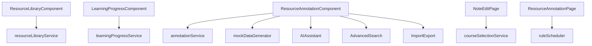

# 服务通信

<cite>
**本文档引用的文件**
- [resourceLibraryService.js](file://src/services/resourceLibraryService.js)
- [learningProgressService.js](file://src/services/learningProgressService.js)
- [annotationService.js](file://src/services/annotationService.js)
- [ResourceLibrary.jsx](file://src/components/ResourceLibrary.jsx)
- [LearningProgress.jsx](file://src/components/LearningProgress.jsx)
- [ResourceAnnotation.jsx](file://src/components/ResourceAnnotation.jsx)
- [ResourceAnnotationPage.jsx](file://src/components/ResourceAnnotationPage.jsx)
</cite>

## 目录
1. [引言](#引言)
2. [项目结构](#项目结构)
3. [核心组件分析](#核心组件分析)
4. [架构概览](#架构概览)
5. [详细组件分析](#详细组件分析)
6. [依赖关系分析](#依赖关系分析)
7. [性能考量](#性能考量)
8. [故障排除指南](#故障排除指南)
9. [结论](#结论)

## 引言
本服务通信文档旨在系统性地描述前端各服务模块间的交互机制。文档深入分析了`resourceLibraryService.js`中资源操作API的调用流程，解析了`learningProgressService.js`与UI组件的数据交互模式，并阐明了`annotationService.js`的异步请求处理机制。同时，文档详细说明了服务层与UI层的解耦设计，包括错误处理、加载状态管理和重试机制。

通过提供时序图展示典型业务场景（如资源检索、学习进度更新）的服务调用链路，本文档为开发者提供了清晰的调用路径和数据流视图。此外，还讨论了服务依赖注入模式、请求缓存策略以及mock数据替换方案，并给出了性能监控和调试的最佳实践。

## 项目结构
该项目采用典型的React应用结构，主要分为以下几个部分：

- `public/`: 包含静态资源文件，如编辑器库、图标和皮肤。
- `src/`: 源代码目录，包含所有可变的源码。
  - `components/`: React UI组件，如AI助手、资源库、学习进度等。
  - `data/`: 静态数据和模拟数据，用于开发和测试。
  - `services/`: 核心服务模块，负责数据存储、检索和业务逻辑。
  - `types/`: TypeScript类型定义。
  - `utils/`: 工具函数和辅助类。

这种分层结构确保了关注点分离，使得UI组件专注于渲染，而服务层则处理数据逻辑和持久化。

**Diagram sources**
- [src/components/ResourceLibrary.jsx](file://src/components/ResourceLibrary.jsx)
- [src/components/LearningProgress.jsx](file://src/components/LearningProgress.jsx)
- [src/components/ResourceAnnotation.jsx](file://src/components/ResourceAnnotation.jsx)
- [src/services/resourceLibraryService.js](file://src/services/resourceLibraryService.js)
- [src/services/learningProgressService.js](file://src/services/learningProgressService.js)
- [src/services/annotationService.js](file://src/services/annotationService.js)

**Section sources**
- [src/components/ResourceLibrary.jsx](file://src/components/ResourceLibrary.jsx)
- [src/components/LearningProgress.jsx](file://src/components/LearningProgress.jsx)
- [src/components/ResourceAnnotation.jsx](file://src/components/ResourceAnnotation.jsx)
- [src/services/resourceLibraryService.js](file://src/services/resourceLibraryService.js)
- [src/services/learningProgressService.js](file://src/services/learningProgressService.js)
- [src/services/annotationService.js](file://src/services/annotationService.js)

## 核心组件分析
### 资源库服务 (ResourceLibraryService)
`resourceLibraryService.js` 是一个基于内存存储的单例服务，负责管理教育资源的分类、检索和访问。它使用JavaScript对象作为数据存储，支持多种筛选和排序功能。

该服务的核心方法包括：
- `getAllResources(filters)`: 根据类别、难度、受众等条件筛选资源。
- `getResourceById(id)`: 获取特定资源详情并增加浏览量。
- `searchResources(query, filters)`: 支持全文搜索标题、描述、标签和关键词。
- `getRecommendedResources(resourceId)`: 基于相关资源ID或分类推荐相似内容。

服务实现了完整的CRUD操作，并通过返回标准化的响应对象（包含success、data、message字段）来统一错误处理。

**Section sources**
- [src/services/resourceLibraryService.js](file://src/services/resourceLibraryService.js)

### 学习进度服务 (LearningProgressService)
`learningProgressService.js` 利用浏览器的`localStorage`进行数据持久化，管理用户的学习目标、学科进度和每日记录。

其主要特性包括：
- **数据初始化**: 在构造函数中检查本地存储，若无数据则创建初始状态。
- **多维度统计**: 提供每周统计、学科进度、学习目标等多种视图。
- **活动追踪**: 记录学习、目标达成等活动，形成时间线。
- **数据导入导出**: 支持JSON格式的数据备份和恢复。

服务通过`getStoredData()`和`saveData(data)`方法封装了对`localStorage`的读写操作，确保了数据访问的一致性和错误处理。

**Section sources**
- [src/services/learningProgressService.js](file://src/services/learningProgressService.js)

### 标注服务 (AnnotationService)
`annotationService.js` 是一个复杂的本地数据管理服务，专为资源标注设计。它同样使用`localStorage`，但管理多个独立的数据集。

关键功能有：
- **多数据集管理**: 分别存储标注数据、分类和标签。
- **智能统计**: 实时计算各类别的标注数量、字数统计和阅读时间。
- **高级搜索**: 支持按分类、标签、日期范围等条件过滤。
- **数据导入导出**: 支持合并或替换模式的批量数据操作。

服务采用了别名模式（如`createNote`是`createAnnotation`的别名），以兼容不同UI组件的调用习惯，体现了良好的向后兼容性设计。

**Section sources**
- [src/services/annotationService.js](file://src/services/annotationService.js)

## 架构概览
整个系统的架构遵循了清晰的分层模式，将UI表示层与数据服务层完全分离。

**Diagram sources**
- [src/components/ResourceLibrary.jsx](file://src/components/ResourceLibrary.jsx)
- [src/components/LearningProgress.jsx](file://src/components/LearningProgress.jsx)
- [src/components/ResourceAnnotation.jsx](file://src/components/ResourceAnnotation.jsx)
- [src/services/resourceLibraryService.js](file://src/services/resourceLibraryService.js)
- [src/services/learningProgressService.js](file://src/services/learningProgressService.js)
- [src/services/annotationService.js](file://src/services/annotationService.js)

## 详细组件分析
### 资源库组件 (ResourceLibrary)
`ResourceLibrary.jsx` 组件展示了如何与`resourceLibraryService`进行高效交互。

#### 数据流与时序图
以下是"资源检索"场景的时序图：

**Diagram sources**
- [src/components/ResourceLibrary.jsx](file://src/components/ResourceLibrary.jsx)
- [src/services/resourceLibraryService.js](file://src/services/resourceLibraryService.js)

**Section sources**
- [src/components/ResourceLibrary.jsx](file://src/components/ResourceLibrary.jsx)
- [src/services/resourceLibraryService.js](file://src/services/resourceLibraryService.js)

### 学习进度组件 (LearningProgress)
`LearningProgress.jsx` 组件与`learningProgressService`的交互体现了数据驱动的UI设计。

#### 数据交互模式
该组件在`useEffect`钩子中调用服务的多个获取方法，将结果映射到自身的状态变量中。

**Diagram sources**
- [src/components/LearningProgress.jsx](file://src/components/LearningProgress.jsx)
- [src/services/learningProgressService.js](file://src/services/learningProgressService.js)

**Section sources**
- [src/components/LearningProgress.jsx](file://src/components/LearningProgress.jsx)
- [src/services/learningProgressService.js](file://src/services/learningProgressService.js)

### 标注组件 (ResourceAnnotation)
`ResourceAnnotation.jsx` 组件与`annotationService`的交互最为复杂，涉及大量的异步操作和状态管理。

#### 异步请求处理机制
该组件通过一系列`async`函数处理异步请求，每个操作都包含完整的错误处理和用户反馈。

**Diagram sources**
- [src/components/ResourceAnnotation.jsx](file://src/components/ResourceAnnotation.jsx)
- [src/services/annotationService.js](file://src/services/annotationService.js)

**Section sources**
- [src/components/ResourceAnnotation.jsx](file://src/components/ResourceAnnotation.jsx)
- [src/services/annotationService.js](file://src/services/annotationService.js)

## 依赖关系分析
各服务和组件之间存在明确的依赖关系，形成了一个松耦合的系统。

**Diagram sources**
- [src/components/ResourceLibrary.jsx](file://src/components/ResourceLibrary.jsx)
- [src/components/LearningProgress.jsx](file://src/components/LearningProgress.jsx)
- [src/components/ResourceAnnotation.jsx](file://src/components/ResourceAnnotation.jsx)
- [src/components/NoteEditPage.jsx](file://src/components/NoteEditPage.jsx)
- [src/components/ResourceAnnotationPage.jsx](file://src/components/ResourceAnnotationPage.jsx)
- [src/services/resourceLibraryService.js](file://src/services/resourceLibraryService.js)
- [src/services/learningProgressService.js](file://src/services/learningProgressService.js)
- [src/services/annotationService.js](file://src/services/annotationService.js)

**Section sources**
- [src/components/ResourceLibrary.jsx](file://src/components/ResourceLibrary.jsx)
- [src/components/LearningProgress.jsx](file://src/components/LearningProgress.jsx)
- [src/components/ResourceAnnotation.jsx](file://src/components/ResourceAnnotation.jsx)
- [src/components/NoteEditPage.jsx](file://src/components/NoteEditPage.jsx)
- [src/components/ResourceAnnotationPage.jsx](file://src/components/ResourceAnnotationPage.jsx)
- [src/services/resourceLibraryService.js](file://src/services/resourceLibraryService.js)
- [src/services/learningProgressService.js](file://src/services/learningProgressService.js)
- [src/services/annotationService.js](file://src/services/annotationService.js)

## 性能考量
### 缓存策略
所有服务都实现了某种形式的缓存：
- `resourceLibraryService` 将数据存储在内存对象中，避免重复解析。
- `learningProgressService` 和 `annotationService` 使用`localStorage`作为持久化缓存。

### Mock数据替换方案
在开发环境中，系统使用`generateMockResourceData()`等函数生成模拟数据。这些数据在`useEffect`中被注入到服务实例中，允许UI组件在没有后端API的情况下正常工作。

### 性能监控最佳实践
1. **加载状态管理**: 所有组件都使用`loading`状态，在异步操作期间显示加载指示器。
2. **错误边界**: 虽然未在代码中显式实现，但建议为关键组件添加错误边界。
3. **性能优化**: 对于大型列表，应考虑使用虚拟滚动技术。

## 故障排除指南
### 常见问题
1. **数据不更新**: 确保服务方法正确调用了`setStorage`或`saveData`。
2. **本地存储限制**: `localStorage`有大小限制（通常5-10MB），大量数据可能导致异常。
3. **跨域问题**: 如果未来迁移到真实API，需配置CORS。

### 调试技巧
1. **使用浏览器开发者工具**: 检查`localStorage`中的数据是否正确。
2. **添加日志**: 在服务的关键方法中添加`console.log`输出。
3. **单元测试**: 为服务方法编写测试，验证其行为。

**Section sources**
- [src/services/resourceLibraryService.js](file://src/services/resourceLibraryService.js)
- [src/services/learningProgressService.js](file://src/services/learningProgressService.js)
- [src/services/annotationService.js](file://src/services/annotationService.js)

## 结论
本文档全面分析了前端服务通信的各个方面。`resourceLibraryService.js`、`learningProgressService.js`和`annotationService.js`三个核心服务通过清晰的接口与UI组件交互，实现了数据与表现的分离。

系统采用了现代化的前端架构模式，包括：
- **服务层抽象**: 将数据访问逻辑集中管理。
- **状态管理**: 使用React Hooks管理组件状态。
- **错误处理**: 统一的响应格式和用户友好的错误提示。
- **可扩展性**: 模块化设计便于添加新功能。

建议未来可以引入Redux或Context API来管理全局状态，并将本地存储服务升级为IndexedDB以支持更大规模的数据。