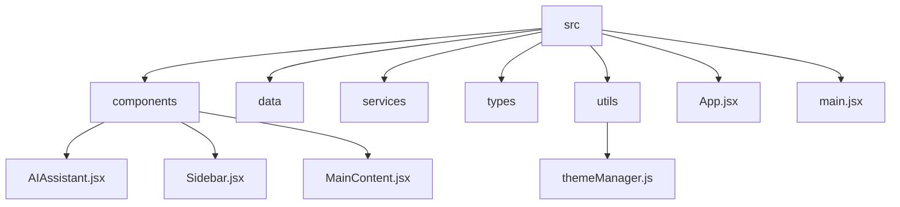
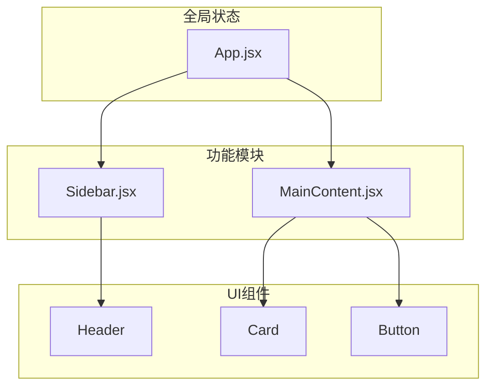
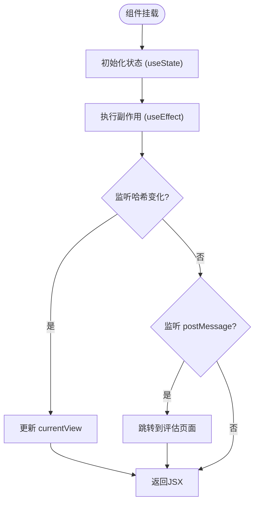
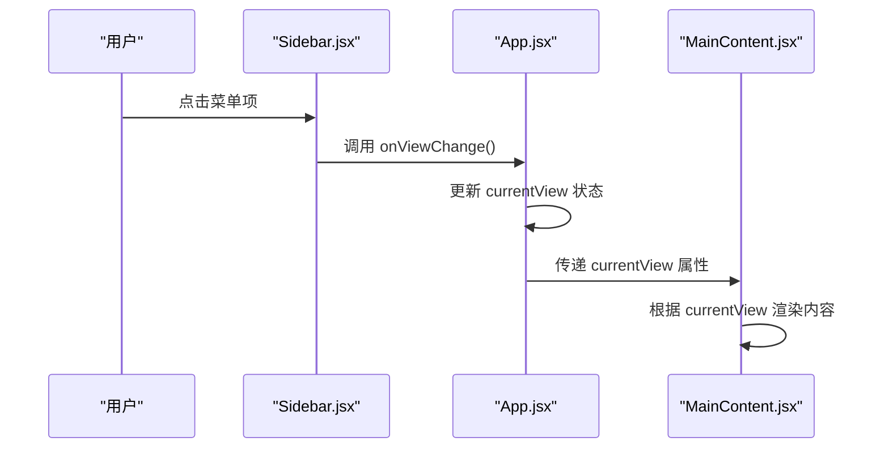
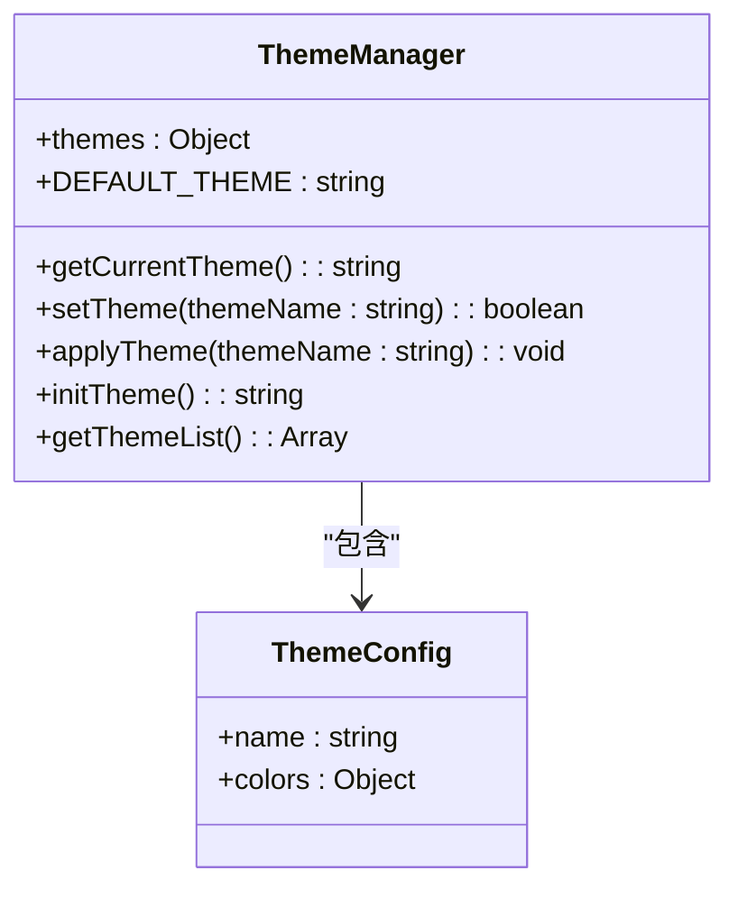
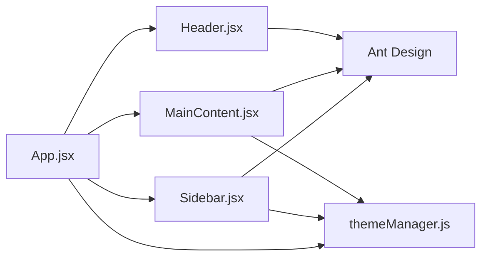

# 状态管理

<cite>
**本文档引用的文件**
- [App.jsx](file://src/App.jsx)
- [Sidebar.jsx](file://src/components/Sidebar.jsx)
- [MainContent.jsx](file://src/components/MainContent.jsx)
- [themeManager.js](file://src/utils/themeManager.js)
</cite>

## 目录
1. [简介](#简介)
2. [项目结构](#项目结构)
3. [核心组件](#核心组件)
4. [架构概述](#架构概述)
5. [详细组件分析](#详细组件分析)
6. [依赖分析](#依赖分析)
7. [性能考虑](#性能考虑)
8. [故障排除指南](#故障排除指南)
9. [结论](#结论)

## 简介
本项目是一个基于React的教育管理系统，采用现代化的状态管理方案。系统通过`useState`和`useEffect`等React Hooks实现组件状态管理，并利用Context API和本地存储进行全局状态持久化。核心状态管理机制围绕App.jsx中的全局状态设计模式展开，实现了Sidebar.jsx和MainContent.jsx之间的高效状态同步。

## 项目结构
项目采用典型的React应用结构，主要分为以下几个目录：
- `public/`: 静态资源文件，包括编辑器、图标、插件等
- `src/`: 源代码目录，包含组件、服务、工具等
- 根目录: 包含配置文件和文档

**Diagram sources**
- [App.jsx](file://src/App.jsx)
- [Sidebar.jsx](file://src/components/Sidebar.jsx)
- [MainContent.jsx](file://src/components/MainContent.jsx)
- [themeManager.js](file://src/utils/themeManager.js)

**Section sources**
- [App.jsx](file://src/App.jsx)
- [Sidebar.jsx](file://src/components/Sidebar.jsx)
- [MainContent.jsx](file://src/components/MainContent.jsx)
- [themeManager.js](file://src/utils/themeManager.js)

## 核心组件
系统的核心组件包括App.jsx作为根组件，负责全局状态管理和路由控制；Sidebar.jsx作为侧边栏导航组件，处理用户交互和视图切换；MainContent.jsx作为主内容区域组件，根据当前视图显示相应的内容。这些组件通过props传递和回调函数实现状态同步。

**Section sources**
- [App.jsx](file://src/App.jsx#L1-L425)
- [Sidebar.jsx](file://src/components/Sidebar.jsx#L1-L730)
- [MainContent.jsx](file://src/components/MainContent.jsx#L1-L701)

## 架构概述
系统的状态管理架构采用分层设计，顶层是App.jsx中定义的全局状态，中间层是各个功能模块的状态，底层是原子化的UI组件状态。这种设计使得状态管理既具有全局一致性，又保持了局部灵活性。

**Diagram sources**
- [App.jsx](file://src/App.jsx#L1-L425)
- [Sidebar.jsx](file://src/components/Sidebar.jsx#L1-L730)
- [MainContent.jsx](file://src/components/MainContent.jsx#L1-L701)

## 详细组件分析
### App.jsx 全局状态分析
App.jsx组件使用`useState`钩子创建了多个状态变量，包括`currentView`用于跟踪当前视图，`messages`用于存储消息记录，以及`pageState`用于管理页面特定状态。这些状态通过回调函数传递给子组件，实现了自上而下的状态流。

#### 状态管理流程图

**Diagram sources**
- [App.jsx](file://src/App.jsx#L1-L425)

### Sidebar.jsx 和 MainContent.jsx 状态同步分析
Sidebar.jsx和MainContent.jsx之间通过回调函数实现状态同步。Sidebar.jsx接收来自App.jsx的`onViewChange`回调函数，当用户点击菜单项时调用该函数，从而通知App.jsx更新`currentView`状态。MainContent.jsx则根据`currentView`的值渲染相应的内容。

#### 组件通信序列图

**Diagram sources**
- [App.jsx](file://src/App.jsx#L1-L425)
- [Sidebar.jsx](file://src/components/Sidebar.jsx#L1-L730)
- [MainContent.jsx](file://src/components/MainContent.jsx#L1-L701)

### themeManager.js 主题管理分析
themeManager.js实现了主题状态的持久化管理。它定义了多种主题配置，并通过localStorage保存用户选择的主题。`setTheme`函数不仅更新本地存储，还通过CSS变量动态应用主题样式，实现了即时的主题切换效果。

#### 主题管理类图

**Diagram sources**
- [themeManager.js](file://src/utils/themeManager.js#L1-L126)

**Section sources**
- [App.jsx](file://src/App.jsx#L1-L425)
- [Sidebar.jsx](file://src/components/Sidebar.jsx#L1-L730)
- [MainContent.jsx](file://src/components/MainContent.jsx#L1-L701)
- [themeManager.js](file://src/utils/themeManager.js#L1-L126)

## 依赖分析
系统的主要依赖关系如下：App.jsx作为根组件依赖于所有其他组件；Sidebar.jsx和MainContent.jsx都依赖于Ant Design组件库；themeManager.js被多个组件间接依赖，用于主题管理。

**Diagram sources**
- [App.jsx](file://src/App.jsx#L1-L425)
- [Sidebar.jsx](file://src/components/Sidebar.jsx#L1-L730)
- [MainContent.jsx](file://src/components/MainContent.jsx#L1-L701)
- [themeManager.js](file://src/utils/themeManager.js#L1-L126)

**Section sources**
- [App.jsx](file://src/App.jsx#L1-L425)
- [Sidebar.jsx](file://src/components/Sidebar.jsx#L1-L730)
- [MainContent.jsx](file://src/components/MainContent.jsx#L1-L701)
- [themeManager.js](file://src/utils/themeManager.js#L1-L126)

## 性能考虑
在状态管理方面，系统采取了多项优化措施以避免不必要的重渲染。例如，在Sidebar.jsx中使用`useMemo`缓存计算结果，在App.jsx中合理使用`useEffect`的依赖数组来控制副作用的执行时机。此外，通过将状态提升到共同祖先组件，减少了深层嵌套组件间的状态传递开销。

## 故障排除指南
常见状态管理问题及解决方案：
- **状态不同步**: 检查回调函数是否正确传递，确保父组件状态更新后子组件能及时接收到新属性
- **过度重渲染**: 使用React DevTools检查组件渲染情况，考虑使用`React.memo`或`useMemo`进行优化
- **主题不生效**: 确认CSS变量是否正确设置，检查`applyTheme`函数是否被正确调用

**Section sources**
- [App.jsx](file://src/App.jsx#L1-L425)
- [Sidebar.jsx](file://src/components/Sidebar.jsx#L1-L730)
- [MainContent.jsx](file://src/components/MainContent.jsx#L1-L701)
- [themeManager.js](file://src/utils/themeManager.js#L1-L126)

## 结论
本系统通过合理的状态管理设计，实现了组件间的高效协作和数据流动。App.jsx作为状态管理中心，协调各个功能模块的工作；Sidebar.jsx和MainContent.jsx通过清晰的API接口进行通信；themeManager.js提供了可扩展的主题管理能力。整体架构既满足了当前需求，也为未来的功能扩展留下了充足的空间。