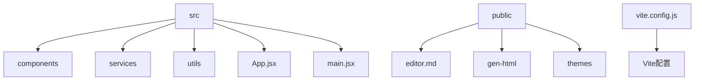
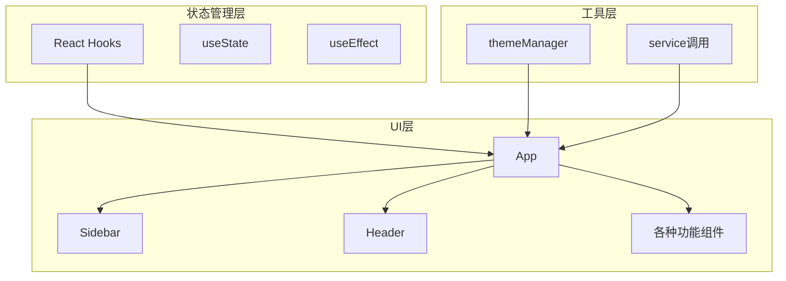
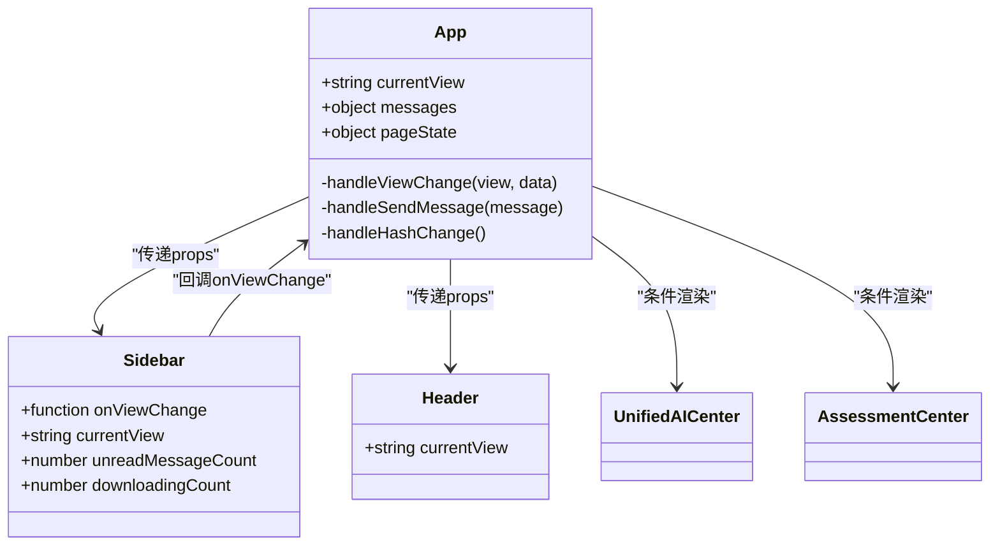
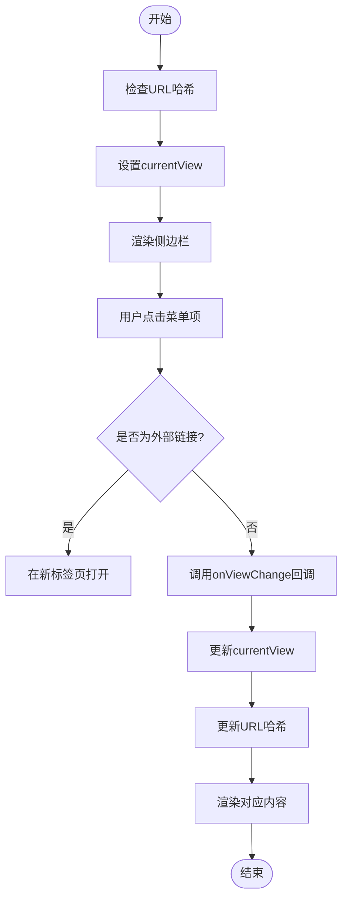
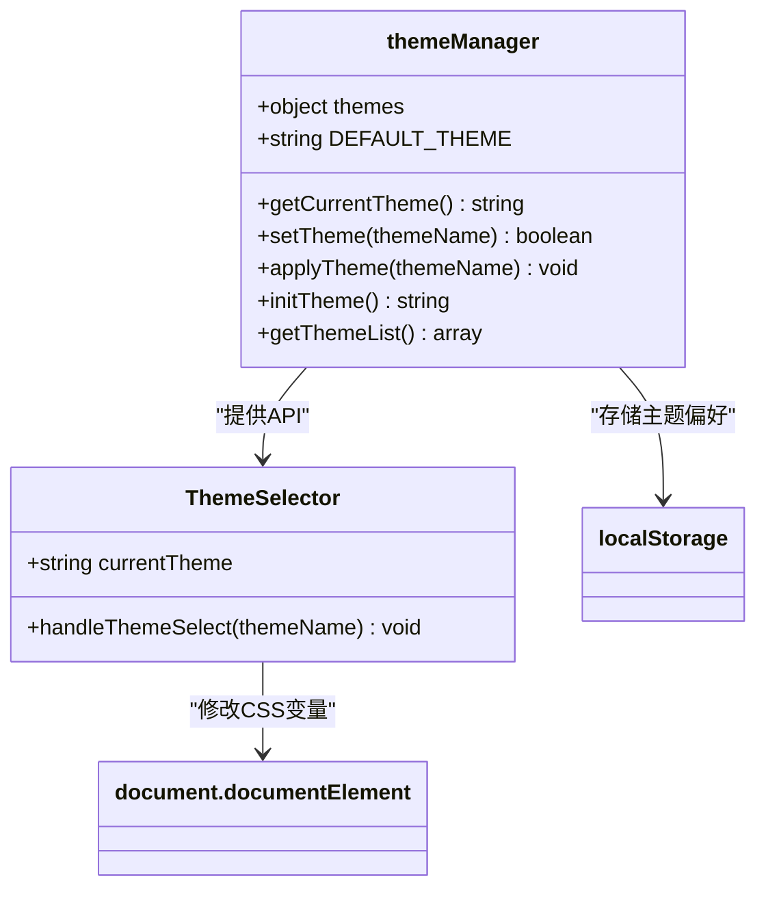

# 架构设计

<cite>
**本文档中引用的文件**
- [App.jsx](file://src/App.jsx)
- [Sidebar.jsx](file://src/components/Sidebar.jsx)
- [themeManager.js](file://src/utils/themeManager.js)
- [vite.config.js](file://vite.config.js)
</cite>

## 目录
1. [引言](#引言)
2. [项目结构](#项目结构)
3. [核心组件](#核心组件)
4. [架构概述](#架构概述)
5. [详细组件分析](#详细组件分析)
6. [依赖分析](#依赖分析)
7. [性能考虑](#性能考虑)
8. [可扩展性与未来演进](#可扩展性与未来演进)
9. [结论](#结论)

## 引言
本架构文档深入描述了基于React的组件化设计模式，重点分析了应用根组件(App.jsx)如何通过路由机制协调各个功能模块。文档详细解释了侧边栏(Sidebar)组件如何实现导航控制和视图切换，以及主题管理系统(themeManager.js)的工作原理和CSS变量的应用方式。同时，阐述了组件层次结构的设计原则、状态提升策略以及props传递模式，并讨论了技术决策背后的权衡取舍。

## 项目结构
该系统采用典型的React项目结构，以组件化设计为核心。src目录下包含components（UI组件）、services（业务服务）、utils（工具函数）等主要模块。公共资源存放在public目录，构建配置使用Vite。这种分层结构清晰地分离了UI展示、业务逻辑和工具功能，便于维护和扩展。



**Diagram sources**
- [App.jsx](file://src/App.jsx)
- [vite.config.js](file://vite.config.js)

**Section sources**
- [App.jsx](file://src/App.jsx)
- [vite.config.js](file://vite.config.js)

## 核心组件
系统的核心组件包括App根组件、Sidebar导航组件和themeManager主题管理器。App组件作为应用的入口点，负责协调全局状态和路由；Sidebar组件提供可定制的导航界面，支持动态菜单项和拖拽排序；themeManager实现了完整的主题切换功能，通过CSS变量实现样式动态更新。

**Section sources**
- [App.jsx](file://src/App.jsx)
- [Sidebar.jsx](file://src/components/Sidebar.jsx)
- [themeManager.js](file://src/utils/themeManager.js)

## 架构概述
系统采用现代化的前端架构，以React函数式组件和Hooks为基础，结合Vite构建工具。整体架构呈现清晰的分层：UI层由Ant Design组件库支撑，状态管理层使用React Hooks，工具层包含主题管理等通用功能。各组件通过props传递数据和回调函数，形成单向数据流。



**Diagram sources**
- [App.jsx](file://src/App.jsx)
- [Sidebar.jsx](file://src/components/Sidebar.jsx)
- [themeManager.js](file://src/utils/themeManager.js)

## 详细组件分析

### App组件分析
App组件作为应用的根组件，承担着全局状态管理和路由协调的核心职责。它通过currentView状态变量控制当前显示的视图，利用URL哈希变化实现持久化的页面状态记忆。

#### 组件关系图


**Diagram sources**
- [App.jsx](file://src/App.jsx)
- [Sidebar.jsx](file://src/components/Sidebar.jsx)

**Section sources**
- [App.jsx](file://src/App.jsx#L48-L96)

### Sidebar组件分析
Sidebar组件实现了高度可定制的导航系统，支持菜单项的动态添加、移除和重新排序。用户可以通过拖拽调整菜单顺序，所有个性化设置都保存在localStorage中，确保用户体验的一致性。

#### 导航流程图


**Diagram sources**
- [Sidebar.jsx](file://src/components/Sidebar.jsx#L669-L687)
- [App.jsx](file://src/App.jsx#L100-L120)

**Section sources**
- [Sidebar.jsx](file://src/components/Sidebar.jsx#L303-L325)

### 主题管理系统分析
主题管理系统通过CSS变量实现动态主题切换，提供了良好的用户体验和性能表现。系统预定义了多种主题方案，用户选择后立即生效，所有主题配置都持久化存储。

#### 主题管理类图


**Diagram sources**
- [themeManager.js](file://src/utils/themeManager.js)
- [ThemeSelector.jsx](file://src/components/ThemeSelector.jsx)

**Section sources**
- [themeManager.js](file://src/utils/themeManager.js#L76-L126)

## 依赖分析
系统依赖关系清晰，主要依赖Ant Design UI库、React框架和Vite构建工具。通过合理的依赖管理，确保了系统的稳定性和可维护性。

```mermaid
graph LR
A[React] --> B[App]
C[Ant Design] --> D[Sider]
C --> E[Layout]
C --> F[Modal]
G[@dnd-kit] --> H[拖拽功能]
I[lucide-react] --> J[图标]
B --> D
B --> K[Sidebar]
B --> L[Header]
K --> H
K --> J
```

**Diagram sources**
- [package.json](file://package.json)
- [App.jsx](file://src/App.jsx)

**Section sources**
- [App.jsx](file://src/App.jsx)
- [Sidebar.jsx](file://src/components/Sidebar.jsx)

## 性能考虑
系统在性能方面做了多项优化：使用React.memo避免不必要的重渲染，通过懒加载减少初始包大小，利用localStorage缓存用户偏好设置。主题切换采用CSS变量而非样式表替换，确保了即时响应和流畅体验。

## 可扩展性与未来演进
系统设计具有良好的可扩展性，主要体现在：
1. 组件化设计便于新增功能模块
2. 动态菜单系统支持应用的灵活集成
3. 主题管理系统易于添加新的视觉方案
4. 基于Vite的构建系统支持现代前端工作流

未来可以考虑引入微前端架构，将不同功能模块拆分为独立的子应用，进一步提升开发效率和系统可维护性。

## 结论
本系统采用了现代化的React组件化架构，通过合理的状态管理和组件设计，实现了功能丰富且易于维护的教育管理系统。Vite的选用带来了快速的开发体验，函数式组件和Hooks的使用使代码更加简洁和可测试。整体架构平衡了功能需求和性能要求，为未来的持续演进奠定了良好基础。