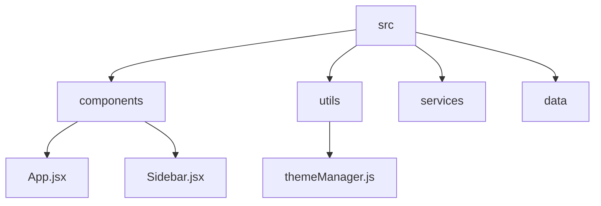
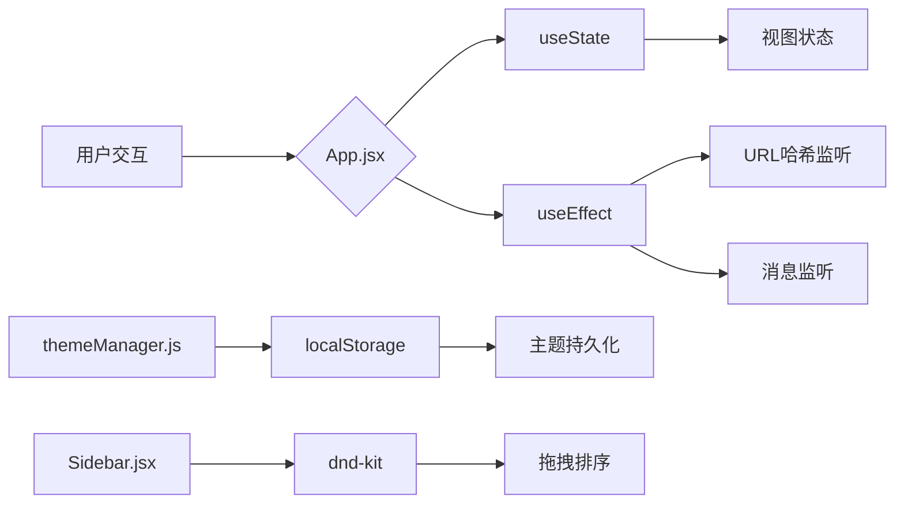
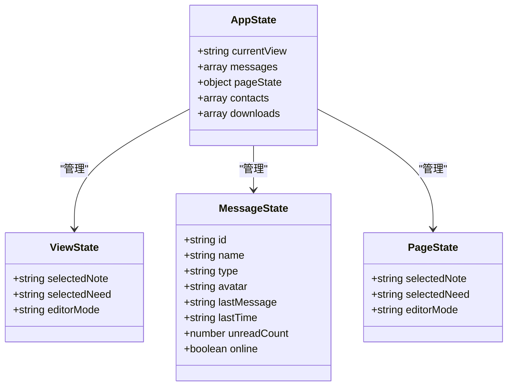
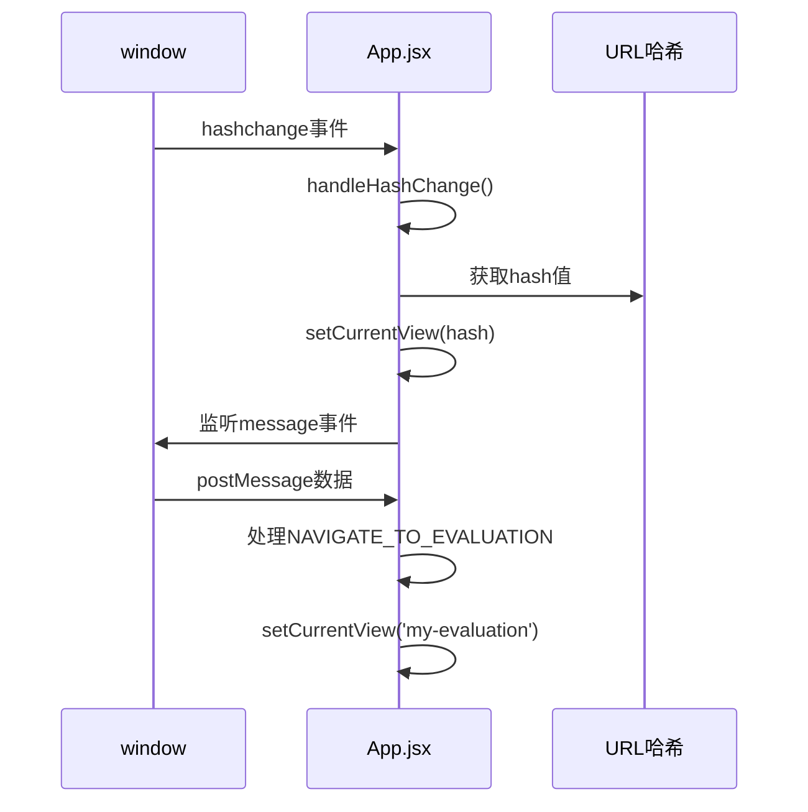
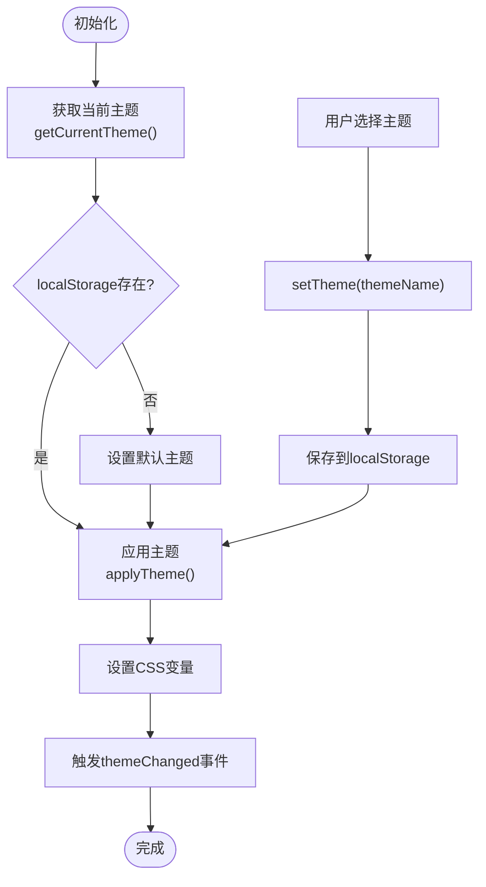
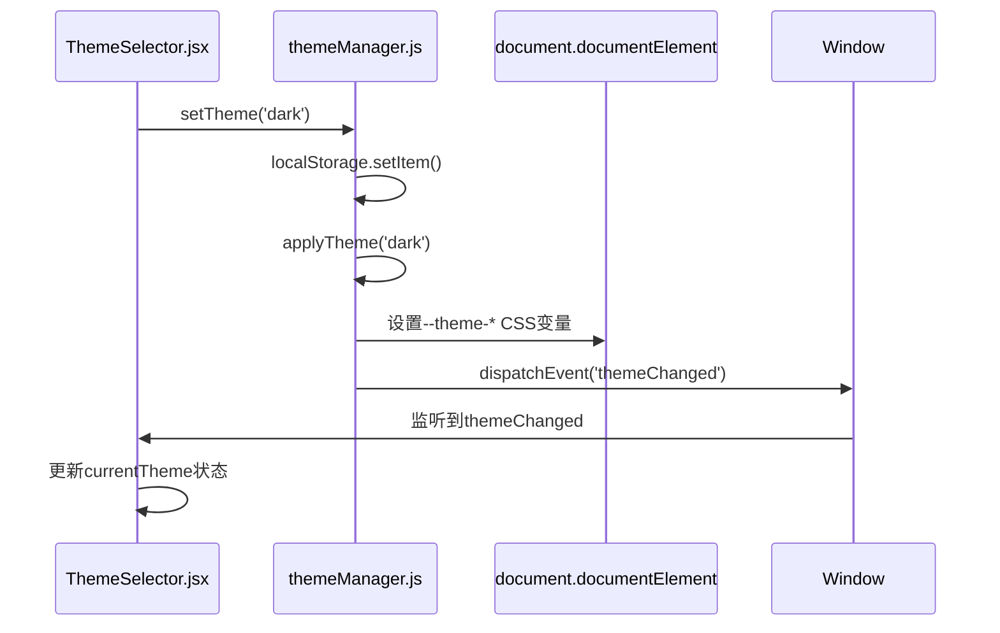
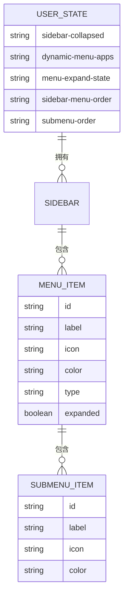
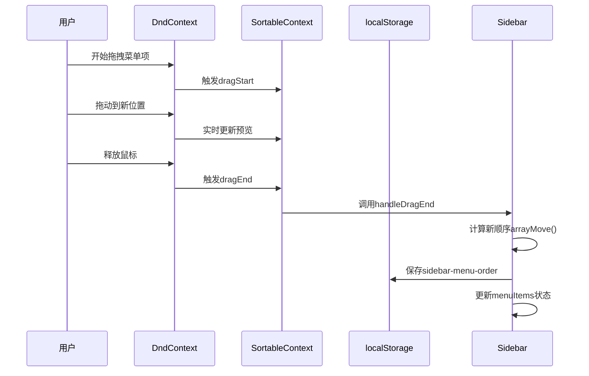

# 状态管理机制

<cite>
**本文档引用的文件**
- [App.jsx](file://src/App.jsx)
- [themeManager.js](file://src/utils/themeManager.js)
- [Sidebar.jsx](file://src/components/Sidebar.jsx)
</cite>

## 目录
1. [简介](#简介)
2. [项目结构](#项目结构)
3. [核心组件](#核心组件)
4. [架构概述](#架构概述)
5. [详细组件分析](#详细组件分析)
6. [依赖分析](#依赖分析)
7. [性能考虑](#性能考虑)
8. [故障排除指南](#故障排除指南)
9. [结论](#结论)

## 简介
本文档深入解析基于React Hooks的状态管理模式，重点阐述`useState`和`useEffect`在`App.jsx`中的应用方式，描述`themeManager.js`中主题状态的管理逻辑及其与UI组件的集成方法。同时分析`Sidebar.jsx`中拖拽排序功能的状态维护机制，包括本地状态与全局状态的划分原则，并提供状态流动图示展示用户交互引发的状态变更路径。

## 项目结构
系统采用分层架构设计，主要分为三个目录：`public`存放静态资源，`src`包含源代码，根目录下为配置文件。源代码组织清晰，`components`目录存放所有UI组件，`utils`目录包含工具函数，特别是`themeManager.js`负责主题管理。



**Diagram sources**
- [App.jsx](file://src/App.jsx)
- [Sidebar.jsx](file://src/components/Sidebar.jsx)
- [themeManager.js](file://src/utils/themeManager.js)

**Section sources**
- [App.jsx](file://src/App.jsx)
- [Sidebar.jsx](file://src/components/Sidebar.jsx)
- [themeManager.js](file://src/utils/themeManager.js)

## 核心组件
核心状态管理涉及三个关键文件：`App.jsx`作为应用入口管理全局视图状态，`Sidebar.jsx`处理侧边栏的交互状态，`themeManager.js`提供主题状态的持久化管理。这些组件通过props传递和事件回调实现状态共享与同步。

**Section sources**
- [App.jsx](file://src/App.jsx)
- [Sidebar.jsx](file://src/components/Sidebar.jsx)
- [themeManager.js](file://src/utils/themeManager.js)

## 架构概述
系统采用混合状态管理策略，结合React本地状态与浏览器存储实现多层次状态管理。顶层组件使用`useState`管理视图切换，工具类通过`localStorage`实现状态持久化，复杂交互组件利用`dnd-kit`库管理拖拽状态。



**Diagram sources**
- [App.jsx](file://src/App.jsx)
- [themeManager.js](file://src/utils/themeManager.js)
- [Sidebar.jsx](file://src/components/Sidebar.jsx)

## 详细组件分析

### App.jsx状态管理分析
`App.jsx`文件展示了典型的React Hooks状态管理模式，使用多个`useState`钩子管理不同维度的应用状态。

#### useState应用方式


**Diagram sources**
- [App.jsx](file://src/App.jsx#L10-L50)

#### useEffect生命周期管理


**Diagram sources**
- [App.jsx](file://src/App.jsx#L60-L100)

### themeManager.js主题状态管理
`themeManager.js`实现了完整的主题管理系统，包含主题配置、持久化存储和动态应用功能。

#### 主题管理逻辑


**Diagram sources**
- [themeManager.js](file://src/utils/themeManager.js#L76-L126)

#### 主题与UI集成


**Diagram sources**
- [themeManager.js](file://src/utils/themeManager.js)
- [ThemeSelector.jsx](file://src/components/ThemeSelector.jsx)

### Sidebar.jsx拖拽排序状态管理
`Sidebar.jsx`实现了复杂的拖拽排序功能，需要精细管理本地状态与持久化存储。

#### 状态划分原则


**Diagram sources**
- [Sidebar.jsx](file://src/components/Sidebar.jsx#L303-L325)

#### 拖拽排序机制


**Diagram sources**
- [Sidebar.jsx](file://src/components/Sidebar.jsx#L625-L667)

## 依赖分析
系统各组件间存在明确的依赖关系，通过props传递和事件回调实现通信。

```mermaid
graph TD
App --> Sidebar : onViewChange, currentView
App --> Header : currentView
Sidebar --> App : handleItemClick
Sidebar --> DynamicApps : addDynamicApp, removeDynamicApp
ThemeSelector --> themeManager : getCurrentTheme, setTheme
themeManager --> Document : CSS变量
themeManager --> Window : themeChanged事件
style App fill:#f9f,stroke:#333
style Sidebar fill:#bbf,stroke:#333
style themeManager fill:#f96,stroke:#333
```

**Diagram sources**
- [App.jsx](file://src/App.jsx)
- [Sidebar.jsx](file://src/components/Sidebar.jsx)
- [themeManager.js](file://src/utils/themeManager.js)

**Section sources**
- [App.jsx](file://src/App.jsx)
- [Sidebar.jsx](file://src/components/Sidebar.jsx)
- [themeManager.js](file://src/utils/themeManager.js)

## 性能考虑
状态管理设计充分考虑了性能优化，避免不必要的渲染和计算。

- **useEffect依赖数组**: 精确指定依赖项，防止无限循环
- **localStorage操作**: 异步保存，不影响主线程
- **事件监听器**: 及时清理，防止内存泄漏
- **状态拆分**: 将大对象状态拆分为独立状态，减少重渲染范围

## 故障排除指南
常见状态管理问题及解决方案：

1. **主题不生效**: 检查CSS变量是否正确设置，确认`applyTheme`执行
2. **拖拽排序丢失**: 验证`localStorage`是否被清除，检查`sidebar-menu-order`键值
3. **视图不更新**: 确认`setCurrentView`调用后URL哈希是否同步
4. **动态应用消失**: 检查`dynamic-menu-apps`存储是否完整，验证JSON解析

**Section sources**
- [App.jsx](file://src/App.jsx)
- [Sidebar.jsx](file://src/components/Sidebar.jsx)
- [themeManager.js](file://src/utils/themeManager.js)

## 结论
本系统采用分层状态管理策略，结合React Hooks的本地状态管理和浏览器存储的持久化能力，实现了灵活且可靠的状态管理体系。通过合理的状态划分和高效的更新机制，确保了应用的响应性和用户体验。