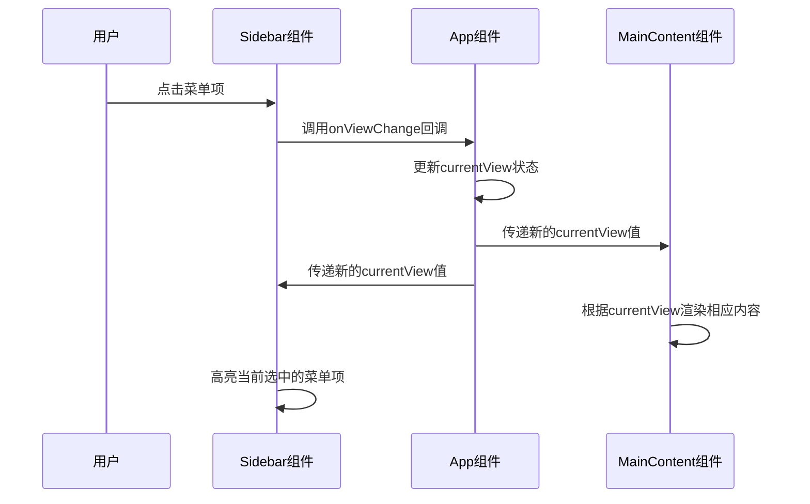
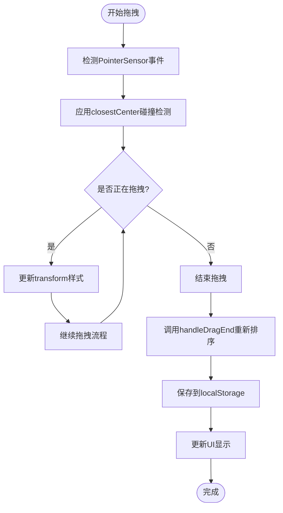

# 组件层次结构

<cite>
**本文档引用的文件**
- [App.jsx](file://src/App.jsx)
- [Sidebar.jsx](file://src/components/Sidebar.jsx)
- [MainContent.jsx](file://src/components/MainContent.jsx)
</cite>

## 目录
1. [介绍](#介绍)
2. [组件树图谱](#组件树图谱)
3. [根组件App分析](#根组件app分析)
4. [Sidebar与MainContent父子关系](#sidebar与maincontent父子关系)
5. [状态同步机制](#状态同步机制)
6. [可拖拽侧边栏实现](#可拖拽侧边栏实现)
7. [组件拆分原则与复用策略](#组件拆分原则与复用策略)
8. [性能优化建议](#性能优化建议)

## 介绍
本文档详细分析了以App.jsx为根组件的应用程序UI结构组织方式。重点阐述了Sidebar.jsx与MainContent.jsx之间的父子组件关系及状态同步机制，描述了通过props传递的导航状态和视图切换逻辑。文档提供了完整的组件树图谱，展示了从App到各功能模块的组件嵌套关系，并包含实际代码示例说明组件间的通信模式、事件回调传递以及数据流方向。

**Section sources**
- [App.jsx](file://src/App.jsx#L1-L425)

## 组件树图谱

```mermaid
graph TD
A[App] --> B[Sider]
A --> C[Layout]
B --> D[Sidebar]
C --> E[Content]
E --> F{currentView}
F --> |home| G[MainContent]
F --> |chat/ai-assistant| H[UnifiedAICenter]
F --> |assessment-center| I[AssessmentCenter]
F --> |message-center| J[MessageCenter]
F --> |calendar-center| K[CalendarCenter]
F --> |download-center| L[DownloadCenter]
F --> |docs-center| M[DocsCenter]
F --> |lesson-observation| N[LessonObservation]
F --> |meeting-center| O[MeetingCenter]
F --> |app-center| P[AppCenter]
F --> |learning-analytics| Q[LearningAnalytics]
F --> |homework-center| R[HomeworkCenter]
F --> |course-management| S[CourseManagement]
F --> |class-management| T[ClassManagement]
F --> |student-management| U[StudentManagement]
F --> |simulation-center| V[SimulationCenter]
F --> |resource-library| W[ResourceLibrary]
F --> |mental-health-coach| X[MentalHealthCoach]
F --> |my-progress| Y[MyProgress]
F --> |scenario-library| Z[ScenarioLibrary]
F --> |mental-health-coaching| AA[MentalHealthCoaching]
F --> |science-demo| AB[ScienceDemo]
F --> |my-evaluation| AC[MyEvaluation]
F --> |simulation-platform| AD[SimulationPlatform]
F --> |smart-notes| AE[SmartNotes]
F --> |note-edit-page| AF[NoteEditPage]
F --> |training-needs| AG[TrainingNeeds]
F --> |resource-annotation| AH[ResourceAnnotationPage]
F --> |student-annotation| AI[StudentAnnotationPage]
F --> |course-selection| AJ[CourseSelection]
F --> |need-edit-page| AK[NeedEditPage]
F --> |course-selection-edit-page| AL[CourseSelectionEditPage]
F --> |learning-square| AM[LearningSquare]
D --> AN[DndContext]
D --> AO[SortableContext]
D --> AP[menuItems]
AP --> AQ[SortableMenuItem]
AQ --> AR[SortableSubMenuItem]
```

**Diagram sources**
- [App.jsx](file://src/App.jsx#L258-L303)
- [Sidebar.jsx](file://src/components/Sidebar.jsx#L303-L730)

## 根组件App分析
App组件作为应用程序的根组件，负责组织和协调整个应用的UI结构。它使用Ant Design的Layout组件构建了基本的布局框架，包含头部、侧边栏和主要内容区域。App组件维护着两个关键的状态：`currentView`用于跟踪当前显示的视图，`pageState`用于管理页面级别的状态信息。

App组件通过`handleViewChange`函数处理视图切换逻辑，该函数不仅更新`currentView`状态，还会根据传入的数据更新`pageState`，并相应地修改URL哈希值以支持浏览器的前进后退功能。此外，App组件还监听URL哈希变化和来自iframe的postMessage事件，实现了多渠道的视图导航。

**Section sources**
- [App.jsx](file://src/App.jsx#L48-L423)

## Sidebar与MainContent父子关系
Sidebar组件和MainContent组件都作为App组件的子组件存在，形成了典型的父子组件关系。App组件通过props将必要的数据和回调函数传递给这两个子组件，实现了单向数据流的通信模式。

Sidebar组件接收`onViewChange`、`currentView`、`unreadMessageCount`、`downloadingCount`等props，用于处理用户交互和显示状态指示。MainContent组件同样接收`onViewChange`和`currentView` props，但其主要职责是根据`currentView`的值来决定渲染哪个功能组件或显示主页内容。

这种设计模式使得App组件成为状态的单一来源，而Sidebar和MainContent组件则专注于各自的UI展示和用户交互，符合关注点分离的设计原则。

**Section sources**
- [App.jsx](file://src/App.jsx#L258-L303)
- [Sidebar.jsx](file://src/components/Sidebar.jsx#L303-L730)
- [MainContent.jsx](file://src/components/MainContent.jsx#L57-L701)

## 状态同步机制
App组件通过props向下传递状态和回调函数，实现了组件间的状态同步。`currentView`状态在App组件中定义，并通过props传递给Sidebar和MainContent组件，确保它们能够根据相同的视图状态进行相应的UI更新。

当用户在Sidebar中点击菜单项时，会触发`handleItemClick`函数，该函数调用从App组件传递下来的`onViewChange`回调，从而更新App组件中的`currentView`状态。这个状态变化会触发React的重新渲染机制，导致MainContent组件根据新的`currentView`值渲染相应的内容。

此外，App组件还通过`pageState`管理更复杂的页面状态，如选中的笔记、培训需求等。这些状态可以通过`handleViewChange`函数在视图切换时进行更新，并在需要时传递给具体的功能组件。

**Diagram sources**
- [App.jsx](file://src/App.jsx#L48-L423)
- [Sidebar.jsx](file://src/components/Sidebar.jsx#L303-L730)
- [MainContent.jsx](file://src/components/MainContent.jsx#L57-L701)

## 可拖拽侧边栏实现
Sidebar组件实现了可拖拽的菜单项排序功能，使用了@dnd-kit/core库来处理拖拽逻辑。每个菜单项都被包装在`useSortable` Hook中，使其成为一个可排序的元素。`DndContext`和`SortableContext`组件提供了拖拽操作所需的上下文环境。

当用户开始拖拽一个菜单项时，`PointerSensor`会检测到指针事件并启动拖拽操作。`closestCenter`碰撞检测算法会确定被拖拽元素应该放置在哪个位置。当拖拽结束时，`handleDragEnd`函数会被调用，它会使用`arrayMove`工具函数重新排列菜单项的顺序，并将新的顺序保存到localStorage中，以实现持久化。

对于分组菜单的子菜单项，也实现了类似的拖拽排序功能。每个子菜单项的ID都包含了父菜单的ID前缀（`${parentId}-${child.id}`），这确保了不同分组的子菜单项可以独立排序而不互相干扰。

**Diagram sources**
- [Sidebar.jsx](file://src/components/Sidebar.jsx#L303-L730)

## 组件拆分原则与复用策略
本应用遵循了清晰的组件拆分原则，将UI分解为多个可复用的小组件。例如，`SortableMenuItem`和`SortableSubMenuItem`组件封装了可排序菜单项的通用逻辑，可以在不同的上下文中复用。

App组件采用了容器组件的模式，主要负责状态管理和数据流控制，而具体的UI展示则委托给专门的功能组件。这种分离使得组件更加专注和可测试。同时，通过将动态应用菜单项存储在localStorage中，实现了菜单配置的持久化和跨会话复用。

对于具有相似功能的组件，如各种"中心"组件（消息中心、下载中心等），采用了统一的命名规范和props接口设计，便于开发人员理解和维护。这种一致性也降低了新功能开发的认知负担。

**Section sources**
- [App.jsx](file://src/App.jsx#L48-L423)
- [Sidebar.jsx](file://src/components/Sidebar.jsx#L303-L730)

## 性能优化建议
为了提高应用性能，建议实施以下优化措施：

1. **懒加载**：对于不常用的大型功能组件，可以使用React的`lazy`和`Suspense`特性实现按需加载，减少初始包大小。
2. **记忆化**：使用`React.memo`对不会频繁变化的组件进行记忆化，避免不必要的重新渲染。
3. **虚拟滚动**：如果菜单项数量较多，可以考虑使用虚拟滚动技术，只渲染可见区域的菜单项。
4. **防抖**：对于频繁触发的状态更新操作，可以添加适当的防抖机制，减少状态更新频率。
5. **代码分割**：根据功能模块进行代码分割，利用Webpack的代码分割功能，实现更细粒度的资源加载控制。

这些优化措施可以在不影响用户体验的前提下，显著提升应用的加载速度和运行效率。

**Section sources**
- [App.jsx](file://src/App.jsx#L48-L423)
- [Sidebar.jsx](file://src/components/Sidebar.jsx#L303-L730)
- [MainContent.jsx](file://src/components/MainContent.jsx#L57-L701)