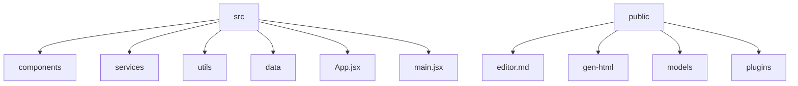
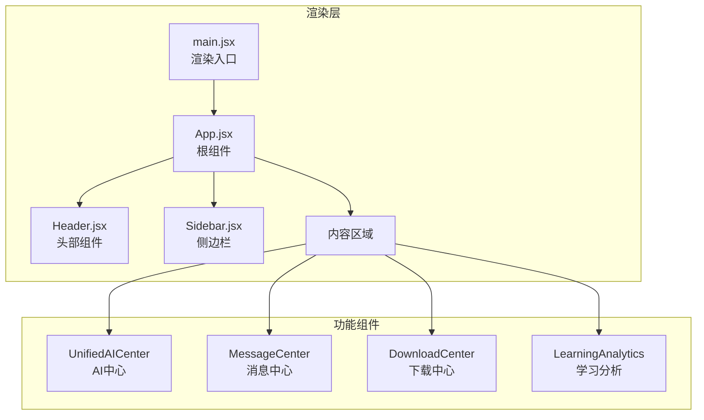
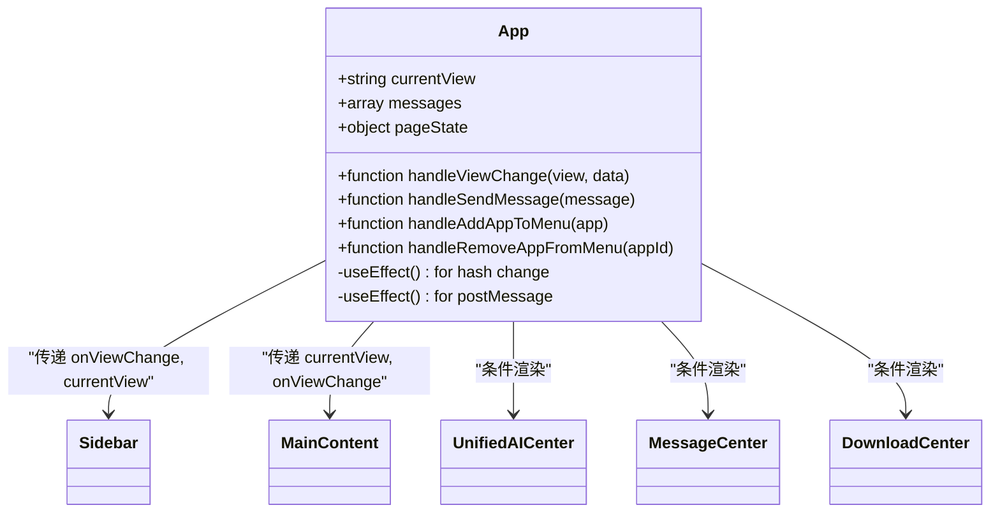
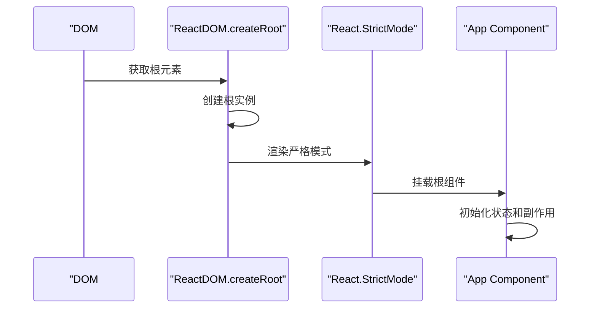
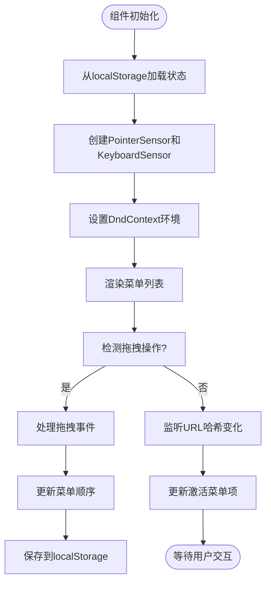
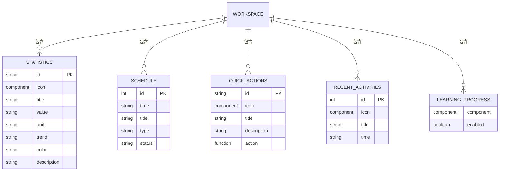
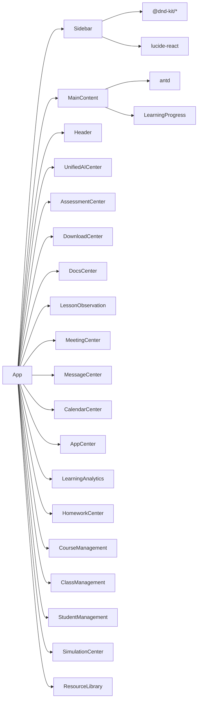

# 组件架构

<cite>
**本文档中引用的文件**
- [App.jsx](file://src/App.jsx)
- [main.jsx](file://src/main.jsx)
- [Sidebar.jsx](file://src/components/Sidebar.jsx)
- [MainContent.jsx](file://src/components/MainContent.jsx)
</cite>

## 目录
1. [简介](#简介)
2. [项目结构](#项目结构)
3. [核心组件](#核心组件)
4. [架构概述](#架构概述)
5. [详细组件分析](#详细组件分析)
6. [依赖分析](#依赖分析)
7. [性能考虑](#性能考虑)
8. [故障排除指南](#故障排除指南)
9. [结论](#结论)

## 简介
本文档深入分析基于React的组件化设计模式，重点阐述应用的整体架构和关键组件之间的交互机制。文档详细解释了App.jsx作为根组件如何通过URL哈希实现路由管理和视图调度，描述main.jsx中的渲染入口和依赖注入机制。同时，文档分析了Sidebar.jsx的可拖拽导航实现原理及其与主内容区域的状态同步机制，并探讨了MainContent.jsx的工作台布局设计和模块集成方式。通过组件层次结构图展示父组件与子组件之间的props传递关系和事件回调机制，阐述函数式组件的设计原则、Hooks使用规范以及状态提升的最佳实践。

## 项目结构
该项目采用典型的React应用结构，以`src`目录为核心开发区域，包含组件、服务、工具和数据管理模块。`public`目录存放静态资源，如编辑器库、插件和演示文件。整体结构清晰地分离了UI组件（components）、业务逻辑（services）、工具函数（utils）和静态数据（data），体现了良好的关注点分离原则。

**图表来源**
- [App.jsx](file://src/App.jsx)
- [main.jsx](file://src/main.jsx)

**章节来源**
- [App.jsx](file://src/App.jsx#L0-L425)
- [main.jsx](file://src/main.jsx#L0-L9)

## 核心组件
本节分析系统中最关键的四个组件：App.jsx、main.jsx、Sidebar.jsx和MainContent.jsx。这些组件构成了应用的核心骨架，负责路由管理、状态同步、用户界面呈现和全局控制流。App.jsx作为根组件协调所有子组件的通信和状态更新，main.jsx是应用的唯一渲染入口，Sidebar.jsx提供可定制的导航功能，而MainContent.jsx则作为默认视图展示工作台内容。

**章节来源**
- [App.jsx](file://src/App.jsx#L0-L425)
- [main.jsx](file://src/main.jsx#L0-L9)
- [Sidebar.jsx](file://src/components/Sidebar.jsx#L0-L730)
- [MainContent.jsx](file://src/components/MainContent.jsx#L0-L701)

## 架构概述
该应用采用现代化的React函数式组件架构，结合Ant Design UI库构建响应式界面。系统通过URL哈希进行客户端路由管理，避免了对React Router等第三方路由库的依赖。状态管理主要通过useState和useEffect Hooks在组件层级间传递，实现了轻量级的状态控制。整个架构呈现出清晰的单向数据流模式，从根组件App向下传递props，子组件通过回调函数向上通信。

**图表来源**
- [App.jsx](file://src/App.jsx#L0-L425)
- [main.jsx](file://src/main.jsx#L0-L9)

## 详细组件分析
本节深入分析各个关键组件的实现细节、设计模式和交互机制。通过代码级别的剖析，揭示组件内部的工作原理、状态管理策略和与其他组件的协作方式。每个组件的分析都包括其职责、Props接口、内部状态、副作用处理和最佳实践应用。

### App.jsx 分析
App.jsx作为应用的根组件，承担着全局状态管理、路由控制和组件协调的核心职责。它通过监听URL哈希变化来实现视图切换，利用条件渲染决定当前显示的功能组件。组件内部维护了多个状态变量，包括当前视图、消息列表和页面状态，这些状态通过props向下传递给子组件。

#### 函数式组件设计

**图表来源**
- [App.jsx](file://src/App.jsx#L0-L425)

**章节来源**
- [App.jsx](file://src/App.jsx#L0-L425)

### main.jsx 分析
main.jsx是应用的唯一渲染入口，负责将React应用挂载到DOM树中。它采用了最新的React 18并发渲染模式，通过createRoot API创建根实例，并使用StrictMode进行开发时的额外检查。这个极简的入口文件体现了关注点分离的设计原则，将应用初始化与业务逻辑完全解耦。

#### 渲染入口机制

**图表来源**
- [main.jsx](file://src/main.jsx#L0-L9)

**章节来源**
- [main.jsx](file://src/main.jsx#L0-L9)

### Sidebar.jsx 分析
Sidebar.jsx实现了高度可定制的侧边栏导航功能，支持菜单项的动态添加、移除和重新排序。组件利用dnd-kit库实现了完整的拖拽功能，允许用户通过鼠标或键盘操作重新排列菜单项。状态持久化通过localStorage实现，确保用户自定义的布局在页面刷新后仍然保留。

#### 可拖拽导航实现

**图表来源**
- [Sidebar.jsx](file://src/components/Sidebar.jsx#L0-L730)

**章节来源**
- [Sidebar.jsx](file://src/components/Sidebar.jsx#L0-L730)

### MainContent.jsx 分析
MainContent.jsx作为默认视图组件，展示了丰富的工作台布局和模块化设计。组件提供了个性化的设置面板，允许用户根据需求显示或隐藏不同的功能模块。通过条件渲染和状态管理，实现了统计数据卡片、今日日程、快捷操作、最近活动和学习进度监控等多个功能模块的灵活组合。

#### 工作台布局设计

**图表来源**
- [MainContent.jsx](file://src/components/MainContent.jsx#L0-L701)

**章节来源**
- [MainContent.jsx](file://src/components/MainContent.jsx#L0-L701)

## 依赖分析
本应用的依赖关系呈现出清晰的层级结构，从根组件到叶组件形成单向数据流。App组件作为依赖图的中心节点，直接或间接依赖于几乎所有其他组件。通过import语句分析，可以发现组件间的依赖主要集中在UI框架（Ant Design）、图标库（lucide-react）和拖拽库（@dnd-kit）上。

**图表来源**
- [App.jsx](file://src/App.jsx#L0-L425)
- [Sidebar.jsx](file://src/components/Sidebar.jsx#L0-L730)
- [MainContent.jsx](file://src/components/MainContent.jsx#L0-L701)

**章节来源**
- [App.jsx](file://src/App.jsx#L0-L425)
- [Sidebar.jsx](file://src/components/Sidebar.jsx#L0-L730)
- [MainContent.jsx](file://src/components/MainContent.jsx#L0-L701)

## 性能考虑
尽管当前实现功能完整，但仍有一些潜在的性能优化空间。首先，App.jsx中的大型条件渲染块可能导致不必要的重渲染，建议使用React.memo或拆分为独立的路由组件。其次，Sidebar.jsx的拖拽功能在菜单项较多时可能影响性能，可以考虑虚拟滚动优化。最后，频繁的localStorage读写操作可以批量处理或使用防抖技术减少I/O开销。

## 故障排除指南
当遇到组件状态不同步问题时，首先检查props传递链是否完整，确保回调函数正确地从子组件冒泡到父组件。对于拖拽功能失效的情况，验证dnd-kit的sensors是否正确配置，检查浏览器兼容性问题。如果localStorage数据异常，尝试清除相关键值后重新初始化。对于条件渲染不生效的问题，确认URL哈希监听器是否正常工作，检查组件的key属性是否导致意外的重新挂载。

**章节来源**
- [App.jsx](file://src/App.jsx#L0-L425)
- [Sidebar.jsx](file://src/components/Sidebar.jsx#L0-L730)
- [MainContent.jsx](file://src/components/MainContent.jsx#L0-L701)

## 结论
本系统采用现代化的React函数式组件架构，通过精心设计的组件层次结构和清晰的数据流实现了复杂的企业级应用功能。App.jsx作为中央协调者，有效地管理了全局状态和路由；main.jsx保持了极简的入口设计；Sidebar.jsx展示了高级的交互功能和状态持久化；MainContent.jsx体现了模块化和可配置的UI设计理念。整体架构遵循了React最佳实践，具有良好的可维护性和扩展性，为未来的功能迭代奠定了坚实的基础。