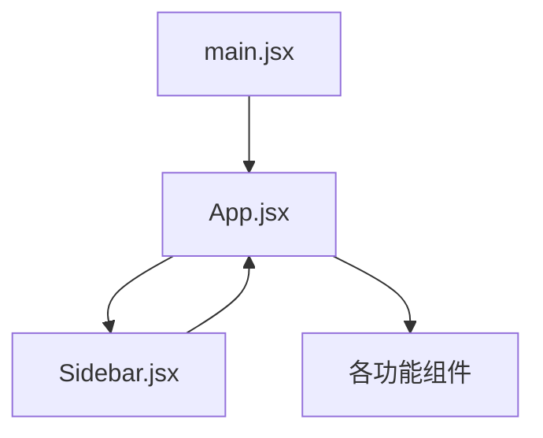
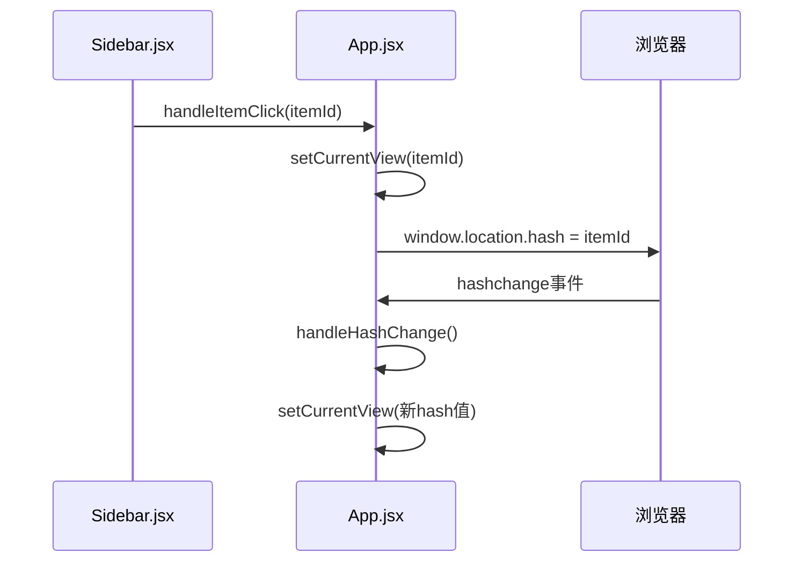
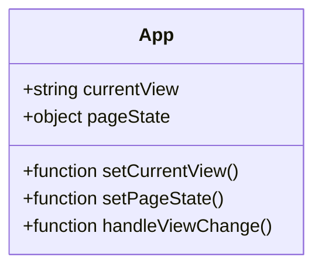
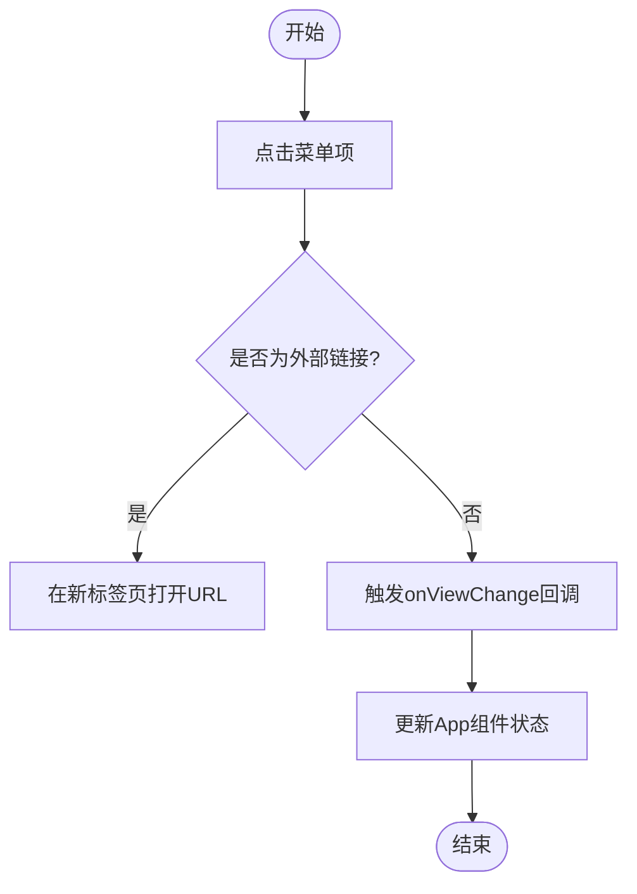
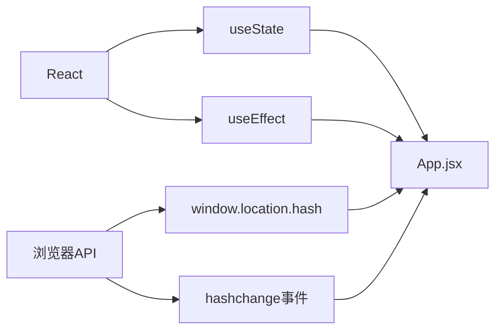

# 路由系统

<cite>
**本文档引用的文件**
- [App.jsx](file://src/App.jsx)
- [main.jsx](file://src/main.jsx)
- [Sidebar.jsx](file://src/components/Sidebar.jsx)
</cite>

## 目录
1. [简介](#简介)
2. [项目结构](#项目结构)
3. [核心组件](#核心组件)
4. [架构概述](#架构概述)
5. [详细组件分析](#详细组件分析)
6. [依赖分析](#依赖分析)
7. [性能考虑](#性能考虑)
8. [故障排除指南](#故障排除指南)
9. [结论](#结论)

## 简介
本文档全面阐述了基于React Router的路由系统，重点介绍系统的配置和导航机制。文档详细解析了App.jsx中路由定义的结构设计，说明main.jsx如何初始化路由上下文并注入应用。同时，文档深入分析了Sidebar.jsx点击事件与路由跳转的关联逻辑，并展示了动态路由参数的处理方式。通过提供完整的路由映射表，列出所有可用路由路径及其对应的组件，帮助开发者快速理解系统架构。此外，文档还包含编程式导航、路由守卫和懒加载实现的代码示例，并讨论了路由性能优化和错误处理策略。

## 项目结构
本项目的路由系统主要由三个核心文件构成：App.jsx负责路由定义和视图切换，main.jsx作为应用入口点初始化路由上下文，Sidebar.jsx则提供用户界面的导航功能。这种分层架构确保了路由逻辑的清晰分离和可维护性。

**Diagram sources**
- [main.jsx](file://src/main.jsx#L0-L9)
- [App.jsx](file://src/App.jsx#L0-L425)
- [Sidebar.jsx](file://src/components/Sidebar.jsx#L0-L730)

**Section sources**
- [main.jsx](file://src/main.jsx#L0-L9)
- [App.jsx](file://src/App.jsx#L0-L425)
- [Sidebar.jsx](file://src/components/Sidebar.jsx#L0-L730)

## 核心组件
路由系统的核心组件包括状态管理、URL哈希监听和视图切换机制。App.jsx中的currentView状态变量作为路由系统的核心，控制着当前显示的视图。通过useEffect钩子函数监听URL哈希变化，实现了浏览器历史记录与应用状态的同步。当用户点击侧边栏菜单项时，handleViewChange函数被调用，更新currentView状态并相应地改变URL哈希值。

**Section sources**
- [App.jsx](file://src/App.jsx#L48-L96)
- [Sidebar.jsx](file://src/components/Sidebar.jsx#L48-L730)

## 架构概述
整个路由系统的架构采用中心化状态管理模式，由App.jsx统一管理应用的当前视图状态。main.jsx作为应用的入口点，通过ReactDOM.createRoot将App组件渲染到DOM中，从而启动整个应用。Sidebar.jsx作为导航组件，通过onViewChange回调函数与App.jsx通信，实现用户交互到状态更新的完整闭环。

**Diagram sources**
- [main.jsx](file://src/main.jsx#L0-L9)
- [App.jsx](file://src/App.jsx#L48-L96)
- [Sidebar.jsx](file://src/components/Sidebar.jsx#L48-L730)

## 详细组件分析
### App.jsx分析
App.jsx是路由系统的核心，它使用useState钩子创建currentView状态变量来跟踪当前活动的视图。通过useEffect钩子，组件在挂载时检查初始URL哈希，并设置相应的视图状态。同时，组件监听hashchange事件，确保浏览器前进/后退按钮的操作能够正确更新应用状态。

#### 状态管理

**Diagram sources**
- [App.jsx](file://src/App.jsx#L48-L96)

### Sidebar.jsx分析
Sidebar.jsx组件提供了用户友好的导航界面，允许用户通过点击菜单项来切换视图。组件支持菜单项的拖拽排序和折叠展开功能，提升了用户体验。每个菜单项的点击事件都会触发handleItemClick函数，该函数通过onViewChange回调通知父组件进行视图切换。

#### 导航逻辑

**Diagram sources**
- [Sidebar.jsx](file://src/components/Sidebar.jsx#L48-L730)

**Section sources**
- [Sidebar.jsx](file://src/components/Sidebar.jsx#L48-L730)

## 依赖分析
路由系统依赖于React的useState和useEffect钩子来管理状态和副作用。同时，系统利用浏览器的原生window.location.hash和hashchange API来实现URL与应用状态的同步。这种设计避免了对第三方路由库的直接依赖，简化了项目依赖关系。

**Diagram sources**
- [App.jsx](file://src/App.jsx#L48-L96)

**Section sources**
- [App.jsx](file://src/App.jsx#L48-L96)

## 性能考虑
路由系统的设计充分考虑了性能因素。通过使用React的条件渲染，只有当前视图对应的组件才会被渲染，减少了不必要的DOM操作。此外，系统利用localStorage持久化存储侧边栏的折叠状态和菜单排序，避免了每次页面加载时的重复计算。

## 故障排除指南
当遇到路由相关问题时，首先检查URL哈希是否正确更新。如果哈希正确但视图未切换，应检查App.jsx中的handleHashChange函数是否正常执行。对于侧边栏点击无响应的情况，需要验证onViewChange回调函数是否正确传递给Sidebar组件。

**Section sources**
- [App.jsx](file://src/App.jsx#L48-L96)
- [Sidebar.jsx](file://src/components/Sidebar.jsx#L48-L730)

## 结论
本路由系统采用简洁而高效的设计，通过URL哈希实现客户端路由，避免了页面刷新带来的用户体验中断。系统具有良好的可扩展性，易于添加新的视图和功能组件。未来可以考虑引入React Router等成熟的路由库，以支持更复杂的路由需求，如嵌套路由、路由参数和路由守卫等功能。