# AI智能中心

<cite>
**本文档引用文件**
- [UnifiedAICenter.jsx](file://src/components/UnifiedAICenter.jsx)
- [DialogueEngine.jsx](file://src/components/DialogueEngine.jsx)
- [ChatInterface.jsx](file://src/components/ChatInterface.jsx)
- [AIAssistantCenter.jsx](file://src/components/AIAssistantCenter.jsx)
</cite>

## 目录
1. [简介](#简介)
2. [项目结构](#项目结构)
3. [核心组件](#核心组件)
4. [架构概述](#架构概述)
5. [详细组件分析](#详细组件分析)
6. [依赖分析](#依赖分析)
7. [性能考虑](#性能考虑)
8. [故障排除指南](#故障排除指南)
9. [结论](#结论)

## 简介
AI智能中心是一个集成了多种AI功能的综合性平台，旨在为用户提供智能化的教学辅助服务。该系统以统一AI中心(UnifiedAICenter)为核心架构，通过对话引擎(DialogueEngine)实现自然语言交互，并与教学场景深度集成。本系统不仅支持常规的问答交互，还具备课程设计、学情分析、资源推荐等专业教育功能，为教师和学生提供全方位的智能支持。

## 项目结构
AI智能中心的项目结构清晰地划分为多个功能模块，主要包含在`src/components`目录下。系统采用React框架构建，通过组件化的方式实现了功能分离和复用。

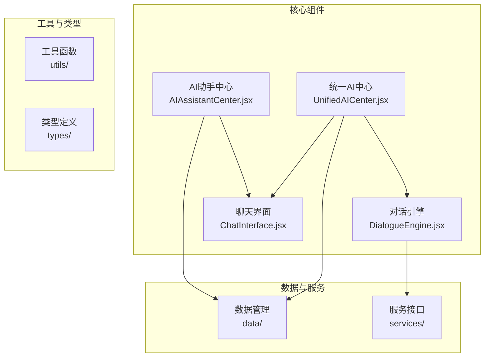

**Diagram sources**
- [UnifiedAICenter.jsx](file://src/components/UnifiedAICenter.jsx)
- [DialogueEngine.jsx](file://src/components/DialogueEngine.jsx)
- [ChatInterface.jsx](file://src/components/ChatInterface.jsx)
- [AIAssistantCenter.jsx](file://src/components/AIAssistantCenter.jsx)

**Section sources**
- [UnifiedAICenter.jsx](file://src/components/UnifiedAICenter.jsx)
- [DialogueEngine.jsx](file://src/components/DialogueEngine.jsx)
- [ChatInterface.jsx](file://src/components/ChatInterface.jsx)
- [AIAssistantCenter.jsx](file://src/components/AIAssistantCenter.jsx)

## 核心组件
AI智能中心的核心组件包括统一AI中心、对话引擎、聊天界面和AI助手中心。这些组件共同构成了系统的主体功能框架。

统一AI中心(UnifiedAICenter)作为系统的主入口，集成了多种AI工具和服务，为用户提供一站式智能服务体验。该组件通过状态管理维护对话历史、用户输入和系统状态，实现了多轮对话的上下文保持。

对话引擎(DialogueEngine)专注于特定场景下的交互式对话，特别适用于教学辅导和心理咨询服务。它通过预设的对话流程和评分机制，为用户提供结构化的互动体验。

聊天界面(ChatInterface)是用户与AI进行自然语言交互的主要通道，提供了消息显示、输入框和模板选择等功能，优化了用户体验。

AI助手中心(AIAssistantCenter)则针对教育场景进行了专门设计，集成了教案生成、学情分析和资源推荐等教育专用功能。

**Section sources**
- [UnifiedAICenter.jsx](file://src/components/UnifiedAICenter.jsx#L0-L100)
- [DialogueEngine.jsx](file://src/components/DialogueEngine.jsx#L0-L50)
- [ChatInterface.jsx](file://src/components/ChatInterface.jsx#L0-L50)
- [AIAssistantCenter.jsx](file://src/components/AIAssistantCenter.jsx#L0-L50)

## 架构概述
AI智能中心采用分层架构设计，将用户界面、业务逻辑和数据管理分离，提高了系统的可维护性和扩展性。

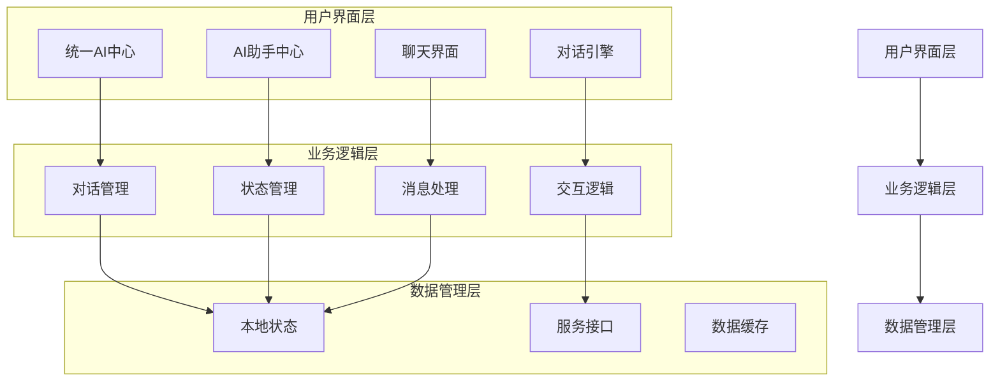

**Diagram sources**
- [UnifiedAICenter.jsx](file://src/components/UnifiedAICenter.jsx)
- [DialogueEngine.jsx](file://src/components/DialogueEngine.jsx)
- [ChatInterface.jsx](file://src/components/ChatInterface.jsx)
- [AIAssistantCenter.jsx](file://src/components/AIAssistantCenter.jsx)

## 详细组件分析

### 统一AI中心分析
统一AI中心作为系统的核心组件，负责整合各种AI功能并提供统一的用户界面。

#### 状态管理
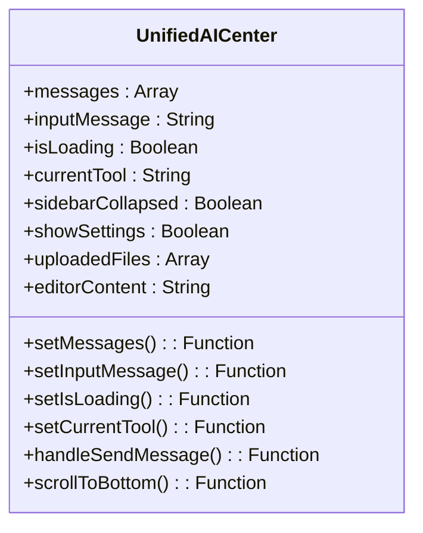

**Diagram sources**
- [UnifiedAICenter.jsx](file://src/components/UnifiedAICenter.jsx#L90-L110)

#### 消息处理流程
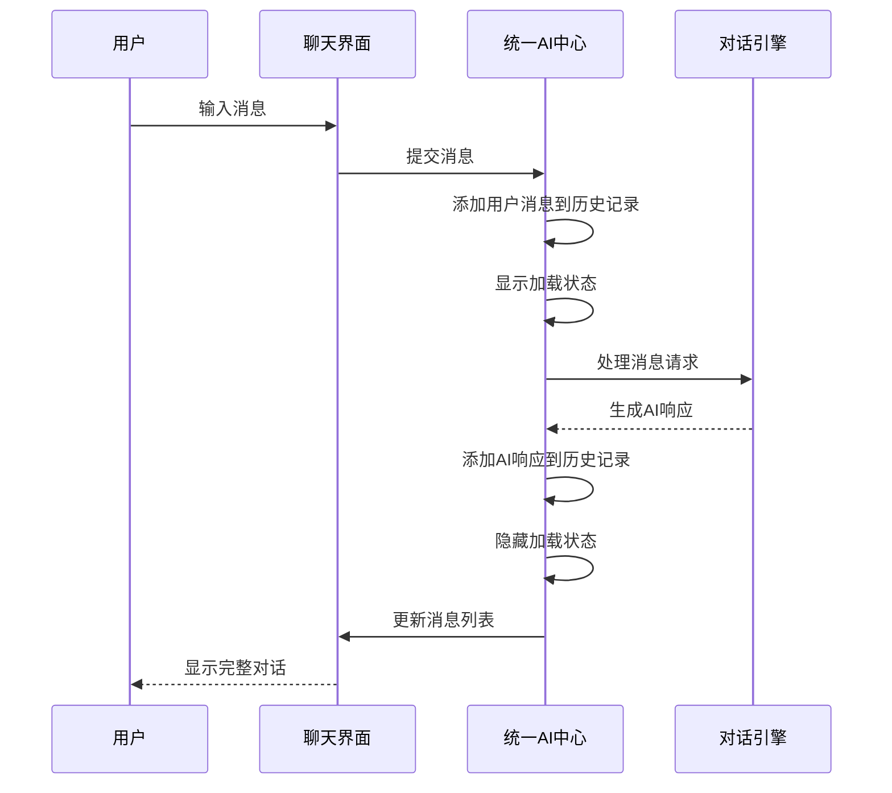

**Diagram sources**
- [UnifiedAICenter.jsx](file://src/components/UnifiedAICenter.jsx#L1755-L1781)
- [DialogueEngine.jsx](file://src/components/DialogueEngine.jsx)

**Section sources**
- [UnifiedAICenter.jsx](file://src/components/UnifiedAICenter.jsx)
- [DialogueEngine.jsx](file://src/components/DialogueEngine.jsx)

### 对话引擎分析
对话引擎是AI智能中心的关键组件之一，专门用于处理结构化的多轮对话场景。

#### 对话流程设计
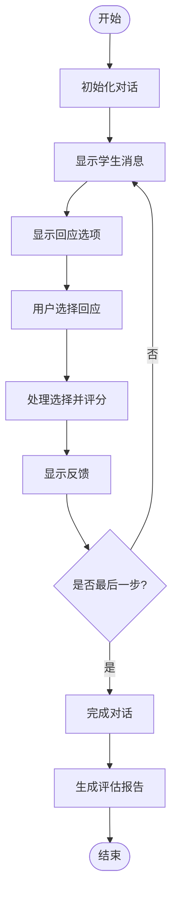

**Diagram sources**
- [DialogueEngine.jsx](file://src/components/DialogueEngine.jsx#L222-L278)

#### 状态转换机制
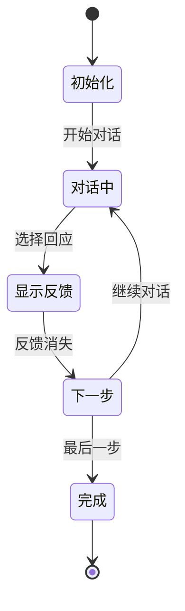

**Diagram sources**
- [DialogueEngine.jsx](file://src/components/DialogueEngine.jsx)

**Section sources**
- [DialogueEngine.jsx](file://src/components/DialogueEngine.jsx)

### 聊天界面分析
聊天界面组件提供了用户与AI交互的可视化界面，是用户体验的关键部分。

#### 用户交互流程
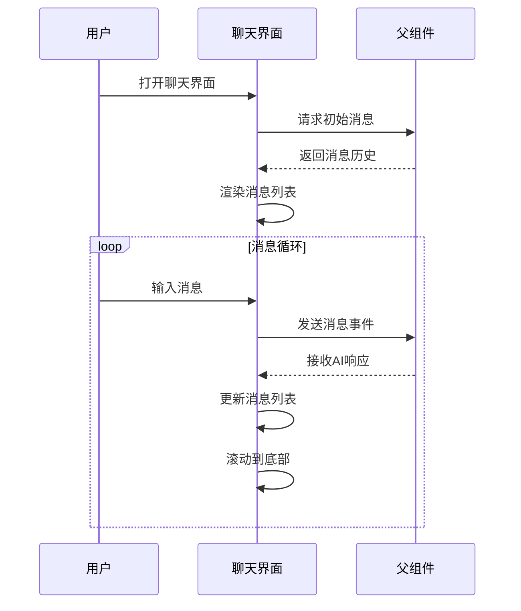

**Diagram sources**
- [ChatInterface.jsx](file://src/components/ChatInterface.jsx)

#### 界面状态管理
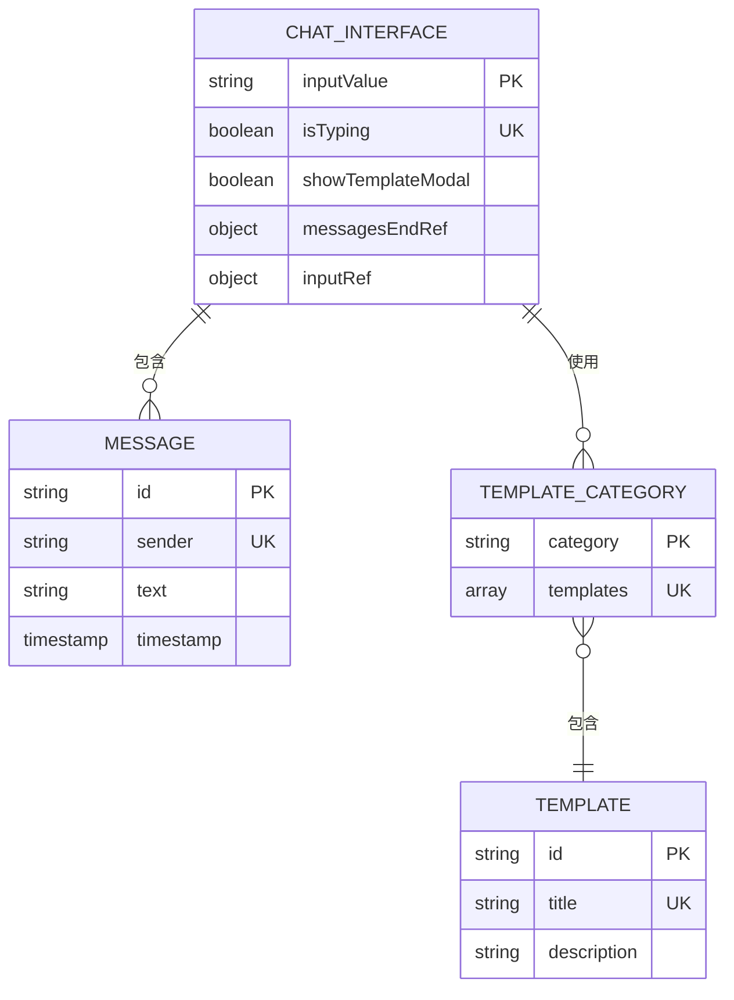

**Diagram sources**
- [ChatInterface.jsx](file://src/components/ChatInterface.jsx)

**Section sources**
- [ChatInterface.jsx](file://src/components/ChatInterface.jsx)

### AI助手中心分析
AI助手中心针对教育场景进行了专门优化，提供了多种教学辅助功能。

#### 功能模块集成
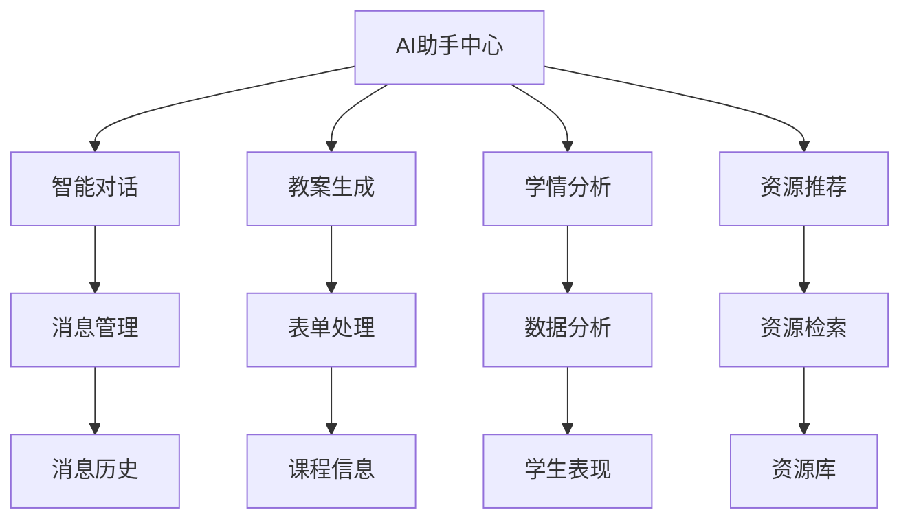

**Diagram sources**
- [AIAssistantCenter.jsx](file://src/components/AIAssistantCenter.jsx)

#### 教案生成流程
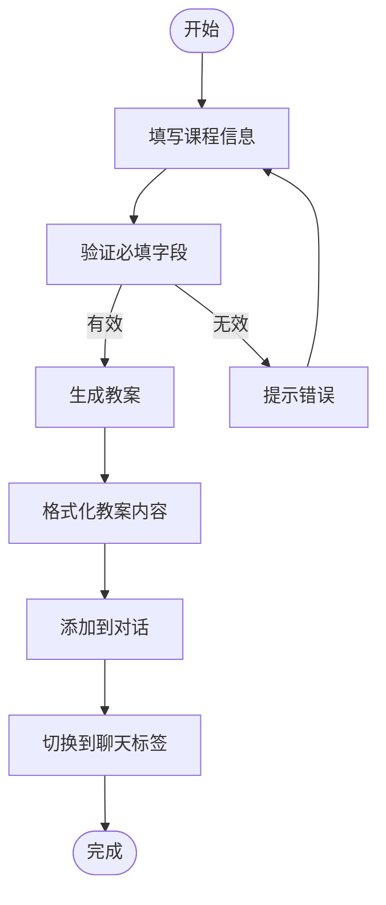

**Diagram sources**
- [AIAssistantCenter.jsx](file://src/components/AIAssistantCenter.jsx#L119-L151)

**Section sources**
- [AIAssistantCenter.jsx](file://src/components/AIAssistantCenter.jsx)

## 依赖分析
AI智能中心的各个组件之间存在明确的依赖关系，形成了一个有机的整体。

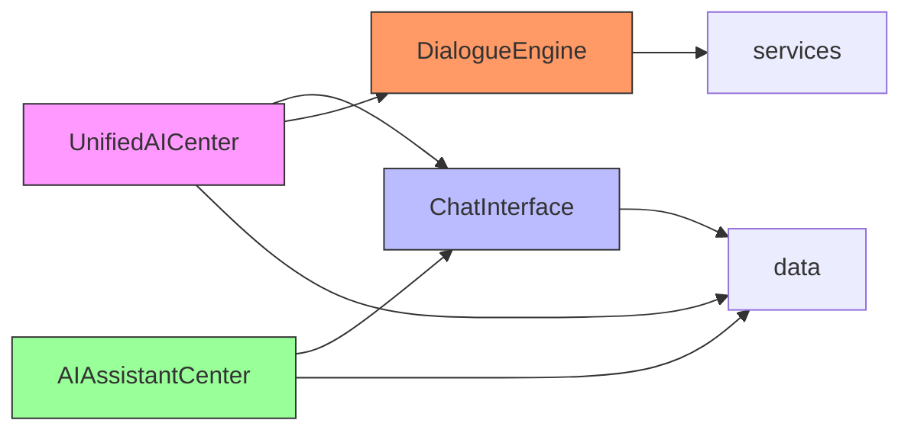

**Diagram sources**
- [UnifiedAICenter.jsx](file://src/components/UnifiedAICenter.jsx)
- [DialogueEngine.jsx](file://src/components/DialogueEngine.jsx)
- [ChatInterface.jsx](file://src/components/ChatInterface.jsx)
- [AIAssistantCenter.jsx](file://src/components/AIAssistantCenter.jsx)

**Section sources**
- [UnifiedAICenter.jsx](file://src/components/UnifiedAICenter.jsx)
- [DialogueEngine.jsx](file://src/components/DialogueEngine.jsx)
- [ChatInterface.jsx](file://src/components/ChatInterface.jsx)
- [AIAssistantCenter.jsx](file://src/components/AIAssistantCenter.jsx)

## 性能考虑
AI智能中心在设计时充分考虑了性能因素，采用了多种优化策略来确保流畅的用户体验。

1. **消息滚动优化**: 通过`useRef`和`scrollIntoView`实现平滑滚动到底部，避免了频繁的DOM操作。
2. **状态更新批处理**: 利用React的状态合并机制，减少不必要的重新渲染。
3. **条件渲染**: 只有在必要时才渲染复杂的UI元素，如模板模态框。
4. **虚拟滚动**: 在消息列表较长时，可以考虑实现虚拟滚动以提高性能。
5. **防抖处理**: 对于频繁触发的操作（如输入），可以添加防抖机制。

这些优化措施确保了即使在处理大量对话消息时，系统也能保持良好的响应速度。

## 故障排除指南
当遇到AI智能中心相关问题时，可以参考以下排查步骤：

1. **检查网络连接**: 确保客户端能够正常访问服务器。
2. **验证组件状态**: 检查相关组件的状态变量是否正确初始化。
3. **查看控制台日志**: 检查是否有JavaScript错误或警告信息。
4. **确认数据流**: 验证消息从输入到显示的完整流程是否畅通。
5. **测试基础功能**: 先测试简单的文本交互，再逐步测试复杂功能。

对于开发者，建议使用React DevTools来监控组件状态和性能。

**Section sources**
- [UnifiedAICenter.jsx](file://src/components/UnifiedAICenter.jsx)
- [DialogueEngine.jsx](file://src/components/DialogueEngine.jsx)
- [ChatInterface.jsx](file://src/components/ChatInterface.jsx)
- [AIAssistantCenter.jsx](file://src/components/AIAssistantCenter.jsx)

## 结论
AI智能中心通过统一AI中心、对话引擎、聊天界面和AI助手中心等核心组件的协同工作，构建了一个功能强大且易于使用的智能教学辅助系统。该系统不仅实现了基本的自然语言交互，还针对教育场景提供了专业的功能支持。通过合理的架构设计和状态管理，系统能够有效地处理复杂的多轮对话，保持上下文一致性，并与教学活动深度融合。未来可以进一步扩展更多教育相关的AI功能，提升系统的智能化水平和实用性。