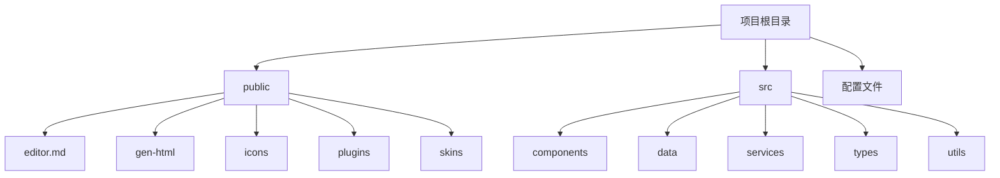
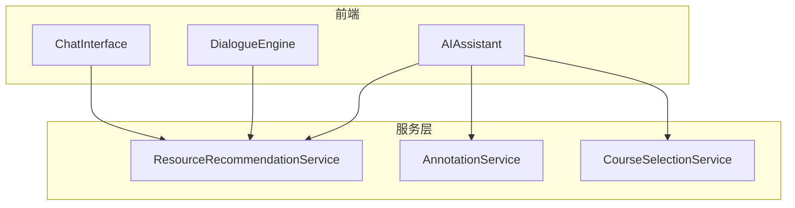
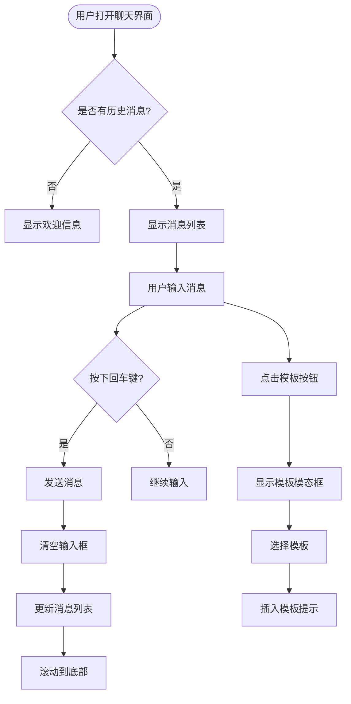
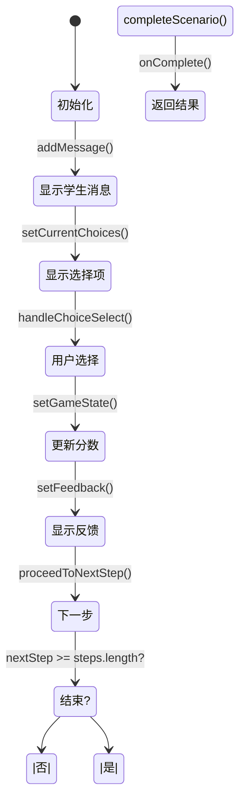
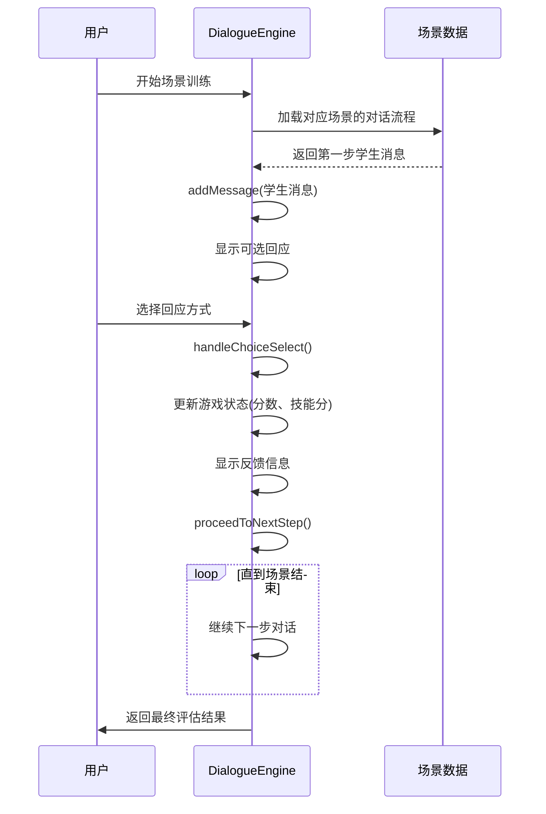
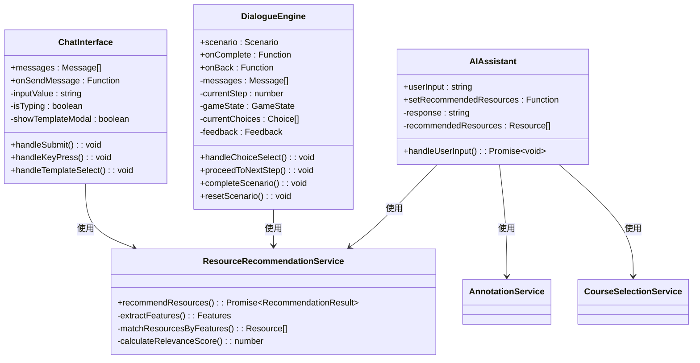

# 对话引擎与交互

<cite>
**本文档引用的文件**
- [ChatInterface.jsx](file://src/components/ChatInterface.jsx)
- [DialogueEngine.jsx](file://src/components/DialogueEngine.jsx)
- [AIAssistant.jsx](file://src/components/AIAssistant.jsx)
- [resourceRecommendationService.js](file://src/services/resourceRecommendationService.js)
</cite>

## 目录
1. [简介](#简介)
2. [项目结构](#项目结构)
3. [核心组件](#核心组件)
4. [架构概述](#架构概述)
5. [详细组件分析](#详细组件分析)
6. [依赖分析](#依赖分析)
7. [性能考虑](#性能考虑)
8. [故障排除指南](#故障排除指南)
9. [结论](#结论)

## 简介
本技术文档深入解析了对话系统中的两个核心组件：ChatInterface（聊天界面）和DialogueEngine（对话引擎）。文档全面阐述了UI交互设计、业务逻辑处理、消息收发流程、自然语言处理管道、上下文管理机制以及多轮对话状态保持策略。通过实际代码片段展示了消息格式定义、响应生成算法和异常处理流程，并解释了如何实现安全的实时通信。

## 项目结构
该项目采用React框架构建，主要分为三个目录：public（静态资源）、src（源代码）和根目录配置文件。源代码组织清晰，components目录包含所有UI组件，services目录提供业务服务，utils目录存放工具函数。

**图示来源**
- [project_structure](file://project_structure)

## 核心组件
系统的核心由ChatInterface和DialogueEngine两个组件构成。ChatInterface负责用户界面的展示和用户输入的收集，而DialogueEngine则专注于复杂对话场景的管理和评估。

**组件来源**
- [ChatInterface.jsx](file://src/components/ChatInterface.jsx#L0-L255)
- [DialogueEngine.jsx](file://src/components/DialogueEngine.jsx#L0-L437)

## 架构概述
整个对话系统采用分层架构设计，前端组件与后端服务分离，通过清晰的接口进行通信。

**图示来源**
- [ChatInterface.jsx](file://src/components/ChatInterface.jsx#L0-L255)
- [DialogueEngine.jsx](file://src/components/DialogueEngine.jsx#L0-L437)
- [resourceRecommendationService.js](file://src/services/resourceRecommendationService.js#L89-L159)

## 详细组件分析

### ChatInterface分析
ChatInterface组件实现了完整的聊天界面功能，包括消息显示、输入框、模板选择等。

#### UI交互设计

**图示来源**
- [ChatInterface.jsx](file://src/components/ChatInterface.jsx#L0-L255)

**组件来源**
- [ChatInterface.jsx](file://src/components/ChatInterface.jsx#L0-L255)

### DialogueEngine分析
DialogueEngine组件是一个复杂的对话管理系统，用于模拟心理咨询场景的训练。

#### 业务逻辑处理

**图示来源**
- [DialogueEngine.jsx](file://src/components/DialogueEngine.jsx#L0-L437)

#### 消息处理流程

**图示来源**
- [DialogueEngine.jsx](file://src/components/DialogueEngine.jsx#L170-L278)

**组件来源**
- [DialogueEngine.jsx](file://src/components/DialogueEngine.jsx#L0-L437)

## 依赖分析
系统各组件之间存在明确的依赖关系，确保了功能的模块化和可维护性。

**图示来源**
- [ChatInterface.jsx](file://src/components/ChatInterface.jsx#L0-L255)
- [DialogueEngine.jsx](file://src/components/DialogueEngine.jsx#L0-L437)
- [AIAssistant.jsx](file://src/components/AIAssistant.jsx#L329-L354)
- [resourceRecommendationService.js](file://src/services/resourceRecommendationService.js#L89-L159)

## 性能考虑
在设计对话系统时，考虑了多个性能优化点：

1. **虚拟滚动**：对于长消息列表，应实现虚拟滚动以提高渲染性能
2. **防抖处理**：用户输入时使用防抖技术减少不必要的状态更新
3. **资源预加载**：提前加载常用的对话模板和推荐资源
4. **异步处理**：复杂的计算任务放在Web Worker中执行，避免阻塞主线程
5. **缓存机制**：对频繁访问的数据进行本地缓存，减少重复计算

这些优化措施确保了即使在处理大量对话数据时，系统仍能保持流畅的用户体验。

## 故障排除指南
当遇到常见问题时，可以参考以下解决方案：

1. **消息不显示**：检查messages数组是否正确传递给ChatInterface组件
2. **输入框无法输入**：确认inputValue状态变量是否正确绑定
3. **模板模态框不出现**：检查showTemplateModal状态和对应的事件处理器
4. **对话流程中断**：验证dialogueFlow配置对象中的nextStep索引是否正确
5. **评分系统异常**：检查skillScores对象的更新逻辑和初始值设置

通过查看浏览器控制台的错误日志，可以快速定位并解决这些问题。

## 结论
本技术文档全面解析了对话系统的两个核心组件：ChatInterface和DialogueEngine。ChatInterface提供了直观的用户界面和丰富的交互功能，支持模板选择和实时消息显示。DialogueEngine则实现了复杂的对话管理逻辑，能够模拟真实的心理咨询场景并提供即时反馈。两个组件通过清晰的API接口进行通信，共同构成了一个功能完整、易于扩展的对话系统。未来可以通过引入WebSocket实现实时通信，进一步提升系统的响应速度和用户体验。