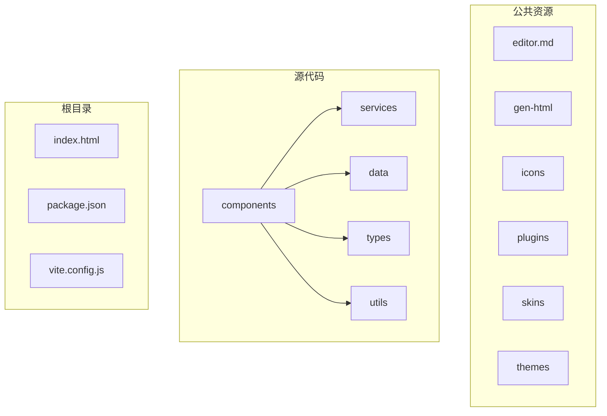
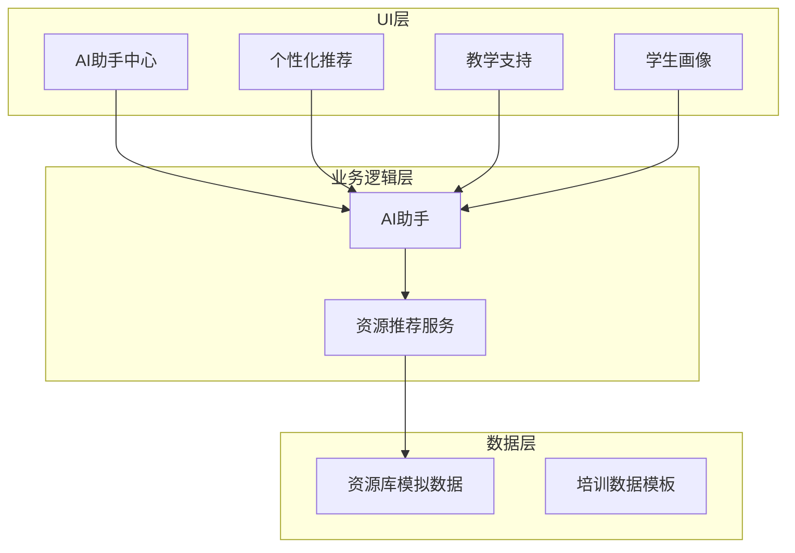
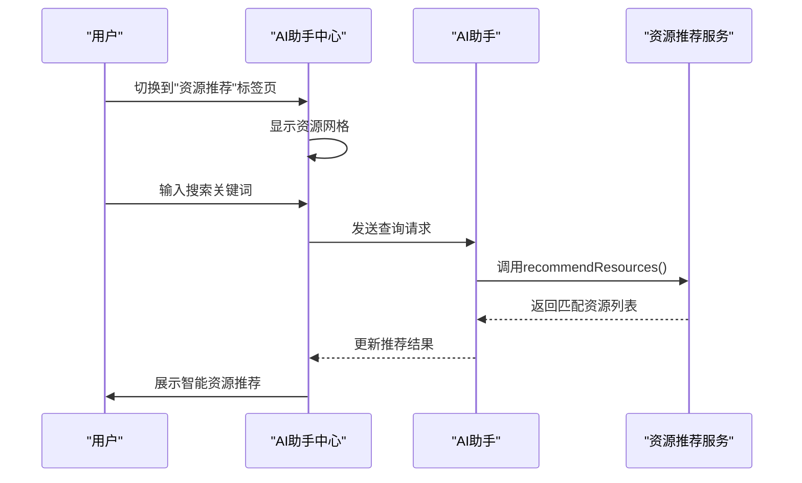
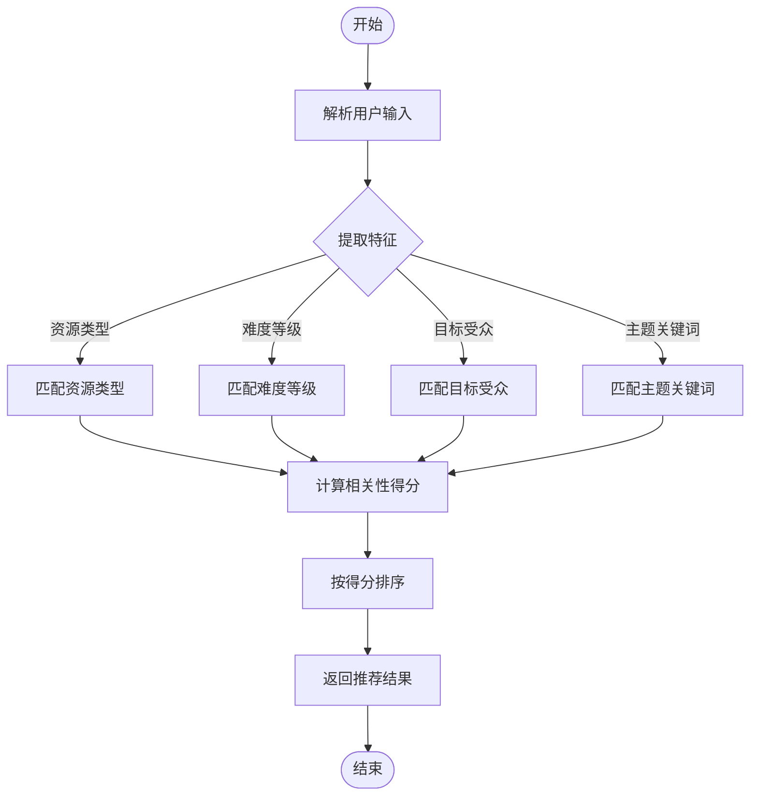
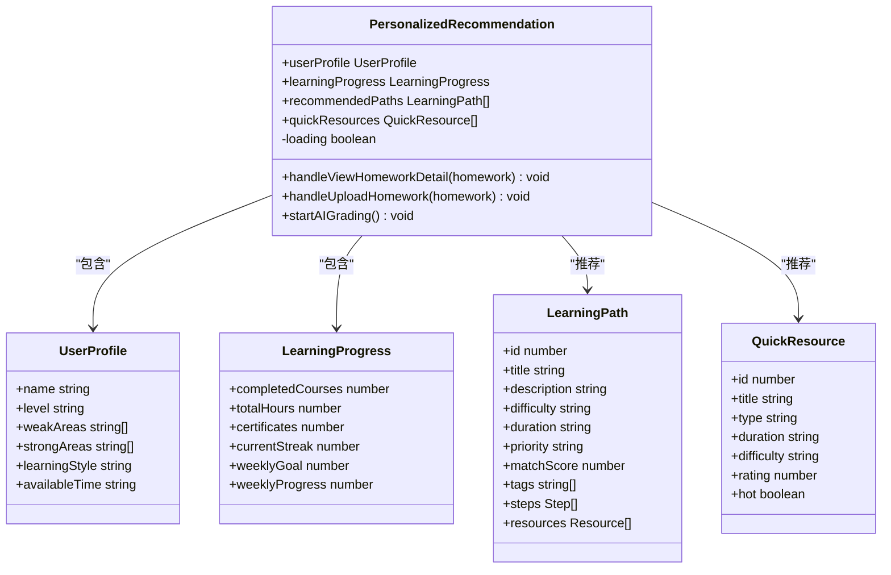
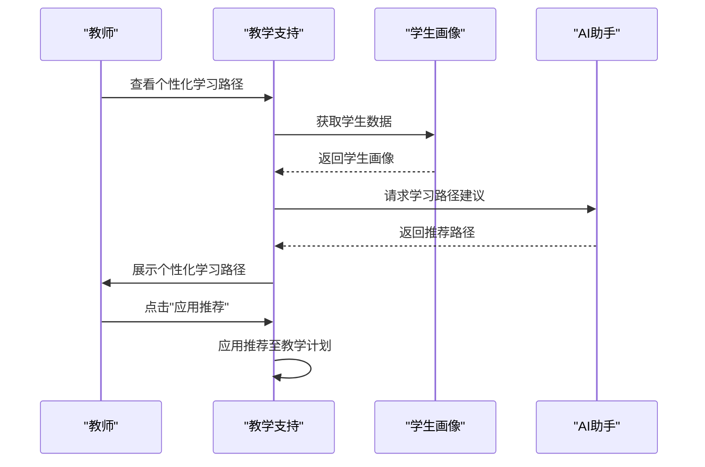
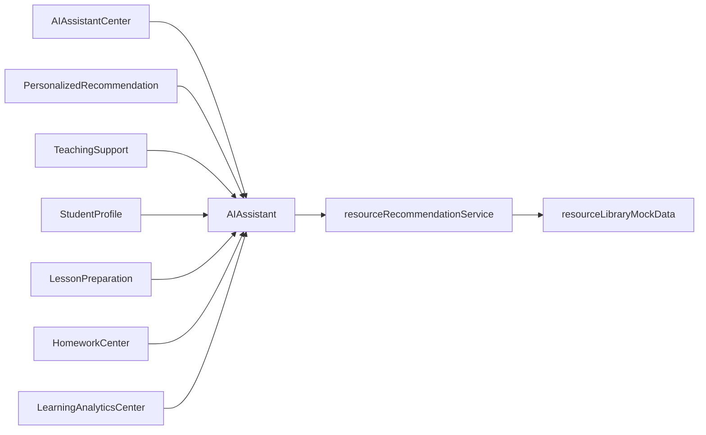

# 教学场景集成

<cite>
**本文档引用文件**   
- [AIAssistant.jsx](file://src/components/AIAssistant.jsx)
- [AIAssistantCenter.jsx](file://src/components/AIAssistantCenter.jsx)
- [resourceRecommendationService.js](file://src/services/resourceRecommendationService.js)
- [PersonalizedRecommendation.jsx](file://src/components/PersonalizedRecommendation.jsx)
- [TeachingSupport.jsx](file://src/components/TeachingSupport.jsx)
- [StudentProfile.jsx](file://src/components/StudentProfile.jsx)
- [LessonPreparation.jsx](file://src/components/LessonPreparation.jsx)
- [HomeworkCenter.jsx](file://src/components/HomeworkCenter.jsx)
- [LearningAnalyticsCenter.jsx](file://src/components/LearningAnalyticsCenter.jsx)
- [resourceLibraryMockData.js](file://src/data/resourceLibraryMockData.js)
</cite>

## 目录
1. [引言](#引言)
2. [项目结构](#项目结构)
3. [核心组件](#核心组件)
4. [架构概览](#架构概览)
5. [详细组件分析](#详细组件分析)
6. [依赖关系分析](#依赖关系分析)
7. [性能考量](#性能考量)
8. [故障排除指南](#故障排除指南)
9. [结论](#结论)

## 引言
本应用文档旨在全面阐述AI智能中心在教育场景中的深度集成方案。通过系统性地介绍AI功能如何融入教学工作流，包括课程准备、课堂互动、作业辅导和学情分析等关键环节，为教育工作者提供清晰的应用指导。文档重点说明了AI助手如何调用资源推荐服务获取教学资源，以及如何基于学生画像提供个性化建议。同时，通过真实使用案例展示AI辅助备课、智能答疑和学习路径推荐等应用场景，并强调数据隐私保护与教育伦理的重要性，确保AI技术的应用符合教学规范。

## 项目结构
该教育应用采用模块化设计，主要分为公共静态资源、源代码组件和服务层。`public`目录存放编辑器相关资源和演示页面；`src`目录为核心开发区域，包含组件、数据、服务、类型定义和工具函数。整体架构遵循现代前端最佳实践，将UI组件、业务逻辑和服务调用分离，便于维护和扩展。

**Diagram sources**
- [src/components](file://src/components)
- [src/services](file://src/services)
- [src/data](file://src/data)
- [src/types](file://src/types)
- [src/utils](file://src/utils)

**Section sources**
- [src/components](file://src/components)
- [src/services](file://src/services)
- [src/data](file://src/data)
- [src/types](file://src/types)
- [src/utils](file://src/utils)

## 核心组件
核心组件围绕AI助手展开，主要包括AI助手中心（AIAssistantCenter）、AI助手（AIAssistant）、个性化推荐（PersonalizedRecommendation）和教学支持（TeachingSupport）。这些组件协同工作，为用户提供从智能对话到个性化学习路径推荐的完整体验。AI助手中心作为主界面，集成了聊天、教案生成、学情分析和资源推荐四大功能模块。

**Section sources**
- [src/components/AIAssistantCenter.jsx](file://src/components/AIAssistantCenter.jsx)
- [src/components/AIAssistant.jsx](file://src/components/AIAssistant.jsx)
- [src/components/PersonalizedRecommendation.jsx](file://src/components/PersonalizedRecommendation.jsx)
- [src/components/TeachingSupport.jsx](file://src/components/TeachingSupport.jsx)

## 架构概览
系统采用分层架构，上层为UI组件，中层为业务逻辑，底层为数据服务。AI助手组件负责处理用户交互和生成响应，通过调用资源推荐服务来获取教学资源。个性化推荐和教学支持组件则利用学生画像数据，提供定制化的学习建议和教学策略。整个架构体现了高内聚、低耦合的设计原则。

**Diagram sources**
- [src/components/AIAssistantCenter.jsx](file://src/components/AIAssistantCenter.jsx)
- [src/components/PersonalizedRecommendation.jsx](file://src/components/PersonalizedRecommendation.jsx)
- [src/components/TeachingSupport.jsx](file://src/components/TeachingSupport.jsx)
- [src/components/StudentProfile.jsx](file://src/components/StudentProfile.jsx)
- [src/components/AIAssistant.jsx](file://src/components/AIAssistant.jsx)
- [src/services/resourceRecommendationService.js](file://src/services/resourceRecommendationService.js)
- [src/data/resourceLibraryMockData.js](file://src/data/resourceLibraryMockData.js)

## 详细组件分析

### AI助手中心分析
AI助手中心是用户与AI交互的主要界面，提供四个核心功能：智能对话、教案生成、学情分析和资源推荐。每个功能都针对特定的教学需求，帮助教师提高工作效率。

#### 对于API/服务组件：

**Diagram sources**
- [src/components/AIAssistantCenter.jsx](file://src/components/AIAssistantCenter.jsx)
- [src/components/AIAssistant.jsx](file://src/components/AIAssistant.jsx)
- [src/services/resourceRecommendationService.js](file://src/services/resourceRecommendationService.js)

**Section sources**
- [src/components/AIAssistantCenter.jsx](file://src/components/AIAssistantCenter.jsx)

### 资源推荐服务分析
资源推荐服务是AI功能的核心引擎，负责根据用户输入的特征和需求，智能匹配并推荐相关教学资源。该服务实现了复杂的解析、匹配和评分算法。

#### 对于复杂逻辑组件：

**Diagram sources**
- [src/services/resourceRecommendationService.js](file://src/services/resourceRecommendationService.js)

**Section sources**
- [src/services/resourceRecommendationService.js](file://src/services/resourceRecommendationService.js)

### 个性化推荐分析
个性化推荐组件基于学生画像，为不同学习者提供量身定制的学习路径和快速学习资源。它综合考虑学生的薄弱领域、优势领域、学习风格和可用时间等因素。

#### 对于对象导向组件：

**Diagram sources**
- [src/components/PersonalizedRecommendation.jsx](file://src/components/PersonalizedRecommendation.jsx)

**Section sources**
- [src/components/PersonalizedRecommendation.jsx](file://src/components/PersonalizedRecommendation.jsx)

### 教学支持分析
教学支持组件为教师提供个性化的教学建议，包括学习路径推荐、教学策略优化和资源推荐。它通过分析学生数据，为教师制定教学决策提供科学依据。

#### 对于API/服务组件：

**Diagram sources**
- [src/components/TeachingSupport.jsx](file://src/components/TeachingSupport.jsx)
- [src/components/StudentProfile.jsx](file://src/components/StudentProfile.jsx)
- [src/components/AIAssistant.jsx](file://src/components/AIAssistant.jsx)

**Section sources**
- [src/components/TeachingSupport.jsx](file://src/components/TeachingSupport.jsx)

## 依赖关系分析
系统各组件间存在明确的依赖关系。UI组件如AI助手中心、个性化推荐和教学支持都依赖于AI助手进行核心逻辑处理。AI助手又依赖于资源推荐服务来获取教学资源。数据层的模拟数据为所有上层组件提供测试和演示所需的数据支持。

**Diagram sources**
- [src/components/AIAssistantCenter.jsx](file://src/components/AIAssistantCenter.jsx)
- [src/components/PersonalizedRecommendation.jsx](file://src/components/PersonalizedRecommendation.jsx)
- [src/components/TeachingSupport.jsx](file://src/components/TeachingSupport.jsx)
- [src/components/StudentProfile.jsx](file://src/components/StudentProfile.jsx)
- [src/components/AIAssistant.jsx](file://src/components/AIAssistant.jsx)
- [src/services/resourceRecommendationService.js](file://src/services/resourceRecommendationService.js)
- [src/data/resourceLibraryMockData.js](file://src/data/resourceLibraryMockData.js)
- [src/components/LessonPreparation.jsx](file://src/components/LessonPreparation.jsx)
- [src/components/HomeworkCenter.jsx](file://src/components/HomeworkCenter.jsx)
- [src/components/LearningAnalyticsCenter.jsx](file://src/components/LearningAnalyticsCenter.jsx)

## 性能考量
系统在性能方面进行了多项优化。首先，采用懒加载机制，只在需要时才初始化复杂的编辑器实例。其次，资源推荐服务通过预解析用户输入和高效的数据匹配算法，确保推荐结果的快速响应。此外，组件间的通信通过回调函数实现，避免了不必要的重新渲染，提高了整体性能。

## 故障排除指南
当遇到问题时，可参考以下常见问题及解决方案：

1. **AI助手无响应**：检查网络连接是否正常，确认AI助手服务已正确初始化。
2. **资源推荐不准确**：尝试使用更具体的关键词，或明确指定资源类型、目标受众和难度等级。
3. **学生画像数据缺失**：确保已正确配置学生数据源，检查数据同步状态。
4. **个性化推荐未更新**：刷新页面或重新登录，以确保获取最新的学生学习数据。

**Section sources**
- [src/components/AIAssistant.jsx](file://src/components/AIAssistant.jsx)
- [src/services/resourceRecommendationService.js](file://src/services/resourceRecommendationService.js)
- [src/components/StudentProfile.jsx](file://src/components/StudentProfile.jsx)

## 结论
本应用成功实现了AI智能中心在教育场景中的深度集成。通过AI助手、资源推荐服务和个性化推荐等核心组件的协同工作，为教师提供了从课程准备到学情分析的全流程智能支持。系统不仅能够根据学生画像提供个性化建议，还能通过智能算法推荐最合适的教学资源。未来可进一步优化推荐算法，引入更多真实教学数据，提升系统的智能化水平和实用性。