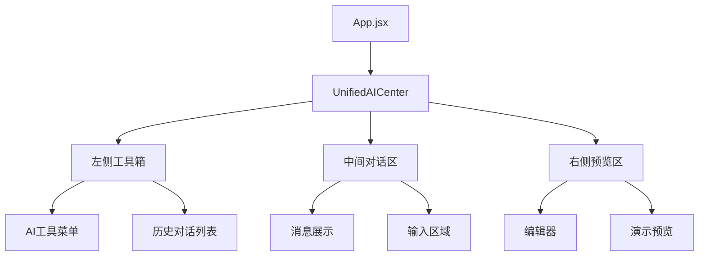
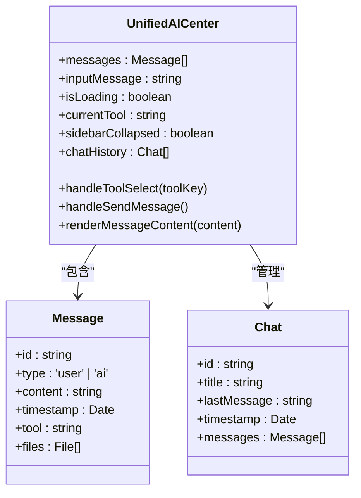
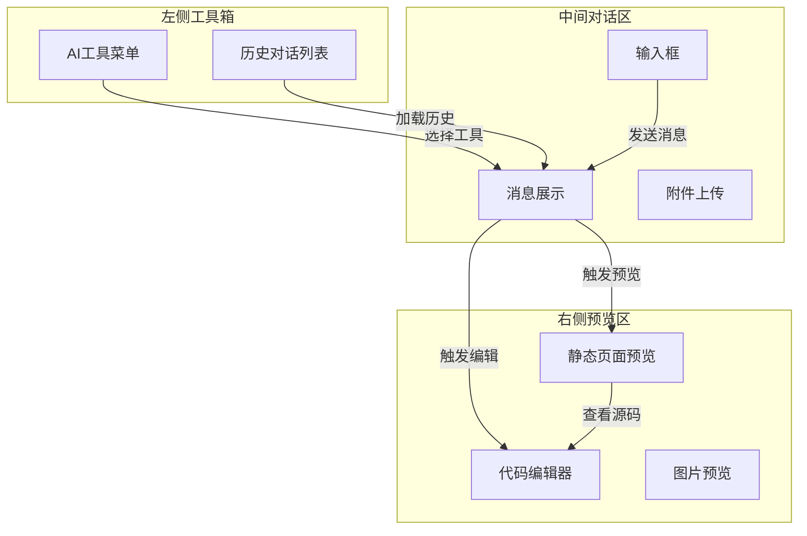
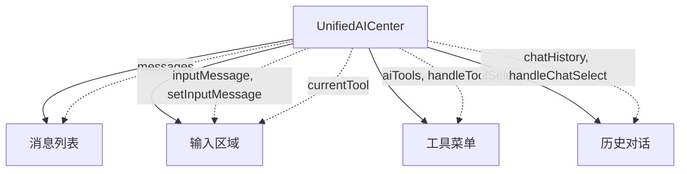
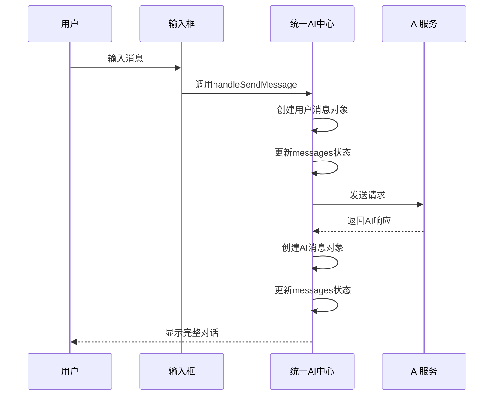
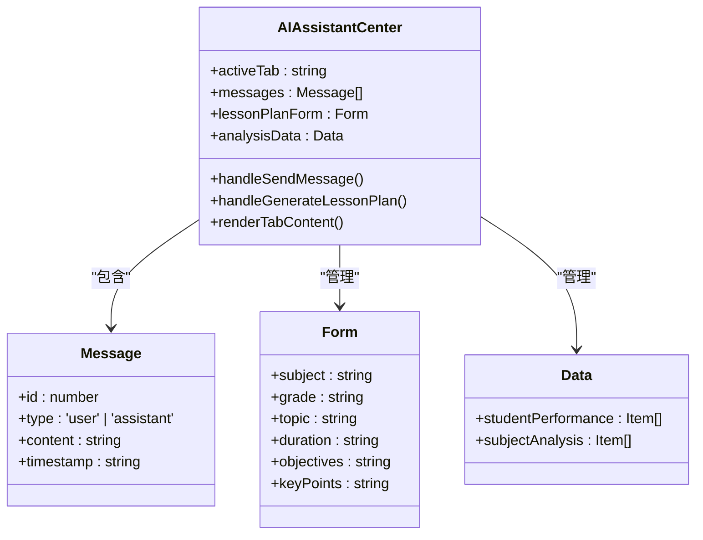
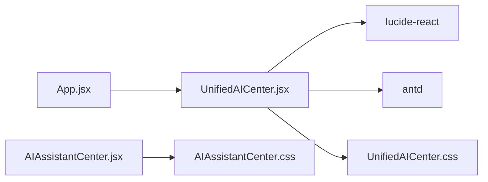

# 统一AI中心架构

<cite>
**本文档引用文件**   
- [UnifiedAICenter.jsx](file://src/components/UnifiedAICenter.jsx)
- [AIAssistantCenter.jsx](file://src/components/AIAssistantCenter.jsx)
</cite>

## 目录
1. [引言](#引言)
2. [项目结构](#项目结构)
3. [核心组件](#核心组件)
4. [架构概述](#架构概述)
5. [详细组件分析](#详细组件分析)
6. [依赖关系分析](#依赖关系分析)
7. [性能考虑](#性能考虑)
8. [故障排除指南](#故障排除指南)
9. [结论](#结论)

## 引言
统一AI中心（UnifiedAICenter）是本系统的核心功能集成枢纽，旨在为用户提供一个集中化的AI功能访问平台。该组件通过模块化设计整合了多种AI助手实例，实现了功能的灵活扩展和状态的统一管理。作为教育技术生态系统的关键组成部分，它不仅支持编程开发、多语言翻译、数据分析等通用AI能力，还特别针对教学场景提供了教案生成、学情分析、资源推荐等专业功能。

## 项目结构
统一AI中心位于`src/components/`目录下，主要由`UnifiedAICenter.jsx`和`UnifiedAICenter.css`两个文件构成。该组件在应用主入口`App.jsx`中被调用，并根据当前视图状态动态渲染。其设计采用了现代React函数式组件模式，结合Hooks进行状态管理和副作用处理，形成了清晰的单向数据流架构。

**Diagram sources**
- [UnifiedAICenter.jsx](file://src/components/UnifiedAICenter.jsx#L0-L3961)

## 核心组件
统一AI中心的核心在于其作为AI功能集成枢纽的设计理念。组件通过`currentTool`状态变量协调管理多个AI助手实例，实现功能模块化。每个AI工具（如AI编程、图像生成、智能搜索等）都作为一个独立的功能模块存在，通过工具选择机制动态加载。

状态集中化体现在`messages`状态的统一管理上，所有对话历史都被存储在一个集中的状态数组中，并根据当前选中的工具进行过滤和显示。这种设计确保了用户在不同AI功能间切换时能够保持上下文连贯性。

**Section sources**
- [UnifiedAICenter.jsx](file://src/components/UnifiedAICenter.jsx#L90-L110)

## 架构概述
统一AI中心采用分层架构设计，分为三个主要区域：左侧工具箱区域负责功能导航和历史对话管理；中间对话区域承担主要的交互任务，包括消息展示和输入处理；右侧预览区域提供内容展示和编辑功能。

组件层次结构清晰，父组件`UnifiedAICenter`通过props向下传递工具选择状态和消息列表，子组件则通过回调函数向上通信。事件通信模式基于React的标准事件处理机制，结合自定义回调函数实现跨层级通信。

**Diagram sources**
- [UnifiedAICenter.jsx](file://src/components/UnifiedAICenter.jsx#L0-L3961)

## 详细组件分析

### 组件层次结构与Props传递
统一AI中心的组件层次结构体现了典型的容器组件与展示组件分离模式。父组件负责状态管理和逻辑处理，将必要的数据和行为通过props传递给子组件。

Props传递机制设计精巧，基础状态如`messages`、`inputMessage`、`isLoading`等直接作为props传递给消息列表和输入组件。更复杂的状态如`selectedTool`则通过context或逐层传递的方式影响整个界面的行为表现。

#### Props传递示意图

**Diagram sources**
- [UnifiedAICenter.jsx](file://src/components/UnifiedAICenter.jsx#L0-L3961)

### 事件通信模式
事件通信采用自底向上的方式，子组件通过回调函数与父组件通信。例如，当用户在输入框按下发送按钮时，会触发`handleSendMessage`回调，该回调由父组件提供并处理消息发送逻辑。

对于复杂的跨组件通信需求，如文件上传后的处理，组件使用了组合式的回调链。文件选择组件触发上传事件，上传成功后更新父组件状态，进而影响消息列表的渲染。

#### 消息发送流程

**Diagram sources**
- [UnifiedAICenter.jsx](file://src/components/UnifiedAICenter.jsx#L0-L3961)

### AIAssistantCenter职责划分
虽然`AIAssistantCenter`是一个独立的组件，但其设计理念与`UnifiedAICenter`一脉相承。该组件专注于教学辅助场景，通过标签页的形式实现了教案生成、学情分析、资源推荐等功能的复用策略。

每个标签页对应一个特定的教学任务，共享相同的消息交互模式但具有各自独特的表单和数据显示逻辑。这种设计既保证了用户体验的一致性，又满足了不同教学场景的特殊需求。

**Section sources**
- [AIAssistantCenter.jsx](file://src/components/AIAssistantCenter.jsx#L0-L518)

## 依赖关系分析
统一AI中心依赖于多个第三方库和内部组件。前端UI框架采用Ant Design，图标库使用lucide-react，这些依赖通过ES6模块导入机制引入。

组件间的依赖关系清晰，`UnifiedAICenter`作为顶级组件不依赖其他业务组件，而是被`App`组件所依赖。样式文件`UnifiedAICenter.css`与JSX文件形成紧密耦合，共同定义组件的外观和行为。

**Diagram sources**
- [UnifiedAICenter.jsx](file://src/components/UnifiedAICenter.jsx#L0-L88)
- [AIAssistantCenter.jsx](file://src/components/AIAssistantCenter.jsx#L0-L32)

## 性能考虑
统一AI中心在性能优化方面采取了多项措施。首先，通过虚拟滚动和分页加载避免大量历史对话造成内存压力。其次，对计算密集型操作如消息内容渲染进行了防抖处理。

图片预览和文件上传功能采用了懒加载策略，只有当用户明确请求时才加载大体积资源。此外，组件使用React.memo对子组件进行记忆化处理，避免不必要的重渲染。

## 故障排除指南
常见问题及解决方案：
- **消息发送无响应**：检查`selectedTool`是否已正确设置，确保在选择工具后才可发送消息
- **文件上传失败**：验证文件大小是否超过10MB限制，确认文件类型是否在允许范围内
- **预览功能异常**：检查URL路径是否正确，特别是端口转换（5173→3000）和路径编码问题
- **状态不同步**：确保在工具切换时正确重置相关状态变量，避免残留数据影响新对话

## 结论
统一AI中心通过精心设计的架构实现了AI功能的高效集成和管理。其模块化设计支持未来轻松扩展新的AI功能，如增加语音识别、视频分析等能力。与其他系统模块的集成方案清晰，可通过dataRecordService记录用户操作日志，利用userPermissionManager实现基于角色的访问控制。

该架构的成功实施为教育技术应用提供了一个可复用的AI集成范本，展示了如何将复杂的AI能力以用户友好的方式呈现，同时保持系统的可维护性和可扩展性。