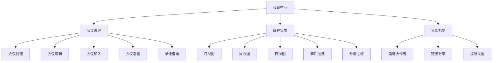
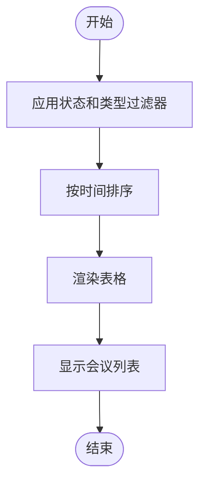
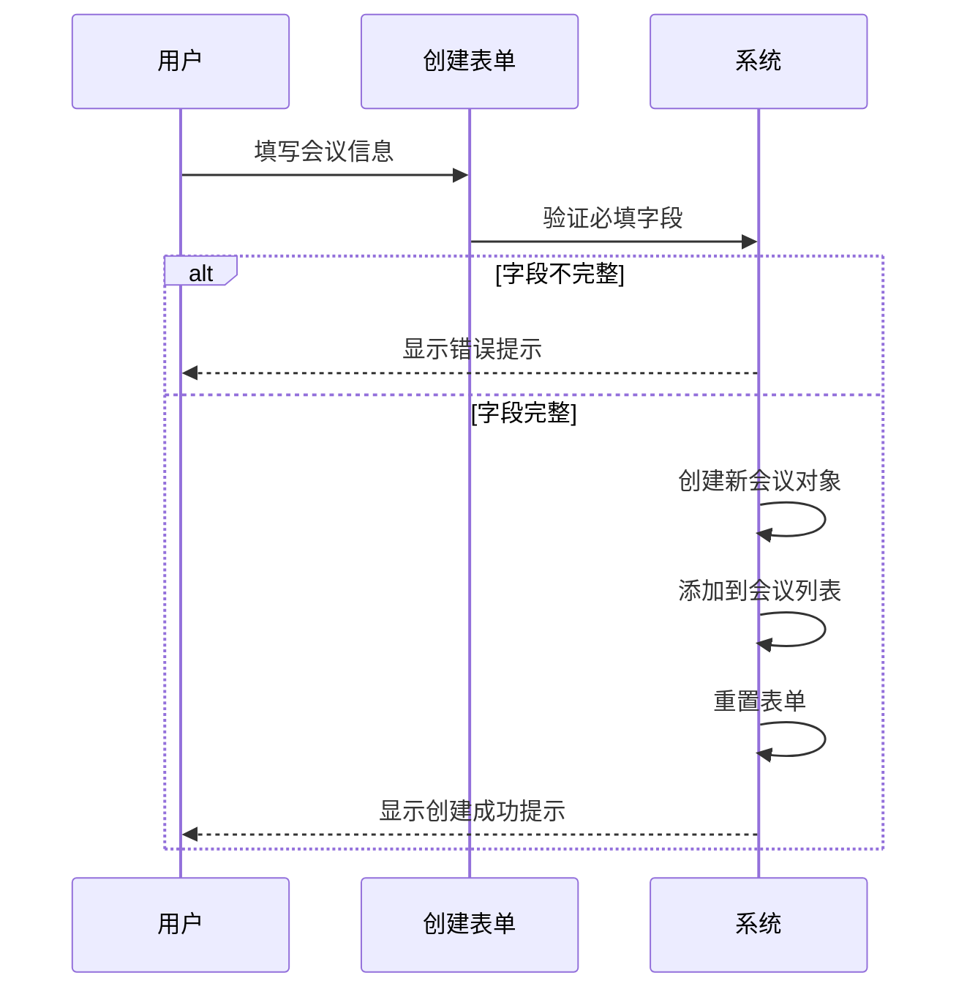
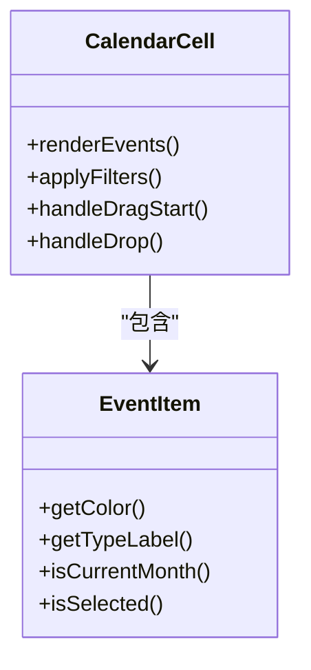
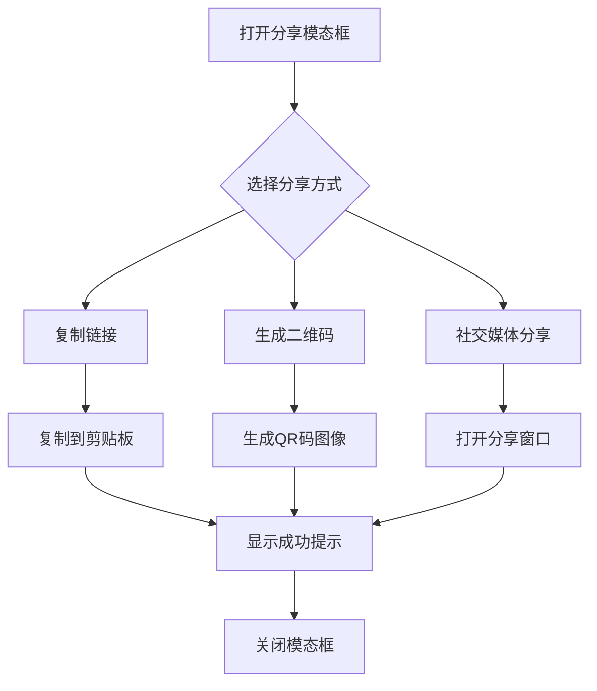

# 会议中心

<cite>
**本文档引用的文件**
- [MeetingCenter.jsx](file://src/components/MeetingCenter.jsx)
- [CalendarCenter.jsx](file://src/components/CalendarCenter.jsx)
- [ShareModal.jsx](file://src/components/ShareModal.jsx)
</cite>

## 目录
1. [介绍](#介绍)
2. [项目结构](#项目结构)
3. [核心组件](#核心组件)
4. [架构概述](#架构概述)
5. [详细组件分析](#详细组件分析)
6. [依赖分析](#依赖分析)
7. [性能考虑](#性能考虑)
8. [故障排除指南](#故障排除指南)
9. [结论](#结论)

## 介绍
会议中心是一个综合性的虚拟会议与研讨平台，旨在为教育机构提供完整的会议管理解决方案。该系统集成了会议创建、日程安排、实时协作、录像回放和数据分析等核心功能，支持教研会议、学术研讨、工作交流和培训会议等多种会议类型。通过与日历系统的深度集成，实现了时间协调和冲突检测功能，并提供了完善的分享机制，便于用户邀请参会者和共享会议内容。

## 项目结构
根据项目目录结构，会议中心相关的核心组件位于`src/components`目录下，主要包括`MeetingCenter.jsx`、`CalendarCenter.jsx`和`ShareModal.jsx`三个主要文件。这些组件共同构成了会议管理系统的核心功能，分别负责会议管理、日程集成和分享机制。系统采用React框架构建，结合Ant Design UI组件库实现现代化的用户界面。

## 核心组件

### 会议管理逻辑
`MeetingCenter`组件实现了完整的会议生命周期管理，包括会议创建、编辑、加入、准备和查看录像等功能。系统维护了一个包含23个示例会议的数据列表，每个会议对象包含ID、标题、类型、组织者、参与者、开始和结束时间、状态、议程、会议室、在线状态、录制状态、出席人数和总邀请人数等属性。会议状态分为"进行中"、"即将开始"和"已结束"三种，通过不同的颜色编码进行视觉区分。

会议创建功能允许用户填写会议标题、选择会议类型（教研会议、学术研讨、工作交流、培训会议）、设置开始和结束时间、指定会议室、输入会议议程，并选择是否为在线会议和是否开启录制。创建成功后，新会议将被添加到会议列表的顶部。

### 日程集成
`CalendarCenter`组件提供了强大的日程管理功能，支持月视图、周视图和日视图三种显示模式。系统预置了46个智慧教学平台的示例事件数据，涵盖新学期教研工作部署会、课程标准研讨、信息化教学培训等多种教研活动。日历支持拖拽操作，用户可以通过拖拽来移动事件，系统会自动更新事件日期并显示成功提示。

日历系统实现了分类过滤功能，将活动分为"教研会议"、"教学工作"、"培训学习"、"交流合作"和"重要节点"五种类型，每种类型有对应的颜色标识。用户可以勾选或取消勾选各类别来控制日历上显示的事件类型。系统还提供了创建日程弹窗，包含表单区域和日视图预览区域，用户在填写表单时可以实时看到日程在日历中的预览效果。

### 分享机制
`ShareModal`组件实现了文档分享功能，包含邀请协作者和链接分享两个主要部分。在邀请协作者部分，用户可以通过搜索框查找用户、群组、部门或用户组，并将其添加为协作者。已选择的协作者会显示在列表中，支持移除操作。链接分享部分提供了复制链接、生成二维码和社交媒体分享等功能，支持QQ、微博和邮件等分享方式。

## 架构概述



**Diagram sources**
- [MeetingCenter.jsx](file://src/components/MeetingCenter.jsx)
- [CalendarCenter.jsx](file://src/components/CalendarCenter.jsx)
- [ShareModal.jsx](file://src/components/ShareModal.jsx)

## 详细组件分析

### MeetingCenter组件分析
`MeetingCenter`组件是整个会议系统的核心，负责管理所有会议相关的功能和数据。组件使用多个useState钩子来管理会议列表、当前会议、聊天消息、会议记录和统计分析数据等状态。

#### 会议列表渲染


**Diagram sources**
- [MeetingCenter.jsx](file://src/components/MeetingCenter.jsx#L400-L500)

#### 会议创建流程


**Diagram sources**
- [MeetingCenter.jsx](file://src/components/MeetingCenter.jsx#L200-L250)

### CalendarCenter组件分析
`CalendarCenter`组件基于Ant Design的Calendar组件构建，扩展了拖拽、分类过滤和多视图支持等高级功能。

#### 日历单元格渲染


**Diagram sources**
- [CalendarCenter.jsx](file://src/components/CalendarCenter.jsx#L150-L200)

### ShareModal组件分析
`ShareModal`组件实现了现代化的分享对话框，支持多种分享方式和权限管理。

#### 分享流程


**Diagram sources**
- [ShareModal.jsx](file://src/components/ShareModal.jsx#L50-L100)

**Section sources**
- [MeetingCenter.jsx](file://src/components/MeetingCenter.jsx#L43-L1674)
- [CalendarCenter.jsx](file://src/components/CalendarCenter.jsx#L14-L838)
- [ShareModal.jsx](file://src/components/ShareModal.jsx#L5-L247)

## 依赖分析

```mermaid
dependency-graph
"MeetingCenter.jsx" --> "antd"
"MeetingCenter.jsx" --> "dayjs"
"CalendarCenter.jsx" --> "antd"
"CalendarCenter.jsx" --> "react-dnd"
"CalendarCenter.jsx" --> "dayjs"
"ShareModal.jsx" --> "lucide-react"
"ShareModal.jsx" --> "antd"
```

**Diagram sources**
- [MeetingCenter.jsx](file://src/components/MeetingCenter.jsx)
- [CalendarCenter.jsx](file://src/components/CalendarCenter.jsx)
- [ShareModal.jsx](file://src/components/ShareModal.jsx)

## 性能考虑
会议中心系统在设计时考虑了多项性能优化措施。首先，通过合理使用React的状态管理，避免了不必要的重新渲染。其次，日历组件采用了虚拟滚动技术，只渲染可见区域的内容，大大提升了大型日历的性能表现。此外，系统对事件处理函数进行了适当的节流和防抖处理，确保在高频率操作下的响应性能。

对于大数据量的会议列表，系统实现了分页显示，每页显示10条记录，避免了一次性加载过多数据导致的页面卡顿。同时，搜索和过滤功能采用了即时反馈机制，在用户输入时实时更新结果，提升了用户体验。

## 故障排除指南
当遇到会议中心功能异常时，可参考以下常见问题及解决方案：

1. **无法创建会议**：检查是否填写了会议标题、开始时间和结束时间等必填字段。
2. **日历显示异常**：确认浏览器支持HTML5拖拽API，某些旧版浏览器可能不完全支持。
3. **分享功能失效**：检查浏览器是否阻止了弹出窗口，特别是社交媒体分享功能需要打开新窗口。
4. **时间显示错误**：确认系统时区设置正确，dayjs库已正确配置中文本地化。
5. **样式丢失**：确保CSS文件已正确导入，检查网络连接是否正常。

## 结论
会议中心系统通过`MeetingCenter`、`CalendarCenter`和`ShareModal`三个核心组件的协同工作，实现了完整的会议管理解决方案。系统设计合理，功能完善，界面友好，能够有效支持教育机构的日常会议和教研活动管理需求。未来可进一步增强的功能包括：与外部日历服务（如Google Calendar）的同步、智能时间建议、会议纪要自动生成和语音识别转录等。