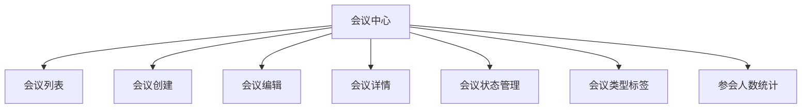
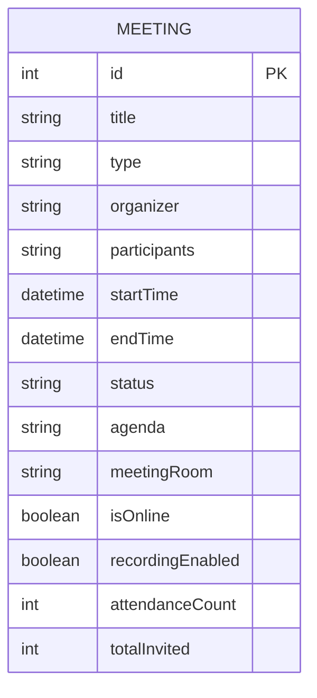
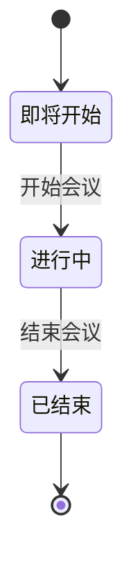
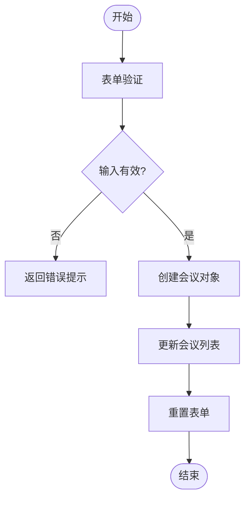
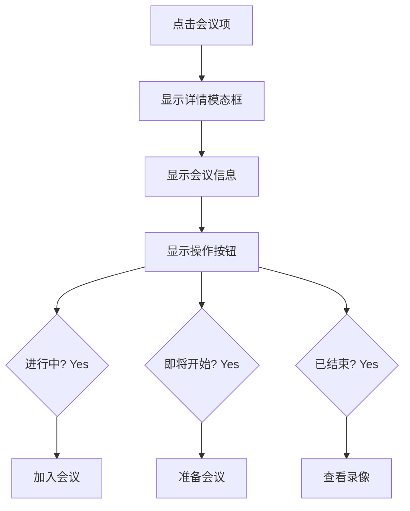
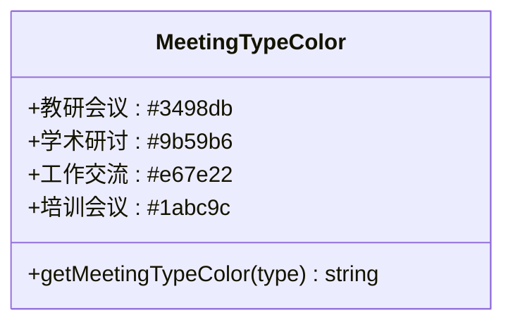

# 会议管理

<cite>
**本文档引用文件**   
- [MeetingCenter.jsx](file://src/components/MeetingCenter.jsx)
- [MeetingCenter.css](file://src/components/MeetingCenter.css)
</cite>

## 目录
1. [项目结构](#项目结构)
2. [核心组件分析](#核心组件分析)
3. [会议数据结构设计](#会议数据结构设计)
4. [会议状态管理](#会议状态管理)
5. [会议创建与编辑流程](#会议创建与编辑流程)
6. [会议信息表单验证](#会议信息表单验证)
7. [会议详情查看](#会议详情查看)
8. [会议数据更新](#会议数据更新)
9. [会议类型标签颜色编码系统](#会议类型标签颜色编码系统)
10. [参会人数统计功能](#参会人数统计功能)

## 项目结构

会议管理功能主要由 `MeetingCenter` 组件实现，该组件位于 `src/components/MeetingCenter.jsx` 文件中。组件包含会议列表展示、会议状态管理、会议创建与编辑等核心功能。样式文件 `MeetingCenter.css` 提供了相应的视觉呈现。

**图表来源**
- [MeetingCenter.jsx](file://src/components/MeetingCenter.jsx#L43-L87)
- [MeetingCenter.css](file://src/components/MeetingCenter.css#L1-L10)

## 核心组件分析

`MeetingCenter` 组件是会议管理功能的核心，实现了会议的全生命周期管理。组件使用 React 的函数式组件和 Hooks 特性，通过 `useState` 管理各种状态，包括当前活动标签页、会议列表、表单数据等。

**组件来源**
- [MeetingCenter.jsx](file://src/components/MeetingCenter.jsx#L43-L87)

## 会议数据结构设计

会议数据采用对象数组的形式存储，每个会议对象包含以下属性：

- `id`: 会议唯一标识符
- `title`: 会议标题
- `type`: 会议类型（教研会议、学术研讨、工作交流、培训会议）
- `organizer`: 组织者
- `participants`: 参与人员列表
- `startTime`: 开始时间
- `endTime`: 结束时间
- `status`: 会议状态（进行中、即将开始、已结束）
- `agenda`: 会议议程
- `meetingRoom`: 会议室
- `isOnline`: 是否为在线会议
- `recordingEnabled`: 是否开启录制
- `attendanceCount`: 实际出席人数
- `totalInvited`: 总邀请人数

**图表来源**
- [MeetingCenter.jsx](file://src/components/MeetingCenter.jsx#L43-L87)

## 会议状态管理

会议状态管理通过 `status` 字段实现，支持三种状态：进行中、即将开始、已结束。状态变更逻辑在编辑会议时处理，用户可以通过下拉菜单选择不同的状态。

**图表来源**
- [MeetingCenter.jsx](file://src/components/MeetingCenter.jsx#L1594-L1623)

## 会议创建与编辑流程

会议创建流程通过表单收集必要信息，包括会议标题、类型、时间、议程等。创建成功后，新会议会被添加到会议列表的最前面。编辑流程允许用户修改现有会议的所有属性。

**图表来源**
- [MeetingCenter.jsx](file://src/components/MeetingCenter.jsx#L574-L628)

## 会议信息表单验证

表单验证确保关键字段不为空，包括会议标题、开始时间和结束时间。验证逻辑在提交表单时执行，如果验证失败，会弹出提示框提醒用户填写必要的会议信息。

**组件来源**
- [MeetingCenter.jsx](file://src/components/MeetingCenter.jsx#L574-L628)

## 会议详情查看

用户点击会议项可以查看详细的会议信息，包括基本信息、会议议程和参与人员。详情模态框提供了直观的信息展示，并根据会议状态显示相应的操作按钮。

**图表来源**
- [MeetingCenter.jsx](file://src/components/MeetingCenter.jsx#L1415-L1443)

## 会议数据更新

会议数据更新通过编辑功能实现，用户可以修改会议的任何属性。更新后的数据会重新映射到会议列表中，保持数据的一致性。

**组件来源**
- [MeetingCenter.jsx](file://src/components/MeetingCenter.jsx#L714-L756)

## 会议类型标签颜色编码系统

会议类型标签采用颜色编码系统，不同类型的会议用不同的颜色区分：
- 教研会议：蓝色 (#3498db)
- 学术研讨：紫色 (#9b59b6)
- 工作交流：橙色 (#e67e22)
- 培训会议：青色 (#1abc9c)

**图表来源**
- [MeetingCenter.jsx](file://src/components/MeetingCenter.jsx#L714-L756)

## 参会人数统计功能

参会人数统计功能显示实际出席人数与总邀请人数的比例，帮助用户了解会议的参与情况。统计信息在会议列表和详情页面都有展示。

**组件来源**
- [MeetingCenter.jsx](file://src/components/MeetingCenter.jsx#L758-L798)