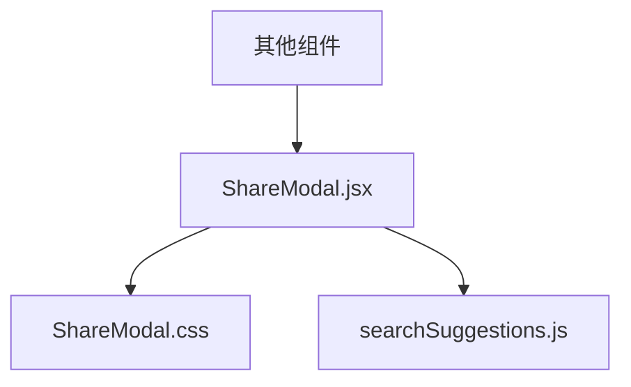
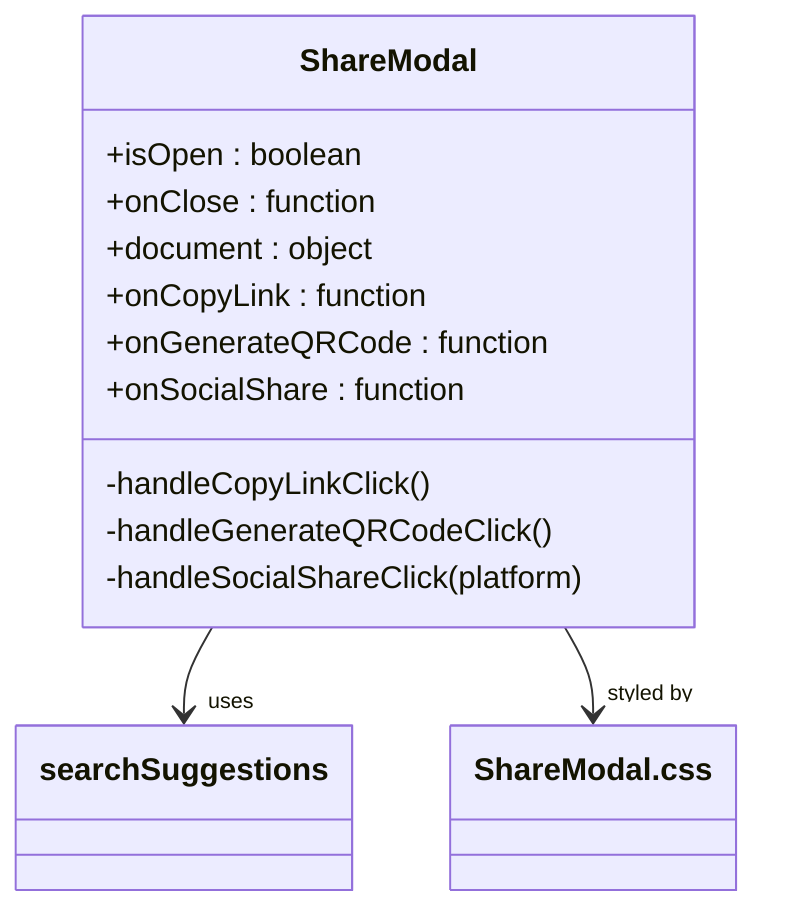
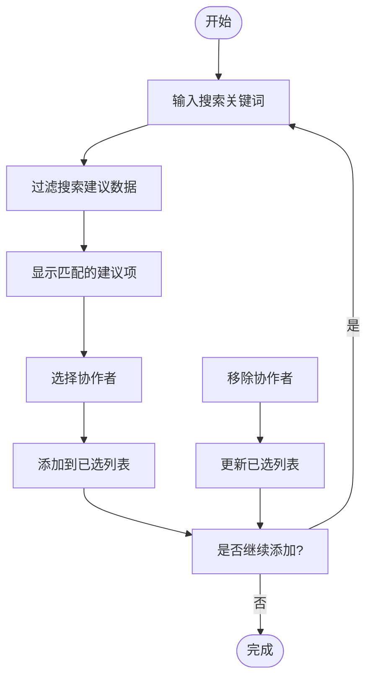
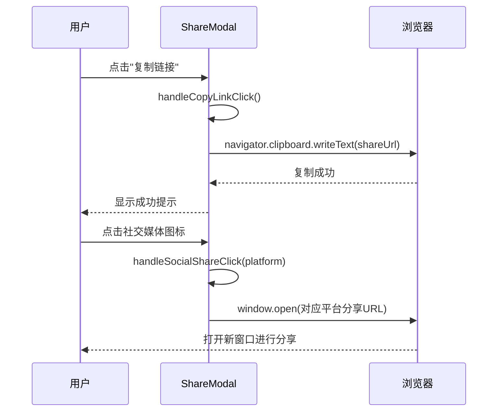
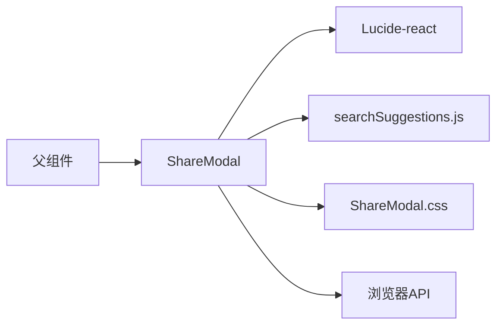

# 分享机制

<cite>
**本文档中引用的文件**
- [ShareModal.jsx](file://src/components/ShareModal.jsx)
- [searchSuggestions.js](file://src/data/searchSuggestions.js)
- [ShareModal.css](file://src/components/ShareModal.css)
</cite>

## 目录
1. [介绍](#介绍)
2. [项目结构](#项目结构)
3. [核心组件](#核心组件)
4. [架构概述](#架构概述)
5. [详细组件分析](#详细组件分析)
6. [依赖分析](#依赖分析)
7. [性能考虑](#性能考虑)
8. [故障排除指南](#故障排除指南)
9. [结论](#结论)

## 介绍
本文件全面记录了会议中心的分享功能实现，重点描述了 ShareModal 组件的分享界面设计、链接生成和多平台分享机制。文档详细说明了分享模态框的显示控制、权限设置和协作者邀请功能的实现逻辑，并解释了复制链接、生成二维码和社交媒体分享的具体技术方案。

## 项目结构
ShareModal 组件位于 `src/components` 目录下，是系统分享功能的核心 UI 组件。该组件与数据层 `src/data/searchSuggestions.js` 紧密协作，实现了协作者搜索建议功能。样式文件 `ShareModal.css` 提供了现代化的视觉设计，确保用户界面的一致性和可用性。

**图源**
- [ShareModal.jsx](file://src/components/ShareModal.jsx)
- [ShareModal.css](file://src/components/ShareModal.css)
- [searchSuggestions.js](file://src/data/searchSuggestions.js)

**节源**
- [ShareModal.jsx](file://src/components/ShareModal.jsx)
- [ShareModal.css](file://src/components/ShareModal.css)

## 核心组件
ShareModal 组件实现了完整的分享功能，包括协作者邀请、链接分享和多平台集成。组件通过 isOpen 属性控制模态框的显示与隐藏，接收 document 对象作为分享内容的基础。提供了 onCopyLink、onGenerateQRCode 和 onSocialShare 等回调函数接口，支持外部系统集成。

**节源**
- [ShareModal.jsx](file://src/components/ShareModal.jsx#L5-L247)

## 架构概述
ShareModal 组件采用 React 函数式组件架构，利用 useState 和 useEffect 钩子管理内部状态。组件分为两个主要功能区域：邀请协作者部分和链接分享部分。通过导入 Lucide-react 图标库增强用户体验，同时集成外部数据服务实现搜索建议功能。

**图源**
- [ShareModal.jsx](file://src/components/ShareModal.jsx#L5-L247)
- [searchSuggestions.js](file://src/data/searchSuggestions.js)

## 详细组件分析
### ShareModal 组件分析
ShareModal 组件实现了完整的分享工作流，从界面展示到功能执行形成闭环。

#### 协作者邀请功能
组件实现了智能的协作者邀请系统，用户可以通过搜索框输入关键词查找用户、群组或部门。搜索建议功能实时过滤 `searchSuggestions.js` 中的预设数据，根据名称、部门、邮箱等字段进行匹配。已选择的协作者会显示在列表中，支持通过移除按钮删除。

**图源**
- [ShareModal.jsx](file://src/components/ShareModal.jsx#L109-L164)
- [searchSuggestions.js](file://src/data/searchSuggestions.js)

**节源**
- [ShareModal.jsx](file://src/components/ShareModal.jsx#L109-L164)
- [searchSuggestions.js](file://src/data/searchSuggestions.js)

#### 链接分享机制
链接分享功能提供了多种分享方式，包括复制链接、生成二维码和社交媒体分享。复制链接功能使用浏览器原生的 navigator.clipboard API 将文档链接写入剪贴板。社交媒体分享通过构建特定平台的 URL 实现，如 QQ、微博和邮件分享。

**图源**
- [ShareModal.jsx](file://src/components/ShareModal.jsx#L38-L67)
- [ShareModal.jsx](file://src/components/ShareModal.jsx#L201-L249)

**节源**
- [ShareModal.jsx](file://src/components/ShareModal.jsx#L38-L67)

## 依赖分析
ShareModal 组件依赖多个外部模块和内部服务。主要依赖包括 Lucide-react 图标库提供 UI 图标，以及 searchSuggestions 数据服务提供搜索建议功能。组件通过 CSS 模块化样式确保视觉一致性，同时保持与其他系统组件的松耦合关系。

**图源**
- [ShareModal.jsx](file://src/components/ShareModal.jsx#L1-L36)

**节源**
- [ShareModal.jsx](file://src/components/ShareModal.jsx#L1-L36)

## 性能考虑
ShareModal 组件在性能方面进行了优化，避免不必要的渲染。通过条件渲染确保只有在 isOpen 为 true 且 document 存在时才创建 DOM 元素。搜索建议功能采用简单的过滤算法，在小型数据集上具有良好的响应性能。未来可考虑对大型数据集实施防抖搜索以进一步提升性能。

## 故障排除指南
当分享功能出现问题时，应首先检查 ShareModal 的 props 是否正确传递，特别是 isOpen 和 document 属性。如果复制链接功能失效，需确认浏览器是否支持 navigator.clipboard API 并检查权限设置。对于搜索建议不显示的问题，应验证 searchSuggestions.js 文件的导入路径和数据格式是否正确。

**节源**
- [ShareModal.jsx](file://src/components/ShareModal.jsx#L5-L247)

## 结论
ShareModal 组件实现了功能完整、用户体验良好的分享系统。通过模块化设计和清晰的职责划分，组件易于维护和扩展。当前实现提供了基础的分享功能，未来可通过集成实际的 QR 码生成库和微信 SDK 来完善二维码和微信分享功能。