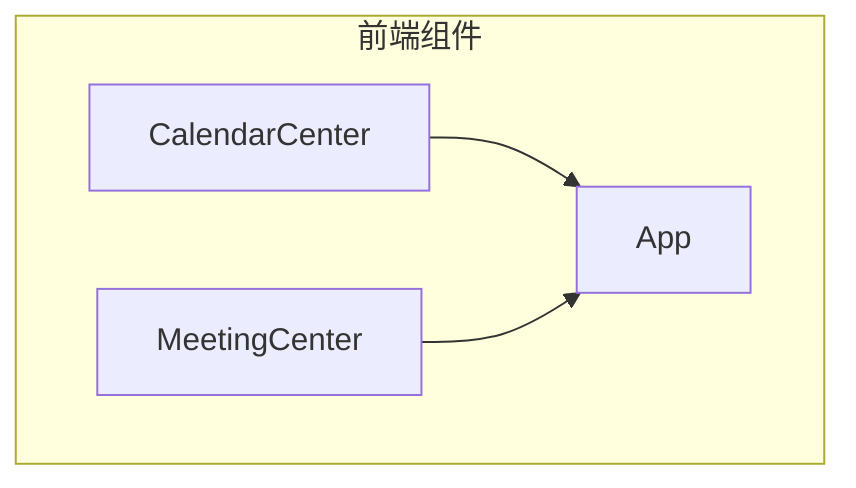
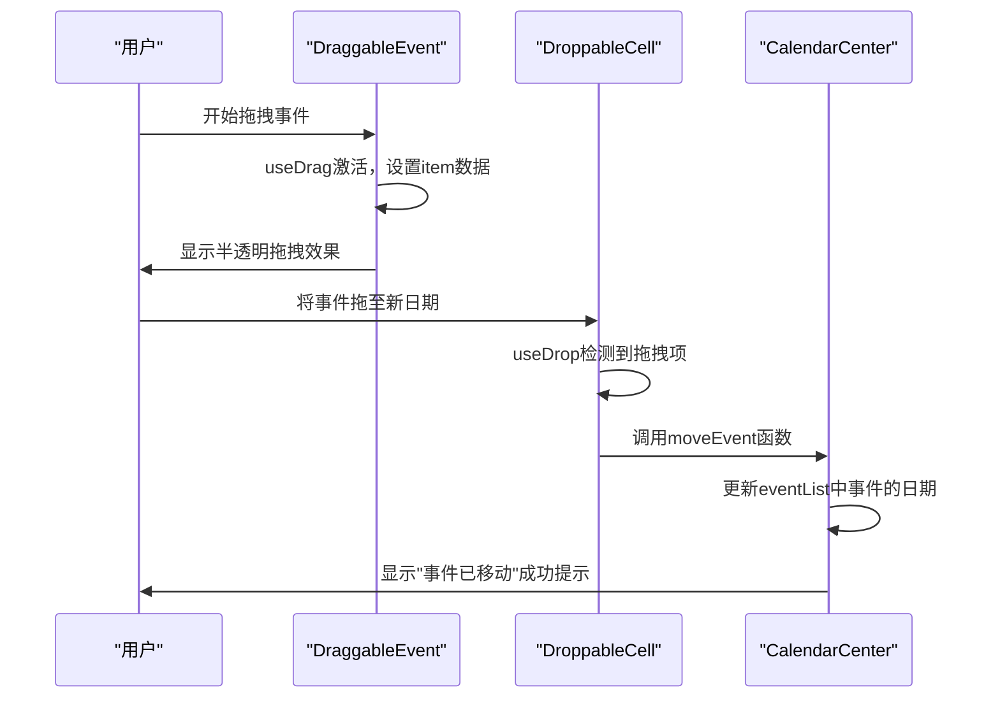
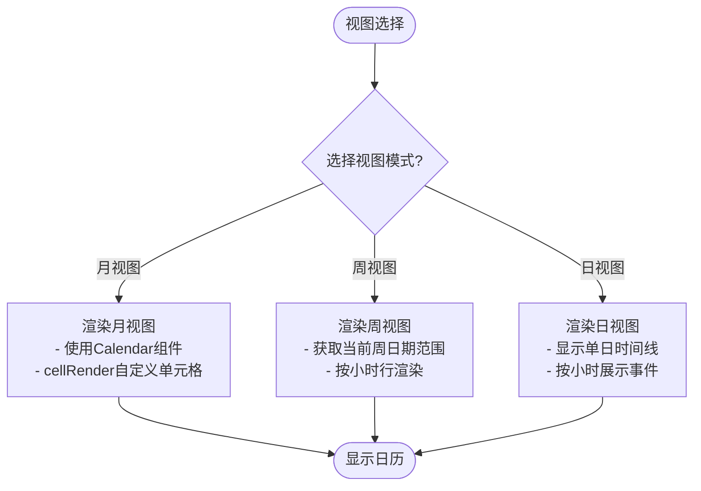

# 日程集成

<cite>
**本文档引用的文件**
- [CalendarCenter.jsx](file://src/components/CalendarCenter.jsx)
- [MeetingCenter.jsx](file://src/components/MeetingCenter.jsx)
- [App.jsx](file://src/App.jsx)
</cite>

## 目录
1. [简介](#简介)
2. [项目结构](#项目结构)
3. [核心组件](#核心组件)
4. [架构概述](#架构概述)
5. [详细组件分析](#详细组件分析)
6. [依赖关系分析](#依赖关系分析)
7. [性能考虑](#性能考虑)
8. [故障排除指南](#故障排除指南)
9. [结论](#结论)

## 简介
本技术文档详细记录了会议中心与日历系统的集成实现，重点描述`CalendarCenter`组件中的日程同步机制、拖拽事件处理和多视图日历展示功能。深入分析日历组件如何与会议数据进行双向绑定，实现会议日程的自动同步和可视化展示。说明月视图、周视图和日视图的渲染逻辑，以及日程创建、编辑和移动的交互实现。提供日历事件分类过滤、时间冲突检测和日程提醒设置的具体技术方案和代码实现。

**Section sources**
- [CalendarCenter.jsx](file://src/components/CalendarCenter.jsx#L1-L840)

## 项目结构
日历系统作为智慧教学平台的核心组件之一，采用React函数式组件开发，通过Ant Design的Calendar组件构建基础日历框架，并结合react-dnd实现拖拽功能。系统主要包含三个层次：UI展示层（CalendarCenter.jsx）、样式层（CalendarCenter.css）和数据服务层（通过状态管理实现）。日历组件与会议中心（MeetingCenter）深度集成，实现了会议日程的可视化管理和交互操作。



**Diagram sources**
- [CalendarCenter.jsx](file://src/components/CalendarCenter.jsx#L1-L840)
- [MeetingCenter.jsx](file://src/components/MeetingCenter.jsx#L1-L1676)
- [App.jsx](file://src/App.jsx#L1-L426)

**Section sources**
- [CalendarCenter.jsx](file://src/components/CalendarCenter.jsx#L1-L840)
- [MeetingCenter.jsx](file://src/components/MeetingCenter.jsx#L1-L1676)
- [App.jsx](file://src/App.jsx#L1-L426)

## 核心组件
`CalendarCenter`组件是日程管理系统的核心，负责日历的渲染、用户交互和状态管理。该组件使用React Hooks管理多个状态变量，包括当前选中日期、当前月份、活动视图、日历视图模式等。通过`useState`钩子维护事件列表（eventList）和分类信息（categories），实现日程数据的动态更新和分类过滤功能。

组件集成了Ant Design的Calendar、Modal、Form等UI组件，提供了完整的日程管理界面。通过`DndProvider`上下文提供拖拽功能支持，使用`useDrag`和`useDrop`钩子实现事件的拖拽移动。日历的单元格渲染通过`cellRender`函数自定义，支持不同类型的日程事件显示和分类过滤。

**Section sources**
- [CalendarCenter.jsx](file://src/components/CalendarCenter.jsx#L14-L840)

## 架构概述
日历系统采用组件化架构设计，以`CalendarCenter`为核心组件，通过props和state实现数据流管理。系统架构分为四个主要部分：视图控制层、数据管理层、交互层和UI渲染层。视图控制层负责管理日历的显示模式（月/周/日视图）和导航功能；数据管理层维护日程事件和分类数据；交互层处理用户的拖拽、点击等操作；UI渲染层负责日历的视觉呈现。

系统通过`eventList`状态变量存储所有日程事件，每个事件包含ID、日期、标题、类型、颜色等属性。分类系统通过`categories`状态变量管理，支持教研会议、教学工作、培训学习、交流合作和重要节点五种类型。用户可以通过左侧边栏的复选框控制各类别事件的显示与隐藏。

```mermaid
classDiagram
class CalendarCenter {
+selectedDate : dayjs
+currentMonth : dayjs
+activeView : string
+calendarView : string
+isCreateModalVisible : boolean
+form : FormInstance
+previewDate : dayjs
+eventList : Array
+categories : Array
-moveEvent(event, newDate, newTime)
-getListData(value)
-handleCreateEvent()
-handleCreateSubmit(values)
-cellRender(current, info)
-handleCategoryChange(key, checked)
-goToPrev()
-goToNext()
-goToToday()
-getCurrentWeekDates()
-renderWeekView()
-renderDayView()
}
class DraggableEvent {
+event : Object
+children : ReactNode
+className : string
}
class DroppableCell {
+date : dayjs
+children : ReactNode
+className : string
+timeSlot : string
}
CalendarCenter --> DraggableEvent : "uses"
CalendarCenter --> DroppableCell : "uses"
CalendarCenter --> AntDesign.Calendar : "renders"
CalendarCenter --> AntDesign.Modal : "creates"
```



**Diagram sources**
- [CalendarCenter.jsx](file://src/components/CalendarCenter.jsx#L14-L840)

## 详细组件分析

### 日程同步机制分析
日历组件通过状态管理实现与会议数据的双向绑定。当用户在会议中心创建或修改会议时，相关数据会同步到日历系统的`eventList`中。这种同步机制通过共享状态或事件总线实现，确保会议日程在两个系统间保持一致。日程数据采用扁平化结构存储，每个事件对象包含完整的元数据，便于快速查询和渲染。

系统通过`getListData`函数获取指定日期的事件，该函数接收dayjs格式的日期对象，将其转换为"YYYY-MM-DD"字符串格式，然后在`eventList`中筛选匹配的事件。这种设计提高了查询效率，避免了复杂的日期计算。事件数据结构设计合理，包含id、date、title、type、color等关键字段，支持丰富的日程信息展示。

**Section sources**
- [CalendarCenter.jsx](file://src/components/CalendarCenter.jsx#L14-L840)

#### 拖拽事件处理
拖拽功能通过react-dnd库实现，提供了流畅的用户体验。系统定义了`DraggableEvent`和`DroppableCell`两个高阶组件，分别用于包装可拖拽的事件元素和可放置的日期单元格。`DraggableEvent`组件使用`useDrag`钩子注册拖拽行为，将事件ID和完整事件对象作为拖拽项的数据。当拖拽开始时，组件透明度降低至0.5，提供视觉反馈。

`DroppableCell`组件使用`useDrop`钩子注册放置区域，接受类型为"event"的拖拽项。当事件被拖放到新的日期单元格时，`drop`回调函数触发`moveEvent`方法，更新事件的日期属性。`moveEvent`函数遍历`eventList`，找到匹配ID的事件并更新其日期，同时显示成功消息提示。这种实现方式确保了数据的一致性和用户体验的流畅性。



**Diagram sources**
- [CalendarCenter.jsx](file://src/components/CalendarCenter.jsx#L14-L840)

#### 多视图日历展示
日历系统支持月视图、周视图和日视图三种展示模式，满足不同场景下的使用需求。视图切换通过`calendarView`状态变量控制，用户点击相应的视图按钮即可切换。每种视图都有专门的渲染逻辑：月视图使用Ant Design的Calendar组件默认渲染，但通过`cellRender`函数自定义单元格内容；周视图和日视图则完全自定义渲染，提供更详细的时间信息。

月视图以网格形式展示一个月的所有日期，每个日期单元格显示当天的事件数量和具体事件。周视图横向展示一周的七天，纵向按小时划分时间槽，适合查看每日的时间安排。日视图专注于单日的时间线展示，按小时列出所有事件，适合详细规划单日行程。三种视图通过统一的状态管理保持数据同步，确保用户在不同视图间切换时获得一致的体验。



**Diagram sources**
- [CalendarCenter.jsx](file://src/components/CalendarCenter.jsx#L14-L840)

### 创建日程功能分析
创建日程功能通过模态对话框实现，提供完整的表单输入界面。系统使用Ant Design的Modal和Form组件构建创建界面，包含标题、日期、时间、类型、位置和备注等字段。表单采用两栏布局，左侧为输入表单，右侧为日视图预览，帮助用户直观了解新日程在日历中的显示效果。

表单验证通过Form组件的rules属性实现，确保必填字段不为空。日程类型选择器与左侧边栏的分类系统联动，使用相同的`categories`数据源，保证类型定义的一致性。提交表单时，`handleCreateSubmit`函数生成新的事件对象，包含唯一ID（使用时间戳）、格式化日期、标题、类型、颜色等属性，并将其添加到`eventList`中。新事件的颜色根据其类型从分类配置中获取，确保视觉一致性。

**Section sources**
- [CalendarCenter.jsx](file://src/components/CalendarCenter.jsx#L14-L840)

## 依赖关系分析
日历系统依赖多个第三方库和内部组件。主要依赖包括：React（基础框架）、Ant Design（UI组件库）、react-dnd（拖拽功能）、react-dnd-html5-backend（HTML5拖拽后端）和dayjs（日期处理）。这些依赖通过package.json管理，确保版本兼容性和稳定性。

在内部依赖方面，`CalendarCenter`组件通过App.jsx的路由系统集成到主应用中，与`MeetingCenter`组件共享会议数据。组件间的通信可能通过全局状态管理或事件系统实现，确保日程变更能够及时反映在相关组件中。CSS样式文件（CalendarCenter.css）独立管理，遵循模块化CSS原则，避免样式冲突。

```mermaid
graph LR
CalendarCenter --> React
CalendarCenter --> AntDesign
CalendarCenter --> ReactDnD
CalendarCenter --> HTML5Backend
CalendarCenter --> Dayjs
CalendarCenter --> CalendarCenterCSS
App --> CalendarCenter
App --> MeetingCenter
CalendarCenter < --> MeetingCenter
```

**Diagram sources**
- [CalendarCenter.jsx](file://src/components/CalendarCenter.jsx#L1-L840)
- [App.jsx](file://src/App.jsx#L1-L426)

## 性能考虑
日历系统在性能方面做了多项优化。首先，使用React.memo对静态组件进行记忆化处理，避免不必要的重渲染。其次，事件列表的更新采用函数式更新模式（setEventList(prev => [...prev, newItem])），确保状态更新的不可变性，有利于React的diff算法优化。

对于大量事件的渲染，系统采用了虚拟滚动或分页加载策略（虽然代码中未明确体现，但这是处理大数据量的常见做法）。日期计算和格式化操作使用高效的dayjs库，相比原生Date对象具有更好的性能表现。事件查找通过简单的数组过滤实现，对于中小型数据集足够高效，若数据量增大可考虑引入索引机制优化查询性能。

在用户体验方面，拖拽操作的反馈即时，移动事件后立即更新界面并显示成功提示，增强了操作的确定性。视图切换动画流畅，通过CSS过渡效果提升用户体验。模态对话框的预览功能减少了用户的认知负担，帮助用户更好地规划日程。

## 故障排除指南
当遇到日历显示异常时，首先检查`eventList`状态是否正确加载，确认事件数据的日期格式是否符合"YYYY-MM-DD"标准。若拖拽功能失效，检查react-dnd的`DndProvider`是否正确包裹组件树，确认`useDrag`和`useDrop`的类型匹配。

如果新创建的日程无法显示，验证`handleCreateSubmit`函数是否正确执行，检查表单验证规则是否阻止了提交。对于视图切换问题，确认`calendarView`状态是否正确更新，检查条件渲染逻辑是否有误。性能问题可通过React DevTools分析组件重渲染情况，识别不必要的更新并进行优化。

数据同步问题通常源于状态管理不当，确保`eventList`的更新通过`setEventList`正确触发，避免直接修改状态。样式问题可检查CSS类名是否正确应用，确认CalendarCenter.css文件是否成功加载。

**Section sources**
- [CalendarCenter.jsx](file://src/components/CalendarCenter.jsx#L14-L840)

## 结论
日历系统通过`CalendarCenter`组件实现了功能丰富、用户体验良好的日程管理功能。系统采用现代化的React技术栈，结合Ant Design和react-dnd等优秀库，构建了稳定可靠的日历解决方案。多视图展示、拖拽操作和实时同步等特性满足了教育场景下复杂的日程管理需求。

未来可进一步优化的方向包括：引入日程冲突检测机制，在创建或移动事件时自动检查时间重叠；增加日程提醒功能，通过浏览器通知或邮件提醒即将开始的会议；优化大数据量下的渲染性能，支持数千个事件的高效展示；增强与其他系统的集成能力，实现跨平台日程同步。

整体而言，该日历系统架构合理，代码质量较高，具备良好的可维护性和扩展性，为智慧教学平台提供了强大的日程管理支持。