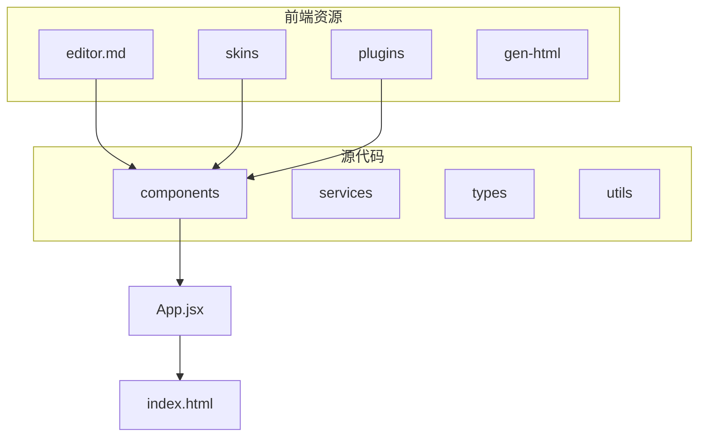
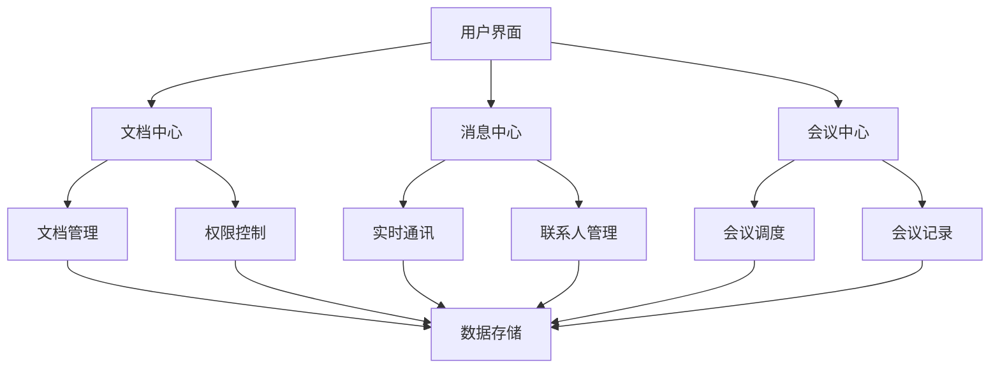
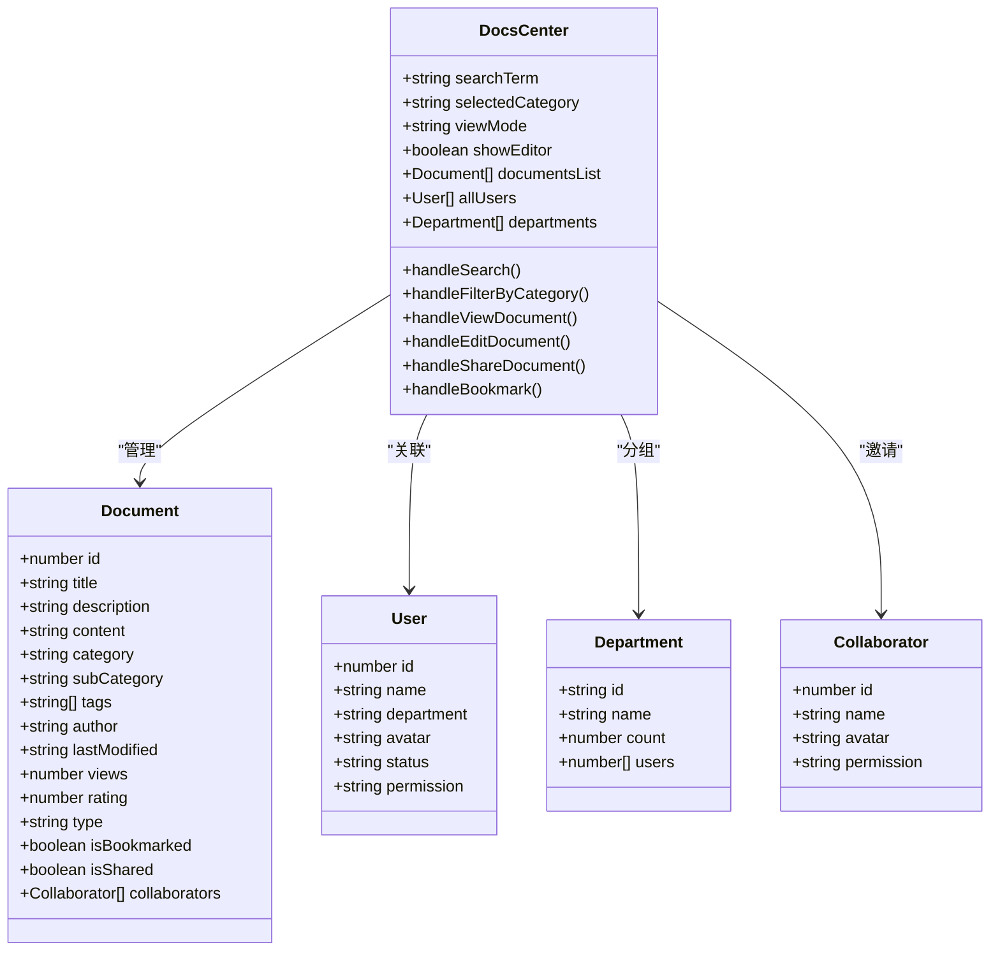
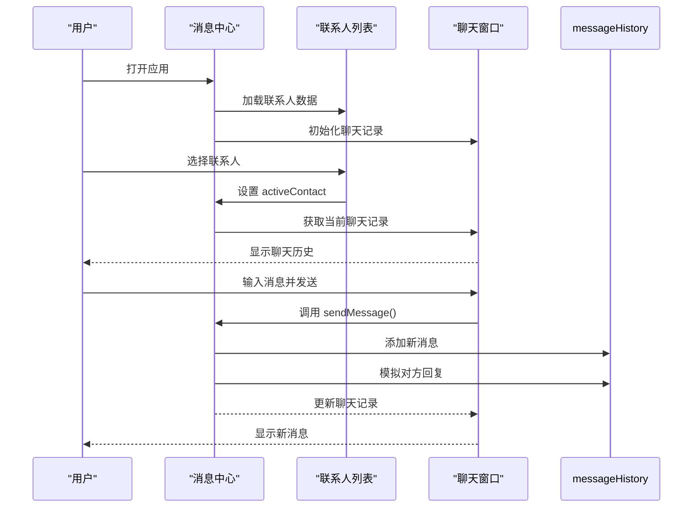
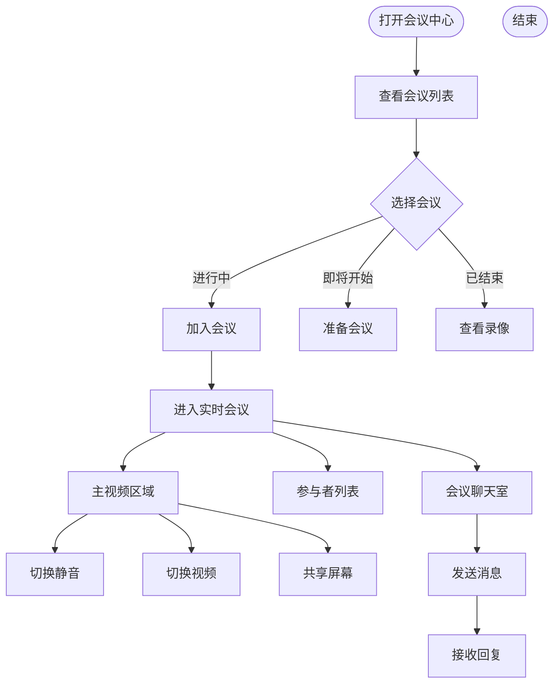
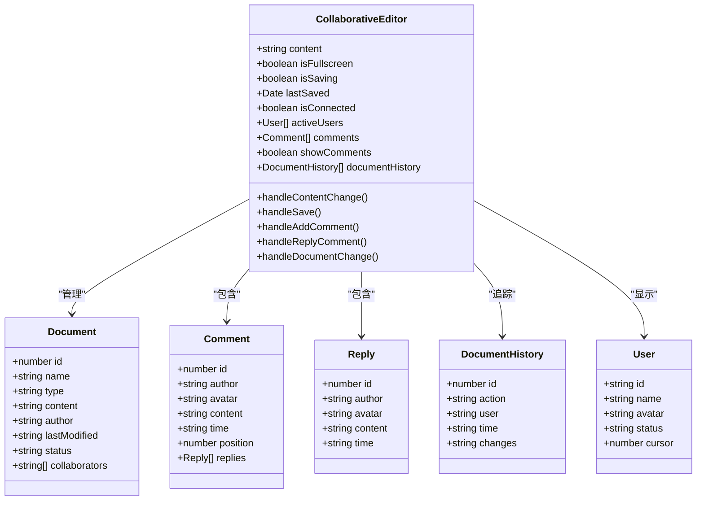
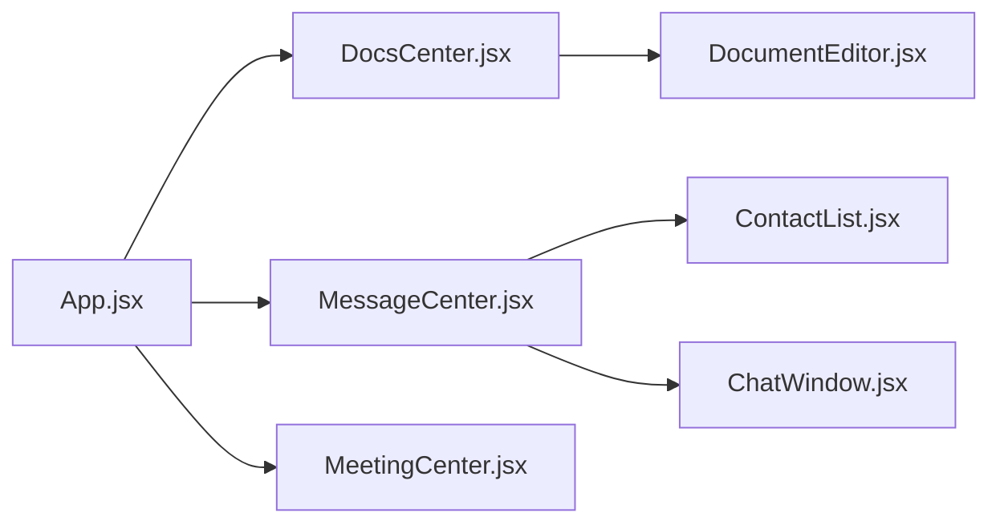

# 协作工具集

<cite>
**本文档引用的文件**
- [DocsCenter.jsx](file://src/components/DocsCenter.jsx)
- [MessageCenter.jsx](file://src/components/MessageCenter.jsx)
- [MeetingCenter.jsx](file://src/components/MeetingCenter.jsx)
- [CollaborativeEditor.jsx](file://src/components/CollaborativeEditor.jsx)
</cite>

## 目录
1. [简介](#简介)
2. [项目结构](#项目结构)
3. [核心组件](#核心组件)
4. [架构概览](#架构概览)
5. [详细组件分析](#详细组件分析)
6. [依赖关系分析](#依赖关系分析)
7. [性能考量](#性能考量)
8. [故障排除指南](#故障排除指南)
9. [结论](#结论)

## 简介
本技术文档全面记录了协作工具集的各项功能实现，重点分析了三大协作组件：文档中心、消息中心和会议中心。文档深入探讨了DocsCenter组件的文档管理和共享机制，MessageCenter组件的实时消息传递系统，以及MeetingCenter组件的会议安排和提醒功能。特别说明了CollaborativeEditor组件的协同编辑技术实现和版本控制策略。通过具体代码示例展示了实时同步算法、冲突解决机制和权限管理方案，并解释了这些工具如何无缝集成，形成完整的协作生态系统。文档涵盖了通信协议、数据一致性保证和性能优化技巧，同时为用户提供高效协作的最佳实践指南。

## 项目结构
协作工具集采用模块化设计，主要分为前端资源和源代码两大目录。`public`目录包含富文本编辑器（editor.md）、UI皮肤、插件和静态资源，而`src`目录则包含了所有React组件、服务、类型定义和工具函数。核心协作功能由`DocsCenter`、`MessageCenter`、`MeetingCenter`和`CollaborativeEditor`等组件实现，它们共同构成了一个完整的教育管理系统。

**图表来源**
- [DocsCenter.jsx](file://src/components/DocsCenter.jsx)
- [MessageCenter.jsx](file://src/components/MessageCenter.jsx)
- [MeetingCenter.jsx](file://src/components/MeetingCenter.jsx)

## 核心组件
协作工具集的核心由三个主要组件构成：文档中心、消息中心和会议中心。文档中心（DocsCenter）提供了一个强大的文档管理和共享平台，支持多种文档类型，如多维表格、文档、幻灯片和思维笔记。它实现了基于分类和标签的文档组织方式，并提供了收藏、搜索和权限管理功能。消息中心（MessageCenter）构建了一个实时通讯系统，支持一对一聊天、群组讨论和系统通知，确保信息能够及时传达。会议中心（MeetingCenter）则是一个虚拟会议与研讨平台，允许用户创建、管理和参与在线或线下的教研会议、学术研讨和工作交流会。

**章节来源**
- [DocsCenter.jsx](file://src/components/DocsCenter.jsx#L0-L1683)
- [MessageCenter.jsx](file://src/components/MessageCenter.jsx#L0-L695)
- [MeetingCenter.jsx](file://src/components/MeetingCenter.jsx#L0-L1676)

## 架构概览
整个协作工具集的架构围绕着以用户为中心的设计理念展开。前端使用React框架构建单页应用，通过Ant Design组件库实现现代化的UI界面。各核心组件通过状态管理进行数据交互，形成了一个松耦合但高度协同的系统。文档中心负责知识资产的沉淀与共享，消息中心作为沟通的桥梁，而会议中心则提供了面对面（无论是线上还是线下）交流的场所。这三个组件的数据最终都汇聚到统一的主应用中，为用户提供了一站式的协作体验。

**图表来源**
- [DocsCenter.jsx](file://src/components/DocsCenter.jsx)
- [MessageCenter.jsx](file://src/components/MessageCenter.jsx)
- [MeetingCenter.jsx](file://src/components/MeetingCenter.jsx)

## 详细组件分析

### 文档中心分析
文档中心是协作工具集的知识库核心，它不仅提供了文档的创建、编辑和查看功能，还实现了复杂的权限管理和协作机制。其文档列表采用网格和列表两种视图模式，方便用户浏览。通过分类树形结构，用户可以快速定位到教学准备、教学实施、教学评估和教学管理等不同类别的文档。每个文档卡片都显示了标题、描述、标签、访问量和评分等元数据，帮助用户快速了解文档内容。

#### 文档中心类图

**图表来源**
- [DocsCenter.jsx](file://src/components/DocsCenter.jsx#L62-L1683)

### 消息中心分析
消息中心实现了高效的实时通讯功能，支持系统消息、个人消息和群组消息的发送与接收。它维护了一个联系人列表，显示了每个联系人的姓名、头像、最后一条消息和未读消息数。聊天窗口支持文本消息的发送，并模拟了对方回复的功能。该组件通过`messageHistory`状态对象来存储不同联系人的聊天记录，确保了对话的连续性和私密性。

#### 消息中心序列图

**图表来源**
- [MessageCenter.jsx](file://src/components/MessageCenter.jsx#L0-L695)

### 会议中心分析
会议中心提供了一个完整的会议生命周期管理解决方案，从会议的创建、安排到实时参与和后续的录像回放。用户可以在“会议列表”中查看所有会议的状态（即将开始、进行中、已结束），并通过点击操作加入、准备或查看录像。在“实时会议”模式下，系统模拟了视频会议的主视频区域、参与者列表和聊天室，支持静音、开启/关闭视频和屏幕共享等核心功能。

#### 会议中心流程图

**图表来源**
- [MeetingCenter.jsx](file://src/components/MeetingCenter.jsx#L43-L1676)

### 协同编辑器分析
协同编辑器（CollaborativeEditor）是文档中心的核心功能之一，它允许多个用户同时对同一份文档进行编辑。该组件实现了实时光标指示、评论与讨论、文档历史版本追踪等功能。当用户选中文本时，可以添加评论，其他协作者可以进行回复，形成了一个围绕文档内容的讨论区。底部状态栏实时显示当前光标位置、字符数和在线协作者数量，增强了协作的透明度。

#### 协同编辑器类图

**图表来源**
- [CollaborativeEditor.jsx](file://src/components/CollaborativeEditor.jsx#L52-L628)

**章节来源**
- [CollaborativeEditor.jsx](file://src/components/CollaborativeEditor.jsx#L0-L628)

## 依赖关系分析
通过对代码库的分析，可以清晰地看到各个组件之间的依赖关系。`App.jsx`作为根组件，引入了`DocsCenter`、`MessageCenter`和`MeetingCenter`，并将它们整合到主布局中。`DocsCenter`依赖于`DocumentEditor`组件来提供具体的文档编辑功能，而`MessageCenter`则依赖于`ContactList`和`ChatWindow`两个子组件来分别处理联系人展示和聊天交互。`MeetingCenter`自身较为独立，但其内部逻辑复杂，包含了会议创建、实时会议、录像回放和统计分析等多个功能模块。

**图表来源**
- [App.jsx](file://src/App.jsx)
- [DocsCenter.jsx](file://src/components/DocsCenter.jsx)
- [MessageCenter.jsx](file://src/components/MessageCenter.jsx)
- [MeetingCenter.jsx](file://src/components/MeetingCenter.jsx)

**章节来源**
- [App.jsx](file://src/App.jsx#L90-L147)
- [DocsCenter.jsx](file://src/components/DocsCenter.jsx)
- [MessageCenter.jsx](file://src/components/MessageCenter.jsx)
- [MeetingCenter.jsx](file://src/components/MeetingCenter.jsx)

## 性能考量
协作工具集在设计时考虑了性能优化。例如，文档中心通过本地存储（localStorage）缓存最近访问的文档记录，减少了重复加载的时间。协同编辑器实现了自动保存功能，每隔30秒检查文档内容是否有变化，若有则触发保存，既保证了数据安全又避免了过于频繁的网络请求。消息中心和会议中心都采用了模拟数据的方式，这表明在实际生产环境中，需要与后端API进行高效的数据同步，以确保实时性。

## 故障排除指南
如果遇到问题，可以按照以下步骤进行排查：
1.  **无法加载文档**：检查`documentsList`状态是否正确初始化，确认`initialDocuments`数组中的数据格式是否符合预期。
2.  **消息发送失败**：检查`sendMessage`函数中的`newMessage`是否为空，确保`activeContact`已被正确设置。
3.  **会议无法加入**：确认`currentMeeting`状态是否被正确赋值，检查`handleJoinMeeting`函数的调用时机。
4.  **协同编辑无响应**：检查`content`状态的更新是否通过`onChange`事件正确绑定，确认`handleContentChange`函数是否正常执行。

**章节来源**
- [DocsCenter.jsx](file://src/components/DocsCenter.jsx)
- [MessageCenter.jsx](file://src/components/MessageCenter.jsx)
- [MeetingCenter.jsx](file://src/components/MeetingCenter.jsx)
- [CollaborativeEditor.jsx](file://src/components/CollaborativeEditor.jsx)

## 结论
协作工具集通过精心设计的`DocsCenter`、`MessageCenter`和`MeetingCenter`三大组件，成功构建了一个功能完备的教育协作生态系统。文档中心实现了知识的有效沉淀与共享，消息中心保障了信息的即时流通，而会议中心则为深度交流提供了平台。特别是`CollaborativeEditor`组件，通过实时同步、评论互动和版本历史等功能，极大地提升了团队协作的效率。未来可进一步集成AI助手，利用智能推荐和自动化生成来提升用户体验。