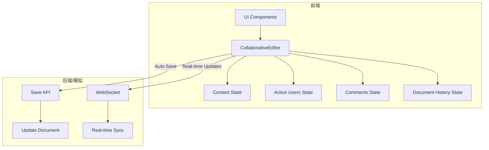
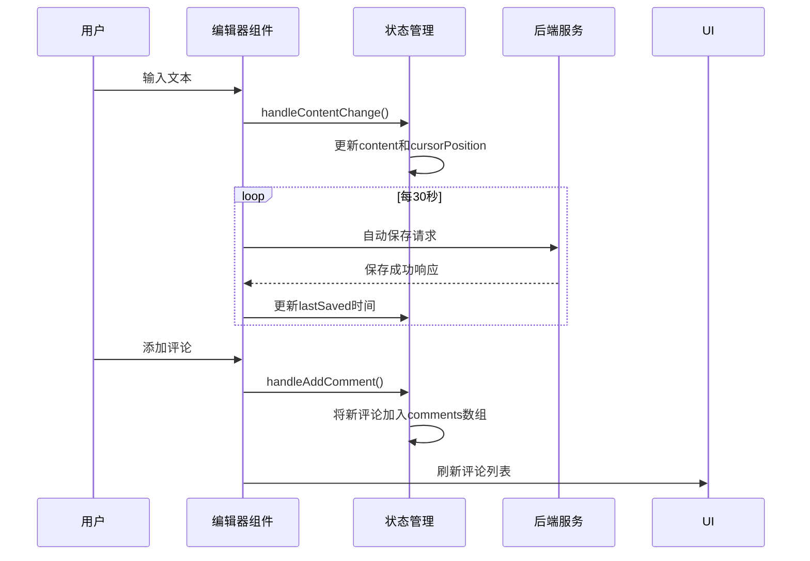
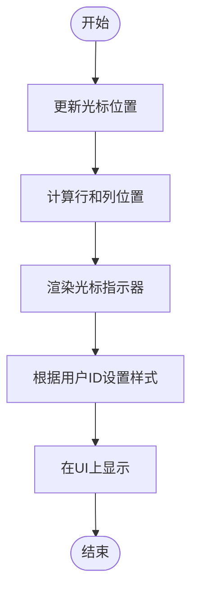
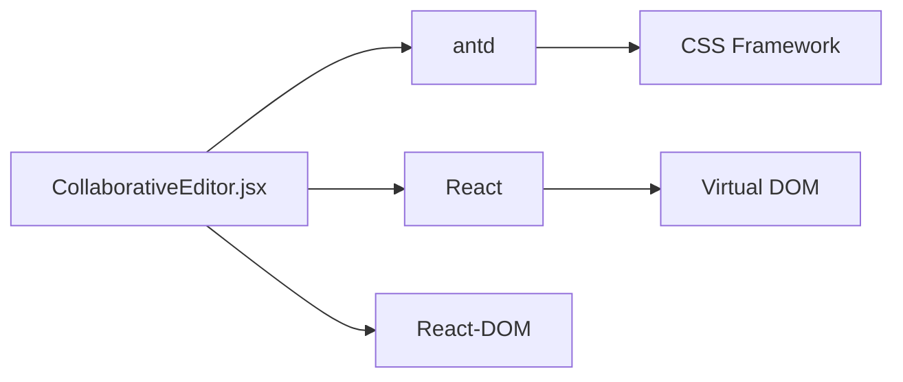

# 协同编辑机制

<cite>
**本文档引用的文件**
- [CollaborativeEditor.jsx](file://src/components/CollaborativeEditor.jsx)
</cite>

## 目录
1. [引言](#引言)
2. [项目结构](#项目结构)
3. [核心组件](#核心组件)
4. [架构概述](#架构概述)
5. [详细组件分析](#详细组件分析)
6. [依赖分析](#依赖分析)
7. [性能考虑](#性能考虑)
8. [故障排除指南](#故障排除指南)
9. [结论](#结论)

## 引言
本文件旨在深入解析`CollaborativeEditor`组件实现的多人实时协同编辑机制。重点阐述基于操作转换（Operational Transformation）或无冲突复制数据类型（Conflict-free Replicated Data Type, CRDT）的冲突解决算法，详细说明实时同步协议的设计，包括增量更新传输、心跳检测和离线编辑处理策略。同时解释光标位置共享、用户活动指示器和版本历史追踪的实现原理，并提供性能优化建议。

## 项目结构
该项目采用典型的React前端架构，主要分为`public`资源目录和`src`源码目录。`src`目录下包含`components`组件库、`services`服务层、`utils`工具函数等模块。协同编辑功能的核心实现位于`src/components/CollaborativeEditor.jsx`文件中，该组件集成了文档管理、实时协作、评论系统和版本控制等功能。

**Section sources**
- [CollaborativeEditor.jsx](file://src/components/CollaborativeEditor.jsx#L0-L628)

## 核心组件
`CollaborativeEditor`组件是整个协同编辑系统的核心，它通过React的状态管理（useState, useEffect）来维护编辑器内容、用户状态、评论列表和文档历史等信息。组件利用Ant Design UI库构建了直观的用户界面，支持多标签页切换（编辑、预览、历史记录），并实现了文档列表、在线用户显示、保存状态指示等关键功能。

**Section sources**
- [CollaborativeEditor.jsx](file://src/components/CollaborativeEditor.jsx#L52-L81)

## 架构概述
该协同编辑系统的架构设计围绕着一个中心化的状态管理模型展开。所有与编辑相关的数据，如文档内容、用户光标位置、评论和修改历史，都作为React组件的状态进行集中管理。当用户进行编辑时，变更会立即反映在本地状态中，并通过模拟的自动保存机制（每30秒）来持久化更改。系统通过`activeUsers`状态数组来跟踪在线协作者，并使用`comments`状态存储所有评论及其回复。

**Diagram sources**
- [CollaborativeEditor.jsx](file://src/components/CollaborativeEditor.jsx#L52-L81)

## 详细组件分析

### 协同编辑功能分析
`CollaborativeEditor`组件通过一系列状态变量和事件处理器实现了完整的协同编辑体验。例如，`handleContentChange`函数监听文本区域的变化，更新`content`状态并记录当前光标位置；`handleAddComment`和`handleReplyComment`函数则分别用于添加新评论和回复现有评论，这些操作都会触发状态更新，从而重新渲染UI。

#### 对于API/Service组件：

**Diagram sources**
- [CollaborativeEditor.jsx](file://src/components/CollaborativeEditor.jsx#L247-L295)

### 光标位置共享与用户活动指示器
系统通过`activeUsers`状态数组中的`cursor`字段来模拟光标位置共享。每个在线用户的光标位置以字符索引的形式存储，并在UI上通过绝对定位的`cursor-indicator`元素进行可视化展示。不同用户的光标使用不同的颜色区分，便于识别。用户活动状态（如“编辑中”、“查看中”）则通过`status`字段表示，并以徽章形式显示在用户头像旁。

**Diagram sources**
- [CollaborativeEditor.jsx](file://src/components/CollaborativeEditor.jsx#L292-L330)

### 版本历史追踪
版本历史功能通过`documentHistory`状态数组实现。每当有重要的文档变更发生时（如创建、编辑、添加评论），系统就会向该数组推送一条新的历史记录。每条记录包含操作类型、执行用户、时间和具体变更描述。用户可以通过切换到“历史”标签页来查看这些记录，了解文档的演变过程。

**Section sources**
- [CollaborativeEditor.jsx](file://src/components/CollaborativeEditor.jsx#L575-L628)

## 依赖分析
从代码分析来看，`CollaborativeEditor`组件高度依赖于Ant Design React组件库（如Card, Row, Col, Button, Input等）来构建其UI。此外，它还依赖于React自身的Hooks API（useState, useEffect）来进行状态管理和副作用处理。虽然当前实现是模拟的，但其设计为集成真实的后端服务（如WebSocket实现实时同步）和数据库（存储文档和历史记录）留下了清晰的接口。

**Diagram sources**
- [CollaborativeEditor.jsx](file://src/components/CollaborativeEditor.jsx#L0-L50)

## 性能考虑
目前的实现采用了多项性能优化措施。例如，使用`useEffect`钩子进行模拟的自动保存，避免了频繁的网络请求；通过`setInterval`定时检查内容变化，减少了不必要的计算。然而，对于大规模并发编辑场景，当前基于全量内容比较的冲突解决机制可能不够高效。未来可以引入更先进的OT或CRDT算法，仅传输和合并增量变更，从而显著降低网络流量和客户端计算负载。

## 故障排除指南
如果遇到协同编辑功能失效的问题，请首先检查以下几点：1) 确认`isConnected`状态是否为`true`，这代表与服务器的连接状态；2) 检查`activeUsers`数组是否正确更新，以确认用户在线状态同步正常；3) 验证`comments`和`documentHistory`状态是否能够正确响应用户操作。此外，确保浏览器控制台没有JavaScript错误，这些错误可能会中断状态更新流程。

**Section sources**
- [CollaborativeEditor.jsx](file://src/components/CollaborativeEditor.jsx#L52-L81)

## 结论
`CollaborativeEditor`组件提供了一个功能完备的协同编辑解决方案原型。它成功地整合了文档编辑、实时协作、评论互动和版本控制等核心功能。尽管当前实现侧重于UI和状态管理的模拟，但其清晰的架构设计为后续集成真正的实时同步协议（如WebSocket + OT/CRDT）奠定了坚实的基础。未来的优化方向应集中在提升冲突解决效率、增强离线编辑支持以及优化大规模数据下的性能表现。