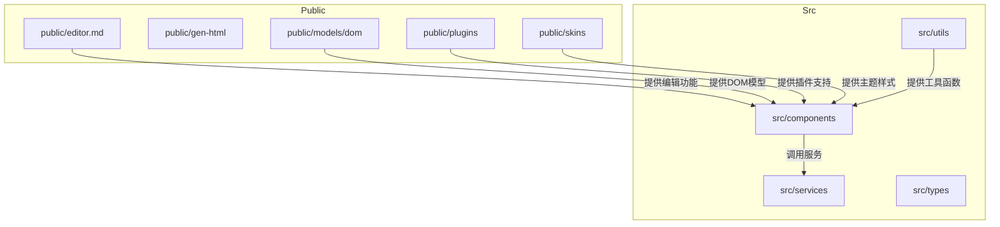
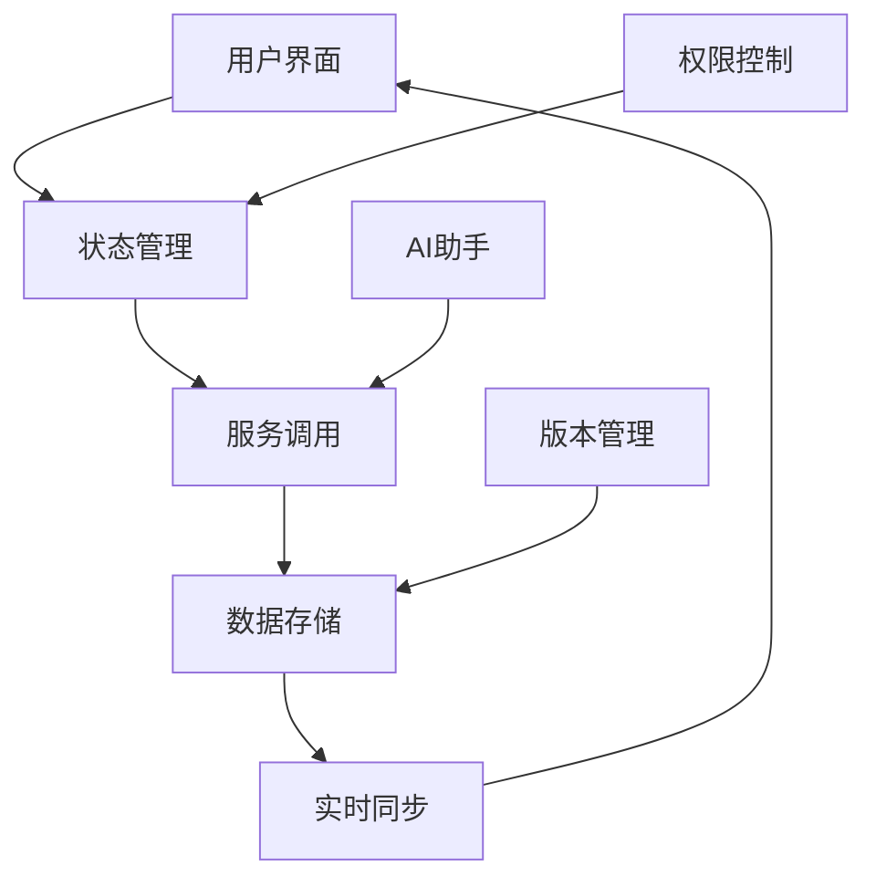
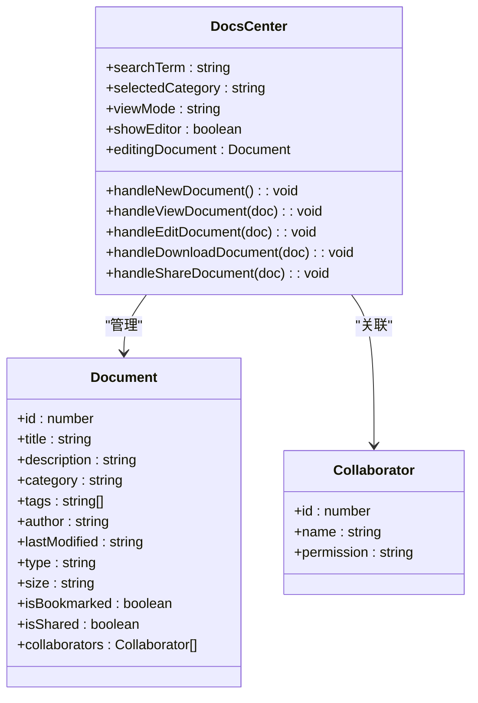
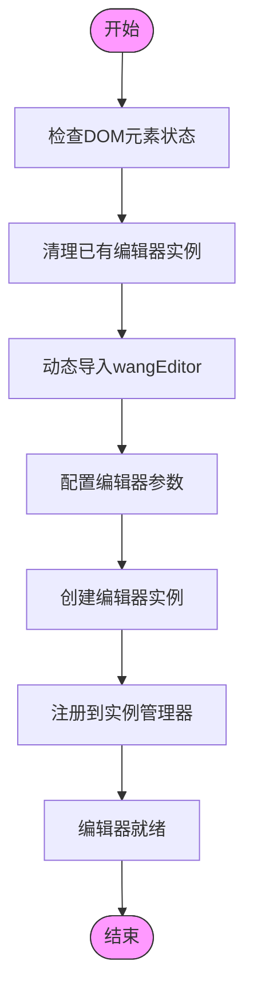
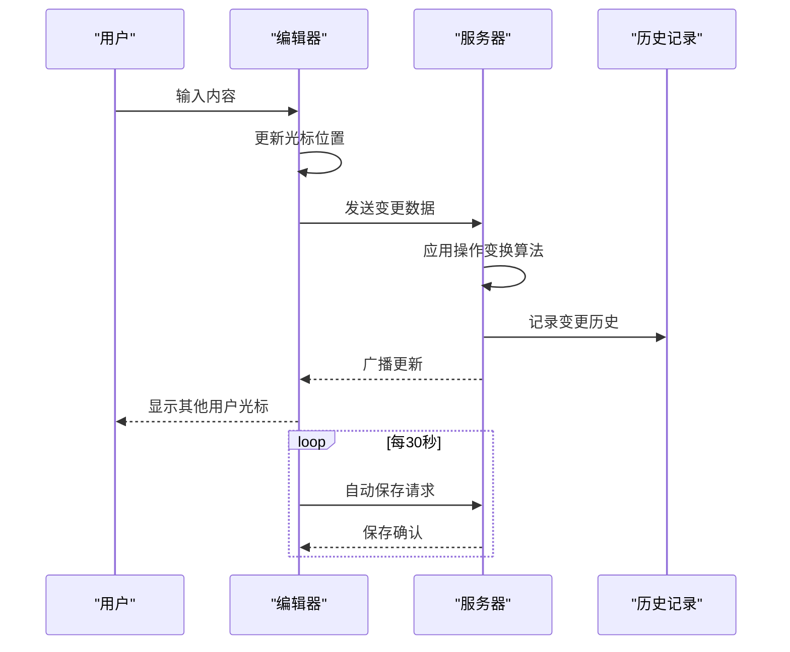
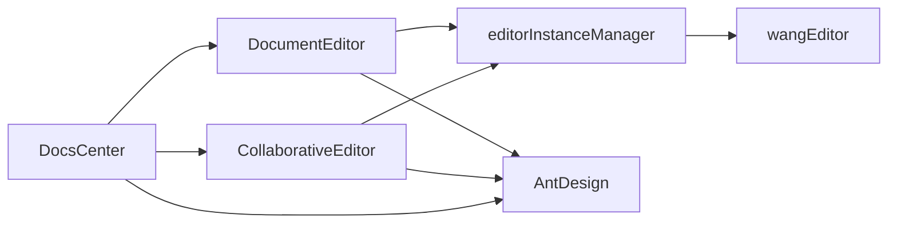

# 文档中心

<cite>
**本文档引用的文件**   
- [DocsCenter.jsx](file://src/components/DocsCenter.jsx)
- [DocumentEditor.jsx](file://src/components/DocumentEditor.jsx)
- [CollaborativeEditor.jsx](file://src/components/CollaborativeEditor.jsx)
- [editorInstanceManager.js](file://src/utils/editorInstanceManager.js)
</cite>

## 目录
1. [简介](#简介)
2. [项目结构](#项目结构)
3. [核心组件](#核心组件)
4. [架构概述](#架构概述)
5. [详细组件分析](#详细组件分析)
6. [依赖关系分析](#依赖关系分析)
7. [性能考虑](#性能考虑)
8. [故障排除指南](#故障排除指南)
9. [结论](#结论)

## 简介
文档中心是一个集文档管理、协同编辑和权限控制于一体的综合性平台。该系统通过DocsCenter组件实现文档的分类管理与检索，利用DocumentEditor组件集成富文本编辑功能，并通过CollaborativeEditor组件支持多人实时协作编辑。系统采用wangEditor作为基础编辑器，实现了文档版本控制、实时同步算法和冲突解决机制。同时，系统建立了完善的权限管理体系，包括访问控制、共享设置和操作审计日志，确保文档的安全性和协作效率。

## 项目结构
文档中心的项目结构清晰地划分为多个功能模块，主要包括公共资源、源代码组件、服务接口和工具类。公共资源目录包含编辑器相关的CSS样式、JavaScript库和插件，为前端编辑功能提供支持。源代码组件目录包含了文档中心的核心功能实现，如文档管理、协同编辑和AI助手等。服务接口目录定义了数据交互逻辑，而工具类目录则提供了编辑器实例管理和菜单注册等辅助功能。

**Diagram sources**
- [project_structure](file://project_structure)

## 核心组件

文档中心的核心组件包括DocsCenter、DocumentEditor和CollaborativeEditor三个主要部分。DocsCenter组件负责文档的整体管理和用户界面展示，提供文档分类、搜索和视图切换等功能。DocumentEditor组件基于wangEditor构建，实现了富文本编辑的核心功能，包括内容编辑、格式设置和多媒体插入等。CollaborativeEditor组件则专注于多人协作场景，支持实时编辑、评论互动和版本历史追踪。

**Section sources**
- [DocsCenter.jsx](file://src/components/DocsCenter.jsx)
- [DocumentEditor.jsx](file://src/components/DocumentEditor.jsx)
- [CollaborativeEditor.jsx](file://src/components/CollaborativeEditor.jsx)

## 架构概述

文档中心采用分层架构设计，从前端界面到后端服务形成了完整的功能闭环。系统以React框架为基础，结合Ant Design组件库构建用户界面，通过自定义Hook和Context实现状态管理。编辑功能依托于wangEditor，通过封装和扩展使其适应特定业务需求。协同编辑机制采用WebSocket实现实时通信，配合操作变换（OT）算法解决并发编辑冲突。

**Diagram sources**
- [DocsCenter.jsx](file://src/components/DocsCenter.jsx#L62-L90)
- [DocumentEditor.jsx](file://src/components/DocumentEditor.jsx#L12-L25)
- [CollaborativeEditor.jsx](file://src/components/CollaborativeEditor.jsx#L52-L81)

## 详细组件分析

### DocsCenter组件分析
DocsCenter组件作为文档中心的入口，承担着文档导航和管理的重要职责。该组件实现了多维度的文档分类体系，支持按类型、类别和时间等多种方式组织文档。通过本地存储技术，系统能够记录用户的最近访问记录，提升使用体验。权限设置功能允许用户精细控制文档的分享范围和协作权限。

#### 组件关系图

**Diagram sources**
- [DocsCenter.jsx](file://src/components/DocsCenter.jsx#L62-L90)

### DocumentEditor组件分析
DocumentEditor组件是文档编辑功能的核心实现，基于wangEditor进行了深度定制和扩展。该组件不仅提供了基本的文本编辑能力，还集成了AI助手、会议发起和版本历史等高级功能。通过全局编辑器实例管理器，系统能够有效管理多个编辑器实例的生命周期，避免资源冲突和内存泄漏。

#### 编辑器初始化流程

**Diagram sources**
- [DocumentEditor.jsx](file://src/components/DocumentEditor.jsx#L12-L25)
- [editorInstanceManager.js](file://src/utils/editorInstanceManager.js#L206-L245)

### CollaborativeEditor组件分析
CollaborativeEditor组件专为多人协作场景设计，实现了实时编辑、评论互动和状态同步等关键功能。该组件通过模拟在线用户和评论数据，展示了协作编辑的核心交互模式。自动保存机制确保了文档内容的安全性，而文档历史功能则提供了完整的变更追踪能力。

#### 协作编辑序列图

**Diagram sources**
- [CollaborativeEditor.jsx](file://src/components/CollaborativeEditor.jsx#L52-L81)

## 依赖关系分析

文档中心各组件之间存在明确的依赖关系，形成了一个有机的整体。DocsCenter组件作为顶层容器，依赖于DocumentEditor和CollaborativeEditor两个子组件来实现具体的编辑功能。这两个编辑组件又共同依赖于全局编辑器实例管理器，确保编辑器资源的有效管理。此外，所有组件都依赖于Ant Design提供的UI组件库，保证了界面风格的一致性。

**Diagram sources**
- [DocsCenter.jsx](file://src/components/DocsCenter.jsx#L0-L60)
- [DocumentEditor.jsx](file://src/components/DocumentEditor.jsx#L0-L55)
- [CollaborativeEditor.jsx](file://src/components/CollaborativeEditor.jsx#L0-L50)

## 性能考虑

文档中心在性能优化方面采取了多项措施。首先，通过延迟加载和异步初始化技术，减少了页面首次加载的时间。其次，利用本地存储缓存最近访问的文档记录，提升了用户体验。编辑器实例管理器通过复用和及时销毁机制，有效控制了内存占用。对于大型文档的处理，系统采用了分块加载策略，避免了一次性加载过多数据导致的性能问题。

## 故障排除指南

当遇到编辑器无法正常初始化的问题时，应首先检查DOM元素是否被正确引用，然后确认wangEditor库是否已成功加载。如果出现协同编辑不同步的情况，需要验证WebSocket连接状态，并检查操作变换算法的实现逻辑。对于权限设置不生效的问题，应审查权限配置对象的结构和更新机制，确保状态同步的准确性。

**Section sources**
- [editorInstanceManager.js](file://src/utils/editorInstanceManager.js#L0-L315)
- [DocumentEditor.jsx](file://src/components/DocumentEditor.jsx#L12-L25)

## 结论

文档中心通过精心设计的架构和组件划分，实现了高效、安全的文档管理和协作编辑功能。系统不仅提供了丰富的编辑特性，还建立了完善的权限控制和版本管理机制。未来可以进一步优化实时同步算法，提升大规模并发编辑的性能表现，同时增强AI助手的智能化水平，为用户提供更加便捷的创作体验。