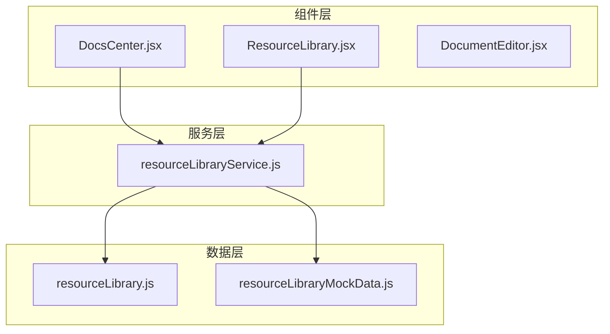
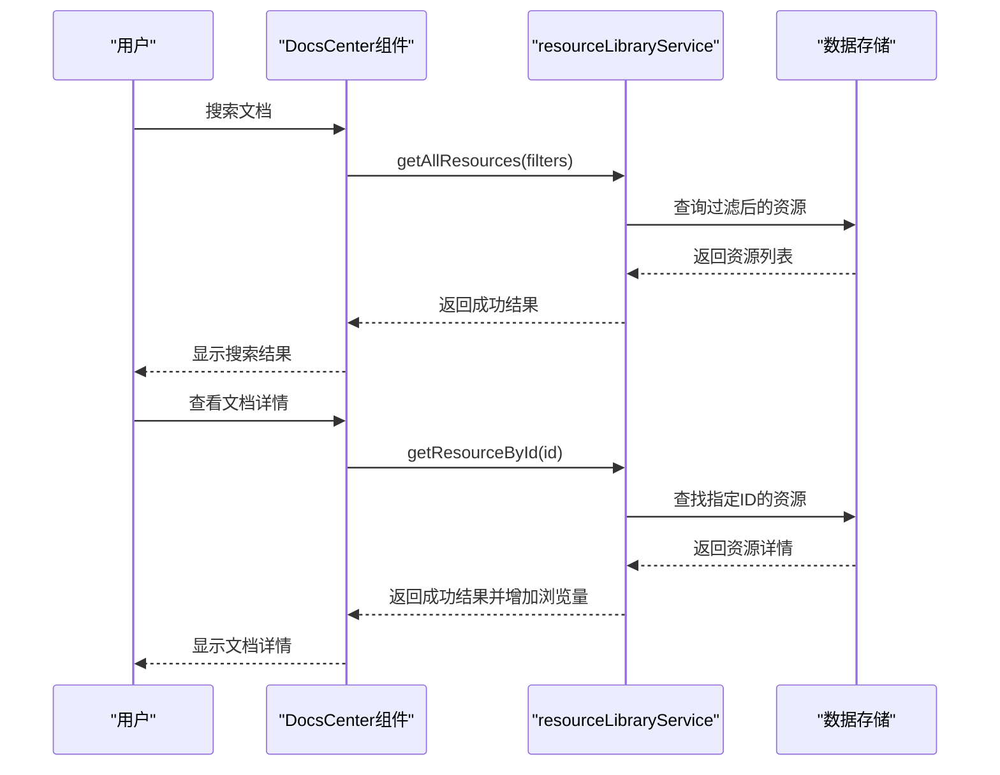
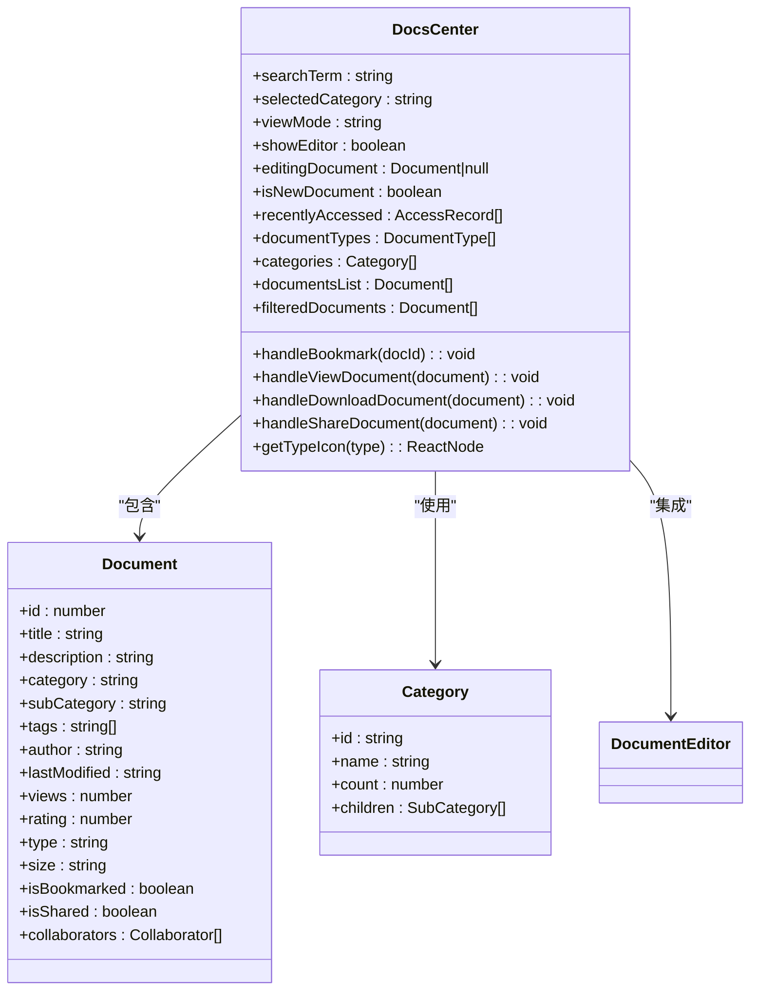
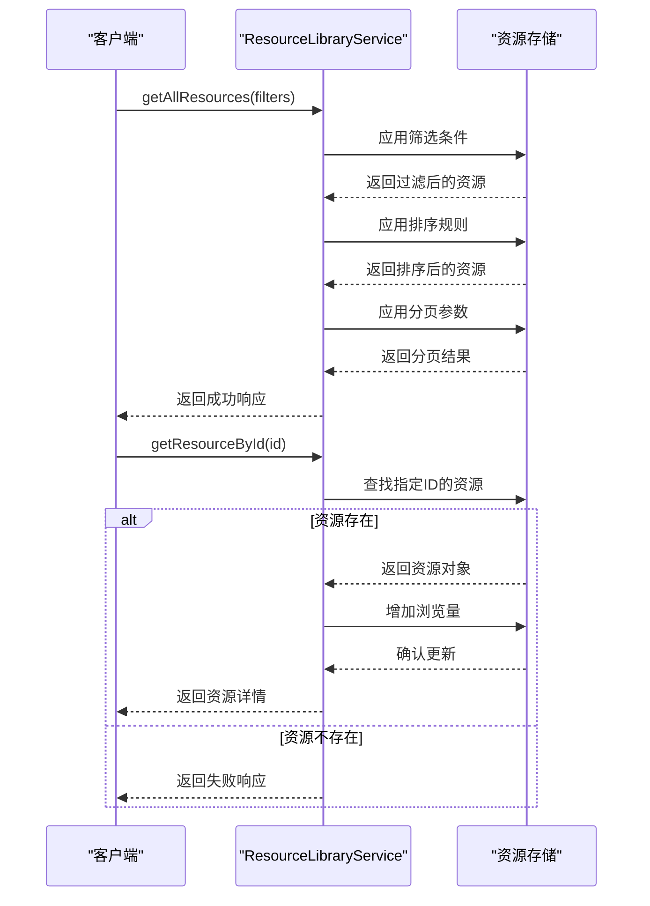
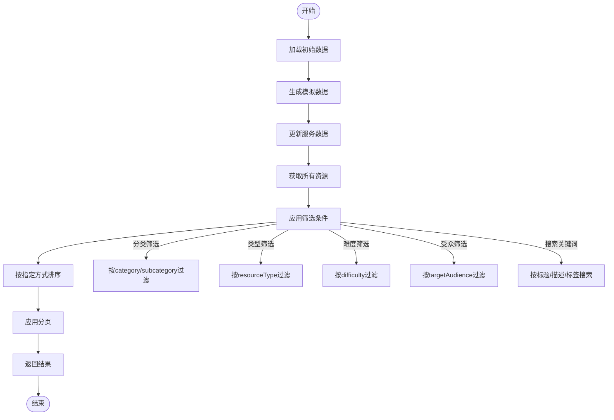
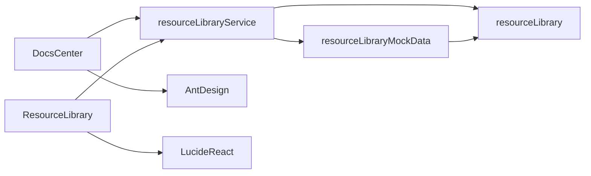

# 文档管理架构

<cite>
**本文档引用文件**   
- [DocsCenter.jsx](file://src/components/DocsCenter.jsx)
- [resourceLibraryService.js](file://src/services/resourceLibraryService.js)
- [ResourceLibrary.jsx](file://src/components/ResourceLibrary.jsx)
- [resourceLibrary.js](file://src/types/resourceLibrary.js)
- [resourceLibraryMockData.js](file://src/data/resourceLibraryMockData.js)
</cite>

## 目录
1. [引言](#引言)
2. [项目结构](#项目结构)
3. [核心组件](#核心组件)
4. [架构概述](#架构概述)
5. [详细组件分析](#详细组件分析)
6. [依赖关系分析](#依赖关系分析)
7. [性能考虑](#性能考虑)
8. [故障排除指南](#故障排除指南)
9. [结论](#结论)

## 引言
文档中心（DocsCenter）是系统中的核心模块，负责管理和组织各类教学文档资源。该模块提供完整的文档生命周期管理功能，包括创建、编辑、分类、搜索和共享等操作。通过与resourceLibraryService服务的深度集成，实现了高效的文档增删改查操作和复杂的元数据管理。系统采用现代化的前端架构，结合虚拟滚动和优化渲染策略，确保在处理大规模文档集时仍能保持流畅的用户体验。

## 项目结构
文档管理系统的代码主要分布在`src/components`和`src/services`目录下，形成了清晰的分层架构。核心组件`DocsCenter.jsx`位于组件目录中，负责用户界面的呈现和交互逻辑。服务层的`resourceLibraryService.js`提供了后端交互的核心功能，而类型定义和模拟数据则分别存储在`types`和`data`目录中。

**Diagram sources**
- [DocsCenter.jsx](file://src/components/DocsCenter.jsx)
- [resourceLibraryService.js](file://src/services/resourceLibraryService.js)
- [ResourceLibrary.jsx](file://src/components/ResourceLibrary.jsx)
- [resourceLibrary.js](file://src/types/resourceLibrary.js)
- [resourceLibraryMockData.js](file://src/data/resourceLibraryMockData.js)

**Section sources**
- [DocsCenter.jsx](file://src/components/DocsCenter.jsx)
- [resourceLibraryService.js](file://src/services/resourceLibraryService.js)

## 核心组件
文档中心的核心功能由`DocsCenter`组件实现，该组件管理文档的展示、搜索、分类和编辑等操作。通过状态管理，维护了搜索条件、选中分类、视图模式等用户交互状态。`resourceLibraryService`服务提供了文档的增删改查接口，支持多种筛选条件和排序方式。系统还实现了最近访问记录功能，通过localStorage持久化存储用户的访问历史。

**Section sources**
- [DocsCenter.jsx](file://src/components/DocsCenter.jsx#L0-L1684)
- [resourceLibraryService.js](file://src/services/resourceLibraryService.js#L0-L838)

## 架构概述
文档管理系统采用分层架构设计，前端组件与后端服务通过明确定义的接口进行通信。`DocsCenter`组件作为用户界面入口，调用`resourceLibraryService`提供的API方法获取和操作文档数据。服务层封装了与数据存储的交互逻辑，提供了统一的访问接口。类型系统定义了完整的数据模型，确保了数据的一致性和类型安全。

**Diagram sources**
- [DocsCenter.jsx](file://src/components/DocsCenter.jsx#L0-L1684)
- [resourceLibraryService.js](file://src/services/resourceLibraryService.js#L0-L838)

## 详细组件分析

### 文档中心组件分析
`DocsCenter`组件实现了完整的文档管理界面，包含搜索栏、分类导航、文档列表和编辑器等子组件。组件通过useState钩子管理多个状态变量，如搜索关键词、选中分类和视图模式等。文档列表支持网格和列表两种视图模式，用户可以根据偏好进行切换。

#### 对象导向组件：

**Diagram sources**
- [DocsCenter.jsx](file://src/components/DocsCenter.jsx#L0-L1684)

**Section sources**
- [DocsCenter.jsx](file://src/components/DocsCenter.jsx#L0-L1684)

### 资源库服务分析
`resourceLibraryService`是文档管理系统的核心服务，提供了完整的CRUD操作接口。服务类封装了对资源存储的访问逻辑，支持多种筛选条件和排序方式。每个API方法都包含错误处理机制，确保在异常情况下能够返回有意义的错误信息。

#### API/服务组件：

**Diagram sources**
- [resourceLibraryService.js](file://src/services/resourceLibraryService.js#L0-L838)

**Section sources**
- [resourceLibraryService.js](file://src/services/resourceLibraryService.js#L0-L838)

### 元数据管理分析
文档系统的元数据管理体系基于`resourceLibrary.js`中定义的数据模型，涵盖了文档的基本信息、分类、标签、统计等多个维度。每个文档都有丰富的元数据属性，包括创建时间、更新时间、作者、目标受众、适用年龄组等，这些元数据为文档的智能分类和精准搜索提供了基础支持。

#### 复杂逻辑组件：

**Diagram sources**
- [resourceLibraryService.js](file://src/services/resourceLibraryService.js#L0-L838)
- [resourceLibraryMockData.js](file://src/data/resourceLibraryMockData.js#L0-L816)

**Section sources**
- [resourceLibraryService.js](file://src/services/resourceLibraryService.js#L0-L838)
- [resourceLibraryMockData.js](file://src/data/resourceLibraryMockData.js#L0-L816)

## 依赖关系分析
文档管理系统各组件之间存在明确的依赖关系。`DocsCenter`组件直接依赖`resourceLibraryService`服务进行数据操作，同时依赖Ant Design等UI库提供界面组件。`resourceLibraryService`服务依赖`resourceLibrary.js`中定义的数据模型和类型，确保数据结构的一致性。模拟数据生成器依赖类型系统来创建符合规范的测试数据。

**Diagram sources**
- [DocsCenter.jsx](file://src/components/DocsCenter.jsx)
- [resourceLibraryService.js](file://src/services/resourceLibraryService.js)
- [ResourceLibrary.jsx](file://src/components/ResourceLibrary.jsx)
- [resourceLibrary.js](file://src/types/resourceLibrary.js)
- [resourceLibraryMockData.js](file://src/data/resourceLibraryMockData.js)

**Section sources**
- [DocsCenter.jsx](file://src/components/DocsCenter.jsx#L0-L1684)
- [resourceLibraryService.js](file://src/services/resourceLibraryService.js#L0-L838)
- [ResourceLibrary.jsx](file://src/components/ResourceLibrary.jsx#L0-L658)
- [resourceLibrary.js](file://src/types/resourceLibrary.js#L0-L464)
- [resourceLibraryMockData.js](file://src/data/resourceLibraryMockData.js#L0-L816)

## 性能考虑
文档管理系统在处理大规模文档集时采用了多种优化策略。首先，通过虚拟滚动技术避免了一次性渲染大量DOM元素，显著提升了页面加载速度和滚动流畅度。其次，搜索和筛选操作都在服务层完成，减少了前端的数据处理负担。此外，系统实现了本地缓存机制，将最近访问记录存储在localStorage中，减少了重复的数据请求。

## 故障排除指南
当文档管理系统出现异常时，可以按照以下步骤进行排查：首先检查网络连接是否正常，确保能够访问后端服务；其次查看浏览器控制台是否有JavaScript错误；然后确认localStorage是否被正确写入和读取；最后检查服务API的返回结果是否符合预期格式。对于搜索功能失效的问题，需要验证筛选条件的逻辑是否正确，特别是多条件组合时的过滤规则。

**Section sources**
- [DocsCenter.jsx](file://src/components/DocsCenter.jsx#L0-L1684)
- [resourceLibraryService.js](file://src/services/resourceLibraryService.js#L0-L838)

## 结论
文档管理系统通过精心设计的架构和高效的实现，提供了完整的文档管理功能。系统采用分层架构，分离了用户界面、业务逻辑和数据访问，提高了代码的可维护性和可扩展性。`resourceLibraryService`服务提供了稳定可靠的API接口，支持复杂的查询和统计操作。未来可以进一步优化搜索算法，引入全文检索和模糊匹配功能，提升用户体验。