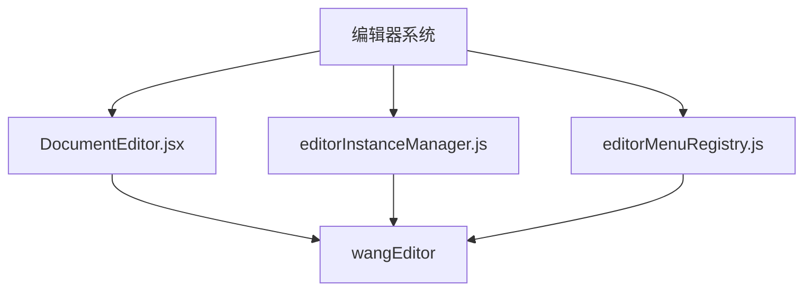
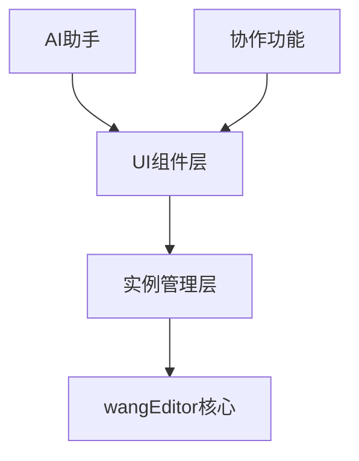
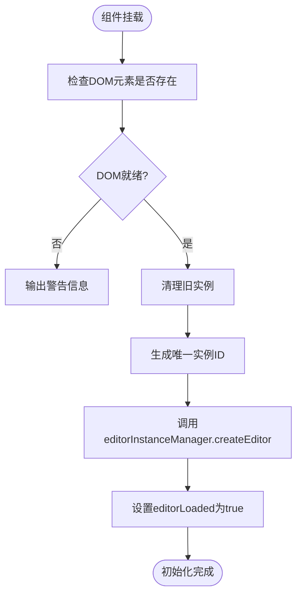
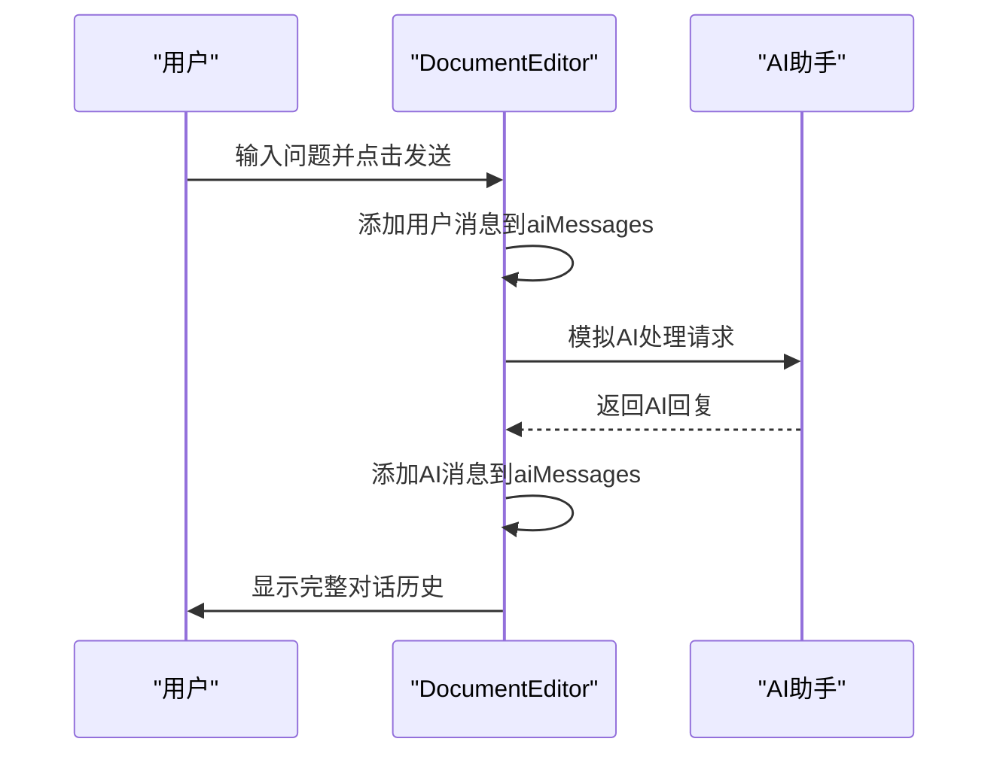
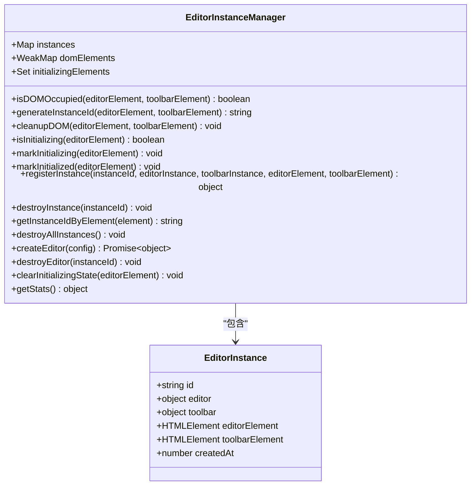
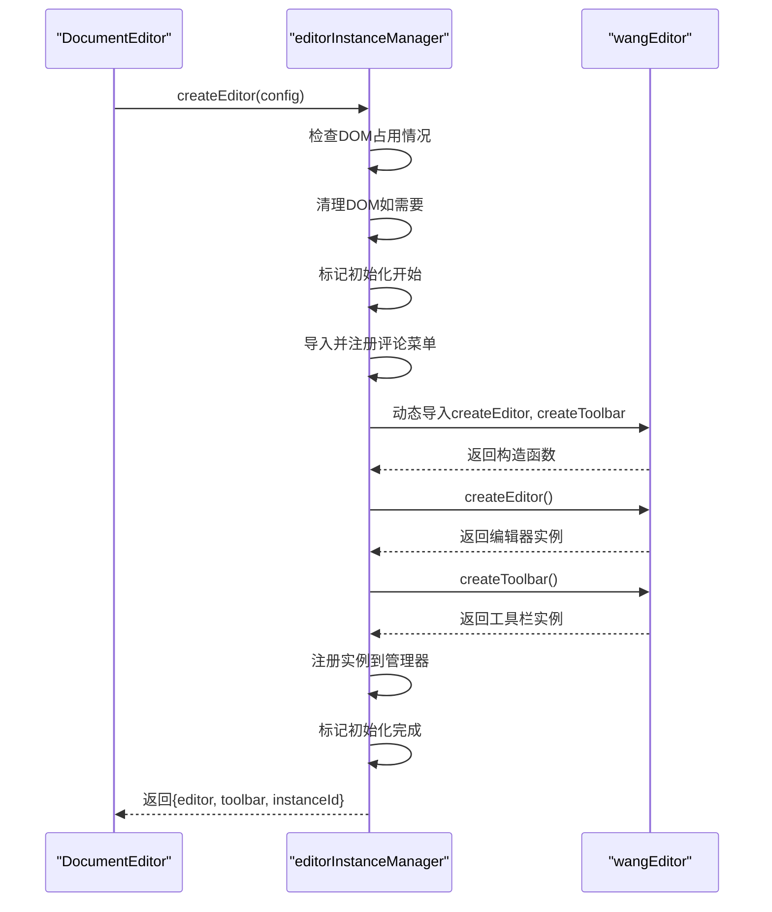
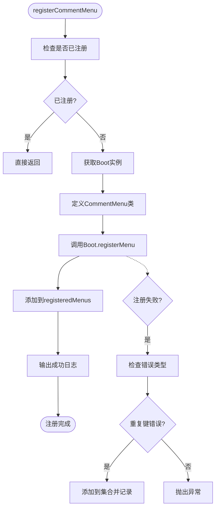
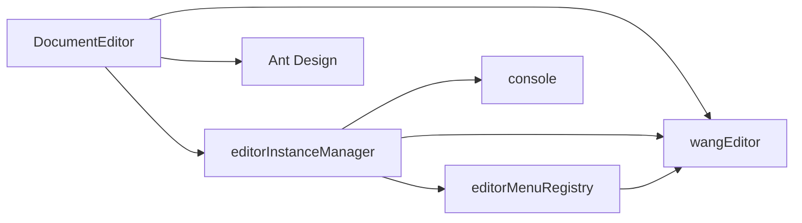

# 编辑器集成

<cite>
**Referenced Files in This Document**   
- [DocumentEditor.jsx](file://src/components/DocumentEditor.jsx)
- [editorInstanceManager.js](file://src/utils/editorInstanceManager.js)
- [editorMenuRegistry.js](file://src/utils/editorMenuRegistry.js)
</cite>

## 目录
1. [简介](#简介)
2. [项目结构](#项目结构)
3. [核心组件](#核心组件)
4. [架构概述](#架构概述)
5. [详细组件分析](#详细组件分析)
6. [依赖分析](#依赖分析)
7. [性能考虑](#性能考虑)
8. [故障排除指南](#故障排除指南)
9. [结论](#结论)

## 简介
本文档全面记录了DocumentEditor组件对wangEditor富文本编辑器的集成实现。文档详细描述了编辑器实例化过程、配置项定制和插件扩展机制，说明了如何通过editorInstanceManager统一管理多个编辑器实例以实现性能优化和内存泄漏防护。同时提供了自定义工具栏按钮、格式化规则和内容过滤器的开发方法，并解释了数学公式、代码块等特殊内容的支持方案及与AI助手的联动机制。

## 项目结构
项目中的编辑器相关文件主要分布在`src/components`和`src/utils`目录下。`DocumentEditor.jsx`是核心组件文件，负责编辑器的UI渲染和用户交互逻辑。`editorInstanceManager.js`和`editorMenuRegistry.js`位于`src/utils`目录，分别负责编辑器实例的生命周期管理和菜单插件的注册。

**Diagram sources**
- [DocumentEditor.jsx](file://src/components/DocumentEditor.jsx)
- [editorInstanceManager.js](file://src/utils/editorInstanceManager.js)
- [editorMenuRegistry.js](file://src/utils/editorMenuRegistry.js)

**Section sources**
- [DocumentEditor.jsx](file://src/components/DocumentEditor.jsx)
- [editorInstanceManager.js](file://src/utils/editorInstanceManager.js)
- [editorMenuRegistry.js](file://src/utils/editorMenuRegistry.js)

## 核心组件
DocumentEditor组件实现了完整的富文本编辑功能，包括内容编辑、AI助手集成、协作会议发起等功能。组件通过ref引用管理DOM元素，使用useState和useEffect钩子管理组件状态和生命周期。editorInstanceManager负责创建和销毁编辑器实例，确保资源的正确释放。

**Section sources**
- [DocumentEditor.jsx](file://src/components/DocumentEditor.jsx#L0-L730)
- [editorInstanceManager.js](file://src/utils/editorInstanceManager.js#L0-L315)

## 架构概述
系统采用分层架构设计，上层为UI组件层，中层为实例管理层，底层为wangEditor核心库。这种架构分离了UI逻辑和编辑器实例管理，提高了代码的可维护性和复用性。

**Diagram sources**
- [DocumentEditor.jsx](file://src/components/DocumentEditor.jsx)
- [editorInstanceManager.js](file://src/utils/editorInstanceManager.js)

## 详细组件分析

### DocumentEditor组件分析
DocumentEditor组件作为富文本编辑器的容器，负责协调UI展示和编辑器实例的交互。

#### 组件初始化流程

**Diagram sources**
- [DocumentEditor.jsx](file://src/components/DocumentEditor.jsx#L57-L91)

#### AI助手交互流程

**Diagram sources**
- [DocumentEditor.jsx](file://src/components/DocumentEditor.jsx#L137-L189)

### editorInstanceManager分析
editorInstanceManager是全局单例对象，负责管理所有编辑器实例的生命周期。

#### 实例管理类图

**Diagram sources**
- [editorInstanceManager.js](file://src/utils/editorInstanceManager.js#L0-L315)

#### 编辑器创建时序图

**Diagram sources**
- [editorInstanceManager.js](file://src/utils/editorInstanceManager.js#L165-L204)

### editorMenuRegistry分析
editorMenuRegistry模块负责全局注册编辑器的自定义菜单，避免重复注册。

#### 菜单注册流程

**Diagram sources**
- [editorMenuRegistry.js](file://src/utils/editorMenuRegistry.js#L0-L99)

## 依赖分析
系统依赖关系清晰，各组件职责分明。DocumentEditor组件依赖于editorInstanceManager进行实例管理，而editorInstanceManager又依赖于editorMenuRegistry进行菜单注册。所有组件最终都依赖于wangEditor核心库。

**Diagram sources**
- [DocumentEditor.jsx](file://src/components/DocumentEditor.jsx)
- [editorInstanceManager.js](file://src/utils/editorInstanceManager.js)
- [editorMenuRegistry.js](file://src/utils/editorMenuRegistry.js)

**Section sources**
- [DocumentEditor.jsx](file://src/components/DocumentEditor.jsx#L0-L730)
- [editorInstanceManager.js](file://src/utils/editorInstanceManager.js#L0-L315)
- [editorMenuRegistry.js](file://src/utils/editorMenuRegistry.js#L0-L99)

## 性能考虑
系统在性能方面做了多项优化：

1. **实例复用**：通过editorInstanceManager统一管理实例，避免重复创建和销毁
2. **延迟加载**：编辑器初始化有100ms延迟，确保DOM完全准备就绪
3. **内存管理**：在组件卸载时主动销毁编辑器实例，防止内存泄漏
4. **DOM清理**：彻底清理wangEditor相关的属性、类名和样式
5. **异步操作**：使用动态导入减少初始包大小，按需加载编辑器核心

这些优化措施确保了即使在大量文档同时打开的情况下，系统也能保持良好的性能表现。

## 故障排除指南
遇到编辑器相关问题时，可以参考以下排查步骤：

1. **编辑器不显示**：
   - 检查DOM元素是否正确引用
   - 查看控制台是否有"编辑器DOM元素未准备就绪"警告
   - 确认CSS文件是否正确加载

2. **内存泄漏**：
   - 确保在组件卸载时调用了destroyEditor
   - 使用getStats方法检查实例数量是否正常
   - 检查是否有重复的实例ID

3. **菜单注册失败**：
   - 查看控制台是否有"Duplicated key"错误
   - 确认registerCommentMenu只被调用一次
   - 检查网络连接是否正常（动态导入需要）

4. **AI助手无响应**：
   - 检查handleAiSend函数是否正确绑定
   - 确认isAiTyping状态更新正常
   - 验证模拟回复的setTimeout是否执行

**Section sources**
- [DocumentEditor.jsx](file://src/components/DocumentEditor.jsx#L57-L91)
- [editorInstanceManager.js](file://src/utils/editorInstanceManager.js#L81-L113)
- [editorMenuRegistry.js](file://src/utils/editorMenuRegistry.js#L72-L99)

## 结论
DocumentEditor组件通过精心设计的架构实现了对wangEditor的高效集成。通过editorInstanceManager的统一管理，系统能够有效控制编辑器实例的生命周期，避免内存泄漏和性能下降。editorMenuRegistry确保了自定义菜单的正确注册，而清晰的依赖关系使得代码易于维护和扩展。整体解决方案既满足了富文本编辑的核心需求，又通过与AI助手的深度集成提升了用户体验。