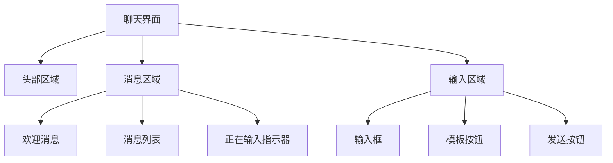
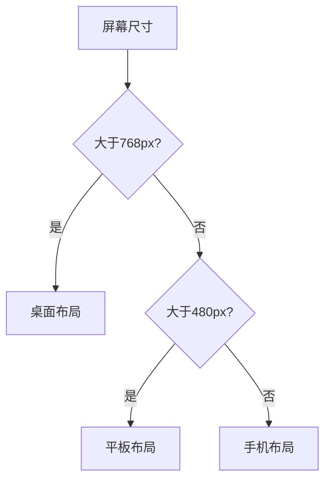

# 对话界面设计

<cite>
**本文档引用文件**  
- [ChatInterface.jsx](file://src/components/ChatInterface.jsx)
- [ChatWindow.jsx](file://src/components/ChatWindow.jsx)
- [ChatInterface.css](file://src/components/ChatInterface.css)
- [ChatWindow.css](file://src/components/ChatWindow.css)
</cite>

## 目录
1. [项目结构](#项目结构)  
2. [核心组件分析](#核心组件分析)  
3. [布局与样式实现](#布局与样式实现)  
4. [滚动行为控制逻辑](#滚动行为控制逻辑)  
5. [输入框功能实现](#输入框功能实现)  
6. [模板选择功能](#模板选择功能)  
7. [响应式设计与跨设备适配](#响应式设计与跨设备适配)  
8. [无障碍访问支持](#无障碍访问支持)  
9. [用户体验优化建议](#用户体验优化建议)

## 项目结构

对话界面相关组件位于 `src/components` 目录下，主要包括：

- `ChatInterface.jsx`：主聊天界面组件
- `ChatWindow.jsx`：聊天窗口组件
- `ChatInterface.css`：主聊天界面样式表
- `ChatWindow.css`：聊天窗口样式表

这些文件共同构成了系统的对话交互模块，支持消息展示、用户输入、模板调用等核心功能。

**Section sources**
- [ChatInterface.jsx](file://src/components/ChatInterface.jsx)
- [ChatWindow.jsx](file://src/components/ChatWindow.jsx)
- [ChatInterface.css](file://src/components/ChatInterface.css)
- [ChatWindow.css](file://src/components/ChatWindow.css)

## 核心组件分析

### ChatInterface 组件

`ChatInterface` 是系统的主要对话界面组件，负责管理消息列表、输入区域和模板弹窗。该组件接收 `messages` 消息数组和 `onSendMessage` 发送回调作为属性，通过 React 的 `useState` 和 `useRef` 钩子管理输入值、打字状态和 DOM 引用。

组件包含以下关键状态：
- `inputValue`：输入框内容
- `isTyping`：AI 正在思考状态
- `showTemplateModal`：模板模态框显示状态
- `messagesEndRef`：用于自动滚动到底部的引用

**Section sources**
- [ChatInterface.jsx](file://src/components/ChatInterface.jsx#L0-L256)

### ChatWindow 组件

`ChatWindow` 组件是一个更通用的聊天窗口实现，集成了 Ant Design UI 库。它支持联系人切换、在线状态显示和丰富的工具栏按钮。该组件通过 `activeContact` 属性确定当前对话对象，并从 `contacts` 列表中获取联系人信息。

与 `ChatInterface` 不同，`ChatWindow` 使用了 Modal 组件来实现模板选择功能，提供了更好的交互体验和响应式支持。

**Section sources**
- [ChatWindow.jsx](file://src/components/ChatWindow.jsx#L0-L238)

## 布局与样式实现

### 聊天界面布局结构

两个组件均采用 Flexbox 布局模型，将界面分为三个主要部分：

1. **头部区域**（chat-header）：显示聊天标题或联系人信息
2. **消息区域**（messages-container/chat-messages）：展示消息气泡
3. **输入区域**（chat-input-form/chat-input）：提供消息输入功能



**Diagram sources**
- [ChatInterface.jsx](file://src/components/ChatInterface.jsx#L0-L256)
- [ChatWindow.jsx](file://src/components/ChatWindow.jsx#L0-L238)

### 消息气泡样式定义

消息气泡采用圆角矩形设计，通过 CSS 类区分用户消息和 AI 消息：

- **用户消息**（user-message/sent）：右对齐，使用渐变蓝色背景
- **AI 消息**（ai-message/received）：左对齐，使用浅灰色背景

CSS 中使用 `border-radius` 创建圆角效果，并通过 `border-bottom-left/right-radius` 进一步调整气泡形状，使其更接近自然对话气泡的外观。

动画效果通过 `@keyframes messageSlideIn` 实现，新消息出现时会有平滑的滑入动画。

**Section sources**
- [ChatInterface.css](file://src/components/ChatInterface.css#L0-L543)
- [ChatWindow.css](file://src/components/ChatWindow.css#L0-L546)

## 滚动行为控制逻辑

### 自动滚动到底部

两个组件都实现了消息列表自动滚动到底部的功能。`ChatInterface` 使用 `useEffect` 钩子监听 `messages` 数组的变化，当消息更新时自动调用 `scrollToBottom` 函数：

```javascript
const scrollToBottom = () => {
  messagesEndRef.current?.scrollIntoView({ behavior: 'smooth' })
}

useEffect(() => {
  scrollToBottom()
}, [messages])
```

`UnifiedAICenter` 组件中也实现了相同的滚动逻辑，确保用户始终能看到最新的消息。

### 滚动性能优化

虽然当前实现没有使用虚拟滚动技术，但通过 `ref` 引用和 `scrollIntoView` 方法实现了高效的滚动控制。对于大量历史消息的场景，建议引入虚拟滚动库（如 `react-window` 或 `react-virtualized`）来优化性能，只渲染可视区域内的消息项。

**Section sources**
- [ChatInterface.jsx](file://src/components/ChatInterface.jsx#L100-L108)
- [UnifiedAICenter.jsx](file://src/components/UnifiedAICenter.jsx#L790-L799)

## 输入框功能实现

### 富文本支持

`ChatWindow` 组件基于 Ant Design 的 Input 组件构建，支持富文本输入功能。输入框的后缀区域集成了多个工具按钮：

- 字体大小调整
- 表情符号插入
- @提及功能
- 剪切工具
- 帮助文档
- 模板选择
- 全屏模式
- 发送按钮

这些功能通过 Ant Design 的 `suffix` 属性集成到输入框中，提供了紧凑而功能丰富的用户界面。

### 快捷操作功能

输入框实现了智能按键处理：
- **Enter**：发送消息
- **Shift + Enter**：换行

这种设计平衡了移动设备和桌面用户的使用习惯，避免了误触发送的情况。

**Section sources**
- [ChatWindow.jsx](file://src/components/ChatWindow.jsx#L180-L210)

## 模板选择功能

### 写作模板数据结构

系统内置了四类写作模板，每类包含四个具体模板：

```javascript
const writingTemplates = [
  {
    category: '学术写作',
    templates: [
      { id: 'research-paper', title: '学术论文', description: '标准学术论文格式模版' },
      // ...
    ]
  },
  // ...
]
```

模板数据结构清晰，包含分类、ID、标题和描述等元信息，便于扩展和维护。

### 模板选择交互

两种实现方式：
1. **浮窗模式**（ChatInterface）：使用原生 HTML/CSS 构建的模态层
2. **Modal 组件**（ChatWindow）：使用 Ant Design 的 Modal 组件

用户点击模板卡片后，系统会生成相应的提示语并填充到输入框中，引导 AI 生成符合特定格式的内容。

**Section sources**
- [ChatInterface.jsx](file://src/components/ChatInterface.jsx#L15-L80)
- [ChatWindow.jsx](file://src/components/ChatWindow.jsx#L20-L50)

## 响应式设计与跨设备适配

### 媒体查询策略

CSS 文件中定义了两层响应式断点：

- **平板适配**（max-width: 768px）
- **手机适配**（max-width: 480px）

针对不同屏幕尺寸调整了以下样式：
- 内边距和外边距
- 消息气泡最大宽度
- 模板网格布局（从多列变为单列）
- 字体大小

### 移动端优化

在小屏幕上，`quick-actions` 区域从水平排列变为垂直堆叠，确保按钮有足够的点击区域。同时调整了输入框的高度和圆角半径，更适合触摸操作。



**Diagram sources**
- [ChatInterface.css](file://src/components/ChatInterface.css#L480-L543)
- [ChatWindow.css](file://src/components/ChatWindow.css#L480-L546)

## 无障碍访问支持

### 语义化 HTML 结构

组件使用了适当的 HTML 元素和 ARIA 属性：
- 按钮元素正确使用 `<button>` 标签
- 图标按钮提供 `title` 属性作为工具提示
- 表单元素有适当的 `placeholder` 提示

### 键盘导航

输入框支持完整的键盘操作：
- Tab 键可以在界面元素间导航
- Enter 键发送消息
- Shift + Enter 换行
- 支持标准的文本编辑快捷键

建议增加对屏幕阅读器的支持，为重要区域添加 `aria-label` 属性，进一步提升无障碍体验。

**Section sources**
- [ChatInterface.jsx](file://src/components/ChatInterface.jsx#L200-L230)
- [ChatWindow.jsx](file://src/components/ChatWindow.jsx#L180-L210)

## 用户体验优化建议

### 性能优化

1. **虚拟滚动**：对于包含大量历史消息的场景，建议实现虚拟滚动，只渲染可视区域的消息项。
2. **防抖输入**：在输入框中实现防抖机制，避免频繁的状态更新。
3. **懒加载**：对于长消息或富媒体内容，实现懒加载策略。

### 功能增强

1. **消息编辑**：允许用户编辑已发送的消息。
2. **消息引用**：支持回复特定消息时的引用功能。
3. **文件上传**：集成文件拖拽上传功能。
4. **语音输入**：添加语音识别支持。

### 视觉反馈

1. **发送状态**：显示消息发送、接收和已读状态。
2. **输入指示器**：显示对方正在输入的实时反馈。
3. **加载骨架屏**：在内容加载时显示骨架屏，提升 perceived performance。

这些建议可在不影响现有功能的基础上逐步实施，持续提升用户体验。