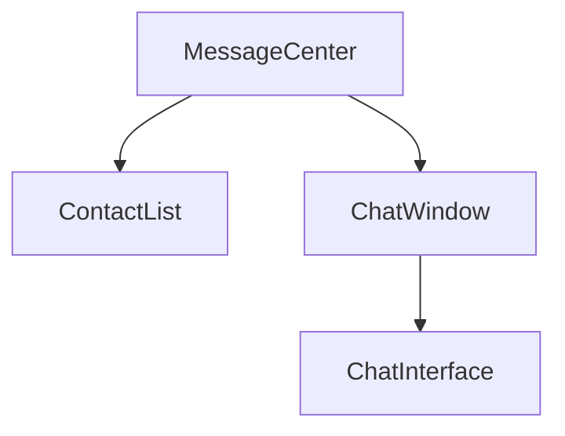
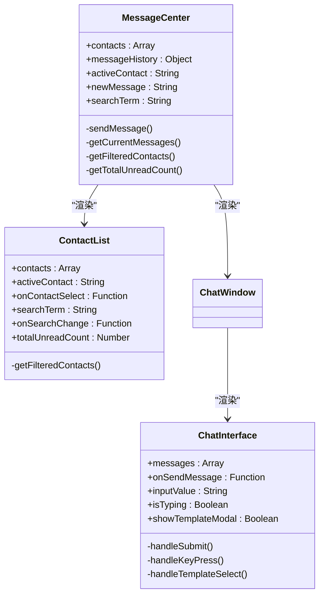
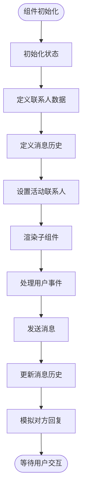
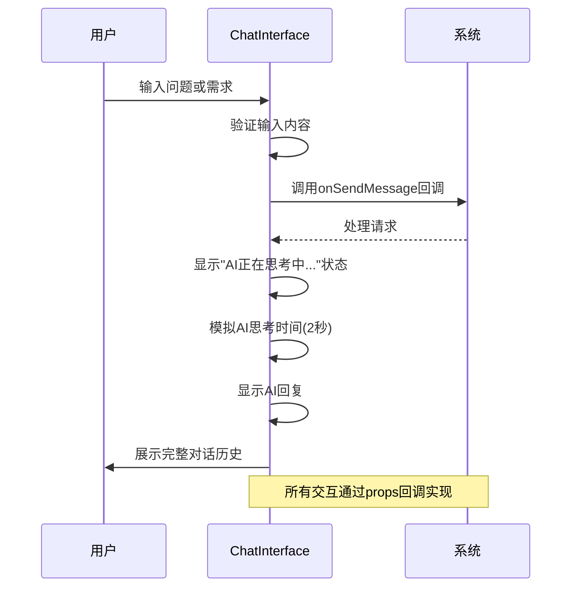
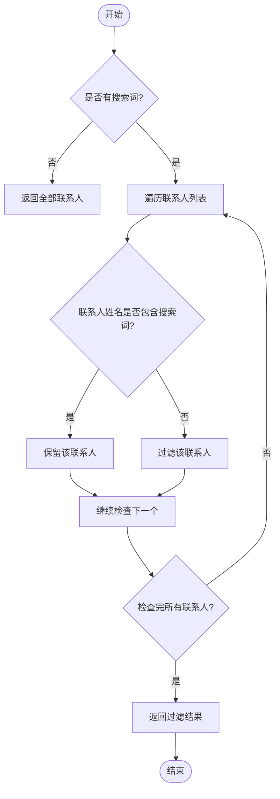
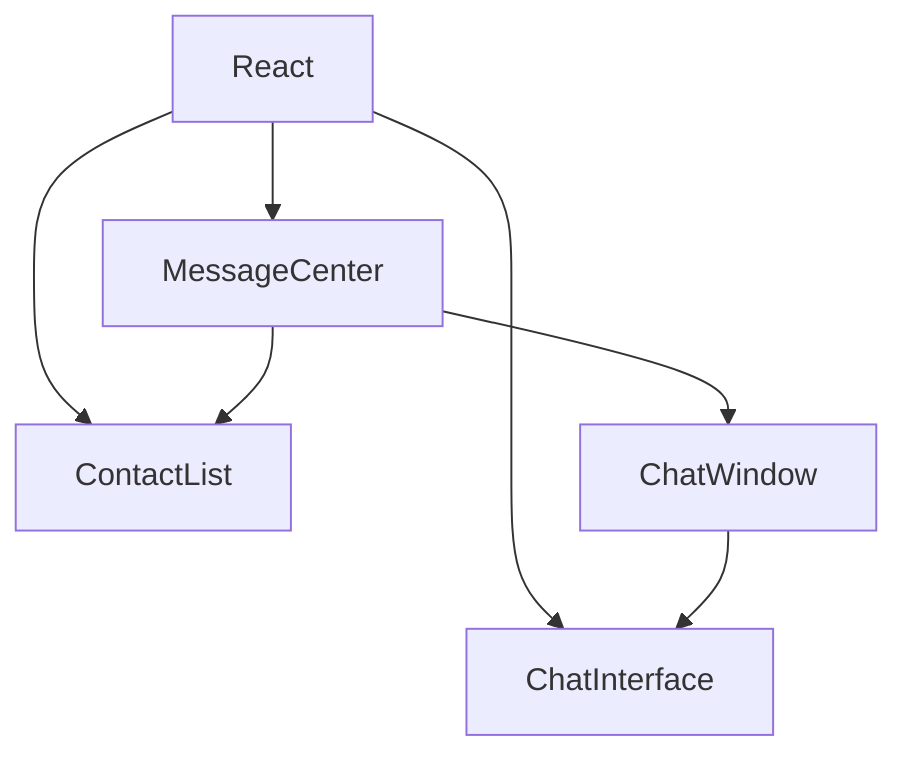

# 消息中心

<cite>
**本文档引用文件**  
- [MessageCenter.jsx](file://src/components/MessageCenter.jsx)
- [ChatInterface.jsx](file://src/components/ChatInterface.jsx)
- [ContactList.jsx](file://src/components/ContactList.jsx)
- [ChatWindow.jsx](file://src/components/ChatWindow.jsx)
</cite>

## 目录
1. [简介](#简介)
2. [项目结构](#项目结构)
3. [核心组件](#核心组件)
4. [架构概览](#架构概览)
5. [详细组件分析](#详细组件分析)
6. [依赖分析](#依赖分析)
7. [性能考虑](#性能考虑)
8. [故障排除指南](#故障排除指南)
9. [结论](#结论)

## 简介
消息中心是教育管理系统中的核心通信模块，提供完整的即时消息功能。该系统实现了消息架构设计、对话界面逻辑和联系人管理三大核心功能，支持实时消息传递、未读消息统计和通知提醒等关键特性。通过集成AI助手功能，系统不仅支持传统文本聊天，还提供了智能写作辅助和内容生成能力。

## 项目结构
消息中心采用模块化设计，主要由三个核心组件构成：MessageCenter作为主容器组件，负责整体布局和状态管理；ContactList组件实现联系人列表展示与交互；ChatInterface组件提供对话界面和AI交互功能。所有组件均位于`src/components/`目录下，遵循React函数式组件和Hooks的最佳实践。

**图表来源**
- [MessageCenter.jsx](file://src/components/MessageCenter.jsx#L0-L695)
- [ChatWindow.jsx](file://src/components/ChatWindow.jsx#L0-L200)

**本节来源**
- [MessageCenter.jsx](file://src/components/MessageCenter.jsx#L0-L695)
- [ChatInterface.jsx](file://src/components/ChatInterface.jsx#L0-L255)
- [ContactList.jsx](file://src/components/ContactList.jsx#L0-L89)

## 核心组件
消息中心的核心组件包括MessageCenter、ChatInterface和ContactList。MessageCenter组件负责管理全局状态，包括联系人数据、消息历史和当前会话状态。ChatInterface组件实现了AI对话界面，提供智能写作模板和实时交互功能。ContactList组件则处理联系人列表的渲染和搜索过滤功能，支持在线状态显示和未读消息计数。

**本节来源**
- [MessageCenter.jsx](file://src/components/MessageCenter.jsx#L0-L695)
- [ChatInterface.jsx](file://src/components/ChatInterface.jsx#L0-L255)
- [ContactList.jsx](file://src/components/ContactList.jsx#L0-L89)

## 架构概览
消息中心采用分层架构设计，上层为UI组件层，中层为状态管理层，底层为数据模型层。组件间通过props进行数据传递和事件回调，实现了单向数据流。系统使用useState Hook管理本地状态，包括联系人列表、消息历史、活动会话等。消息数据模型包含id、senderId、senderName、content、time和type等字段，支持系统消息和用户消息的区分。

**图表来源**
- [MessageCenter.jsx](file://src/components/MessageCenter.jsx#L0-L695)
- [ContactList.jsx](file://src/components/ContactList.jsx#L0-L89)
- [ChatInterface.jsx](file://src/components/ChatInterface.jsx#L0-L255)

## 详细组件分析

### MessageCenter 组件分析
MessageCenter是消息中心的主控组件，负责协调各个子组件的工作。它初始化联系人数据和消息历史，管理当前活动会话，并处理消息发送逻辑。组件使用propContacts参数接收外部联系人数据，若无传入则使用内置的默认联系人列表。消息发送后，系统会将消息添加到对应会话的历史记录中，并模拟对方回复以增强用户体验。

#### 组件状态管理

**图表来源**
- [MessageCenter.jsx](file://src/components/MessageCenter.jsx#L0-L695)

**本节来源**
- [MessageCenter.jsx](file://src/components/MessageCenter.jsx#L0-L695)

### ChatInterface 组件分析
ChatInterface组件提供AI智能助手的对话界面，支持多种写作模板选择。组件包含欢迎界面、消息列表、输入区域和模板选择模态框四个主要部分。当用户首次进入时显示欢迎信息和快捷操作按钮，之后显示消息历史记录。输入区域支持Enter键发送消息，Shift+Enter换行。模板选择功能允许用户快速生成特定类型的文档内容。

#### AI 对话流程

**图表来源**
- [ChatInterface.jsx](file://src/components/ChatInterface.jsx#L0-L255)

**本节来源**
- [ChatInterface.jsx](file://src/components/ChatInterface.jsx#L0-L255)

### ContactList 组件分析
ContactList组件实现联系人列表的展示和管理功能。组件支持搜索过滤、在线状态指示和未读消息提醒。联系人头像支持emoji、图片URL和首字母占位符三种显示模式。在线状态通过绿色指示点显示，并配有脉冲动画效果。未读消息数量以红色徽章形式展示，带有弹跳动画效果，吸引用户注意。

#### 联系人过滤逻辑

**图表来源**
- [ContactList.jsx](file://src/components/ContactList.jsx#L0-L89)

**本节来源**
- [ContactList.jsx](file://src/components/ContactList.jsx#L0-L89)

## 依赖分析
消息中心组件之间存在明确的依赖关系。MessageCenter组件依赖ContactList和ChatWindow组件，而ChatWindow组件又依赖ChatInterface组件。这种层级依赖结构确保了数据流的单向性和可预测性。所有组件都依赖React框架的基本功能，特别是useState和useEffect Hooks。样式方面，各组件通过CSS模块化方式管理自己的样式，避免全局样式冲突。

**图表来源**
- [MessageCenter.jsx](file://src/components/MessageCenter.jsx#L0-L695)
- [ContactList.jsx](file://src/components/ContactList.jsx#L0-L89)
- [ChatInterface.jsx](file://src/components/ChatInterface.jsx#L0-L255)

**本节来源**
- [MessageCenter.jsx](file://src/components/MessageCenter.jsx#L0-L695)
- [ContactList.jsx](file://src/components/ContactList.jsx#L0-L89)
- [ChatInterface.jsx](file://src/components/ChatInterface.jsx#L0-L255)

## 性能考虑
消息中心在性能方面进行了多项优化。首先，通过useRef获取DOM引用并使用scrollIntoView方法实现消息列表的平滑滚动到底部，避免了频繁的DOM重绘。其次，利用useEffect Hook精确控制副作用执行时机，仅在相关状态变化时更新UI。对于长列表渲染，虽然当前数据量较小，但建议未来引入虚拟滚动技术以提升大数据量下的性能表现。此外，输入框的自动高度调整和防抖处理也提升了用户体验。

## 故障排除指南
常见问题包括消息无法发送、联系人列表不更新和AI响应延迟等。对于消息无法发送问题，应检查输入内容是否为空以及onSendMessage回调函数是否正确传递。联系人列表不更新通常源于父组件状态未正确更新，需要确保contacts prop发生变化时触发重新渲染。AI响应延迟可能是由于网络请求超时或服务器负载过高，建议实施超时重试机制和负载均衡策略。

**本节来源**
- [MessageCenter.jsx](file://src/components/MessageCenter.jsx#L0-L695)
- [ChatInterface.jsx](file://src/components/ChatInterface.jsx#L0-L255)

## 结论
消息中心系统设计合理，实现了完整的即时通讯功能。通过模块化组件设计，系统具有良好的可维护性和扩展性。AI集成提供了智能化的写作辅助功能，提升了用户生产力。未来可进一步优化WebSocket实时通信机制，实现真正的双向实时消息传递，同时加强消息持久化和同步策略，确保跨设备消息一致性。