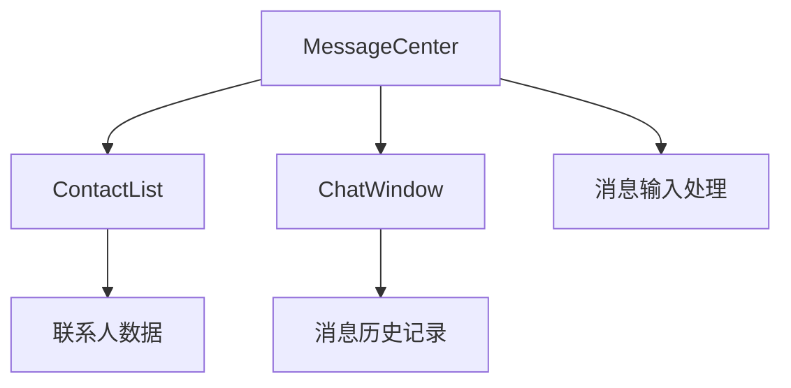
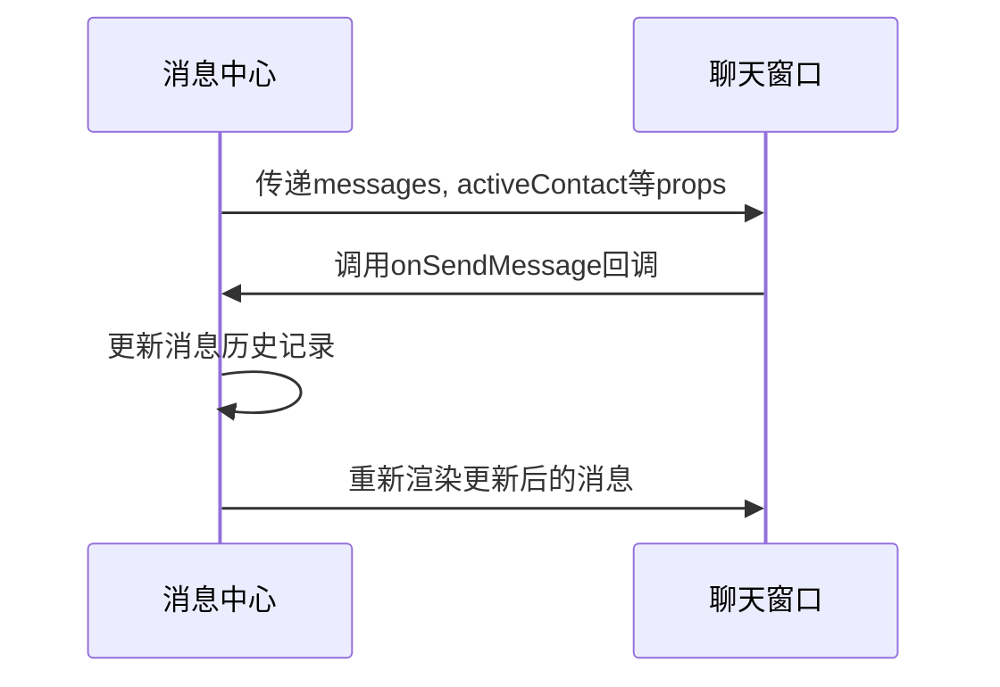
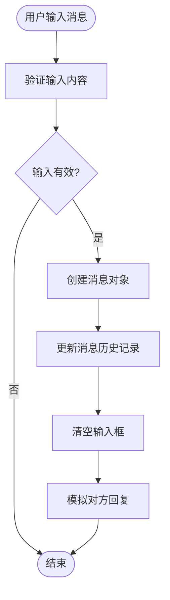
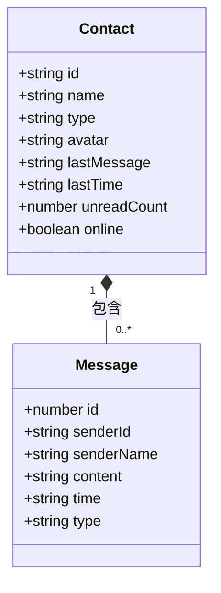
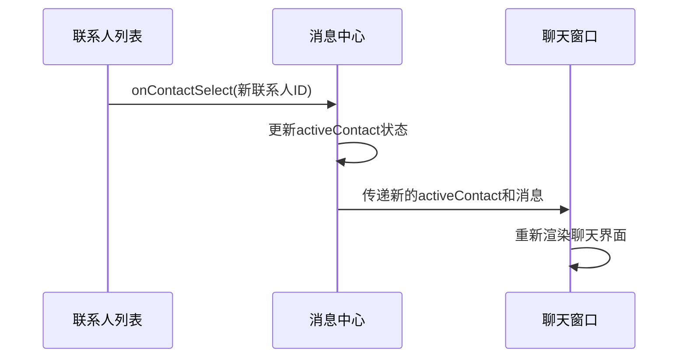
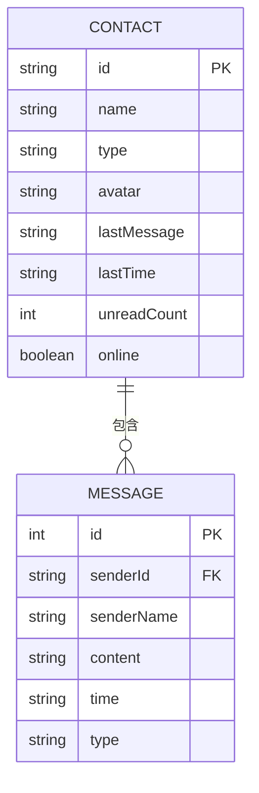
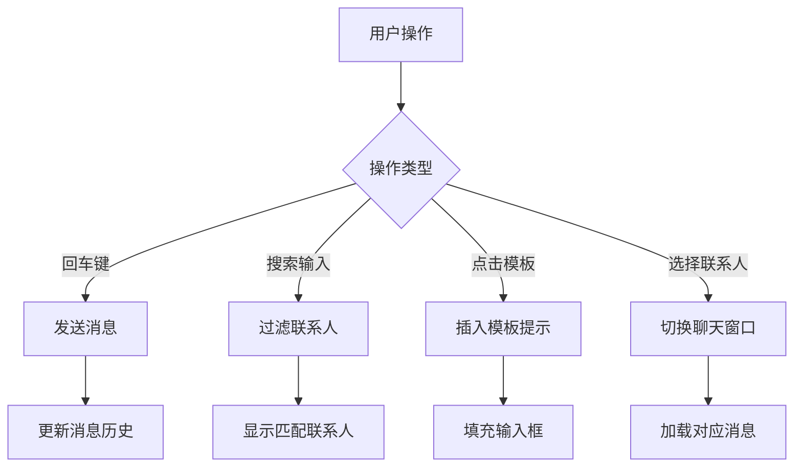

# 消息传输机制

<cite>
**本文档中引用的文件**
- [MessageCenter.jsx](file://src/components/MessageCenter.jsx)
- [ChatInterface.jsx](file://src/components/ChatInterface.jsx)
- [ChatWindow.jsx](file://src/components/ChatWindow.jsx)
</cite>

## 目录
1. [消息中心架构概述](#消息中心架构概述)
2. [组件通信协议与数据流设计](#组件通信协议与数据流设计)
3. [消息发送与接收流程](#消息发送与接收流程)
4. [消息状态管理与未读计数](#消息状态管理与未读计数)
5. [联系人列表与聊天窗口交互](#联系人列表与聊天窗口交互)
6. [消息历史记录管理](#消息历史记录管理)
7. [用户界面交互功能](#用户界面交互功能)

## 消息中心架构概述

消息中心采用React函数式组件架构，由`MessageCenter`作为主容器组件，集成`ContactList`（联系人列表）和`ChatWindow`（聊天窗口）两个核心子组件。该架构通过props传递实现组件间通信，维护全局消息状态和联系人状态。

**图示来源**
- [MessageCenter.jsx](file://src/components/MessageCenter.jsx#L0-L695)

**本节来源**
- [MessageCenter.jsx](file://src/components/MessageCenter.jsx#L0-L695)

## 组件通信协议与数据流设计

消息中心组件与聊天界面组件之间通过props进行数据传递和事件回调。`MessageCenter`组件负责维护全局状态，包括联系人列表、消息历史记录、当前激活联系人等，并将这些状态作为props传递给`ChatWindow`组件。

**图示来源**
- [MessageCenter.jsx](file://src/components/MessageCenter.jsx#L647-L695)
- [ChatWindow.jsx](file://src/components/ChatWindow.jsx#L0-L237)

**本节来源**
- [MessageCenter.jsx](file://src/components/MessageCenter.jsx#L647-L695)
- [ChatWindow.jsx](file://src/components/ChatWindow.jsx#L0-L237)

## 消息发送与接收流程

消息发送流程始于用户在聊天窗口输入消息并触发发送操作。系统创建包含时间戳、发送者信息和内容的消息对象，将其添加到对应联系人的消息历史记录中。

**图示来源**
- [MessageCenter.jsx](file://src/components/MessageCenter.jsx#L589-L645)

**本节来源**
- [MessageCenter.jsx](file://src/components/MessageCenter.jsx#L589-L645)

## 消息状态管理与未读计数

系统通过联系人数据中的`unreadCount`字段管理未读消息状态。当用户切换到某个联系人时，该联系人的未读计数会被重置为零。总未读消息数通过聚合所有联系人的未读计数获得。

**图示来源**
- [MessageCenter.jsx](file://src/components/MessageCenter.jsx#L0-L57)

**本节来源**
- [MessageCenter.jsx](file://src/components/MessageCenter.jsx#L0-L57)

## 联系人列表与聊天窗口交互

联系人列表与聊天窗口通过`activeContact`状态变量实现联动。当用户在联系人列表中选择一个联系人时，`onContactSelect`回调函数被触发，更新当前激活的联系人，从而切换聊天窗口显示的内容。

**图示来源**
- [MessageCenter.jsx](file://src/components/MessageCenter.jsx#L647-L695)

**本节来源**
- [MessageCenter.jsx](file://src/components/MessageCenter.jsx#L647-L695)

## 消息历史记录管理

消息历史记录以对象形式存储，键为联系人ID，值为该联系人的消息数组。系统提供`getCurrentMessages()`函数获取当前激活联系人的消息记录，并在发送新消息时使用函数式更新模式确保状态不可变性。

**图示来源**
- [MessageCenter.jsx](file://src/components/MessageCenter.jsx#L647-L695)

**本节来源**
- [MessageCenter.jsx](file://src/components/MessageCenter.jsx#L647-L695)

## 用户界面交互功能

系统实现了多种用户界面交互功能，包括回车发送消息、搜索联系人、模板选择等。其中，回车发送消息功能通过`handleKeyPress`事件处理器实现，而模板选择功能则通过模态框展示各类写作模板供用户选择。

**图示来源**
- [MessageCenter.jsx](file://src/components/MessageCenter.jsx#L647-L695)
- [ChatWindow.jsx](file://src/components/ChatWindow.jsx#L0-L237)

**本节来源**
- [MessageCenter.jsx](file://src/components/MessageCenter.jsx#L647-L695)
- [ChatWindow.jsx](file://src/components/ChatWindow.jsx#L0-L237)