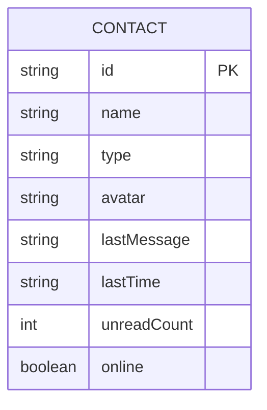
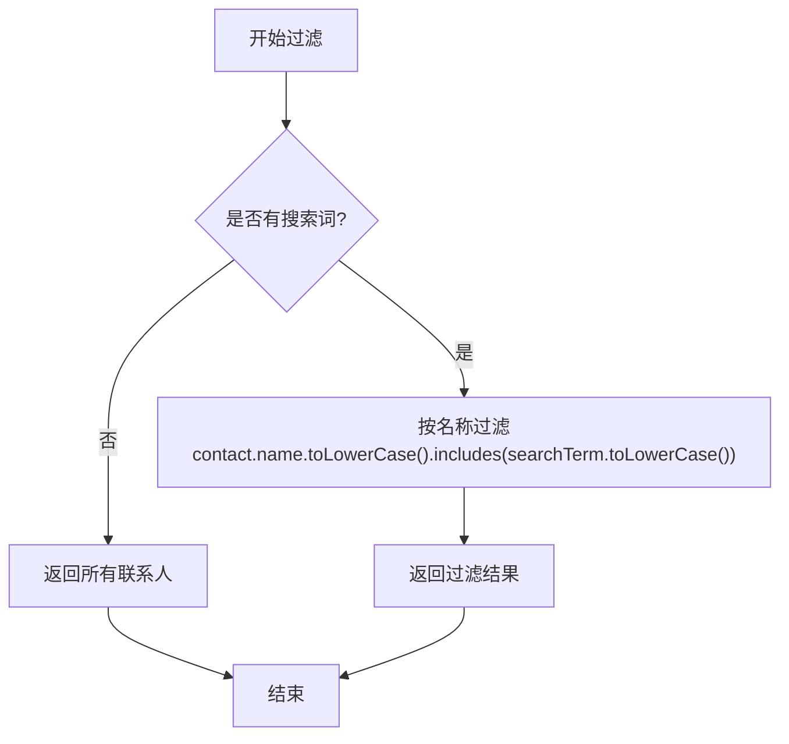
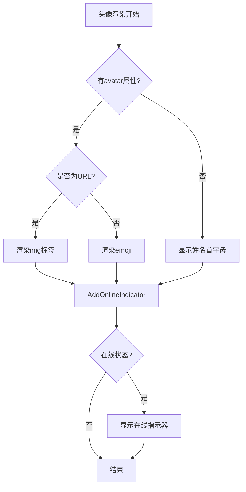
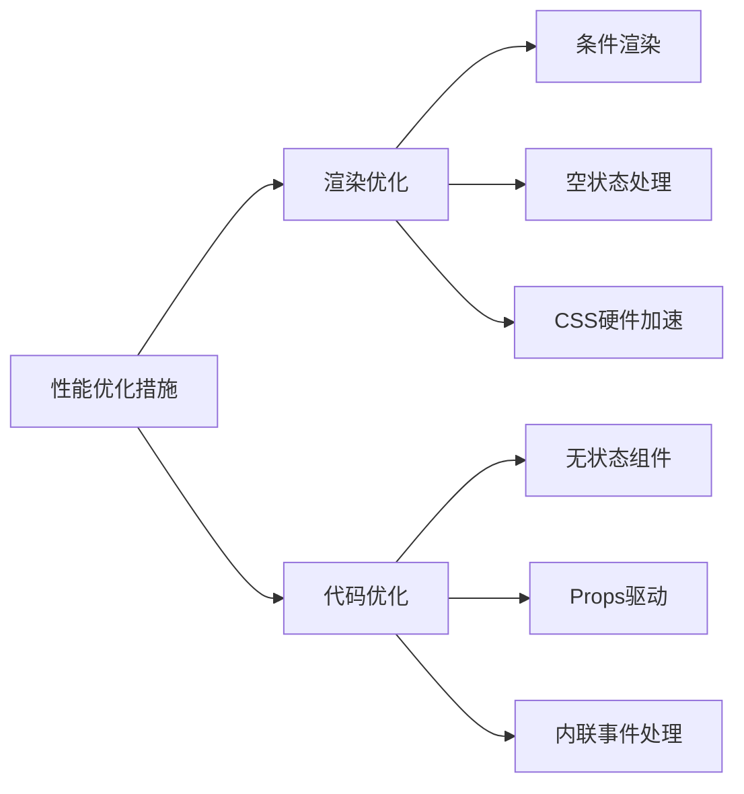
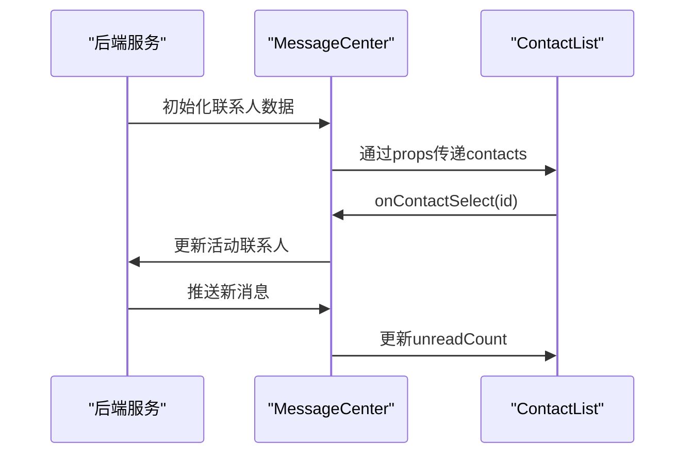
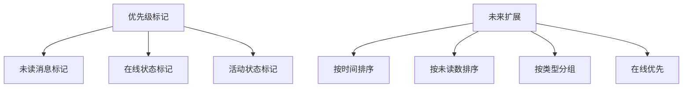

# 联系人列表功能

<cite>
**本文档引用的文件**
- [ContactList.jsx](file://src/components/ContactList.jsx)
- [ContactList.css](file://src/components/ContactList.css)
- [MessageCenter.jsx](file://src/components/MessageCenter.jsx)
</cite>

## 目录
1. [简介](#简介)
2. [联系人数据模型设计](#联系人数据模型设计)
3. [状态管理与搜索过滤逻辑](#状态管理与搜索过滤逻辑)
4. [分组展示与展开折叠动画](#分组展示与展开折叠动画)
5. [头像加载策略与在线状态指示器](#头像加载策略与在线状态指示器)
6. [性能优化手段](#性能优化手段)
7. [后端数据同步策略](#后端数据同步策略)
8. [联系人排序算法与优先级标记](#联系人排序算法与优先级标记)

## 简介
联系人列表功能是消息中心的核心组件，提供联系人展示、搜索过滤、状态指示等关键功能。该功能通过ContactList组件实现，支持联系人搜索、未读消息计数、在线状态显示和交互反馈等特性。

**Section sources**
- [ContactList.jsx](file://src/components/ContactList.jsx#L0-L89)
- [MessageCenter.jsx](file://src/components/MessageCenter.jsx#L0-L695)

## 联系人数据模型设计
联系人数据模型包含以下核心属性：

| 属性 | 类型 | 描述 |
|------|------|------|
| id | string | 联系人唯一标识符 |
| name | string | 联系人姓名 |
| type | string | 联系人类型（用户/系统/群组） |
| avatar | string | 头像信息（URL、emoji或首字母） |
| lastMessage | string | 最后一条消息内容 |
| lastTime | string | 最后消息时间 |
| unreadCount | number | 未读消息数量 |
| online | boolean | 在线状态 |

联系人数据结构支持多种类型，包括个人用户、系统消息和群组会话，通过type字段进行区分。



**Diagram sources**
- [ContactList.jsx](file://src/components/ContactList.jsx#L0-L89)
- [MessageCenter.jsx](file://src/components/MessageCenter.jsx#L0-L695)

**Section sources**
- [MessageCenter.jsx](file://src/components/MessageCenter.jsx#L0-L695)

## 状态管理与搜索过滤逻辑
ContactList组件采用函数式组件配合props的状态管理方式，通过父组件MessageCenter传递状态和回调函数。

### 搜索过滤实现
搜索过滤功能通过getFilteredContacts辅助函数实现，该函数根据searchTerm对联系人列表进行过滤：



**Diagram sources**
- [ContactList.jsx](file://src/components/ContactList.jsx#L18-L20)
- [MessageCenter.jsx](file://src/components/MessageCenter.jsx#L647-L650)

**Section sources**
- [ContactList.jsx](file://src/components/ContactList.jsx#L18-L20)
- [MessageCenter.jsx](file://src/components/MessageCenter.jsx#L647-L650)

## 分组展示与展开折叠动画
虽然当前实现中未包含多级分组的展开/折叠功能，但组件具备良好的扩展性。联系人列表采用平铺展示方式，通过CSS过渡效果实现平滑的交互动画。

### 交互动画效果
- **悬停效果**：联系人项在鼠标悬停时向右平移4px，并显示阴影效果
- **激活状态**：选中的联系人显示蓝色边框和增强阴影
- **徽章动画**：未读消息徽章具有脉冲动画效果

```mermaid
classDiagram
class ContactItem {
+hover : translateX(4px)
+hover : boxShadow
+active : borderRight
+active : boxShadow
}
ContactItem : transition : all 0.3s cubic-bezier(0.4, 0, 0.2, 1)
ContactItem : animation : pulse 2s infinite
```

**Diagram sources**
- [ContactList.css](file://src/components/ContactList.css#L123-L184)
- [ContactList.css](file://src/components/ContactList.css#L186-L240)

**Section sources**
- [ContactList.css](file://src/components/ContactList.css#L123-L240)

## 头像加载策略与在线状态指示器
### 头像加载策略
组件实现了智能的头像加载策略，支持三种类型的头像显示：

1. **图片URL头像**：以http或/开头的字符串被视为图片URL
2. **Emoji头像**：非URL的字符串被视为emoji表情
3. **默认头像**：无头像时显示姓名首字母



**Diagram sources**
- [ContactList.jsx](file://src/components/ContactList.jsx#L40-L55)
- [ContactList.css](file://src/components/ContactList.css#L240-L250)

**Section sources**
- [ContactList.jsx](file://src/components/ContactList.jsx#L40-L55)

### 在线状态指示器
在线状态通过online布尔值控制，当联系人在线时显示绿色圆形指示器，具有脉冲动画效果：

```css
.online-indicator {
  background: linear-gradient(135deg, #27ae60, #2ecc71);
  animation: onlinePulse 2s infinite;
}
```

**Section sources**
- [ContactList.jsx](file://src/components/ContactList.jsx#L55-L57)
- [ContactList.css](file://src/components/ContactList.css#L240-L250)

## 性能优化手段
### 渲染性能优化
- **条件渲染**：仅在有未读消息时渲染未读计数徽章
- **空状态处理**：搜索结果为空时显示友好的空状态提示
- **CSS硬件加速**：使用transform进行动画，避免重排重绘

### 代码层面优化
- **纯函数组件**：ContactList为无状态函数组件，提高可预测性
- **props驱动**：所有状态由父组件管理，保持组件纯净
- **内联事件处理**：搜索框onChange事件直接绑定处理函数



**Diagram sources**
- [ContactList.jsx](file://src/components/ContactList.jsx#L0-L89)
- [ContactList.css](file://src/components/ContactList.css#L0-L392)

**Section sources**
- [ContactList.jsx](file://src/components/ContactList.jsx#L0-L89)
- [ContactList.css](file://src/components/ContactList.css#L0-L392)

## 后端数据同步策略
### 数据流架构
联系人数据通过MessageCenter组件统一管理，形成单向数据流：



### 缓存管理
当前实现采用内存缓存策略，联系人数据存储在MessageCenter组件的useState中。总未读数通过reduce计算得出：

```javascript
const getTotalUnreadCount = () => {
  return contacts.reduce((total, contact) => total + contact.unreadCount, 0);
};
```

**Diagram sources**
- [MessageCenter.jsx](file://src/components/MessageCenter.jsx#L560-L587)
- [MessageCenter.jsx](file://src/components/MessageCenter.jsx#L687-L690)

**Section sources**
- [MessageCenter.jsx](file://src/components/MessageCenter.jsx#L560-L587)
- [MessageCenter.jsx](file://src/components/MessageCenter.jsx#L687-L690)

## 联系人排序算法与优先级标记
### 排序算法
当前实现采用默认的数组顺序，未实现复杂的排序算法。联系人按照在contacts数组中的原始顺序展示。

### 优先级标记
通过视觉元素实现优先级标记：
- **未读消息**：显示红色未读计数徽章
- **在线状态**：显示绿色在线指示器
- **活动状态**：选中的联系人有特殊的激活样式

未来可扩展的排序策略包括：
- 按最后消息时间排序（最新优先）
- 按未读消息数量排序
- 按联系人类型分组排序
- 按在线状态优先排序



**Diagram sources**
- [ContactList.jsx](file://src/components/ContactList.jsx#L20-L60)
- [ContactList.css](file://src/components/ContactList.css#L123-L184)

**Section sources**
- [ContactList.jsx](file://src/components/ContactList.jsx#L20-L60)
- [ContactList.css](file://src/components/ContactList.css#L123-L184)