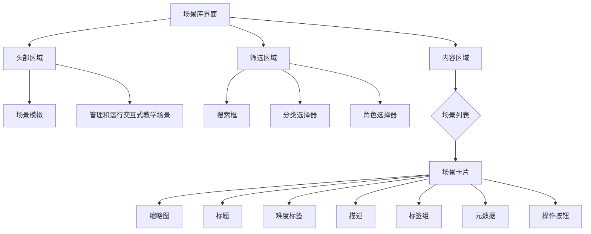
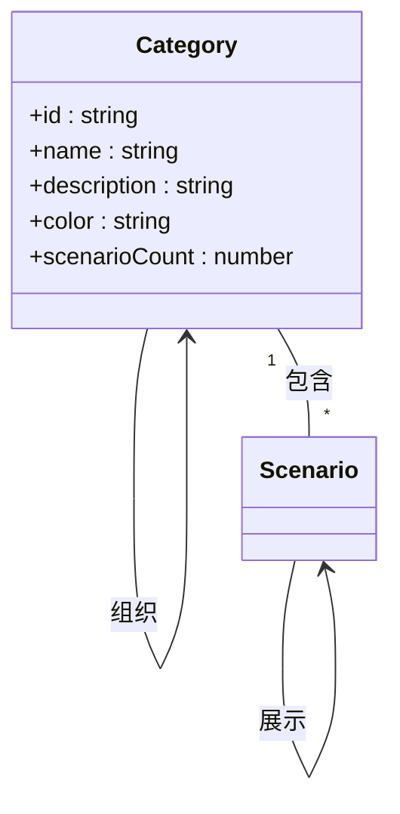
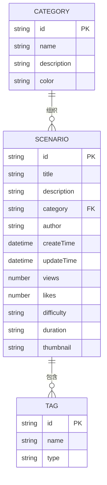
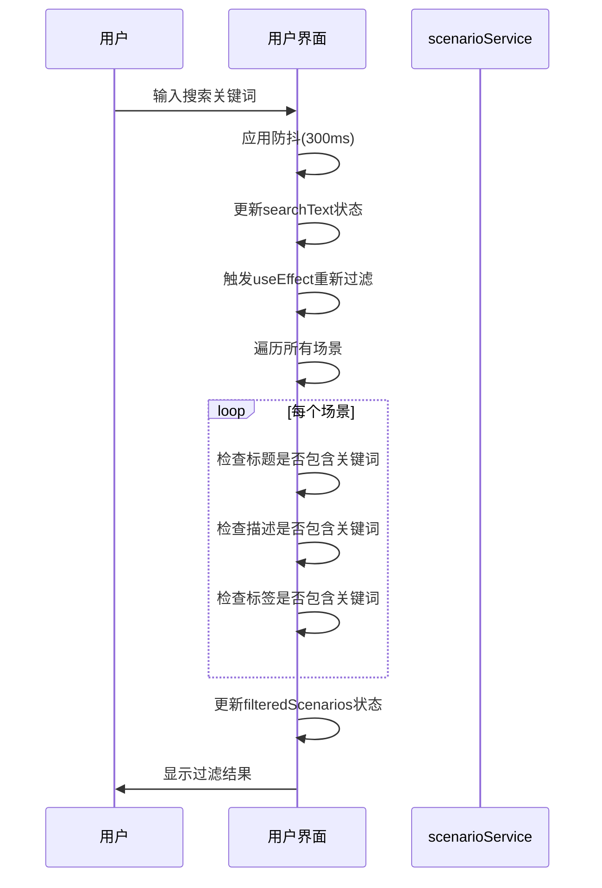
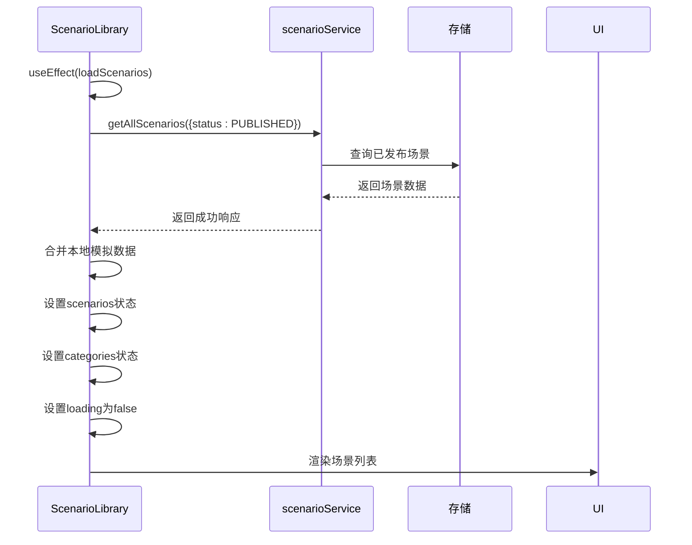
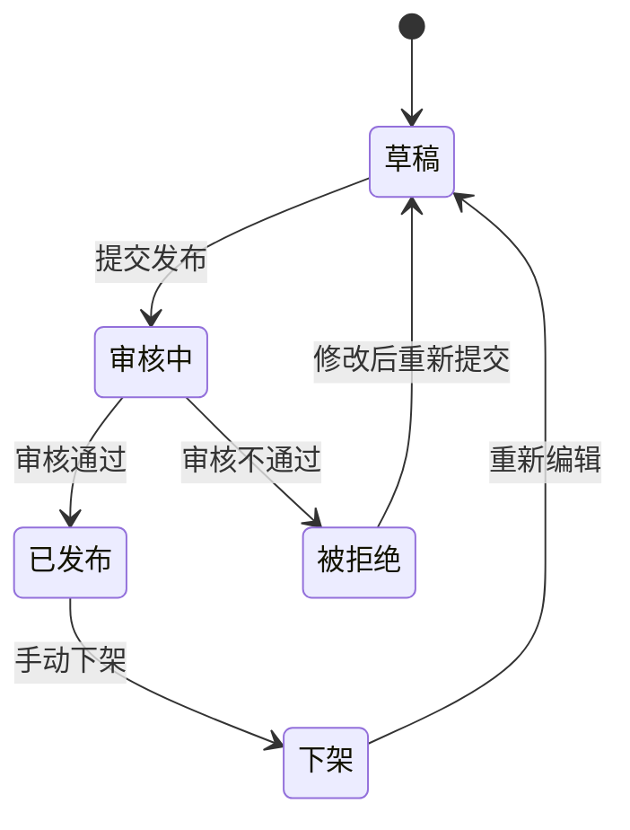
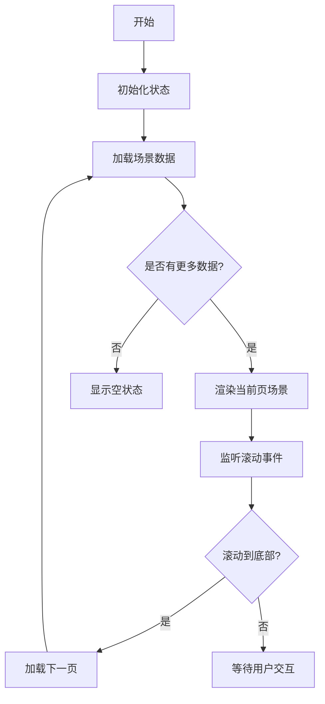
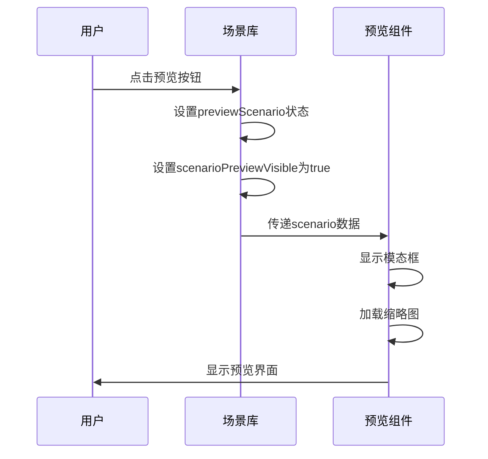
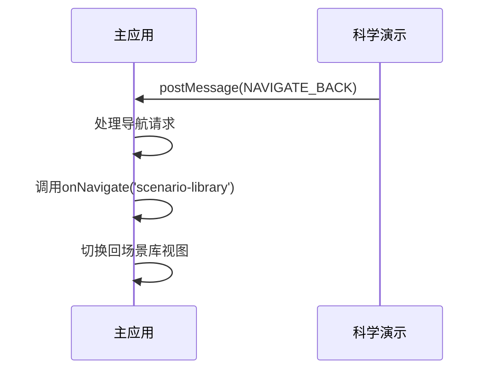

# 场景库管理

<cite>
**本文档引用文件**   
- [ScenarioLibrary.jsx](file://src/components/ScenarioLibrary.jsx)
- [scenarioService.js](file://src/services/scenarioService.js)
- [ScenarioPreview.jsx](file://src/components/ScenarioPreview.jsx)
- [ScienceDemo.jsx](file://src/components/ScienceDemo.jsx)
</cite>

## 目录
1. [简介](#简介)
2. [UI结构与功能特性](#ui结构与功能特性)
3. 场景分类与标签系统
4. 搜索过滤功能实现
5. 场景数据管理
6. 场景元数据模型
7. 列表渲染与分页加载
8. 场景预览机制
9. 与模拟平台集成
10. 使用场景与最佳实践

## 简介
场景库管理功能为用户提供了一个全面的交互式教学场景管理系统，支持场景的浏览、搜索、预览和运行。系统通过分类组织、标签管理和智能搜索等功能，帮助用户高效地发现和使用各种教学场景。

**Section sources**
- [ScenarioLibrary.jsx](file://src/components/ScenarioLibrary.jsx#L0-L53)

## UI结构与功能特性
场景库组件采用现代化的卡片式布局，每个场景以卡片形式展示，包含缩略图、标题、描述、标签和操作按钮。界面顶部提供搜索框和筛选控件，用户可以通过关键词搜索或按分类、角色进行筛选。

场景卡片支持多种操作：
- **进入**：直接运行场景
- **预览**：查看场景详细信息
- **编辑**：修改场景内容（开发中）
- **删除**：移除场景

当没有匹配场景时，系统显示友好的空状态提示。



**Diagram sources**
- [ScenarioLibrary.jsx](file://src/components/ScenarioLibrary.jsx#L51-L69)
- [ScenarioLibrary.jsx](file://src/components/ScenarioLibrary.jsx#L941-L976)

**Section sources**
- [ScenarioLibrary.jsx](file://src/components/ScenarioLibrary.jsx#L0-L53)
- [ScenarioLibrary.jsx](file://src/components/ScenarioLibrary.jsx#L51-L69)

### 分类管理
系统内置了多个场景分类，包括学生心理、家庭教育、教师培训、班级管理、学校管理、特殊教育和教学科学演示等。每个分类都有独特的颜色标识，便于用户快速识别。



**Diagram sources**
- [ScenarioLibrary.jsx](file://src/components/ScenarioLibrary.jsx#L69-L120)

**Section sources**
- [ScenarioLibrary.jsx](file://src/components/ScenarioLibrary.jsx#L69-L120)

### 角色筛选
系统支持按适用角色进行筛选，包括学生、家长、教师、心理咨询师、校长/管理者和社工等不同角色。这种设计确保用户能够找到最适合其身份和需求的教学场景。

**Section sources**
- [ScenarioLibrary.jsx](file://src/components/ScenarioLibrary.jsx#L122-L135)

## 场景分类与标签系统
### 分类组织方式
场景库采用多维度分类体系，主要基于教学领域和应用场景进行组织：

1. **学生心理健康**：考试焦虑缓解、校园霸凌应对等
2. **家庭教育**：青春期亲子沟通、单亲家庭关怀等
3. **教师专业发展**：课堂管理、差异化教学等
4. **班主任工作**：班级文化建设、问题学生转化等
5. **学校管理**：危机管理、团队建设等
6. **特殊教育**：融合教育、学习困难辅导等
7. **教学科学演示**：物理、化学、生物等学科的3D可视化演示

每种分类都有明确的定义和适用范围，帮助用户快速定位所需场景。

### 标签管理系统
每个场景都配备了一组语义化标签，这些标签从多个维度描述场景特征：

- **主题标签**：如"考试焦虑"、"亲子沟通"、"课堂管理"
- **学科标签**：如"数学"、"化学"、"心理学"
- **技术标签**：如"3D模型"、"交互式教学"、"多学科"
- **难度标签**：初级、中级、高级

标签系统采用扁平化设计，避免层级过深导致的复杂性。用户可以通过点击标签快速查找相似主题的场景。



**Diagram sources**
- [ScenarioLibrary.jsx](file://src/components/ScenarioLibrary.jsx#L137-L250)
- [scenarioService.js](file://src/services/scenarioService.js#L391-L449)

**Section sources**
- [ScenarioLibrary.jsx](file://src/components/ScenarioLibrary.jsx#L137-L250)
- [scenarioService.js](file://src/services/scenarioService.js#L391-L449)

## 搜索过滤功能实现
### 搜索功能
场景库提供了强大的搜索功能，支持对场景标题、描述和标签进行全文搜索。搜索框位于界面顶部，采用防抖技术优化性能，避免频繁触发搜索请求。

搜索逻辑实现如下：
1. 用户输入关键词
2. 系统在标题、描述和标签中进行模糊匹配
3. 返回所有匹配的场景结果

### 多维度过滤
除了搜索功能，系统还提供了多维度的筛选功能：

- **按分类筛选**：用户可以选择特定分类查看相关场景
- **按角色筛选**：根据适用角色过滤场景
- **组合筛选**：支持搜索与筛选条件的组合使用



**Diagram sources**
- [ScenarioLibrary.jsx](file://src/components/ScenarioLibrary.jsx#L252-L300)

**Section sources**
- [ScenarioLibrary.jsx](file://src/components/ScenarioLibrary.jsx#L252-L300)

## 场景数据管理
### 场景服务接口
`scenarioService` 提供了完整的场景管理API，支持场景的增删改查操作：

- `getAllScenarios()`: 获取所有场景
- `getScenarioById()`: 获取单个场景详情
- `createScenario()`: 创建新场景
- `updateScenario()`: 更新场景
- `deleteScenario()`: 删除场景
- `publishScenario()`: 发布场景
- `likeScenario()`: 点赞场景
- `incrementViews()`: 增加浏览量

### 数据获取流程
场景数据的加载流程如下：

1. 组件挂载时调用`loadScenarios()`方法
2. 从`scenarioService`获取已发布的开放平台场景
3. 合并本地模拟场景数据
4. 更新状态并渲染界面



**Diagram sources**
- [ScenarioLibrary.jsx](file://src/components/ScenarioLibrary.jsx#L677-L724)
- [scenarioService.js](file://src/services/scenarioService.js#L511-L552)

**Section sources**
- [ScenarioLibrary.jsx](file://src/components/ScenarioLibrary.jsx#L677-L724)
- [scenarioService.js](file://src/services/scenarioService.js#L511-L552)

### 增删改查操作
#### 创建场景
创建场景时，系统会验证必填字段，并自动设置作者、创建时间等元数据。如果提供了源码附件，系统会启动自动部署流程。

#### 更新场景
更新场景需要检查权限，只有场景作者或管理员才能修改。系统会对更新的数据进行验证，确保数据完整性。

#### 删除场景
删除场景有严格的权限控制：
- 只有作者或管理员可以删除
- 已发布的场景不能删除，只能下架
- 删除操作需要二次确认

#### 发布场景
发布场景实际上是提交审核流程：
1. 场景必须处于草稿或被拒绝状态
2. 提交后状态变为"审核中"
3. 模拟3秒后自动通过审核，状态变为"已发布"



**Diagram sources**
- [scenarioService.js](file://src/services/scenarioService.js#L780-L826)
- [scenarioService.js](file://src/services/scenarioService.js#L820-L877)

**Section sources**
- [scenarioService.js](file://src/services/scenarioService.js#L644-L734)
- [scenarioService.js](file://src/services/scenarioService.js#L729-L785)

## 场景元数据模型
### 字段定义
每个场景包含丰富的元数据字段，分为基本信息、分类信息、统计信息和互动仿真信息四类。

| 字段 | 类型 | 描述 | 必填 |
|------|------|------|------|
| id | string | 场景唯一标识符 | 是 |
| title | string | 场景标题 | 是 |
| description | string | 场景描述 | 是 |
| category | string | 分类ID | 是 |
| roles | array | 适用角色数组 | 是 |
| tags | array | 标签数组 | 是 |
| author | string | 作者姓名 | 是 |
| createTime | string | 创建时间 | 是 |
| lastModified | string | 最后修改时间 | 是 |
| views | number | 浏览量 | 否 |
| likes | number | 收藏量 | 否 |
| difficulty | string | 难度等级 | 是 |
| duration | string | 预计时长 | 是 |
| thumbnail | string | 缩略图URL | 是 |
| files | object | 文件资源对象 | 是 |

### 难度等级
系统定义了三个难度等级，每个等级对应不同的颜色标识：

- **简单**：绿色，适合初学者
- **中等**：橙色，适合有一定基础的用户
- **困难**：红色，适合高级用户

### 互动仿真字段
对于教学科学演示类场景，系统支持互动仿真相关字段：

- `simulationUrl`: 互动仿真地址
- `sourceAttachment`: 源码附件信息
- `deploymentStatus`: 部署状态

当上传源码附件时，系统会自动生成部署URL并启动部署流程。

**Section sources**
- [ScenarioLibrary.jsx](file://src/components/ScenarioLibrary.jsx#L252-L500)
- [scenarioService.js](file://src/services/scenarioService.js#L391-L449)

## 列表渲染与分页加载
### 场景列表渲染
场景列表采用响应式网格布局，根据不同屏幕尺寸调整列数：

- 手机端：1列
- 平板端：2列
- 桌面端：3-4列

每个场景卡片包含以下元素：
- 缩略图：嵌入式iframe展示场景预览
- 标题：场景名称和难度标签
- 描述：简要说明场景内容
- 标签组：展示场景的关键标签
- 元数据：作者、时长、浏览量、收藏量
- 操作按钮：进入、预览、编辑、删除

### 分页加载
当前实现中，系统一次性加载所有场景数据，然后在前端进行过滤和展示。未来可扩展为真正的分页加载：

1. 初始化时加载第一页数据
2. 滚动到底部时加载下一页
3. 维护分页状态和总页数



**Section sources**
- [ScenarioLibrary.jsx](file://src/components/ScenarioLibrary.jsx#L941-L976)

## 场景预览机制
### 预览功能实现
场景预览通过`ScenarioPreview`组件实现，提供多标签页的详细信息展示：

- **场景预览**：缩放的iframe展示场景主要内容
- **详细信息**：场景描述、学习目标、适用对象等
- **使用说明**：操作指南和注意事项
- **评价反馈**：用户评分和评论

预览窗口包含以下交互功能：
- 点赞：增加收藏量
- 分享：复制分享链接
- 下载：下载场景文件
- 运行：进入完整场景

### 预览样式处理
为了在有限空间内展示完整的场景内容，系统采用了CSS变换技术：

```css
iframe {
    width: 125%;
    height: 125%;
    transform: scale(0.8);
    transform-origin: top left;
}
```

这种方法可以在保持内容完整性的前提下，将大尺寸内容适配到小窗口中。



**Diagram sources**
- [ScenarioPreview.jsx](file://src/components/ScenarioPreview.jsx#L0-L358)

**Section sources**
- [ScenarioPreview.jsx](file://src/components/ScenarioPreview.jsx#L0-L358)
- [ScenarioLibrary.jsx](file://src/components/ScenarioLibrary.jsx#L977-L1133)

## 与模拟平台集成
### 特殊场景处理
系统支持特殊类型的场景，如科学演示和心理健康辅导。这些场景通过`isSpecialScenario`标记，并指定`routePath`路由路径。

当用户运行特殊场景时，系统会触发视图切换而不是打开新窗口：

```javascript
if (scenario.isSpecialScenario && scenario.routePath && onViewChange) {
    onViewChange(scenario.routePath.replace('/', ''))
} else {
    window.open(scenario.files.html, '_blank')
}
```

### 科学演示集成
科学演示场景通过`ScienceDemo`组件集成，该组件使用iframe嵌入外部HTML页面，并通过postMessage API实现父子窗口通信。



**Diagram sources**
- [ScienceDemo.jsx](file://src/components/ScienceDemo.jsx#L0-L38)
- [ScenarioLibrary.jsx](file://src/components/ScenarioLibrary.jsx#L941-L976)

**Section sources**
- [ScienceDemo.jsx](file://src/components/ScienceDemo.jsx#L0-L38)
- [ScenarioLibrary.jsx](file://src/components/ScenarioLibrary.jsx#L941-L976)

## 使用场景与最佳实践
### 常见使用场景
1. **教师备课**：查找相关教学场景，用于课堂教学
2. **学生自学**：通过互动场景自主学习复杂概念
3. **教师培训**：参与专业发展场景，提升教学技能
4. **心理咨询**：使用心理辅导场景进行模拟训练
5. **家校合作**：家长学习亲子沟通技巧

### 最佳实践
#### 高效组织大量教学场景
1. **合理分类**：建立清晰的分类体系，避免分类过多或过少
2. **规范标签**：制定标签命名规范，避免同义词重复
3. **定期维护**：清理过时场景，更新优质内容
4. **权限管理**：设置不同角色的访问和编辑权限
5. **数据分析**：关注场景的浏览量、收藏量等指标，优化内容策略

#### 场景创建建议
1. **明确目标**：每个场景应有清晰的学习目标
2. **控制时长**：保持场景时长在合理范围内（20-60分钟）
3. **丰富交互**：增加用户参与度，避免单向灌输
4. **兼容设备**：确保在不同设备上都能正常运行
5. **持续迭代**：根据用户反馈不断优化场景内容

**Section sources**
- [ScenarioLibrary.jsx](file://src/components/ScenarioLibrary.jsx#L252-L500)
- [scenarioService.js](file://src/services/scenarioService.js#L391-L449)