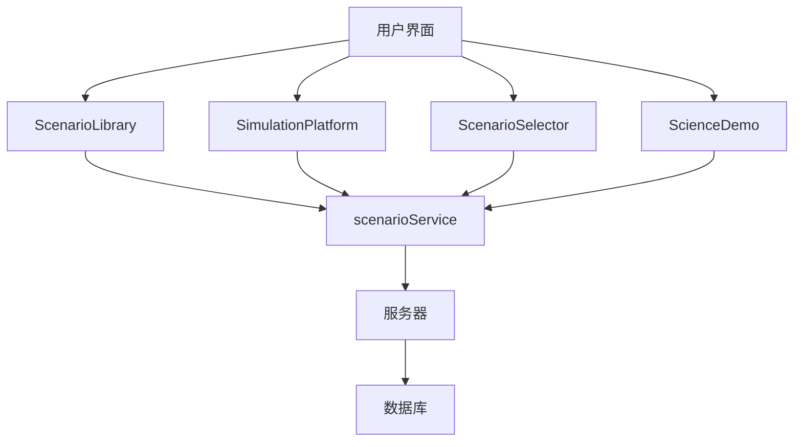

# 场景模拟系统

<cite>
**本文档引用的文件**   
- [ScenarioLibrary.jsx](file://src/components/ScenarioLibrary.jsx)
- [SimulationPlatform.jsx](file://src/components/SimulationPlatform.jsx)
- [ScenarioSelector.jsx](file://src/components/ScenarioSelector.jsx)
- [ScienceDemo.jsx](file://src/components/ScienceDemo.jsx)
- [scenarioService.js](file://src/services/scenarioService.js)
</cite>

## 目录
1. [引言](#引言)
2. [项目结构](#项目结构)
3. [核心组件](#核心组件)
4. [架构概述](#架构概述)
5. [详细组件分析](#详细组件分析)
6. [依赖分析](#依赖分析)
7. [性能考虑](#性能考虑)
8. [故障排除指南](#故障排除指南)
9. [结论](#结论)

## 引言
场景模拟系统是一个综合性的教育技术平台，旨在通过交互式模拟环境支持多种学科（如物理、化学、生物等）的教学需求。该系统集成了场景库管理、模拟平台和场景选择器三大核心组件，为用户提供了一个完整的教学模拟解决方案。系统不仅支持教师创建和分享教学场景，还允许学生和家长参与学习过程，促进家校合作与协同教育。

## 项目结构
本项目的目录结构清晰地划分了前端资源、源代码和服务模块。`public` 目录存放静态资源，包括编辑器、插件和HTML演示文件；`src` 目录包含React组件、数据服务和工具函数；根目录下则有配置文件和文档说明。


**Diagram sources**
- [ScenarioLibrary.jsx](file://src/components/ScenarioLibrary.jsx)
- [SimulationPlatform.jsx](file://src/components/SimulationPlatform.jsx)
- [ScenarioSelector.jsx](file://src/components/ScenarioSelector.jsx)
- [ScienceDemo.jsx](file://src/components/ScienceDemo.jsx)

**Section sources**
- [ScenarioLibrary.jsx](file://src/components/ScenarioLibrary.jsx)
- [SimulationPlatform.jsx](file://src/components/SimulationPlatform.jsx)
- [ScenarioSelector.jsx](file://src/components/ScenarioSelector.jsx)
- [ScienceDemo.jsx](file://src/components/ScienceDemo.jsx)

## 核心组件

### 场景库管理 (ScenarioLibrary)
场景库管理组件负责组织和展示所有可用的教学场景。它提供了分类筛选、角色筛选和全文搜索功能，帮助用户快速找到合适的场景。每个场景卡片显示标题、难度等级、作者、浏览量和点赞数等元数据，并支持预览、运行、编辑和删除操作。

#### 场景组织结构
场景按照分类进行组织，主要分类包括：
- 学生心理
- 家庭教育
- 教师培训
- 班级管理
- 学校管理
- 特殊教育
- 教学科学演示

每个场景包含以下元数据：
- **ID**: 唯一标识符
- **标题**: 场景名称
- **描述**: 详细说明
- **分类**: 所属类别
- **适用角色**: 可使用该场景的角色
- **标签**: 关键词标签
- **作者**: 创建者姓名
- **创建时间**: 创建日期
- **最后修改**: 最后更新时间
- **浏览量**: 被查看次数
- **点赞数**: 收藏数量
- **难度**: 难度等级（简单、中等、困难）
- **时长**: 预计完成时间
- **缩略图**: 预览图片或HTML页面链接
- **文件**: HTML、CSS、JS文件路径

#### 元数据管理
系统通过 `mockScenarios` 数组存储场景数据，并在组件初始化时加载。用户可以通过搜索框按标题、描述或标签进行搜索，也可以通过下拉菜单按分类和角色进行筛选。场景的难度等级用颜色编码表示，便于识别。

**Section sources**
- [ScenarioLibrary.jsx](file://src/components/ScenarioLibrary.jsx)

### 模拟平台 (SimulationPlatform)
模拟平台是系统的开放共享中心，允许用户贡献、发现和评价教学场景。平台分为四个主要部分：发现、我的贡献、社区和贡献者排行榜。

#### 交互式模拟环境实现
平台提供了一个丰富的UI界面，包含多个选项卡：
- **发现**: 展示精选场景，支持分页浏览。
- **我的贡献**: 显示用户自己创建的场景及其统计数据。
- **社区**: 提供最新动态、热门讨论和活跃话题。
- **贡献者排行榜**: 展示本月表现最佳的贡献者。

平台还集成了统计信息，如总场景数、贡献者数量、总下载量和月活跃用户数。用户可以创建新场景，填写标题、分类、学科领域、难度等级、预计时长、使用许可等信息，并上传源码附件或提供仿真地址。

**Section sources**
- [SimulationPlatform.jsx](file://src/components/SimulationPlatform.jsx)

### 场景选择器 (ScenarioSelector)
场景选择器组件用于让用户从一系列预设的心理健康辅导场景中选择一个进行训练。它提供了基于类别和难度等级的筛选功能，并展示了每个场景的详细信息。

#### 场景筛选和加载机制
用户可以选择不同的场景类别（如压力管理、焦虑障碍、抑郁情绪等）和难度等级（初级、中级、高级）。筛选后的场景列表会动态更新，显示匹配的结果。每个场景卡片包含标题、难度、时长、学生信息、训练技能和学习目标等详细内容。

当用户点击“开始训练”按钮时，系统会调用 `onSelectScenario` 回调函数，将选中的场景传递给父组件进行处理。已完成的场景会有特殊标记，提醒用户已练习过。

**Section sources**
- [ScenarioSelector.jsx](file://src/components/ScenarioSelector.jsx)

## 架构概述

### 系统架构
系统采用前后端分离的架构设计，前端使用React框架构建用户界面，后端通过 `scenarioService` 提供API接口。各组件之间通过props传递数据和回调函数，保持松耦合。



**Diagram sources**
- [ScenarioLibrary.jsx](file://src/components/ScenarioLibrary.jsx)
- [SimulationPlatform.jsx](file://src/components/SimulationPlatform.jsx)
- [ScenarioSelector.jsx](file://src/components/ScenarioSelector.jsx)
- [ScienceDemo.jsx](file://src/components/ScienceDemo.jsx)
- [scenarioService.js](file://src/services/scenarioService.js)

### 数据流
1. 用户在界面上触发操作（如搜索、筛选、运行场景）。
2. 组件调用相应的事件处理器。
3. 处理器调用 `scenarioService` 中的服务方法。
4. 服务方法发送HTTP请求到服务器。
5. 服务器返回数据，服务方法解析并返回结果。
6. 组件根据返回结果更新状态，重新渲染UI。

## 详细组件分析

### ScienceDemo 组件
`ScienceDemo` 组件是一个特殊的教学场景，专门用于展示科学实验的3D可视化效果。它通过iframe嵌入外部HTML页面，实现跨域通信。

#### 实现模式和可配置参数
- **onNavigate**: 回调函数，用于处理导航事件。
- **useEffect**: 监听来自iframe的消息，特别是 `NAVIGATE_BACK` 类型的消息，以便返回上一级。
- **iframe src**: 指向 `/gen-html/science_demo_home.html`，即科学演示的主页面。

该组件支持多种学科的教学模拟，包括物理、化学、生物、数学、地理等。用户可以在iframe中进行交互式操作，观察实验现象。

**Section sources**
- [ScienceDemo.jsx](file://src/components/ScienceDemo.jsx)

## 依赖分析

### 组件依赖关系
- `ScenarioLibrary` 依赖于 `scenarioService` 获取场景数据。
- `SimulationPlatform` 依赖于 `scenarioService` 进行场景管理和统计。
- `ScenarioSelector` 不直接依赖外部服务，但需要父组件提供 `onSelectScenario` 回调。
- `ScienceDemo` 依赖于外部HTML资源，通过iframe加载。

### 外部依赖
- **Ant Design**: UI组件库，提供Card、Button、Modal等基础组件。
- **Lucide React**: 图标库，提供Play、Eye、Edit等图标。
- **React**: 前端框架，用于构建组件化UI。

```mermaid
graph TD
A[ScenarioLibrary] --> B[scenarioService]
C[SimulationPlatform] --> B
D[ScenarioSelector] --> E[父组件]
F[ScienceDemo] --> G[iframe]
G --> H[/gen-html/science_demo_home.html]
```

**Diagram sources**
- [ScenarioLibrary.jsx](file://src/components/ScenarioLibrary.jsx)
- [SimulationPlatform.jsx](file://src/components/SimulationPlatform.jsx)
- [ScenarioSelector.jsx](file://src/components/ScenarioSelector.jsx)
- [ScienceDemo.jsx](file://src/components/ScienceDemo.jsx)
- [scenarioService.js](file://src/services/scenarioService.js)

## 性能考虑
系统在加载大量场景数据时可能会遇到性能瓶颈。建议对场景数据进行分页加载，避免一次性获取过多数据。此外，可以引入缓存机制，减少重复请求。对于复杂的3D可视化场景，应优化模型和纹理资源，确保在不同设备上的流畅运行。

## 故障排除指南
- **场景无法加载**: 检查网络连接，确认iframe的src路径是否正确。
- **搜索无结果**: 确认搜索关键词是否匹配场景的标题、描述或标签。
- **发布失败**: 检查表单必填项是否完整，特别是互动仿真地址或源码附件。
- **权限错误**: 确保当前用户具有相应操作的权限，如编辑或删除他人场景。

## 结论
场景模拟系统通过整合场景库管理、模拟平台和场景选择器三大组件，为教育工作者提供了一个强大而灵活的教学工具。系统支持多学科教学需求，具备良好的扩展性和可维护性。未来可进一步增强AI辅助功能，提升用户体验。