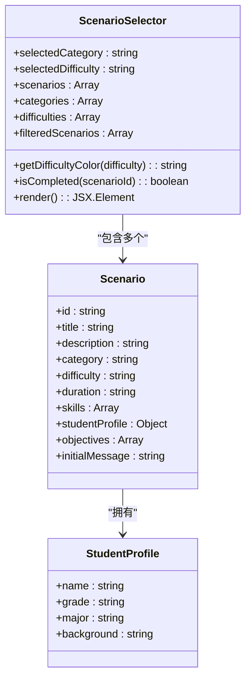
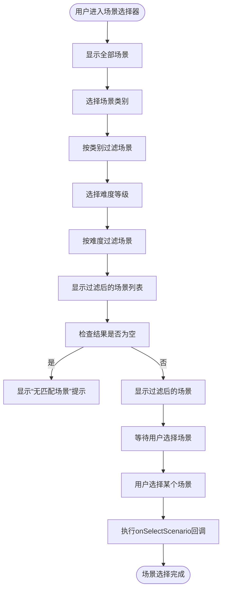
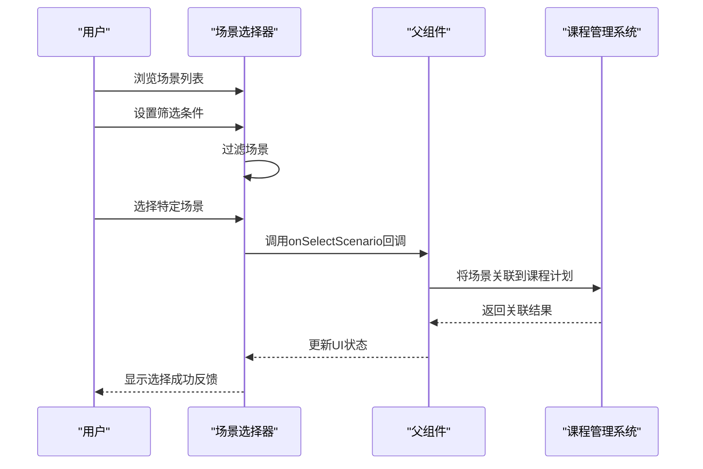
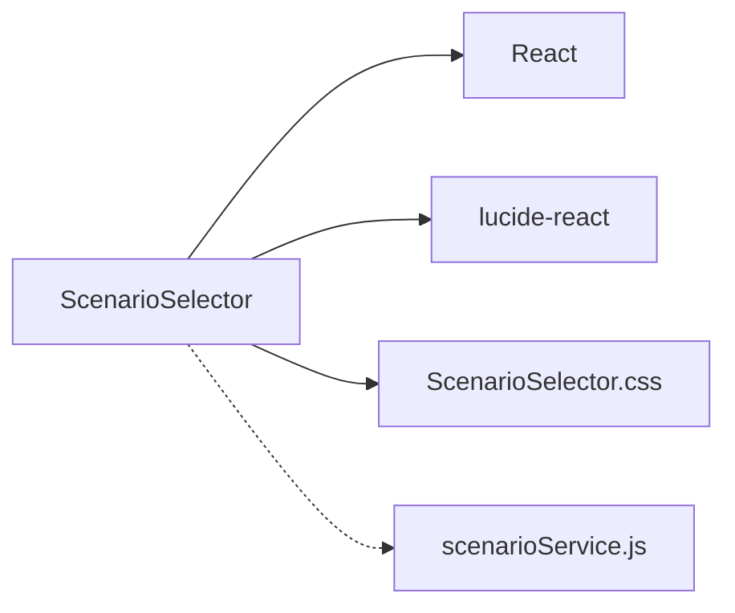

# 场景选择器

<cite>
**本文档引用的文件**
- [ScenarioSelector.jsx](file://src/components/ScenarioSelector.jsx)
- [scenarioService.js](file://src/services/scenarioService.js)
</cite>

## 目录
1. [引言](#引言)
2. [项目结构](#项目结构)
3. [核心组件](#核心组件)
4. [架构概述](#架构概述)
5. [详细组件分析](#详细组件分析)
6. [依赖关系分析](#依赖关系分析)
7. [性能考虑](#性能考虑)
8. [故障排除指南](#故障排除指南)
9. [结论](#结论)

## 引言
场景选择器是课程创建和教学设计中的关键功能组件，为用户提供了一个直观、高效的界面来浏览、筛选和选择心理健康辅导训练场景。该组件通过分类浏览、难度筛选和多选操作等功能，帮助用户快速定位合适的教学场景，并与课程管理系统集成，实现将选定场景关联到具体课程计划。本文档详细说明了场景选择器的功能特性、UI布局、交互逻辑、状态管理机制以及性能优化措施。

## 项目结构
场景选择器组件位于`src/components`目录下，作为独立的React组件实现。它与`src/services`目录下的`scenarioService.js`服务文件协同工作，获取场景数据并处理相关业务逻辑。整个项目采用模块化设计，将UI组件与业务逻辑分离，便于维护和扩展。

```mermaid
graph TB
subgraph "组件"
ScenarioSelector[ScenarioSelector.jsx]
ScenarioLibrary[ScenarioLibrary.jsx]
ScenarioPreview[ScenarioPreview.jsx]
ScenarioUpload[ScenarioUpload.jsx]
end
subgraph "服务"
scenarioService[scenarioService.js]
end
ScenarioSelector --> scenarioService : "获取场景数据"
ScenarioLibrary --> scenarioService : "管理场景库"
ScenarioPreview --> scenarioService : "预览场景详情"
ScenarioUpload --> scenarioService : "上传新场景"
```

**Diagram sources**
- [ScenarioSelector.jsx](file://src/components/ScenarioSelector.jsx)
- [scenarioService.js](file://src/services/scenarioService.js)

**Section sources**
- [ScenarioSelector.jsx](file://src/components/ScenarioSelector.jsx)
- [scenarioService.js](file://src/services/scenarioService.js)

## 核心组件
场景选择器组件（ScenarioSelector）是一个功能丰富的UI组件，主要负责展示可用的训练场景，提供筛选和搜索功能，并允许用户选择特定场景进行训练。组件接收`onSelectScenario`回调函数作为props，当用户选择一个场景时，通过该回调通知父组件。同时，组件还接收`completedScenarios`数组，用于标记已完成的场景。

**Section sources**
- [ScenarioSelector.jsx](file://src/components/ScenarioSelector.jsx#L4-L340)

## 架构概述
场景选择器采用React函数式组件结合Hooks的方式实现，利用`useState`管理组件内部状态，如当前选中的分类和难度等级。组件的数据来源于内置的场景列表，这些场景包含标题、描述、类别、难度、持续时间、训练技能、学生信息和学习目标等丰富属性。通过过滤机制，组件能够根据用户的筛选条件动态显示匹配的场景。



**Diagram sources**
- [ScenarioSelector.jsx](file://src/components/ScenarioSelector.jsx#L4-L340)

## 详细组件分析

### UI布局和交互逻辑
场景选择器的UI布局分为三个主要部分：头部信息区、筛选器区和场景列表区。头部信息区显示组件标题和简要说明；筛选器区提供场景类别和难度等级的选择按钮；场景列表区以卡片形式展示所有匹配的场景。

#### 筛选条件设置
用户可以通过点击类别图标或难度按钮来设置筛选条件。每个筛选按钮都有激活状态样式，直观地显示当前选择。筛选功能实现实时响应，当用户更改筛选条件时，场景列表会立即更新。



**Diagram sources**
- [ScenarioSelector.jsx](file://src/components/ScenarioSelector.jsx#L4-L340)

**Section sources**
- [ScenarioSelector.jsx](file://src/components/ScenarioSelector.jsx#L4-L340)

### 多选操作和状态管理
虽然当前实现中每个场景卡片只有一个"开始训练"按钮，但组件设计支持多选操作的概念。通过`completedScenarios`属性，组件可以跟踪哪些场景已经被完成，并在UI上做出相应标记。这种状态管理机制使得用户能够清晰地看到自己的学习进度。

### 与课程管理系统的集成
场景选择器通过`onSelectScenario`回调函数与父组件通信，将选定的场景数据传递给课程管理系统。这使得系统能够将选定的场景关联到具体的课程计划中，实现教学内容的动态配置。



**Diagram sources**
- [ScenarioSelector.jsx](file://src/components/ScenarioSelector.jsx#L321-L321)
- [CourseSelectionEditPage.jsx](file://src/components/CourseSelectionEditPage.jsx#L3248-L3267)

**Section sources**
- [ScenarioSelector.jsx](file://src/components/ScenarioSelector.jsx#L4-L340)

## 依赖关系分析
场景选择器组件主要依赖于React框架和一些UI图标库（如lucide-react）。它与`scenarioService.js`服务文件存在间接依赖关系，因为场景数据的结构和格式需要与服务端定义保持一致。此外，组件的样式依赖于`ScenarioSelector.css`文件，确保UI表现的一致性。



**Diagram sources**
- [ScenarioSelector.jsx](file://src/components/ScenarioSelector.jsx)
- [ScenarioSelector.css](file://src/components/ScenarioSelector.css)

**Section sources**
- [ScenarioSelector.jsx](file://src/components/ScenarioSelector.jsx)
- [scenarioService.js](file://src/services/scenarioService.js)

## 性能考虑
场景选择器在性能方面做了以下优化：
1. 使用简单的数组过滤方法进行场景筛选，避免复杂的计算。
2. 采用虚拟滚动技术的潜力，虽然当前实现中未明确使用，但组件结构支持未来添加此功能以处理大量场景列表。
3. 利用React的key属性优化列表渲染性能。
4. 通过CSS动画延迟（animation-delay）实现场景卡片的渐进式加载效果，提升用户体验。

**Section sources**
- [ScenarioSelector.jsx](file://src/components/ScenarioSelector.jsx#L262-L288)

## 故障排除指南
### 常见问题及解决方案
- **问题：筛选功能不生效**
  - 检查`selectedCategory`和`selectedDifficulty`状态是否正确更新
  - 确认场景数据中的`category`和`difficulty`字段与筛选条件匹配
- **问题：场景列表为空**
  - 验证场景数据是否正确加载
  - 检查筛选条件是否过于严格导致无匹配结果
- **问题：选择场景后无响应**
  - 确认父组件正确传递了`onSelectScenario`回调函数
  - 检查回调函数的实现是否正确处理场景数据

**Section sources**
- [ScenarioSelector.jsx](file://src/components/ScenarioSelector.jsx#L4-L340)

## 结论
场景选择器作为一个关键的教学设计工具，通过直观的UI设计和高效的交互逻辑，极大地简化了课程创建过程。其模块化的架构和清晰的依赖关系使得组件易于维护和扩展。未来可以考虑增加更多高级功能，如收藏夹、推荐系统和更复杂的多选操作，以进一步提升用户体验。