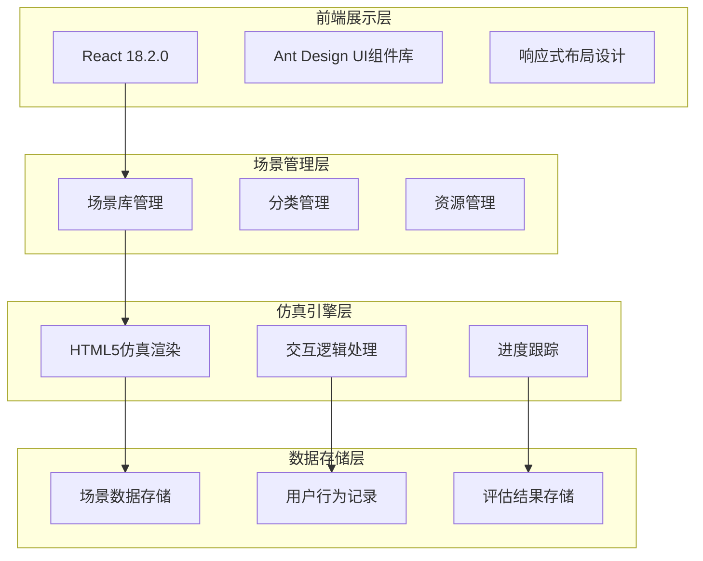
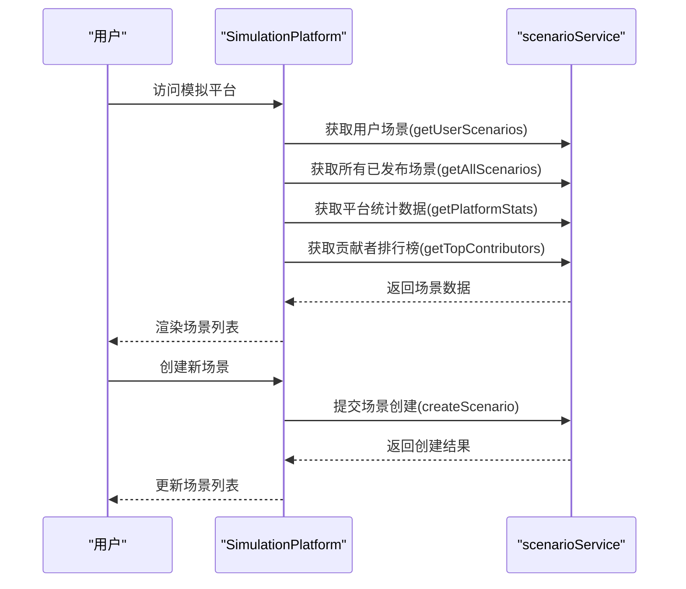
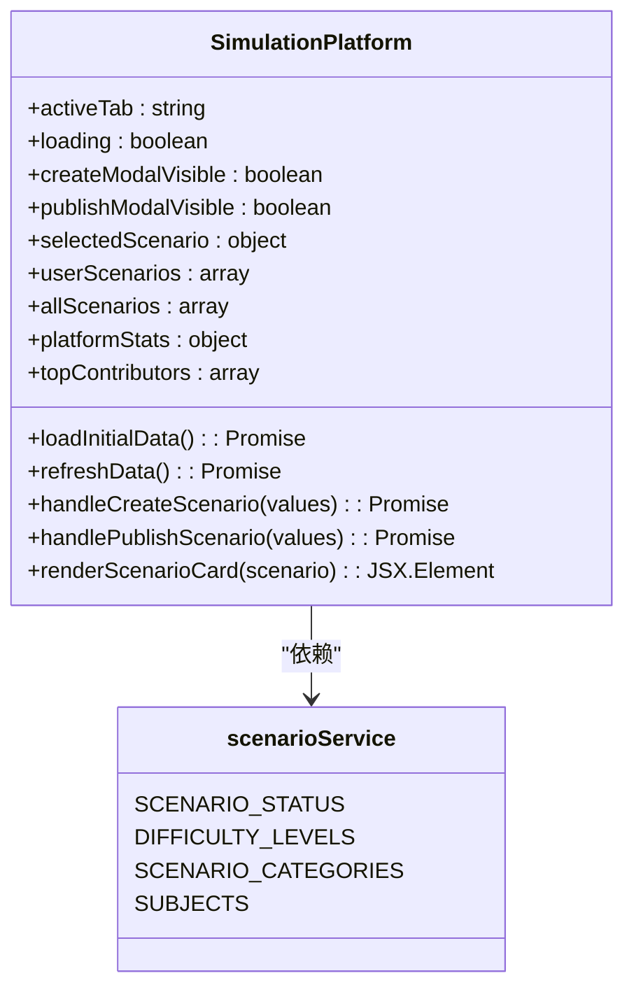
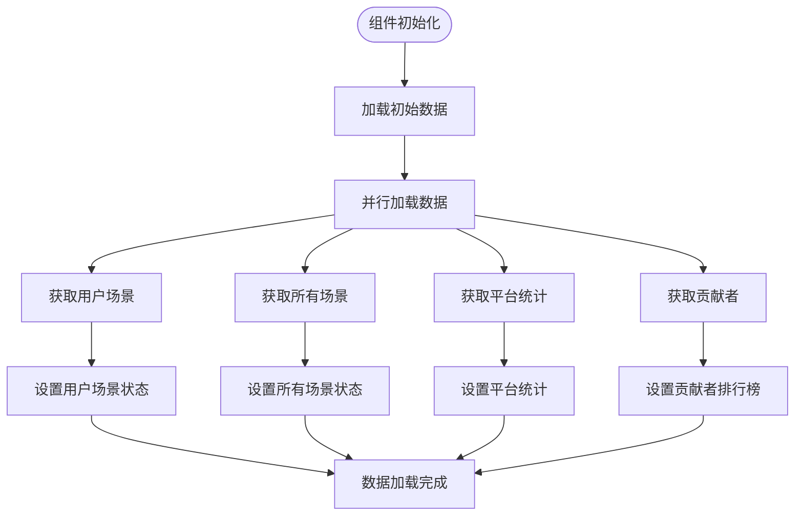
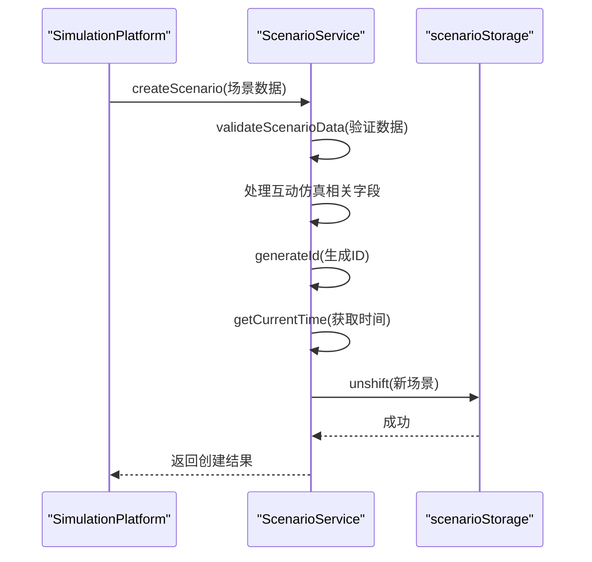
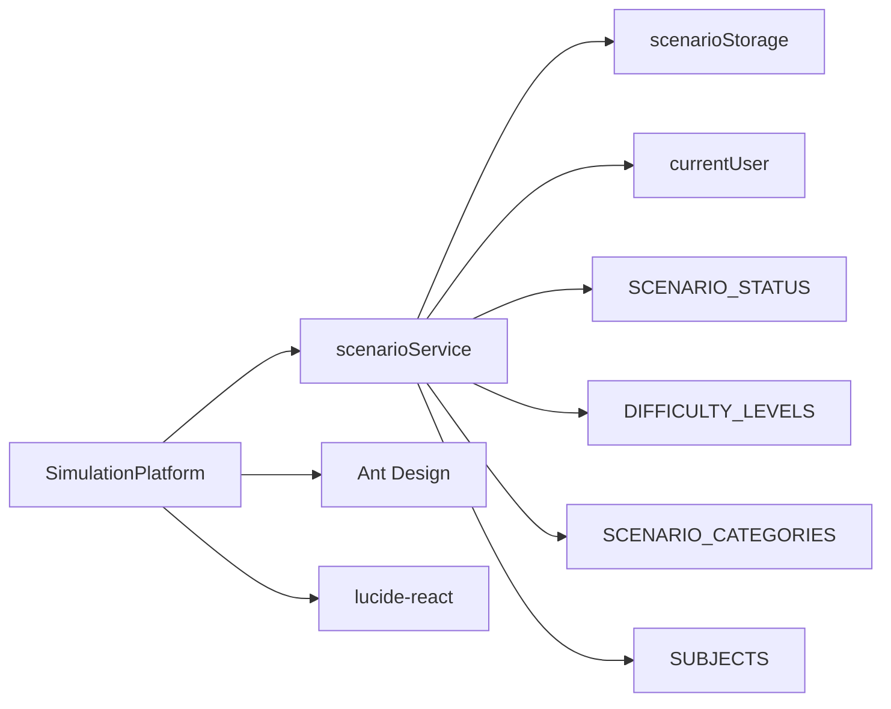

# 架构设计

<cite>
**本文档引用的文件**
- [SimulationPlatform.jsx](file://src/components/SimulationPlatform.jsx)
- [scenarioService.js](file://src/services/scenarioService.js)
- [场景模拟仿真系统需求规格说明书.md](file://场景模拟仿真系统需求规格说明书.md)
</cite>

## 目录
1. [引言](#引言)
2. [项目结构](#项目结构)
3. [核心组件](#核心组件)
4. [架构概述](#架构概述)
5. [详细组件分析](#详细组件分析)
6. [依赖关系分析](#依赖关系分析)
7. [性能考虑](#性能考虑)
8. [故障排除指南](#故障排除指南)
9. [结论](#结论)

## 引言
本架构文档旨在全面描述场景模拟系统的整体设计模式和组件交互关系。系统以教育工作者为核心用户，提供沉浸式的教学场景模拟体验，涵盖学生心理、家庭教育、教师培训等多个领域。通过虚拟仿真技术，系统帮助用户提升专业技能和应对能力。

## 项目结构
场景模拟系统采用模块化架构设计，主要分为前端展示层、场景管理层、仿真引擎层和数据存储层四个层次。系统基于React框架构建，使用Ant Design作为UI组件库，实现了响应式布局和现代化的用户界面。

**Diagram sources**
- [场景模拟仿真系统需求规格说明书.md](file://场景模拟仿真系统需求规格说明书.md)

**Section sources**
- [场景模拟仿真系统需求规格说明书.md](file://场景模拟仿真系统需求规格说明书.md)

## 核心组件
系统的核心执行引擎是SimulationPlatform组件，它负责协调场景加载、状态管理和用户交互。该组件通过事件驱动架构实现跨组件通信，并与场景服务层进行数据交互。

**Section sources**
- [SimulationPlatform.jsx](file://src/components/SimulationPlatform.jsx)
- [scenarioService.js](file://src/services/scenarioService.js)

## 架构概述
系统采用事件驱动架构，通过React Context和状态管理机制实现跨组件通信。SimulationPlatform作为核心执行引擎，协调场景加载、状态管理和用户交互过程。

**Diagram sources**
- [SimulationPlatform.jsx](file://src/components/SimulationPlatform.jsx)
- [scenarioService.js](file://src/services/scenarioService.js)

## 详细组件分析

### SimulationPlatform组件分析
SimulationPlatform组件是系统的核心执行引擎，负责协调场景加载、状态管理和用户交互。组件使用React Hooks管理多个状态变量，包括活动标签页、加载状态、模态框可见性等。

#### 状态管理

**Diagram sources**
- [SimulationPlatform.jsx](file://src/components/SimulationPlatform.jsx)

#### 组件交互流程

**Diagram sources**
- [SimulationPlatform.jsx](file://src/components/SimulationPlatform.jsx)

### 场景服务分析
场景服务（scenarioService）负责处理场景相关的业务逻辑，包括场景的创建、发布、更新和删除等操作。

#### 服务方法调用流程

**Diagram sources**
- [scenarioService.js](file://src/services/scenarioService.js)

## 依赖关系分析
系统各组件之间存在明确的依赖关系，确保了功能的模块化和可维护性。

**Diagram sources**
- [SimulationPlatform.jsx](file://src/components/SimulationPlatform.jsx)
- [scenarioService.js](file://src/services/scenarioService.js)

**Section sources**
- [SimulationPlatform.jsx](file://src/components/SimulationPlatform.jsx)
- [scenarioService.js](file://src/services/scenarioService.js)

## 性能考虑
系统在设计时充分考虑了性能优化策略，包括数据的懒加载和缓存机制。通过并行加载多个数据源，减少了页面加载时间。同时，系统采用了防抖和节流技术来优化频繁的操作请求。

## 故障排除指南
当系统出现数据加载失败时，应检查网络连接状态和服务端响应。如果场景创建失败，需要验证输入数据的完整性和格式是否符合要求。对于性能问题，可以检查是否有不必要的重新渲染或内存泄漏。

**Section sources**
- [SimulationPlatform.jsx](file://src/components/SimulationPlatform.jsx)
- [scenarioService.js](file://src/services/scenarioService.js)

## 结论
场景模拟系统通过精心设计的架构和组件交互，实现了高效、可扩展的模拟仿真平台。系统采用事件驱动架构和现代化的状态管理方案，确保了良好的用户体验和系统性能。未来可以通过引入更高级的缓存策略和预加载机制进一步优化系统性能。