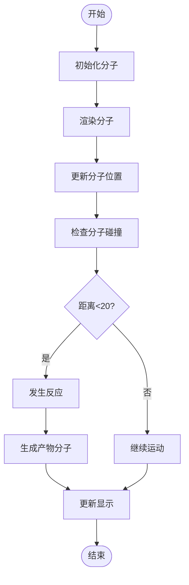
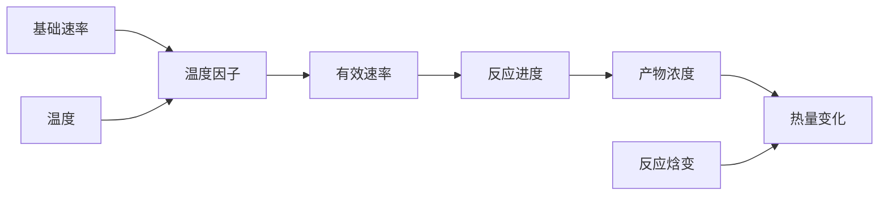

# 化学模拟

<cite>
**本文档引用文件**   
- [chemistry_demo.html](file://public/gen-html/chemistry_demo.html)
- [chemistry_demo.js](file://public/gen-html/chemistry_demo.js)
- [chemistry_demo.css](file://public/gen-html/chemistry_demo.css)
</cite>

## 目录
1. [引言](#引言)
2. [化学反应建模方法](#化学反应建模方法)
3. [分子结构可视化技术](#分子结构可视化技术)
4. [实验操作交互逻辑](#实验操作交互逻辑)
5. [化学方程式动态生成算法](#化学方程式动态生成算法)
6. [反应速率计算数学模型](#反应速率计算数学模型)
7. [安全警示功能](#安全警示功能)
8. [实验数据记录功能](#实验数据记录功能)

## 引言

化学模拟系统是一个交互式化学实验可视化平台，旨在通过数字化方式呈现化学实验过程。该系统提供了多种实验类型选择，包括酸碱中和反应、沉淀反应、氧化还原反应等，使用户能够直观地观察和理解化学反应的基本原理。平台集成了实时数据监测、分子运动模拟和反应条件调节等功能，为学习者提供了一个安全、可控的虚拟实验环境。

**Section sources**
- [chemistry_demo.html](file://public/gen-html/chemistry_demo.html#L1-L50)

## 化学反应建模方法

化学反应过程采用基于粒子系统的建模方法，通过JavaScript类`ChemistryDemo`实现。系统将反应物表示为具有位置、速度和颜色属性的分子对象，并在画布上进行可视化渲染。反应进度通过时间增量(deltaTime)逐步更新，使用`updateReaction`方法计算反应进度、产物浓度和热量变化。

反应物分子的初始化通过`initializeMolecules`方法完成，根据用户设置的浓度参数生成相应数量的分子。分子的颜色由`getMoleculeColor`方法根据分子类型确定，如HCl为红色(#ff6b6b)，NaOH为蓝色(#74b9ff)。反应的发生基于概率检测机制，在`tryReaction`方法中检查两种反应物分子的距离是否小于阈值(20像素)，若满足条件则标记为已反应并生成产物。

**Section sources**
- [chemistry_demo.js](file://public/gen-html/chemistry_demo.js#L137-L176)
- [chemistry_demo.js](file://public/gen-html/chemistry_demo.js#L354-L393)

## 分子结构可视化技术

分子结构可视化采用HTML5 Canvas技术实现，通过`drawMolecules`和`drawProducts`方法绘制分子及其运动轨迹。反应物分子以圆形表示，不同类型的分子用不同颜色区分，并在分子上方显示其化学式标签。分子的运动模拟了布朗运动特性，包含随机速度变化和边界碰撞检测。

对于原子轨道表示，系统使用简单的圆形元素来代表原子，通过CSS样式定义不同原子的颜色特征：氢原子(H)为红色，氯原子(Cl)为绿色，钠原子(Na)为紫色，氧原子(O)为橙色。化学键形成动画通过分子接近时发生反应的视觉效果实现，当两个反应物分子距离足够近时，它们会"消失"并生成新的产物分子，这一过程伴随着视觉上的转变效果。

**Diagram sources**
- [chemistry_demo.js](file://public/gen-html/chemistry_demo.js#L354-L393)
- [chemistry_demo.js](file://public/gen-html/chemistry_demo.js#L400-L450)

**Section sources**
- [chemistry_demo.js](file://public/gen-html/chemistry_demo.js#L400-L450)
- [chemistry_demo.css](file://public/gen-html/chemistry_demo.css#L282-L361)

## 实验操作交互逻辑

实验操作交互逻辑通过事件监听器实现，系统为各种控制元素注册了相应的事件处理函数。实验类型选择、反应物配置和实验条件调节都通过`addEventListener`方法绑定到change或input事件上。

控制按钮的事件处理机制如下：
- **开始反应**：触发`start`方法，启动动画循环并激活第三步实验步骤
- **暂停**：切换`isPaused`状态，暂停或恢复动画
- **重置**：调用`reset`方法，清除所有状态并重新初始化
- **单步执行**：在非运行状态下执行一步反应(1秒步长)

温度控制对反应速率的影响通过阿伦尼乌斯方程简化模型实现，`updateReactionRate`方法根据当前温度计算有效反应速率：`effectiveRate = baseRate * exp((temperature - 25) / 10)`。pH值的更新在酸碱反应中特别处理，通过`updatePH`方法根据酸碱剩余量计算当前pH值。

**Section sources**
- [chemistry_demo.js](file://public/gen-html/chemistry_demo.js#L77-L104)
- [chemistry_demo.js](file://public/gen-html/chemistry_demo.js#L204-L254)

## 化学方程式动态生成算法

化学方程式动态生成算法通过`updateReactionEquation`方法实现，该方法根据当前实验类型从预定义的方程式集合中选择对应的化学反应式。系统维护了三个关联的对象：`equations`存储各实验类型的化学方程式，`reactionTypes`存储反应类型名称，`energyChanges`存储能量变化信息。

算法实现细节包括：
1. 根据`experimentType`属性获取对应的化学方程式模板
2. 使用模板字符串动态插入反应物A和B的符号
3. 更新页面上化学方程式的文本内容
4. 同时更新反应类型标签和能量变化信息

例如，酸碱中和反应的方程式为`${this.reactantA} + ${this.reactantB} → NaCl + H₂O`，其中反应物部分会根据用户选择动态替换。沉淀反应固定为`AgNO₃ + NaCl → AgCl↓ + NaNO₃`，气体产生反应为`CaCO₃ + 2HCl → CaCl₂ + H₂O + CO₂↑`。

**Section sources**
- [chemistry_demo.js](file://public/gen-html/chemistry_demo.js#L175-L206)

## 反应速率计算数学模型

反应速率计算采用简化的阿伦尼乌斯方程模型，综合考虑基础速率、温度影响和用户设定的速率因子。数学模型的核心公式为：`effectiveRate = baseRate * exp((temperature - 25) / 10)`，其中25°C作为参考温度。

反应进度的更新使用线性增长模型：`progress = min(100, progress + effectiveRate * deltaTime * 2)`，确保进度不会超过100%。产物浓度根据反应进度和最小初始浓度计算：`productConcentration = (progress / 100) * min(concentrationA, concentrationB)`。

热量变化的计算基于反应焓变：`heatChange = productConcentration * getReactionEnthalpy()`，其中`getReactionEnthalpy`方法返回各反应类型的特征焓变值，如酸碱中和反应为-57.3 kJ/mol，氧化还原反应为-217.1 kJ/mol。

**Diagram sources**
- [chemistry_demo.js](file://public/gen-html/chemistry_demo.js#L290-L326)
- [chemistry_demo.js](file://public/gen-html/chemistry_demo.js#L249-L292)

**Section sources**
- [chemistry_demo.js](file://public/gen-html/chemistry_demo.js#L249-L326)

## 安全警示功能

安全警示功能通过实验步骤的自动引导和状态提示实现。系统将实验过程分为四个明确的阶段：准备反应物、设置实验条件、开始反应和数据分析。通过`setActiveStep`方法管理当前活动步骤，在用户操作时自动切换到相应步骤。

当反应完成时(进度达到100%)，系统会自动激活第四步"数据分析"，并在3秒后自动重置实验。这种设计防止了用户在反应完成后继续操作，确保实验流程的规范性。此外，系统还通过视觉反馈提供安全提示，如开始按钮变为绿色表示正在运行，帮助用户清晰了解当前状态。

**Section sources**
- [chemistry_demo.js](file://public/gen-html/chemistry_demo.js#L249-L292)
- [chemistry_demo.html](file://public/gen-html/chemistry_demo.html#L207-L240)

## 实验数据记录功能

实验数据记录功能通过实时数据显示区域实现，系统持续更新反应进度、产物浓度、反应时间和热量变化等关键参数。这些数据在`updateDisplay`方法中统一更新，确保与模拟状态同步。

虽然当前版本未实现持久化数据保存和实验报告生成功能，但系统架构已具备相关基础。`ChemistryDemo`类中的状态变量如`progress`、`productConcentration`、`currentTime`和`heatChange`可作为数据快照的基础。未来可通过扩展添加数据导出功能，将实验过程的关键状态点保存为结构化数据，用于生成详细的实验报告。

**Section sources**
- [chemistry_demo.js](file://public/gen-html/chemistry_demo.js#L249-L292)
- [chemistry_demo.html](file://public/gen-html/chemistry_demo.html#L89-L121)