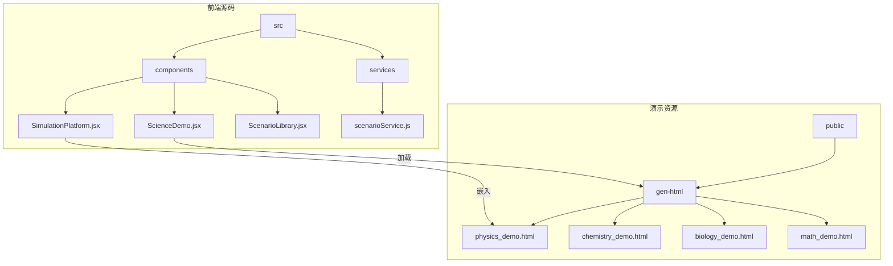
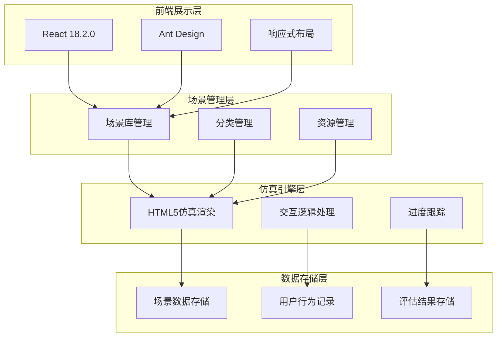
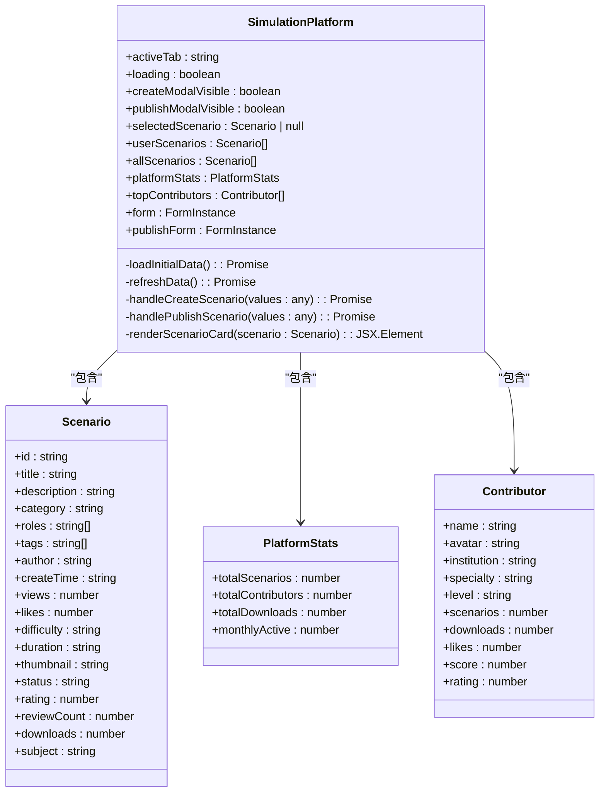
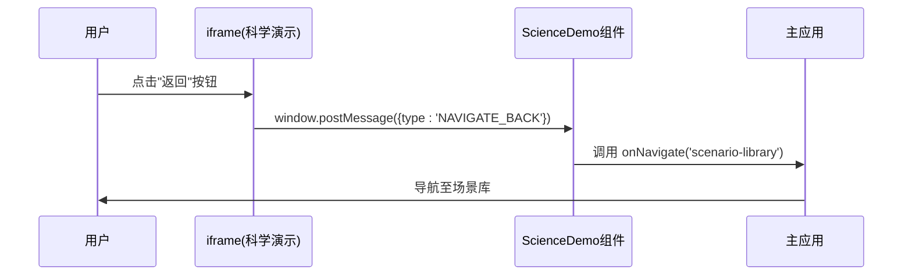
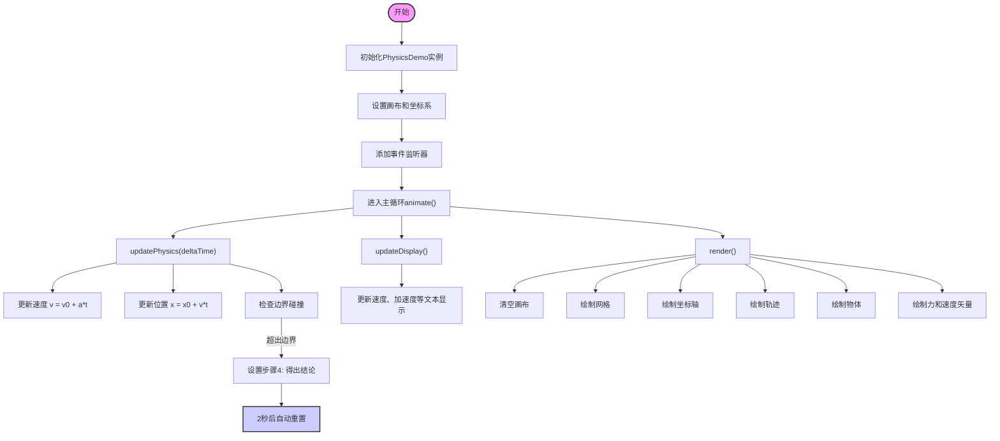
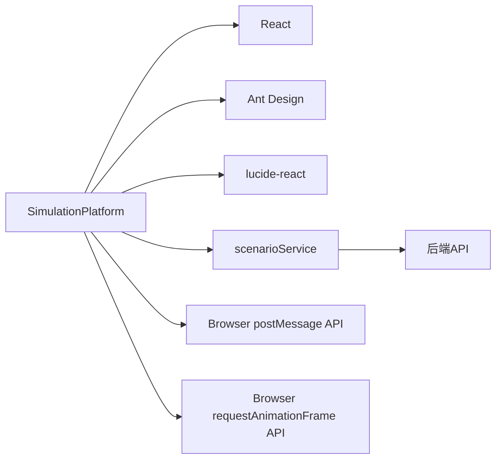

# 模拟平台

<cite>
**本文档引用文件**   
- [SimulationPlatform.jsx](file://src/components/SimulationPlatform.jsx)
- [ScienceDemo.jsx](file://src/components/ScienceDemo.jsx)
- [physics_demo.html](file://public/gen-html/physics_demo.html)
- [physics_demo.js](file://public/gen-html/physics_demo.js)
- [ScenarioLibrary.jsx](file://src/components/ScenarioLibrary.jsx)
- [SimulationPlatform.css](file://src/components/SimulationPlatform.css)
- [场景模拟仿真系统需求规格说明书.md](file://场景模拟仿真系统需求规格说明书.md)
</cite>

## 目录
1. [引言](#引言)
2. [项目结构](#项目结构)
3. [核心组件](#核心组件)
4. [架构概述](#架构概述)
5. [详细组件分析](#详细组件分析)
6. [依赖分析](#依赖分析)
7. [性能考虑](#性能考虑)
8. [故障排除指南](#故障排除指南)
9. [结论](#结论)

## 引言
本技术文档全面记录了模拟平台的技术实现，重点描述了SimulationPlatform组件如何承载各种教学场景的交互式模拟。该平台通过嵌入外部HTML演示文件（如物理、化学、生物实验模拟），为教育工作者提供了一个沉浸式的培训和学习环境。文档详细阐述了平台与外部演示文件之间的iframe通信机制和消息传递协议，以及用户交互事件从输入捕获到状态更新再到视觉反馈的完整处理流程。此外，还说明了模拟参数的配置方式、可调节变量的管理机制，并以physics_demo.html中的力学模拟为例进行了具体案例分析。文档包含了错误处理策略和平台的扩展性设计，支持教育专家添加新的学科模拟。

## 项目结构
模拟平台是AI智能教研助手系统的核心模块，其前端代码主要位于`src/components`目录下，而具体的教学演示资源则存放在`public/gen-html`目录中。平台采用React框架构建，利用Ant Design作为UI组件库，实现了现代化的Web应用界面。

**Diagram sources**
- [SimulationPlatform.jsx](file://src/components/SimulationPlatform.jsx)
- [ScienceDemo.jsx](file://src/components/ScienceDemo.jsx)
- [physics_demo.html](file://public/gen-html/physics_demo.html)

## 核心组件
核心组件包括`SimulationPlatform`、`ScienceDemo`和`ScenarioLibrary`。`SimulationPlatform`是整个开放平台的主入口，负责展示所有可用的教学场景，允许用户贡献和分享自己的场景。`ScienceDemo`组件专门用于加载和显示科学演示类场景，它通过iframe嵌入`/gen-html/science_demo_home.html`来呈现一个综合性的科学演示中心。`ScenarioLibrary`则是一个场景库管理组件，它不仅展示了预设的场景，还集成了来自开放平台的用户贡献场景，为用户提供了一个统一的访问入口。

**Section sources**
- [SimulationPlatform.jsx](file://src/components/SimulationPlatform.jsx#L79-L1710)
- [ScienceDemo.jsx](file://src/components/ScienceDemo.jsx#L0-L38)
- [ScenarioLibrary.jsx](file://src/components/ScenarioLibrary.jsx#L0-L1134)

## 架构概述
系统的整体架构分为四层：前端展示层、场景管理层、仿真引擎层和数据存储层。前端展示层使用React 18.2.0框架和Ant Design UI组件库，确保了界面的一致性和响应式设计。场景管理层负责场景库的管理和分类，支持多维度搜索和筛选功能。仿真引擎层通过iframe嵌入HTML场景，利用JavaScript实现交互逻辑和CSS3动画效果。数据存储层则负责存储场景数据、用户行为记录和评估结果。

**Diagram sources**
- [场景模拟仿真系统需求规格说明书.md](file://场景模拟仿真系统需求规格说明书.md#L100-L120)

## 详细组件分析

### SimulationPlatform 组件分析
`SimulationPlatform`组件是模拟仿真开放平台的核心，它提供了一个发现、贡献和管理教学场景的综合性界面。该组件通过`scenarioService`服务并行加载用户场景、所有已发布场景、平台统计数据和顶级贡献者信息，确保了数据的实时性和一致性。

#### 状态管理
组件内部维护了多个状态，包括活跃页签、加载状态、模态框可见性、表单实例以及各类场景数据。这些状态共同驱动着UI的动态变化。

**Diagram sources**
- [SimulationPlatform.jsx](file://src/components/SimulationPlatform.jsx#L79-L1710)

### ScienceDemo 组件分析
`ScienceDemo`组件是连接主应用与外部科学演示资源的桥梁。它通过iframe嵌入`/gen-html/science_demo_home.html`，并在父窗口中监听来自iframe的消息，实现了跨域通信。

#### iframe通信机制
该组件利用浏览器的`postMessage` API建立了一套双向通信协议。当用户在iframe内的演示页面点击“返回”按钮时，会触发`NAVIGATE_BACK`消息，`ScienceDemo`组件接收到此消息后，会调用`onNavigate`回调函数，将导航请求转发给父级组件，从而实现页面跳转。

**Diagram sources**
- [ScienceDemo.jsx](file://src/components/ScienceDemo.jsx#L0-L38)
- [App.jsx](file://src/App.jsx#L48-L96)

### 物理实验演示实现分析
`physics_demo.html`和`physics_demo.js`共同构成了一个完整的物理实验演示场景，展示了力学实验的动态模拟过程。

#### 功能特性
该演示提供了丰富的交互功能，包括实验选择、参数调节、控制面板和数据显示。用户可以调节物体的质量、施加的力和角度，观察物体在不同条件下的运动轨迹。演示还包含了详细的实验步骤引导和理论知识介绍，帮助学生理解牛顿第二定律等物理概念。

#### 技术实现
`PhysicsDemo`类封装了所有的物理计算和渲染逻辑。它通过`requestAnimationFrame`实现平滑的动画循环，根据牛顿运动定律实时更新物体的速度和位置。画布上绘制了网格、坐标轴、物体、力矢量和速度矢量，提供了直观的可视化效果。

**Diagram sources**
- [physics_demo.html](file://public/gen-html/physics_demo.html#L0-L174)
- [physics_demo.js](file://public/gen-html/physics_demo.js#L0-L412)

## 依赖分析
平台的正常运行依赖于一系列外部库和服务。前端框架React和UI库Ant Design是构建用户界面的基础。`lucide-react`图标库提供了丰富的SVG图标。`scenarioService`服务是与后端API通信的关键，负责获取和提交场景数据。此外，平台还依赖于浏览器的原生API，如`postMessage`用于跨iframe通信，`requestAnimationFrame`用于高性能动画渲染。

**Diagram sources**
- [SimulationPlatform.jsx](file://src/components/SimulationPlatform.jsx#L0-L79)
- [package.json](file://package.json)

## 性能考虑
为了保证流畅的用户体验，平台在多个方面进行了性能优化。首先，`loadInitialData`方法使用`Promise.all`并行加载多项数据，显著减少了总的加载时间。其次，对于大型列表的渲染，采用了分页或虚拟滚动技术，避免一次性渲染过多DOM节点。在物理模拟中，使用了固定的时间步长（约60fps）进行计算，确保了动画的平滑性。此外，对画布的渲染也进行了优化，只在必要时才清除和重绘，减少了不必要的计算开销。

## 故障排除指南
当遇到问题时，可以按照以下步骤进行排查：

1.  **资源加载失败**：如果iframe内容无法显示，请检查`src`属性中的路径是否正确。例如，`ScienceDemo`组件中的`src="/gen-html/science_demo_home.html"`必须指向正确的文件位置。
2.  **通信中断**：如果`postMessage`通信失效，请确认消息的`origin`是否匹配。在生产环境中，应严格验证`event.origin`以防止安全漏洞。
3.  **数据未更新**：如果平台数据没有刷新，可以尝试点击“刷新数据”按钮。这会调用`refreshData`方法，强制重新加载所有数据。
4.  **模拟卡顿**：如果物理模拟出现卡顿，可能是由于计算过于复杂或帧率过低。可以尝试简化物理模型或调整`deltaTime`的值。

**Section sources**
- [ScienceDemo.jsx](file://src/components/ScienceDemo.jsx#L0-L38)
- [SimulationPlatform.jsx](file://src/components/SimulationPlatform.jsx#L79-L1710)

## 结论
模拟平台成功地构建了一个开放、灵活且功能强大的教学场景仿真生态系统。通过精心设计的组件架构和高效的通信机制，平台能够无缝集成各种外部HTML演示文件，为用户提供丰富多样的交互式学习体验。其扩展性设计鼓励教育专家贡献高质量的内容，共同推动教育技术的发展。未来，平台可以进一步引入WebGL和Three.js等3D图形库，以支持更复杂的三维可视化演示，从而全面提升教学效果。