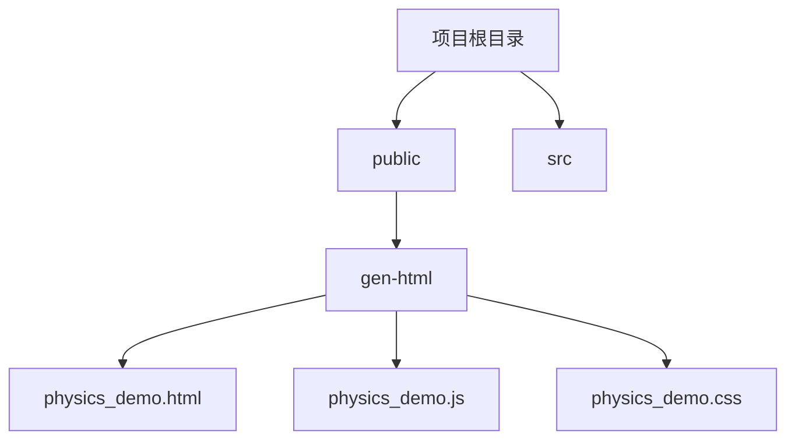
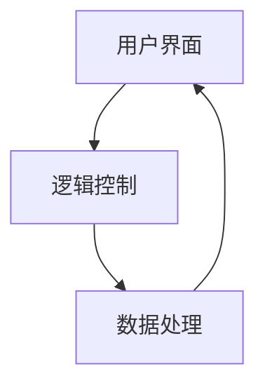
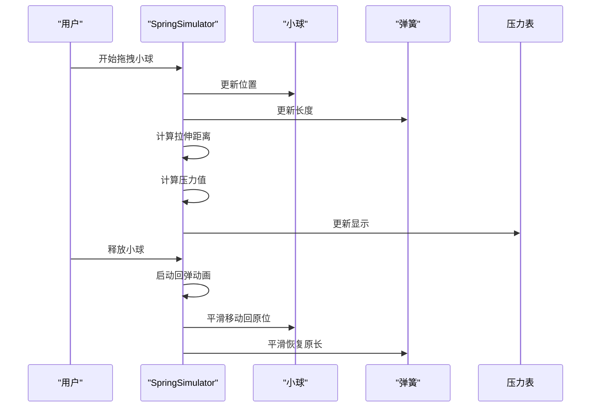
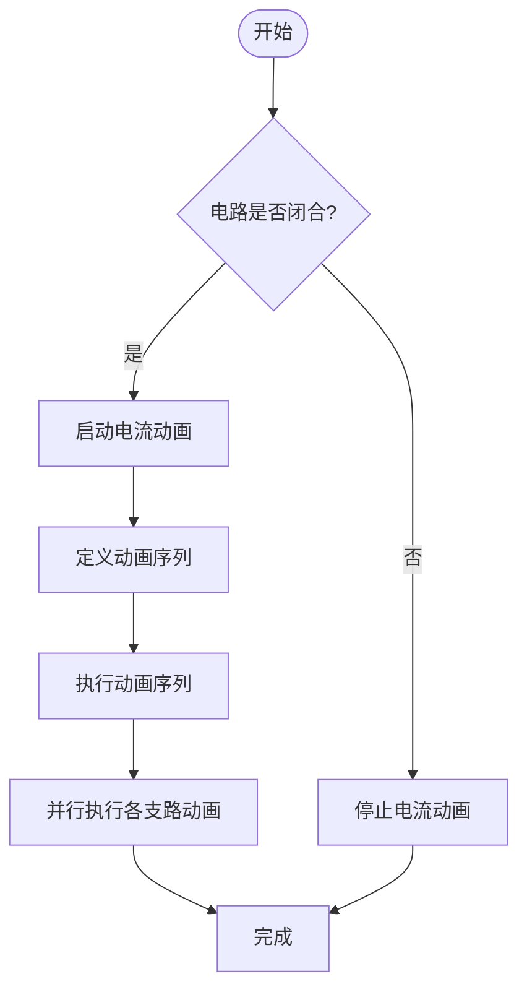
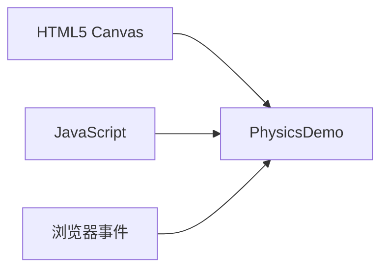

# 物理模拟

<cite>
**本文档引用的文件**
- [physics_demo.html](file://public/gen-html/physics_demo.html)
- [physics_demo.js](file://public/gen-html/physics_demo.js)
- [physics_demo.css](file://public/gen-html/physics_demo.css)
- [spring_simulator.js](file://public/gen-html/spring_simulator.js)
- [parallel_circuit_demo.js](file://public/gen-html/parallel_circuit_demo.js)
</cite>

## 目录
1. [引言](#引言)
2. [项目结构](#项目结构)
3. [核心组件](#核心组件)
4. [架构概述](#架构概述)
5. [详细组件分析](#详细组件分析)
6. [依赖分析](#依赖分析)
7. [性能考虑](#性能考虑)
8. [故障排除指南](#故障排除指南)
9. [结论](#结论)

## 引言
物理教学模拟系统是一个基于Web的交互式教育平台，旨在通过可视化的方式帮助学生理解复杂的物理概念。该系统包含多个实验模块，如力学、电磁学、光学和热力学实验，通过HTML5 Canvas技术实现实时动态演示。本文档将深入分析`physics_demo.html`及其关联资源，重点解析力学实验（如弹簧振子、并联电路）的物理模型构建过程。

## 项目结构
该项目采用模块化设计，主要分为以下几个部分：
- `public/`: 包含所有前端资源，包括HTML、CSS、JavaScript文件。
- `src/`: 包含React组件和业务逻辑代码。
- 根心演示文件位于`public/gen-html/`目录下，包括`physics_demo.html`、`physics_demo.js`和`physics_demo.css`。



**Diagram sources**
- [physics_demo.html](file://public/gen-html/physics_demo.html)
- [physics_demo.js](file://public/gen-html/physics_demo.js)
- [physics_demo.css](file://public/gen-html/physics_demo.css)

**Section sources**
- [physics_demo.html](file://public/gen-html/physics_demo.html)
- [physics_demo.js](file://public/gen-html/physics_demo.js)
- [physics_demo.css](file://public/gen-html/physics_demo.css)

## 核心组件
物理模拟的核心是`PhysicsDemo`类，它负责管理实验的状态、参数调节、动画渲染等。该类通过HTML5 Canvas实现图形渲染，并结合牛顿运动定律进行物理计算。

**Section sources**
- [physics_demo.js](file://public/gen-html/physics_demo.js#L0-L44)

## 架构概述
整个物理模拟系统的架构可以分为三层：用户界面层、逻辑控制层和数据处理层。用户界面层负责展示实验场景和控制面板；逻辑控制层处理用户的输入并更新实验状态；数据处理层则负责具体的物理计算和动画渲染。



**Diagram sources**
- [physics_demo.js](file://public/gen-html/physics_demo.js)
- [physics_demo.html](file://public/gen-html/physics_demo.html)

## 详细组件分析

### 力学实验分析
力学实验是物理模拟中最基础的部分，主要涉及牛顿运动定律的应用。在`PhysicsDemo`类中，通过设置质量、力和角度等参数来模拟物体的运动。

#### 物理模型构建
物理模型的构建基于牛顿第二定律F=ma，其中F表示作用力，m表示物体质量，a表示加速度。在代码中，这些参数通过滑块进行调节，并实时反映在物体的运动上。

```mermaid
classDiagram
class PhysicsDemo {
+canvas : HTMLCanvasElement
+ctx : CanvasRenderingContext2D
+mass : number
+force : number
+angle : number
+gravity : number
+position : {x : number, y : number}
+velocity : {x : number, y : number}
+acceleration : {x : number, y : number}
+displacement : number
+experimentType : string
+trajectory : Array<{x : number, y : number}>
+initializeControls() : void
+setupCanvas() : void
+calculateAcceleration() : void
+start() : void
+pause() : void
+reset() : void
+step() : void
+animate() : void
+updatePhysics(deltaTime : number) : void
+updateDisplay() : void
+render() : void
+drawGrid() : void
+drawAxes() : void
+drawTrajectory() : void
+drawObject() : void
+drawForceVector() : void
+drawVelocityVector() : void
+drawArrow(x : number, y : number, angle : number) : void
+setActiveStep(stepNumber : number) : void
}
```

**Diagram sources**
- [physics_demo.js](file://public/gen-html/physics_demo.js#L0-L412)

**Section sources**
- [physics_demo.js](file://public/gen-html/physics_demo.js#L0-L412)

### 弹簧振子实验分析
弹簧振子实验通过`SpringSimulator`类实现，模拟了胡克定律下的弹簧振动现象。用户可以通过拖拽小球来改变弹簧的拉伸长度，并观察压力表的变化。

#### 胡克定律实现
胡克定律指出，弹簧的弹力与形变量成正比。在代码中，通过计算拉伸距离并乘以弹簧常数来得到弹力值，进而影响小球的运动。



**Diagram sources**
- [spring_simulator.js](file://public/gen-html/spring_simulator.js#L0-L282)

**Section sources**
- [spring_simulator.js](file://public/gen-html/spring_simulator.js#L0-L282)

### 并联电路实验分析
并联电路实验通过`ParallelCircuitDemo`类实现，展示了电流在不同支路中的流动情况。用户可以通过开关控制电路的通断，并观察灯泡的亮灭状态。

#### 电流路径模拟
电流路径的模拟采用了分步动画的方式，依次点亮各个路径上的指示器，从而直观地展示电流的流向。这种设计使得学生能够清晰地理解并联电路的工作原理。



**Diagram sources**
- [parallel_circuit_demo.js](file://public/gen-html/parallel_circuit_demo.js#L0-L290)

**Section sources**
- [parallel_circuit_demo.js](file://public/gen-html/parallel_circuit_demo.js#L0-L290)

## 依赖分析
物理模拟系统依赖于HTML5 Canvas API进行图形渲染，同时使用JavaScript进行物理计算和动画控制。此外，还利用了浏览器的事件处理机制来响应用户的交互操作。



**Diagram sources**
- [physics_demo.js](file://public/gen-html/physics_demo.js)
- [physics_demo.html](file://public/gen-html/physics_demo.html)

**Section sources**
- [physics_demo.js](file://public/gen-html/physics_demo.js)
- [physics_demo.html](file://public/gen-html/physics_demo.html)

## 性能考虑
为了确保在不同设备上的流畅运行，物理模拟系统采取了一系列性能优化措施。例如，使用`requestAnimationFrame`进行动画渲染，避免了不必要的重绘；通过限制轨迹记录的数量，减少了内存占用。

**Section sources**
- [physics_demo.js](file://public/gen-html/physics_demo.js#L179)
- [spring_simulator.js](file://public/gen-html/spring_simulator.js#L182)

## 故障排除指南
如果遇到问题，首先检查浏览器是否支持HTML5 Canvas。其次，确认JavaScript文件是否正确加载。最后，查看控制台是否有错误信息，以便定位问题所在。

**Section sources**
- [physics_demo.js](file://public/gen-html/physics_demo.js)
- [spring_simulator.js](file://public/gen-html/spring_simulator.js)

## 结论
物理教学模拟系统通过直观的可视化方式，有效地帮助学生理解和掌握复杂的物理概念。通过对`physics_demo.html`及其关联资源的深入分析，我们了解了其背后的物理模型构建过程和技术实现细节。未来可以进一步扩展更多类型的实验，提升用户体验。