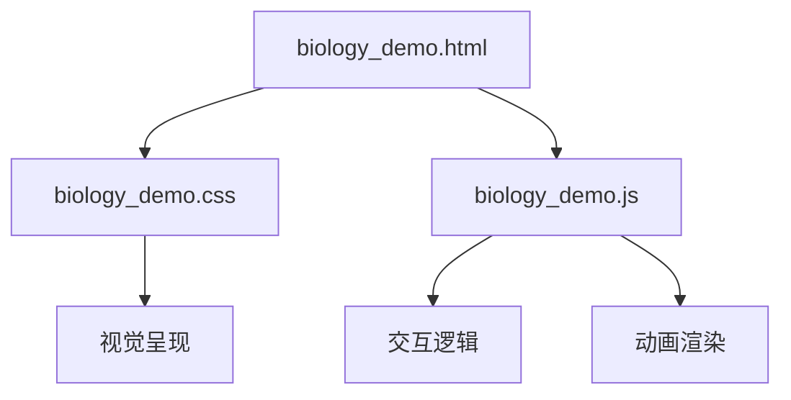
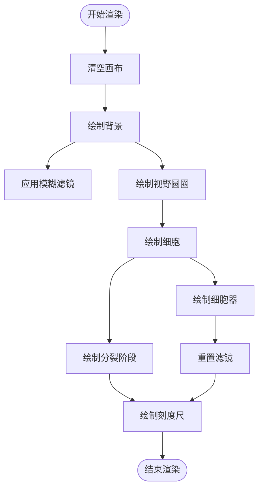
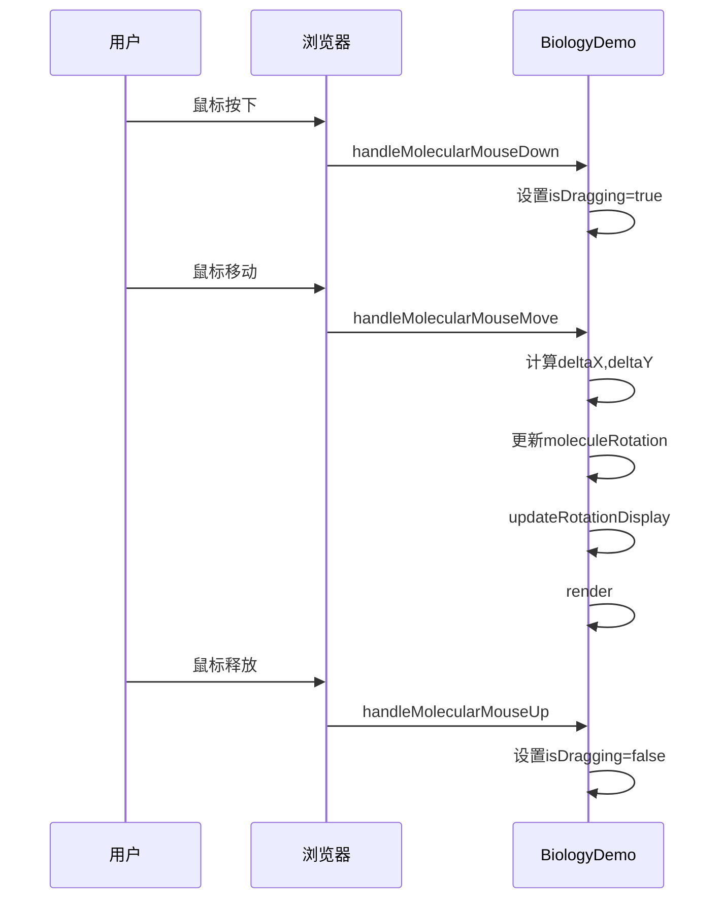
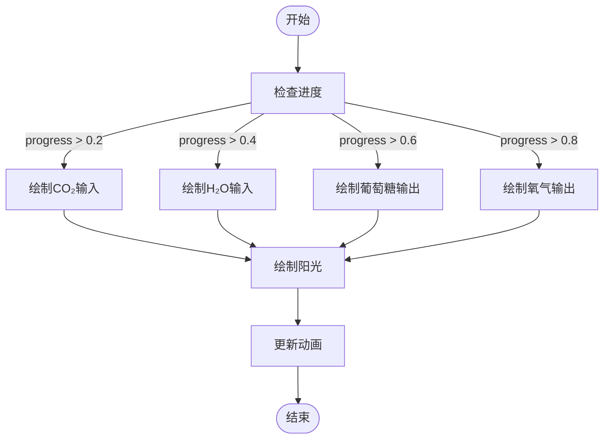
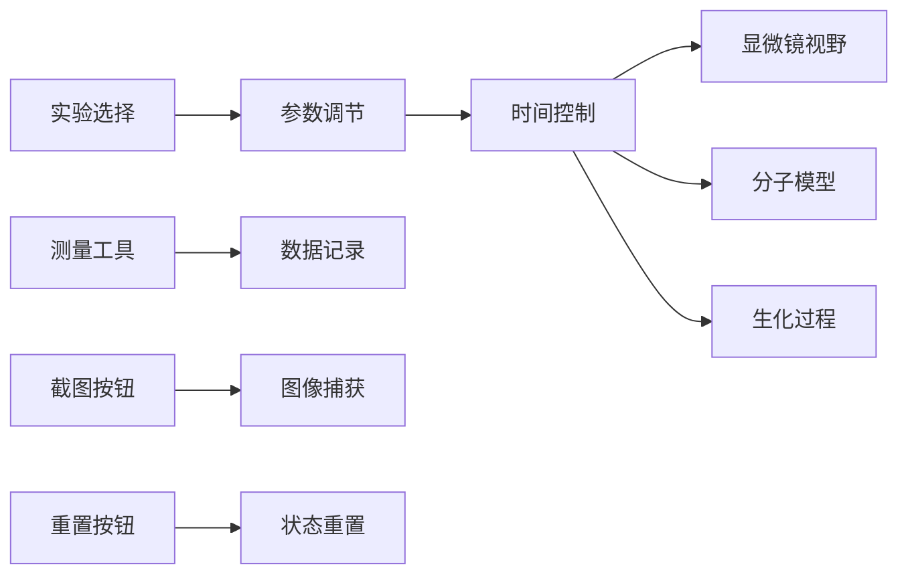

# 生物模拟

<cite>
**本文档引用文件**   
- [biology_demo.html](file://public/gen-html/biology_demo.html)
- [biology_demo.js](file://public/gen-html/biology_demo.js)
- [biology_demo.css](file://public/gen-html/biology_demo.css)
</cite>

## 目录
1. [引言](#引言)
2. [项目结构](#项目结构)
3. [核心组件](#核心组件)
4. [架构概述](#架构概述)
5. [详细组件分析](#详细组件分析)
6. [依赖分析](#依赖分析)
7. [性能考虑](#性能考虑)
8. [故障排除指南](#故障排除指南)
9. [结论](#结论)

## 引言
本技术文档详细记录了生物学教学模拟的技术实现，重点解析 `biology_demo.html` 中的生命科学概念可视化方案。该系统通过交互式Web界面实现了细胞结构、生态系统和生理过程的动态展示，为生物教学提供了直观的教学工具。

## 项目结构
生物学教学模拟系统由HTML、CSS和JavaScript三个主要文件构成，形成了一个完整的前端应用。系统采用模块化设计，将用户界面、样式和交互逻辑分离，便于维护和扩展。

**图表来源**
- [biology_demo.html](file://public/gen-html/biology_demo.html#L1-L303)
- [biology_demo.js](file://public/gen-html/biology_demo.js#L1-L1358)
- [biology_demo.css](file://public/gen-html/biology_demo.css#L1-L815)

**章节来源**
- [biology_demo.html](file://public/gen-html/biology_demo.html#L1-L303)

## 核心组件
生物学教学模拟的核心组件包括显微镜视野、分子模型和生化过程示意图三大可视化区域，以及实验选择、参数调节、时间控制等交互控制面板。系统通过Canvas绘制技术实现了生命科学概念的动态可视化。

**章节来源**
- [biology_demo.html](file://public/gen-html/biology_demo.html#L1-L303)
- [biology_demo.js](file://public/gen-html/biology_demo.js#L1-L1358)

## 架构概述
系统采用面向对象的设计模式，通过 `BiologyDemo` 类封装了所有功能和状态。架构分为数据层、渲染层和交互层三个层次，实现了关注点分离。

```mermaid
classDiagram
class BiologyDemo {
+microscopeCanvas Canvas
+molecularCanvas Canvas
+processCanvas Canvas
+currentExperiment String
+magnification Number
+focus Number
+illumination Number
+staining Object
+specimenType String
+cellSize Number
+cellCount Number
+cells Array
+moleculeType String
+moleculeRotation Object
+moleculeScale Number
+processType String
+processSpeed Number
+processTime Number
+isProcessRunning Boolean
+timeScale String
+timeSpeed Number
+isPlaying Boolean
+measurements Array
+currentMeasurement Object
+animationId Number
+lastTime Number
+init() void
+setupCanvas() void
+setupControls() void
+changeExperiment(experiment) void
+initializeCells() void
+generateOrganelles() Array
+handleMicroscopeMouseMove(e) void
+handleMicroscopeClick(e) void
+handleMolecularMouseDown(e) void
+handleMolecularMouseMove(e) void
+handleMolecularMouseUp(e) void
+findCellAtPosition(x, y) Cell
+selectCell(cell) void
+measureCellSize() void
+countCells() void
+recordMeasurement() void
+clearMeasurements() void
+togglePlay() void
+pause() void
+resetProcess() void
+startAnimation() void
+updateProcess(deltaTime) void
+updateMitosis(deltaTime) void
+render() void
+renderMicroscope() void
+renderMolecularModel() void
+renderBiochemicalProcess() void
+getBackgroundColor() String
+hexToRgb(hex) Object
+drawCell(ctx, cell) void
+getCellColor(cell) String
+drawOrganelle(ctx, cell, organelle, cellRadius) void
+drawMitosisPhase(ctx, cell, cellRadius) void
+drawChromosomes(ctx, cell, cellRadius, stage) void
+drawCellDivision(ctx, cell, cellRadius) void
+drawScale(ctx, canvas) void
+drawDNA(ctx, centerX, centerY) void
+drawProtein(ctx, centerX, centerY) void
+drawGlucose(ctx, centerX, centerY) void
+drawATP(ctx, centerX, centerY) void
+drawPhotosynthesis(ctx, canvas) void
+drawCellularRespiration(ctx, canvas) void
+drawProteinSynthesis(ctx, canvas) void
+drawEnzymeReaction(ctx, canvas) void
+updateDisplay() void
+updateMagnificationDisplay() void
+updateFocusDisplay() void
+updateIlluminationDisplay() void
+updateRotationDisplay() void
+updateScaleDisplay() void
+updateProcessSpeedDisplay() void
+updateProcessTimeDisplay() void
+updateMeasurementDisplay() void
+updateSpecimenInfo(x, y) void
+updateCellInfo(cell) void
+updateRecordedDataDisplay() void
+destroy() void
}
```

**图表来源**
- [biology_demo.js](file://public/gen-html/biology_demo.js#L1-L1358)

## 详细组件分析

### 细胞结构可视化分析
系统通过分层渲染技术实现了细胞结构的动态展示，利用DOM操作和Canvas绘制相结合的方式创建了逼真的显微镜效果。

#### 细胞结构渲染流程

**图表来源**
- [biology_demo.js](file://public/gen-html/biology_demo.js#L300-L400)

**章节来源**
- [biology_demo.js](file://public/gen-html/biology_demo.js#L300-L400)

### 分子模型可视化分析
分子模型组件通过Canvas API实现了3D分子结构的2D投影，支持用户交互式的旋转和缩放操作。

#### 分子模型交互流程

**图表来源**
- [biology_demo.js](file://public/gen-html/biology_demo.js#L200-L250)

**章节来源**
- [biology_demo.js](file://public/gen-html/biology_demo.js#L200-L250)

### 生化过程可视化分析
生化过程组件通过时间轴控制实现了光合作用、细胞呼吸等复杂生物过程的动态演示。

#### 光合作用动画流程

**图表来源**
- [biology_demo.js](file://public/gen-html/biology_demo.js#L1000-L1100)

**章节来源**
- [biology_demo.js](file://public/gen-html/biology_demo.js#L1000-L1100)

## 依赖分析
系统内部组件之间存在明确的依赖关系，通过事件驱动的方式实现了各组件间的通信和同步。

**图表来源**
- [biology_demo.html](file://public/gen-html/biology_demo.html#L1-L303)
- [biology_demo.js](file://public/gen-html/biology_demo.js#L1-L1358)

**章节来源**
- [biology_demo.js](file://public/gen-html/biology_demo.js#L1-L1358)

## 性能考虑
系统在性能方面采用了requestAnimationFrame进行动画渲染，确保了流畅的用户体验。同时通过合理的Canvas清理和重绘策略，避免了内存泄漏问题。

**章节来源**
- [biology_demo.js](file://public/gen-html/biology_demo.js#L500-L550)

## 故障排除指南
当系统出现显示异常时，可检查Canvas元素是否正确初始化；当交互失效时，需确认事件监听器是否正确绑定；当动画卡顿时，应检查requestAnimationFrame调用是否正常。

**章节来源**
- [biology_demo.js](file://public/gen-html/biology_demo.js#L1300-L1358)

## 结论
生物学教学模拟系统通过先进的前端技术实现了生命科学概念的可视化，为生物教学提供了有力的支持。系统架构清晰，组件职责分明，具有良好的可维护性和扩展性。